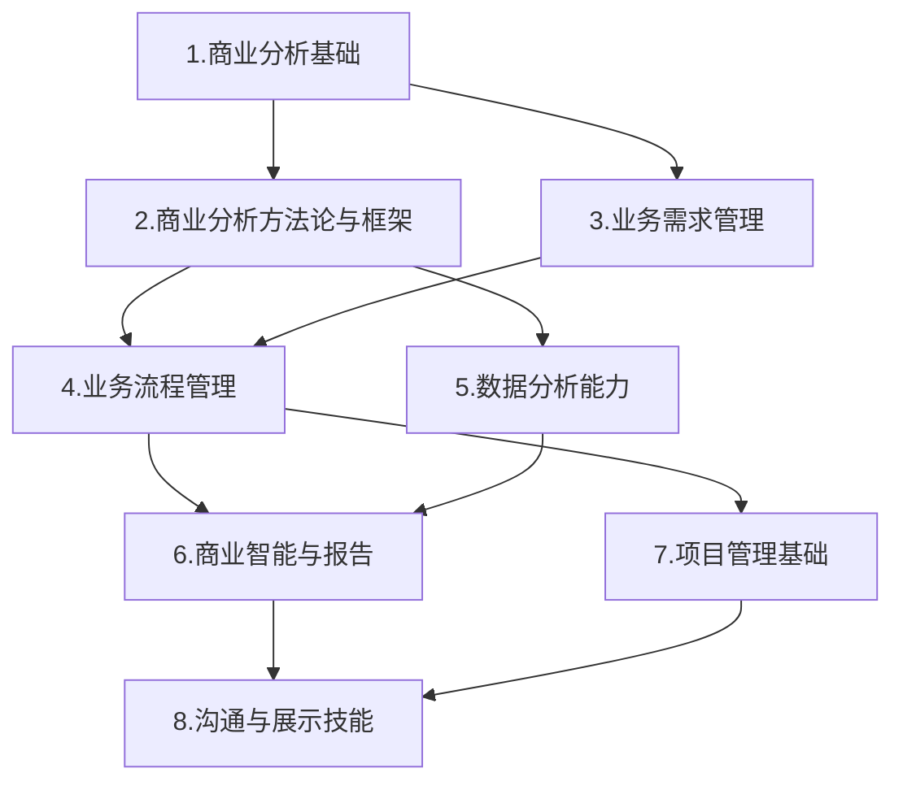

---
{"dg-publish":true,"permalink":"/08-财务专业/商业分析师/catalogue/","tags":["商业分析","业务分析","数据分析","决策分析","技能体系","学习大纲"]}
---

# 商业分析师技能体系学习大纲

> [!NOTE] 概述
> 本文档是商业分析师职业的系统化技能学习大纲，涵盖从基础理论到高级应用的全方位知识体系。通过结构化的学习路径，帮助您掌握商业分析所需的核心方法论、分析工具和专业技能。

## 1. 商业分析基础

### 1.1 商业分析师角色与职责 #基础知识 #角色定位
- [[商业分析师的定义与发展\|商业分析师的定义与发展]] #角色认知 #发展历程
- [[不同行业中的商业分析师角色差异\|不同行业中的商业分析师角色差异]] #行业差异 #角色变化
- [[商业分析师与数据分析师、产品经理的区别\|商业分析师与数据分析师、产品经理的区别]] #角色对比 #职能边界
- [[商业分析师职业发展路径\|商业分析师职业发展路径]] #职业规划 #发展方向

### 1.2 商业分析核心概念 #基础知识 #核心概念
- [[业务价值与价值交付\|业务价值与价值交付]] #价值理论 #价值评估
- [[利益相关者识别与管理\|利益相关者识别与管理]] #利益相关者 #关系管理
- [[业务需求与解决方案范围\|业务需求与解决方案范围]] #需求管理 #解决方案
- [[商业分析生命周期\|商业分析生命周期]] #流程管理 #生命周期

### 1.3 商业分析思维方式 #基础知识 #思维方法
- [[结构化思考法\|结构化思考法]] #思维框架 #结构化思考
- [[系统性思维\|系统性思维]] #思维框架 #系统思维
- [[批判性思维\|批判性思维]] #思维框架 #批判思考
- [[MECE原则(相互独立，完全穷尽)\|MECE原则(相互独立，完全穷尽)]] #思维框架 #MECE

## 2. 商业分析方法论与框架

### 2.1 战略分析框架 #分析方法 #战略分析
- [[08-财务专业/商业分析师/笔记/分析方法/SWOT分析\|SWOT分析]] #分析框架 #优劣势分析
- [[08-财务专业/商业分析师/笔记/分析方法/PEST分析\|PEST分析]] #分析框架 #环境分析
- [[08-财务专业/商业分析师/笔记/分析方法/波特五力模型\|波特五力模型]] #分析框架 #竞争分析
- [[08-财务专业/商业分析师/笔记/价值链分析\|价值链分析]] #分析框架 #价值分析
- [[蓝海战略\|蓝海战略]] #分析框架 #市场创新
- [[08-财务专业/商业分析师/笔记/分析方法/商业模式画布\|商业模式画布]] #分析框架 #模式设计

### 2.2 问题分析方法 #分析方法 #问题分析
- [[08-财务专业/商业分析师/笔记/分析方法/5W2H分析法\|5W2H分析法]] #分析技术 #问题定义
- [[根本原因分析(RCA)\|根本原因分析(RCA)]] #分析技术 #原因分析
- [[鱼骨图(因果分析)\|鱼骨图(因果分析)]] #分析技术 #因果分析
- [[帕累托分析(80/20法则)\|帕累托分析(80/20法则)]] #分析技术 #重要性分析
- [[对策矩阵\|对策矩阵]] #分析技术 #解决方案

### 2.3 决策分析工具 #分析方法 #决策分析
- [[08-财务专业/商业分析师/笔记/分析方法/决策树分析\|决策树分析]] #决策工具 #条件分析
- [[08-财务专业/商业分析师/笔记/分析方法/成本效益分析\|成本效益分析]] #决策工具 #效益评估
- [[情景规划与分析\|情景规划与分析]] #决策工具 #前瞻分析
- [[风险评估模型\|风险评估模型]] #决策工具 #风险管理
- [[多标准决策分析(MCDA)\|多标准决策分析(MCDA)]] #决策工具 #多维决策

## 3. 业务需求管理

### 3.1 需求获取技术 #需求管理 #需求获取
- [[访谈技巧\|访谈技巧]] #获取方法 #沟通技术
- [[用户调研方法\|用户调研方法]] #获取方法 #用户研究
- [[问卷设计\|问卷设计]] #获取方法 #调查设计
- [[头脑风暴与工作坊\|头脑风暴与工作坊]] #获取方法 #群体创新
- [[观察与用户跟踪\|观察与用户跟踪]] #获取方法 #实地研究
- [[文档分析\|文档分析]] #获取方法 #资料研究

### 3.2 需求分析与建模 #需求管理 #需求分析
- [[需求分类与优先级排序\|需求分类与优先级排序]] #分析技术 #优先级
- [[用户故事编写\|用户故事编写]] #分析技术 #用户故事
- [[用例分析\|用例分析]] #分析技术 #用例设计
- [[业务规则分析\|业务规则分析]] #分析技术 #规则管理
- [[功能分解\|功能分解]] #分析技术 #功能结构

### 3.3 需求文档化 #需求管理 #文档化
- [[需求规格说明书\|需求规格说明书]] #文档模板 #规格说明
- [[商业需求文档(BRD)\|商业需求文档(BRD)]] #文档模板 #业务需求
- [[功能需求文档(FRD)\|功能需求文档(FRD)]] #文档模板 #功能需求
- [[用户故事地图\|用户故事地图]] #文档模板 #需求地图
- [[原型与线框图\|原型与线框图]] #文档模板 #视觉表达

## 4. 业务流程管理

### 4.1 流程分析基础 #流程管理 #流程分析
- [[业务流程概念\|业务流程概念]] #流程基础 #概念理解
- [[流程分析目标与方法\|流程分析目标与方法]] #流程基础 #分析方法
- [[流程改进与优化原则\|流程改进与优化原则]] #流程基础 #优化原则
- [[流程度量与KPI设计\|流程度量与KPI设计]] #流程基础 #绩效指标

### 4.2 流程建模技术 #流程管理 #流程建模
- [[BPMN(业务流程建模符号)\|BPMN(业务流程建模符号)]] #建模技术 #标准符号
- [[流程图绘制\|流程图绘制]] #建模技术 #图形表达
- [[泳道图\|泳道图]] #建模技术 #责任划分
- [[状态转换图\|状态转换图]] #建模技术 #状态变化
- [[服务蓝图\|服务蓝图]] #建模技术 #服务设计

### 4.3 流程优化方法 #流程管理 #流程优化
- [[精益管理原则\|精益管理原则]] #优化方法 #精益理念
- [[六西格玛方法\|六西格玛方法]] #优化方法 #质量控制
- [[约束理论(TOC)\|约束理论(TOC)]] #优化方法 #瓶颈管理
- [[BPR(业务流程重组)\|BPR(业务流程重组)]] #优化方法 #流程重构
- [[持续改进(PDCA循环)\|持续改进(PDCA循环)]] #优化方法 #循环改进

## 5. 数据分析能力

### 5.1 数据分析基础 #数据分析 #分析基础
- [[数据类型与结构\|数据类型与结构]] #数据基础 #数据类型
- [[描述性统计分析\|描述性统计分析]] #数据基础 #统计分析
- [[数据质量评估\|数据质量评估]] #数据基础 #质量管理
- [[数据采集方法\|数据采集方法]] #数据基础 #数据获取
- [[抽样技术\|抽样技术]] #数据基础 #抽样方法

### 5.2 分析工具应用 #数据分析 #分析工具
- [[Excel高级分析功能\|Excel高级分析功能]] #工具应用 #Excel技能
- [[SQL基础查询\|SQL基础查询]] #工具应用 #SQL技能
- [[数据可视化工具(Power BI/Tableau)\|数据可视化工具(Power BI/Tableau)]] #工具应用 #可视化工具
- [[统计分析软件入门\|统计分析软件入门]] #工具应用 #统计软件
- [[Python/R语言基础\|Python/R语言基础]] #工具应用 #编程技能

### 5.3 高级分析方法 #数据分析 #高级分析
- [[趋势分析与预测\|趋势分析与预测]] #高级方法 #趋势预测
- [[相关性与回归分析\|相关性与回归分析]] #高级方法 #相关分析
- [[分群分析\|分群分析]] #高级方法 #分群技术
- [[A/B测试设计与分析\|A/B测试设计与分析]] #高级方法 #对比测试
- [[异常检测方法\|异常检测方法]] #高级方法 #异常分析
- [[指标体系构建\|指标体系构建]] #高级方法 #指标设计

## 6. 商业智能与报告

### 6.1 指标设计 #商业智能 #指标设计
- [[KPI框架设计\|KPI框架设计]] #指标体系 #KPI设计
- [[核心业务指标定义\|核心业务指标定义]] #指标体系 #关键指标
- [[指标间关系分析\|指标间关系分析]] #指标体系 #指标关系
- [[指标口径与计算逻辑\|指标口径与计算逻辑]] #指标体系 #计算规则

### 6.2 数据可视化 #商业智能 #数据可视化
- [[图表类型选择原则\|图表类型选择原则]] #可视化 #图表选择
- [[数据可视化最佳实践\|数据可视化最佳实践]] #可视化 #设计规范
- [[交互式仪表板设计\|交互式仪表板设计]] #可视化 #仪表板
- [[数据故事讲述\|数据故事讲述]] #可视化 #叙事技巧

### 6.3 商业分析报告 #商业智能 #分析报告
- [[报告结构设计\|报告结构设计]] #报告设计 #结构规划
- [[管理层报告与技术报告差异\|管理层报告与技术报告差异]] #报告设计 #受众适配
- [[见解提炼与表达\|见解提炼与表达]] #报告设计 #洞察提炼
- [[行动建议formulation\|行动建议formulation]] #报告设计 #建议提出

## 7. 项目管理基础

### 7.1 项目生命周期 #项目管理 #生命周期
- [[项目启动与规划\|项目启动与规划]] #周期阶段 #启动规划
- [[范围管理\|范围管理]] #周期阶段 #范围控制
- [[进度与资源管理\|进度与资源管理]] #周期阶段 #进度资源
- [[风险管理\|风险管理]] #周期阶段 #风险控制
- [[项目收尾与评估\|项目收尾与评估]] #周期阶段 #收尾评估

### 7.2 敏捷方法论 #项目管理 #敏捷方法
- [[敏捷原则与实践\|敏捷原则与实践]] #敏捷实践 #核心原则
- [[Scrum框架\|Scrum框架]] #敏捷实践 #Scrum
- [[用户故事与产品待办事项\|用户故事与产品待办事项]] #敏捷实践 #需求管理
- [[迭代计划与回顾\|迭代计划与回顾]] #敏捷实践 #迭代管理
- [[敏捷会议引导\|敏捷会议引导]] #敏捷实践 #会议技巧

### 7.3 变更管理 #项目管理 #变更管理
- [[变更影响分析\|变更影响分析]] #变更实践 #影响评估
- [[利益相关者沟通\|利益相关者沟通]] #变更实践 #沟通策略
- [[变更实施计划\|变更实施计划]] #变更实践 #实施规划
- [[抵抗管理\|抵抗管理]] #变更实践 #抵抗应对
- [[培训与支持\|培训与支持]] #变更实践 #能力建设

## 8. 沟通与展示技能

### 8.1 商务沟通 #沟通技能 #商务沟通
- [[沟通计划制定\|沟通计划制定]] #沟通方法 #计划管理
- [[跨部门沟通技巧\|跨部门沟通技巧]] #沟通方法 #跨部门协作
- [[会议组织与主持\|会议组织与主持]] #沟通方法 #会议管理
- [[冲突处理与谈判\|冲突处理与谈判]] #沟通方法 #冲突解决

### 8.2 展示技巧 #沟通技能 #展示技巧
- [[演示文稿设计原则\|演示文稿设计原则]] #展示方法 #幻灯片设计
- [[数据展示技巧\|数据展示技巧]] #展示方法 #数据呈现
- [[叙事结构设计\|叙事结构设计]] #展示方法 #结构设计
- [[受众分析与内容调整\|受众分析与内容调整]] #展示方法 #受众适配

### 8.3 影响力构建 #沟通技能 #影响力
- [[建议提出框架\|建议提出框架]] #影响方法 #建议框架
- [[说服与影响技巧\|说服与影响技巧]] #影响方法 #说服技术
- [[管理向上沟通\|管理向上沟通]] #影响方法 #上行沟通
- [[构建分析师品牌\|构建分析师品牌]] #影响方法 #个人品牌

## 学习路径图

## 能力发展阶段

| 阶段 | 主要学习重点 | 应用场景 |
| --- | --- | --- |
| 入门级 #能力阶段 | 基础概念、需求获取、流程图、基础数据分析 | 需求文档编写、简单流程分析、基础数据报表 |
| 进阶级 #能力阶段 | 分析框架应用、流程优化、数据模型构建、指标设计 | 业务问题分析、流程改进建议、KPI体系设计 |
| 资深级 #能力阶段 | 战略分析、复杂决策分析、高级数据分析、变革管理 | 战略规划参与、复杂业务分析、变革项目管理 |
| 专家级 #能力阶段 | 方法论创新、跨领域整合分析、组织层面价值评估 | 企业级分析框架设计、战略决策支持 | 

## 推荐学习资源

- [[08-财务专业/商业分析师/README\|项目介绍]]
- [[商业分析师/笔记/分析方法/SWOT分析实战\|SWOT分析实战指南]]
- [[商业分析师/笔记/数据分析/数据可视化最佳实践\|数据可视化最佳实践]]
- [[商业分析案例集索引\|商业分析案例集索引]]

> [!TIP] 使用指南
> 本学习大纲采用模块化结构设计，您可以根据自身基础和职业需求灵活选择学习路径。建议先掌握基础模块内容，再根据工作需要选择相应的专业领域深入学习。每个知识点都附有标签，方便您通过标签系统在知识库中快速导航和关联相关内容。 