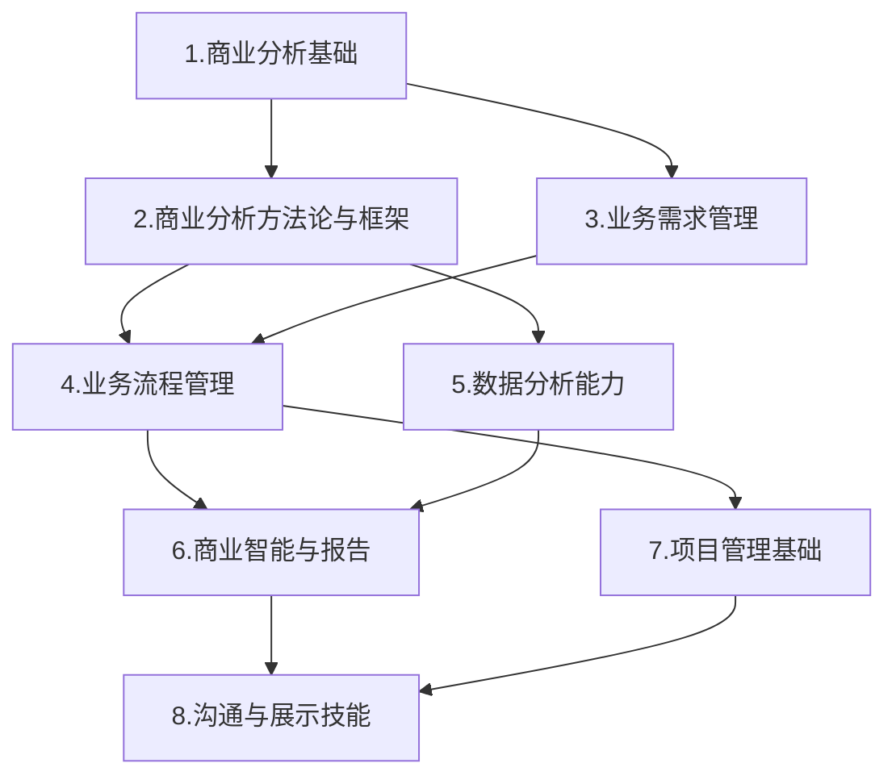

---
{"dg-publish":true,"dg-home":false,"permalink":"/08//catalogue/","dgPassFrontmatter":true}
---

# 商业分析师技能体系学习大纲

## 1. 商业分析基础

### 1.1 商业分析师角色与职责
- 商业分析师的定义与发展
- 不同行业中的商业分析师角色差异
- 商业分析师与数据分析师、产品经理的区别
- 商业分析师职业发展路径

### 1.2 商业分析核心概念
- 业务价值与价值交付
- 利益相关者识别与管理
- 业务需求与解决方案范围
- 商业分析生命周期

### 1.3 商业分析思维方式
- 结构化思考法
- 系统性思维
- 批判性思维
- MECE原则(相互独立，完全穷尽)

## 2. 商业分析方法论与框架

### 2.1 战略分析框架
- SWOT分析
- PEST分析
- 波特五力模型
- 价值链分析
- 蓝海战略
- 商业模式画布

### 2.2 问题分析方法
- 5W2H分析法
- 根本原因分析(RCA)
- 鱼骨图(因果分析)
- 帕累托分析(80/20法则)
- 对策矩阵

### 2.3 决策分析工具
- 决策树分析
- 成本效益分析
- 情景规划与分析
- 风险评估模型
- 多标准决策分析(MCDA)

## 3. 业务需求管理

### 3.1 需求获取技术
- 访谈技巧
- 用户调研方法
- 问卷设计
- 头脑风暴与工作坊
- 观察与用户跟踪
- 文档分析

### 3.2 需求分析与建模
- 需求分类与优先级排序
- 用户故事编写
- 用例分析
- 业务规则分析
- 功能分解

### 3.3 需求文档化
- 需求规格说明书
- 商业需求文档(BRD)
- 功能需求文档(FRD)
- 用户故事地图
- 原型与线框图

## 4. 业务流程管理

### 4.1 流程分析基础
- 业务流程概念
- 流程分析目标与方法
- 流程改进与优化原则
- 流程度量与KPI设计

### 4.2 流程建模技术
- BPMN(业务流程建模符号)
- 流程图绘制
- 泳道图
- 状态转换图
- 服务蓝图

### 4.3 流程优化方法
- 精益管理原则
- 六西格玛方法
- 约束理论(TOC)
- BPR(业务流程重组)
- 持续改进(PDCA循环)

## 5. 数据分析能力

### 5.1 数据分析基础
- 数据类型与结构
- 描述性统计分析
- 数据质量评估
- 数据采集方法
- 抽样技术

### 5.2 分析工具应用
- Excel高级分析功能
- SQL基础查询
- 数据可视化工具(Power BI/Tableau)
- 统计分析软件入门
- Python/R语言基础

### 5.3 高级分析方法
- 趋势分析与预测
- 相关性与回归分析
- 分群分析
- A/B测试设计与分析
- 异常检测方法
- 指标体系构建

## 6. 商业智能与报告

### 6.1 指标设计
- KPI框架设计
- 核心业务指标定义
- 指标间关系分析
- 指标口径与计算逻辑

### 6.2 数据可视化
- 图表类型选择原则
- 数据可视化最佳实践
- 交互式仪表板设计
- 数据故事讲述

### 6.3 商业分析报告
- 报告结构设计
- 管理层报告与技术报告差异
- 见解提炼与表达
- 行动建议formulation

## 7. 项目管理基础

### 7.1 项目生命周期
- 项目启动与规划
- 范围管理
- 进度与资源管理
- 风险管理
- 项目收尾与评估

### 7.2 敏捷方法论
- 敏捷原则与实践
- Scrum框架
- 用户故事与产品待办事项
- 迭代计划与回顾
- 敏捷会议引导

### 7.3 变更管理
- 变更影响分析
- 利益相关者沟通
- 变更实施计划
- 抵抗管理
- 培训与支持

## 8. 沟通与展示技能

### 8.1 商务沟通
- 沟通计划制定
- 跨部门沟通技巧
- 会议组织与主持
- 冲突处理与谈判

### 8.2 展示技巧
- 演示文稿设计原则
- 数据展示技巧
- 叙事结构设计
- 受众分析与内容调整

### 8.3 影响力构建
- 建议提出框架
- 说服与影响技巧
- 管理向上沟通
- 构建分析师品牌

## 学习路径图

## 能力发展阶段

| 阶段 | 主要学习重点 | 应用场景 |
| --- | --- | --- |
| 入门级 | 基础概念、需求获取、流程图、基础数据分析 | 需求文档编写、简单流程分析、基础数据报表 |
| 进阶级 | 分析框架应用、流程优化、数据模型构建、指标设计 | 业务问题分析、流程改进建议、KPI体系设计 |
| 资深级 | 战略分析、复杂决策分析、高级数据分析、变革管理 | 战略规划参与、复杂业务分析、变革项目管理 |
| 专家级 | 方法论创新、跨领域整合分析、组织层面价值评估 | 企业级分析框架设计、战略决策支持 | 