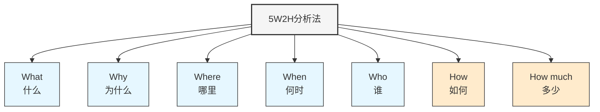

---
{"dg-publish":true,"dg-home":false,"permalink":"/08//notes//5-w2-h/","dgPassFrontmatter":true}
---

# 5W2H分析法

**标签**: #问题分析 #分析框架 #方法论

## 概述

5W2H分析法是一种全面、系统化的问题分析和思考框架，通过回答7个基本问题（5个W和2个H），帮助商业分析师清晰定义问题、识别关键因素、规划解决方案。这种方法简单实用，适用于多种商业分析场景，从问题定义到行动计划制定。

## 5W2H框架要素

5W2H代表以下七个英文问题词：

### 1. What（什么）

**核心问题**: 
- 问题/情况是什么？
- 要做什么？
- 要达成什么目标？
- 涉及哪些内容？

**分析价值**:
- 明确分析对象和范围
- 定义问题或目标的具体内容
- 确定期望的结果

**示例问题**:
- 我们具体面临什么问题？
- 需要解决的核心问题是什么？
- 我们想要达成什么目标？

### 2. Why（为什么）

**核心问题**:
- 为什么要解决这个问题？
- 为什么选择这种方式？
- 解决这个问题的价值是什么？

**分析价值**:
- 明确解决问题的必要性和意义
- 理解背后的动机和原因
- 确认是否值得投入资源

**示例问题**:
- 为什么这个问题需要现在解决？
- 不解决会带来什么后果？
- 解决这个问题能为组织带来什么价值？

### 3. Where（哪里）

**核心问题**:
- 问题发生在哪里？
- 解决方案在哪里实施？
- 影响范围在哪里？

**分析价值**:
- 确定问题和解决方案的空间边界
- 明确地理位置或组织部门
- 识别环境因素和限制条件

**示例问题**:
- 问题主要出现在哪些部门/区域？
- 解决方案需要在哪里实施？
- 受影响的范围有多广？

### 4. When（何时）

**核心问题**:
- 问题何时发生？
- 何时需要解决？
- 何时实施解决方案？

**分析价值**:
- 确定时间点和时间范围
- 设定优先级和截止日期
- 规划时间线和里程碑

**示例问题**:
- 问题是何时开始的？有何规律？
- 解决方案的最佳实施时间是什么？
- 需要在什么时间点见到成果？

### 5. Who（谁）

**核心问题**:
- 谁受到问题影响？
- 谁负责解决问题？
- 谁是相关利益方？

**分析价值**:
- 明确责任人和相关方
- 识别所需技能和资源
- 确保合适的人员参与

**示例问题**:
- 谁是问题的主要受害者？
- 谁应该负责解决这个问题？
- 谁需要参与方案实施？

### 6. How（如何）

**核心问题**:
- 如何解决问题？
- 用什么方法？
- 具体步骤是什么？

**分析价值**:
- 详细规划解决方案
- 确定具体方法和技术
- 设计实施流程和步骤

**示例问题**:
- 我们将如何解决这个问题？
- 解决方案的具体步骤是什么？
- 如何确保解决方案有效？

### 7. How much（多少）

**核心问题**:
- 需要多少资源？
- 成本是多少？
- 预期收益是多少？

**分析价值**:
- 量化资源需求和投入
- 估算预算和成本
- 评估投资回报率

**示例问题**:
- 实施这个方案需要多少预算？
- 解决这个问题能节省多少成本？
- 需要投入多少人力和时间？

## 5W2H分析的应用场景

### 1. 问题定义与分析

使用5W2H全面定义和分析问题，确保考虑所有关键因素。

**应用步骤**:
1. 详细描述"What"，明确问题本质
2. 分析"Why"，理解问题重要性
3. 确定"Where"和"When"，明确问题的时空边界
4. 识别"Who"，确定受影响者和责任人
5. 初步探索"How"和"How much"，为解决方案奠定基础

### 2. 项目规划

使用5W2H作为项目规划和设计的框架，确保考虑所有关键要素。

**应用步骤**:
1. 定义项目目标(What)和理由(Why)
2. 确定项目范围(Where)和时间表(When)
3. 分配团队角色和责任(Who)
4. 设计实施方法和流程(How)
5. 制定预算和资源计划(How much)

### 3. 流程改进

使用5W2H分析现有流程并设计改进方案。

**应用步骤**:
1. 确定需要改进的流程(What)和改进理由(Why)
2. 明确流程所在部门和影响范围(Where)
3. 规划改进时间和周期(When)
4. 确定流程改进责任人和参与者(Who)
5. 设计改进方法和步骤(How)
6. 估算改进成本和预期收益(How much)

### 4. 决策分析

使用5W2H框架辅助决策过程，确保全面考虑各方面因素。

**应用步骤**:
1. 明确决策内容(What)和决策背景(Why)
2. 确定决策影响范围(Where)和时间限制(When)
3. 识别决策相关方(Who)
4. 设计决策方案和实施计划(How)
5. 评估各方案成本和收益(How much)

### 5. 沟通计划

使用5W2H设计全面的沟通计划，确保有效传递信息。

**应用步骤**:
1. 确定沟通内容(What)和目的(Why)
2. 选择沟通渠道和场所(Where)
3. 安排沟通时间和频率(When)
4. 明确沟通对象和责任人(Who)
5. 设计沟通方式和形式(How)
6. 评估沟通成本和效果(How much)

## 5W2H分析实践案例

### 案例：客户投诉率上升问题分析

#### 背景
某电信公司客户服务部门注意到过去三个月客户投诉率显著上升，需要全面分析问题并制定改进计划。

#### 5W2H分析表

| 要素 | 问题 | 分析结果 |
|------|------|---------|
| **What** (什么) | 遇到了什么问题？ | 客户投诉率在过去三个月上升了35%，主要集中在账单错误和服务中断问题 |
| **Why** (为什么) | 为什么需要解决这个问题？ | 投诉率上升导致客户满意度下降，客户流失率增加，每月损失约50万元收入 |
| **Where** (哪里) | 问题主要发生在哪里？ | 投诉主要来自三个城市区域的用户，特别是新系统升级区域 |
| **When** (何时) | 问题是何时开始的？ | 问题始于系统升级后的三个月，投诉高峰期在每月账单生成后的3天内 |
| **Who** (谁) | 谁受到影响？谁负责解决？ | 受影响：约12万名客户 负责人：客户服务团队、技术团队和账单部门 |
| **How** (如何) | 如何解决这个问题？ | 1. 修复账单系统计算错误 2. 改进服务中断通知流程 3. 强化客服人员培训 4. 建立跨部门协作机制 |
| **How much** (多少) | 解决问题需要多少资源？ | 预算：35万元 人力：2名技术专家，5名客服团队成员 时间：8周实施周期 |

#### 分析结果与行动计划

通过5W2H分析，团队识别出以下关键问题和解决方案：

1. **核心问题**：系统升级引发的两类关键问题
   - 账单计算错误导致账单金额不准确
   - 服务中断通知不及时或不清晰

2. **解决方案**：
   - **短期措施**：
     - 审核并修正错误账单
     - 改进服务中断通知流程
     - 为客服人员提供专门培训
   
   - **中长期措施**：
     - 改进系统测试流程，防止未来升级问题
     - 建立跨部门协作机制
     - 实施客户满意度监控仪表板

3. **效果追踪**：
   - 每周监测投诉率变化
   - 每月评估客户满意度提升
   - 季度评估客户留存改善

## 5W2H分析法的最佳实践

### 1. 保持简洁明了
- 每个问题的回答应清晰、具体、简洁
- 避免模糊或过于宽泛的表述
- 使用量化数据和事实，而非假设

### 2. 确保完整性
- 尽量完整回答所有七个问题
- 不同问题之间应保持逻辑一致性
- 检查是否有遗漏的关键因素

### 3. 重视"Why"问题
- 深入思考"为什么"，理解本质原因
- 可结合[[08-财务专业/商业分析师/notes/分析方法/根本原因分析\|根本原因分析]]方法深挖原因
- 确保解决真正的问题，而非表面现象

### 4. 量化"How much"
- 尽可能使用具体数字
- 考虑成本、收益、时间等多维度
- 进行投资回报率分析

### 5. 迭代优化
- 将5W2H作为动态工具使用
- 随着更多信息获取，不断更新分析
- 在项目进行中定期回顾和完善

## 常见误区与对策

| 误区 | 对策 |
|-----|------|
| 跳过某些问题 | 使用完整的分析模板，确保每个问题都有回答 |
| 回答过于笼统 | 使用具体、可测量的表述和数据支持 |
| 过度关注"How" | 平衡关注所有要素，尤其是"Why"和"What" |
| 缺乏数据支撑 | 收集关键数据，避免基于假设的分析 |
| 孤立使用工具 | 与其他分析方法结合，如SWOT、根本原因分析等 |

## 5W2H与其他分析方法的结合

- 与[[08-财务专业/商业分析师/notes/分析方法/SWOT分析\|SWOT分析]]结合，全面分析问题和机会
- 与[[08-财务专业/商业分析师/notes/分析方法/根本原因分析\|根本原因分析]]结合，深入挖掘"Why"问题
- 与[[08-财务专业/商业分析师/notes/分析方法/决策树分析\|决策树分析]]结合，系统评估"How"选项
- 与[[项目管理\|项目管理]]方法结合，设计完整的行动计划

## 思考问题

1. 你所在组织的问题分析过程中，哪些5W2H要素通常被忽视？这对决策质量有何影响？
2. 5W2H分析法如何帮助跨部门团队建立共识？有什么实践经验？
3. 在使用5W2H方法时，如何确保分析的深度与广度平衡？

## 相关资源

- [[问题分析方法\|问题分析方法]]
- [[08-财务专业/商业分析师/notes/分析方法/根本原因分析\|根本原因分析]]
- [[项目规划技术\|项目规划技术]]
- [[结构化思考\|结构化思考]]
- [[08-财务专业/商业分析师/notes/方法论/商业分析方法论体系\|商业分析方法论体系]] 