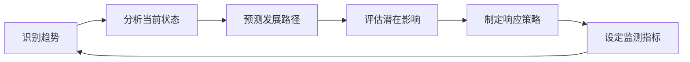

---
{"dg-publish":true,"dg-home":true,"permalink":"/08//notes//pest/","tags":["gardenEntry"],"dgPassFrontmatter":true}
---

# PEST分析

## 概述

PEST分析是一种用于评估宏观环境因素如何影响企业或行业的战略分析工具。PEST是英文Political（政治）、Economic（经济）、Social（社会）和Technological（技术）四个词的首字母缩写。这一方法帮助企业识别外部环境中可能影响其战略决策、业务表现和长期发展的关键驱动因素。

PEST分析与波特五力模型和价值链分析共同构成完整的战略分析体系：波特五力关注行业竞争环境，价值链关注企业内部价值创造活动，而PEST则聚焦更广泛的宏观环境。这三种工具结合使用，可以全面评估企业的外部环境和内部能力。

## PEST分析框架

### 政治因素 (Political)

政治因素包括政府政策、法律法规以及政治稳定性等对企业经营环境的影响。

**主要考量点**：
- 政治稳定性
- 政府政策走向
- 行业监管框架
- 税收政策
- 劳动法律
- 贸易限制或改革
- 环保法规
- 消费者保护法
- 政府补贴与支持政策
- 政府在市场中的作用

**评估问题**：
1. 现有或即将出台的政策法规如何影响我们的行业？
2. 政治环境变化会在多大程度上影响我们的业务决策？
3. 未来政策趋势对企业有何机遇或威胁？

### 经济因素 (Economic)

经济因素包括宏观经济指标、市场周期以及经济增长模式等对企业运营成本和消费者购买力的影响。

**主要考量点**：
- 经济增长率
- 通货膨胀率
- 利率和货币政策
- 汇率波动
- 失业率
- 劳动力成本
- 可支配收入水平
- 经济周期阶段
- 行业特定经济指标
- 全球化的经济影响

**评估问题**：
1. 当前宏观经济环境如何影响我们的销售和盈利能力？
2. 消费者购买力变化将如何影响产品需求？
3. 利率、通胀和汇率变化对企业成本结构有何影响？

### 社会因素 (Social)

社会因素包括人口统计、文化趋势、消费习惯以及社会价值观等对市场需求和消费行为的影响。

**主要考量点**：
- 人口规模与结构变化
- 年龄分布
- 收入分布
- 教育水平
- 生活方式变化
- 工作和职业态度
- 消费习惯和偏好
- 健康意识
- 社会流动性
- 文化因素和价值观

**评估问题**：
1. 消费者行为和偏好如何变化？
2. 人口结构变化会如何影响我们的目标市场？
3. 社会价值观和文化趋势如何影响产品设计和营销策略？

### 技术因素 (Technological)

技术因素包括技术创新、研发活动以及新技术普及等对产品开发、生产流程和商业模式的影响。

**主要考量点**：
- 关键技术变革
- 研发投入和创新速度
- 自动化程度
- 技术基础设施
- 信息与通信技术发展
- 新兴技术的商业化
- 知识产权保护
- 技术获取和转移
- 技术应用的成熟度
- 技术颠覆的可能性

**评估问题**：
1. 哪些技术创新可能改变我们的行业竞争格局？
2. 如何利用新技术提高效率或创造差异化优势？
3. 数字化转型将如何影响我们的业务模式和价值链？

## PEST分析的扩展形式

随着企业面临的外部环境日益复杂，PEST分析框架也有多种扩展形式：

### PESTEL/PESTLE

在PEST基础上增加了环境(Environmental)和法律(Legal)因素：

- **环境因素**：气候变化、环保意识、可持续发展压力等
- **法律因素**：将法律与政治因素分开，更具体地关注法律体系、法律程序和执法情况

### PESTLIED

在PESTEL基础上进一步增加了国际(International)和人口(Demographic)因素：

- **国际因素**：全球化、国际关系、地缘政治等
- **人口因素**：将人口统计学从社会因素中单独提取出来深入分析

### STEEPLE

代表社会(Social)、技术(Technological)、经济(Economic)、环境(Environmental)、政治(Political)、法律(Legal)和伦理(Ethical)因素。

### STEEPLED

在STEEPLE基础上增加了人口(Demographic)因素。

## 分析方法与步骤

### 1. 明确分析目的和范围

确定分析的具体目标、地理范围、时间跨度和行业边界。

**关键问题**：
- 我们需要解决什么问题？
- 分析结果将用于哪些决策？
- 我们关注哪个市场或地区？
- 分析的时间跨度是多久？

### 2. 收集相关信息

系统地收集各个因素领域的数据和信息，确保信息来源的可靠性和多样性。

**主要信息来源**：
- 官方统计数据
- 行业报告
- 学术研究
- 专家访谈
- 市场调研
- 新闻媒体
- 政府公告

### 3. 识别关键因素

从收集的大量信息中筛选出对企业或项目最具影响力的关键因素。

**筛选标准**：
- 影响程度的大小
- 变化的可能性
- 与企业业务的相关性
- 时间紧迫性

### 4. 分析因素影响

评估每个关键因素对企业战略、运营和财务表现的具体影响。

**评估维度**：
- 影响的方向（正面/负面）
- 影响的强度（高/中/低）
- 影响的时间范围（短期/中期/长期）
- 影响的确定性（确定/可能/不确定）

### 5. 制定响应策略

基于分析结果，制定应对各种外部环境变化的战略选择。

**战略视角**：
- 如何利用有利因素创造机会
- 如何减轻不利因素带来的威胁
- 短期战术调整与长期战略变革

### 6. 持续监测和更新

建立机制定期更新PEST分析，跟踪环境变化。

**监测机制**：
- 定期审视关键指标
- 设置预警触发条件
- 建立快速响应流程

## 分析工具和方法

### PEST影响评估矩阵

| 因素类别 | 具体因素 | 影响方向 | 影响强度(1-5) | 时间范围 | 确定性 | 战略意义 |
|---------|---------|----------|--------------|----------|---------|----------|
| 政治 | 行业监管加强 | 负面 | 4 | 中期 | 高 | 需提前合规调整 |
| 经济 | 利率上升 | 负面 | 3 | 短期 | 高 | 降低负债率 |
| 社会 | 健康意识增强 | 正面 | 5 | 长期 | 中 | 产品创新方向 |
| 技术 | AI技术普及 | 正面 | 4 | 中长期 | 中 | 流程优化机会 |

### 趋势影响分析

对关键趋势进行时间序列分析，评估其演变路径和影响程度：

### 情景规划

基于PEST分析结果构建多种可能的未来情景，并制定相应的应对策略。

**情景构建步骤**：
1. 确定关键不确定因素
2. 定义这些因素的可能取值
3. 组合不同取值创建情景
4. 分析每种情景对企业的影响
5. 制定适应不同情景的战略选择

## 应用场景

### 1. 市场进入决策

- 评估新市场的宏观环境风险和机会
- 确定市场进入时机和策略
- 预测潜在的监管和市场障碍

### 2. 产品开发与创新

- 识别影响产品需求的社会和技术趋势
- 预测产品生命周期和市场接受度
- 调整研发方向以适应环境变化

### 3. 投资决策

- 评估投资环境和风险
- 比较不同地区或行业的宏观条件
- 预测长期回报的影响因素

### 4. 战略规划

- 为长期战略提供环境假设
- 识别需要监控的关键外部变量
- 构建战略选择的决策树

### 5. 风险管理

- 识别和评估外部环境风险
- 开发风险缓解策略
- 建立环境变化的预警系统

## 案例分析：中国新能源汽车行业PEST分析

### 背景

中国新能源汽车行业在过去十年经历了爆发式增长，政策支持、技术进步和市场需求共同推动了行业发展。

### PEST分析

#### 政治因素

- **产业政策支持**：
  - 政府将新能源汽车列为战略性新兴产业
  - 《新能源汽车产业发展规划(2021-2035年)》明确行业发展路线图
  - 地方政府出台配套支持政策

- **补贴政策变化**：
  - 补贴逐步退坡，由直接补贴转向市场化机制
  - 双积分政策(油耗积分和新能源积分)推动传统车企转型
  - 公共领域电动化加速(公交、出租、物流等)

- **碳达峰碳中和目标**：
  - 2030年前碳达峰、2060年前碳中和的国家承诺
  - 交通电动化是减碳的重要路径
  - 清洁能源配套政策加速推进

#### 经济因素

- **经济增长与城市化**：
  - 中产阶级扩大带动汽车消费升级
  - 城市化推动私人交通需求增长
  - 区域经济发展不平衡影响市场渗透率差异

- **成本结构变化**：
  - 电池成本持续下降(10年降低超过80%)
  - 规模化生产降低整车制造成本
  - 充电基础设施投资加大，使用成本降低

- **全球供应链调整**：
  - 关键材料(锂、钴、镍)价格波动
  - 芯片供应紧张影响产能
  - 全球贸易环境变化影响国际市场拓展

#### 社会因素

- **消费观念转变**：
  - 环保意识增强，"绿色出行"观念普及
  - 智能网联成为购车新卖点
  - 共享出行模式影响部分城市购车需求

- **用户特征变化**：
  - 年轻一代成为新能源汽车主力消费群体
  - 高学历、高收入群体采纳意愿更强
  - 一二线城市渗透率领先，下沉市场潜力大

- **使用场景拓展**：
  - 从短途通勤扩展到中长途出行
  - 家用、商用、公共服务多场景融合
  - 汽车从交通工具向移动空间、能源载体转变

#### 技术因素

- **电池技术进步**：
  - 电池能量密度持续提升
  - 快充技术发展(800V高压平台)
  - 新一代电池技术(固态电池、钠离子电池)研发加速

- **智能化水平提升**：
  - 自动驾驶技术从L2向L3、L4演进
  - 车载操作系统生态构建
  - 车路协同技术实现规模化应用

- **制造工艺创新**：
  - CTC(电池车身一体化)等集成技术应用
  - 柔性生产线提高定制化能力
  - 数字孪生等技术降低研发成本和周期

### 综合影响分析

- **短期影响(1-2年)**：
  - 补贴退坡造成价格压力，行业整合加速
  - 动力电池供应链紧张影响产能释放
  - 智能化功能成为品牌差异化关键点

- **中期影响(3-5年)**：
  - 电动汽车总拥有成本(TCO)有望低于燃油车
  - 充电基础设施逐步完善解决"里程焦虑"
  - 自主品牌与国际品牌竞争格局明朗化

- **长期影响(5-10年)**：
  - 碳中和目标推动行业全面电动化
  - 智能网联重塑出行方式和汽车使用场景
  - 能源系统变革(V2G等)使汽车成为能源节点

### 战略启示

1. **政策导向**：
   - 密切关注政策变化，前瞻性布局符合政策方向的技术路线
   - 积极参与标准制定，提升行业话语权

2. **业务重点**：
   - 电池技术和供应链安全是核心竞争力
   - 软件定义汽车成为新的竞争焦点
   - 服务生态(充电、金融、售后)日益重要

3. **市场策略**：
   - 细分市场精准定位，避免同质化竞争
   - 构建差异化用户体验
   - 国际化战略需考虑贸易环境变化

## PEST分析的优势与局限性

### 优势

1. **全面系统**：提供全面的外部环境分析框架
2. **前瞻性**：有助于预测未来趋势和变化
3. **战略导向**：直接支持战略规划和决策
4. **结构化**：使复杂的环境分析变得有条理
5. **可扩展**：可根据需要纳入更多环境因素

### 局限性

1. **静态分析**：难以充分捕捉环境的动态变化
2. **主观判断**：分析结果依赖信息质量和分析者判断
3. **复杂性挑战**：环境因素间相互关联，难以单独分析
4. **信息需求大**：需要收集和处理大量信息
5. **实施能力限制**：分析结果的应用受企业实施能力限制

## 与其他分析工具的结合

### PEST与波特五力模型

- PEST分析宏观环境，五力分析行业环境
- PEST因素如何影响五力结构变化
- 结合确定宏观趋势如何转化为行业竞争变化

### PEST与SWOT分析

- PEST分析结果提供SWOT中的机会和威胁
- 内部优势劣势如何应对PEST分析发现的外部变化
- 结合制定环境适应性战略

### PEST与价值链分析

- PEST分析识别影响价值链各环节的外部因素
- 结合确定如何调整价值链以适应环境变化
- 评估价值链重构的必要性和可行性

## 实践应用建议

### 有效实施PEST分析的关键成功因素

1. **多学科团队**：
   - 组建涵盖市场、技术、法务、财务等职能的分析团队
   - 引入外部专家提供行业洞见

2. **数据与判断平衡**：
   - 依赖客观数据，减少主观偏见
   - 运用结构化判断技术评估不确定因素

3. **定期更新**：
   - 建立规律更新机制，如季度或半年度更新
   - 重大事件触发即时分析更新

4. **战略连接**：
   - 明确分析结果与战略规划的直接联系
   - 转化分析洞见为具体行动计划

5. **简明实用**：
   - 避免过度复杂的分析框架
   - 确保分析结果可操作、易理解

## 思考问题

1. 您所在行业面临的最关键宏观环境因素是什么？
2. 这些因素之间如何相互作用，产生叠加效应？
3. 哪些长期趋势可能从根本上改变您的行业结构？
4. 您的组织如何建立有效的环境监测机制？
5. PEST分析结果如何转化为具体的战略行动？

## 参考资源

1. Johnson, G., Scholes, K., & Whittington, R. *Exploring Corporate Strategy*
2. Aguilar, F.J. *Scanning the Business Environment*
3. Lynch, R. *Corporate Strategy*
4. Henry, A. *Understanding Strategic Management*
5. 世界经济论坛年度《全球风险报告》 