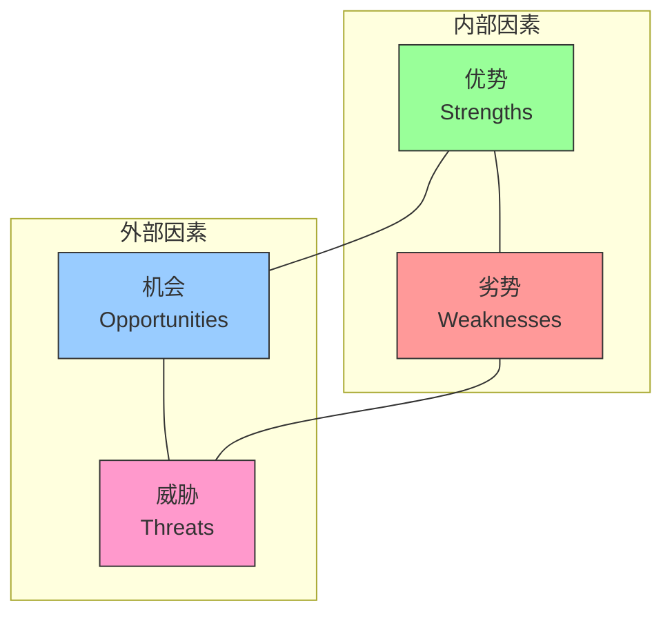
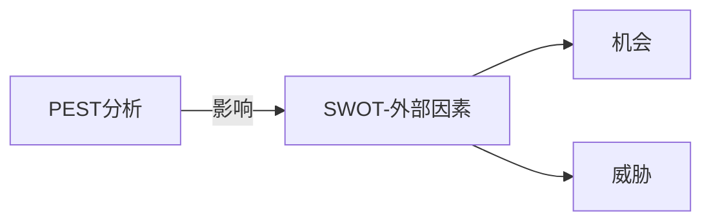
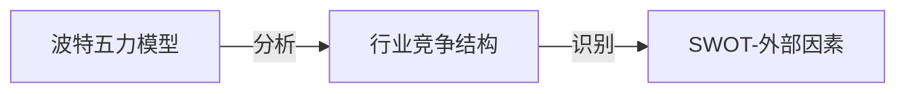
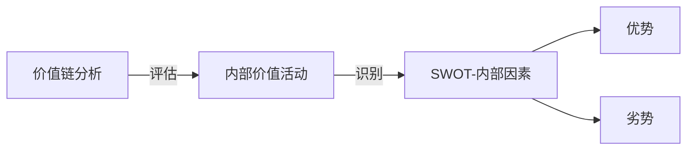
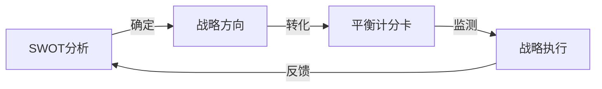

---
{"dg-publish":true,"dg-home":false,"permalink":"/08//notes//swot/","dgPassFrontmatter":true}
---

# SWOT分析

## 概述

SWOT分析是一种用于评估组织内部优势(Strengths)、劣势(Weaknesses)以及外部机会(Opportunities)和威胁(Threats)的战略规划工具。这一简单而强大的框架帮助企业全面评估其竞争地位，制定与组织实际情况相匹配的战略，并为决策提供系统化的思考方式。

SWOT分析与之前学习的战略工具形成完整体系：PEST分析提供宏观环境评估，波特五力模型分析行业竞争结构，价值链分析关注内部价值创造活动，而SWOT则整合内外部视角，形成全面的战略定位基础。

## SWOT分析框架

SWOT分析框架由四个象限组成，分别代表分析的四个维度：

### 内部因素分析

内部因素是组织可以直接控制的方面，包括优势和劣势：

#### 优势 (Strengths)

优势是组织内部拥有的、能够提供竞争优势的积极属性或特点。

**关键评估领域**：
- 核心能力与专长
- 独特资源与资产
- 专有技术或知识产权
- 品牌价值与市场声誉
- 成本优势或规模经济
- 员工技能与专业知识
- 产品或服务品质
- 客户关系与忠诚度
- 财务资源与稳定性
- 供应链效率

**评估问题**：
1. 我们比竞争对手做得更好的是什么？
2. 我们拥有哪些独特资源或能力？
3. 客户认为我们的优势是什么？
4. 我们的产品/服务有哪些独特卖点？

#### 劣势 (Weaknesses)

劣势是组织内部影响绩效的消极属性或限制，是需要改进的方面。

**关键评估领域**：
- 能力与资源缺口
- 流程效率问题
- 产品/服务质量不足
- 财务限制
- 人才缺乏或技能不足
- 品牌认知度不足
- 技术落后
- 管理经验不足
- 地理覆盖限制
- 成本结构劣势

**评估问题**：
1. 我们可以改进的地方是什么？
2. 我们应该避免什么？
3. 竞争对手做得比我们好的是什么？
4. 阻碍我们成功的内部限制是什么？

### 外部因素分析

外部因素是组织无法直接控制但可以利用或应对的方面，包括机会和威胁：

#### 机会 (Opportunities)

机会是外部环境中可能提升组织绩效的积极趋势或发展。

**关键评估领域**：
- 市场增长趋势
- 客户需求变化
- 技术进步与创新
- 监管环境变化
- 竞争格局变化
- 全球化机会
- 新兴市场
- 战略合作可能性
- 经济周期
- 社会文化趋势

**评估问题**：
1. 有哪些有利的市场趋势？
2. 环境变化创造了哪些机会？
3. 竞争对手的弱点可能为我们带来什么机会？
4. 有哪些值得开发的细分市场？

#### 威胁 (Threats)

威胁是外部环境中可能损害组织绩效或生存的消极趋势或发展。

**关键评估领域**：
- 竞争加剧
- 客户需求变化
- 替代产品/服务出现
- 供应链风险
- 经济下滑
- 政策法规变化
- 技术变革风险
- 劳动力市场变化
- 原材料成本上涨
- 商业模式颠覆

**评估问题**：
1. 我们面临哪些障碍？
2. 竞争对手在做什么？
3. 质量、产品或服务标准是否在变化？
4. 技术变革是否威胁我们的市场地位？

## SWOT分析实施步骤

### 1. 明确分析目标

确定SWOT分析的具体目标和范围，可以针对：
- 整个组织的战略定位
- 特定业务部门或产品线
- 具体项目或战略举措
- 市场进入或扩张决策

### 2. 组建多元分析团队

汇集来自不同部门和层级的代表，确保多角度视角：
- 高层管理团队
- 业务部门负责人
- 一线员工代表
- 专业职能部门(如市场、财务、运营)
- 外部顾问(如适用)

### 3. 收集内外部数据

系统性收集相关信息，确保分析基于事实而非假设：

**内部数据来源**：
- 财务报表和KPI指标
- 客户反馈和满意度调查
- 员工调查和绩效报告
- 产品/服务质量指标
- 流程效率数据

**外部数据来源**：
- 市场研究报告
- 竞争对手分析
- 行业趋势报告
- PEST分析结果
- 客户需求调研

### 4. 开展SWOT识别会议

通过结构化讨论，识别关键的SWOT元素：
- 使用头脑风暴等创新技术
- 确保讨论开放且建设性
- 记录所有提出的观点
- 避免过早评判

### 5. 整合与优先级排序

从初始清单中筛选和优先排序最关键的SWOT因素：
- 评估每个因素的重要性和相关性
- 识别最具战略影响力的因素
- 确保内外部因素平衡
- 避免过于宽泛或过于具体的表述

### 6. 交叉分析与战略形成

将SWOT四个象限交叉分析，形成战略选择：

**SO战略**(优势-机会)：利用内部优势抓住外部机会的战略
**WO战略**(劣势-机会)：克服内部劣势以把握外部机会的战略
**ST战略**(优势-威胁)：利用内部优势应对外部威胁的战略
**WT战略**(劣势-威胁)：减轻内部劣势并避免外部威胁的战略

### 7. 制定行动计划

将战略转化为具体可行的行动计划：
- 明确目标与关键成果指标
- 分配责任与资源
- 设定时间表与里程碑
- 确定监控与评估机制

### 8. 定期复审与更新

确保SWOT分析保持相关性和时效性：
- 建立定期复审机制
- 根据内外部变化调整分析
- 评估战略执行效果
- 必要时重新进行分析

## 分析工具和方法

### SWOT矩阵

用于结构化展示分析结果，并帮助形成战略方向：

| | 优势(S) | 劣势(W) |
|---|---|---|
| **机会(O)** | SO战略 如何利用优势抓住机会？ | WO战略 如何克服劣势把握机会？ |
| **威胁(T)** | ST战略 如何利用优势应对威胁？ | WT战略 如何减轻劣势避免威胁？ |

### 加权SWOT分析

为每个SWOT因素分配权重，增强分析的量化基础：

1. 为每个因素分配重要性权重(1-10)
2. 评估每个因素的现状或影响程度(1-10)
3. 计算加权得分(权重×评分)
4. 确定关注优先级

### 比较SWOT分析

与关键竞争对手进行并排SWOT比较，识别相对竞争优势与劣势：

| SWOT要素 | 本企业 | 竞争对手A | 竞争对手B |
|----------|--------|-----------|-----------|
| 优势     | ... | ... | ... |
| 劣势     | ... | ... | ... |
| 机会     | ... | ... | ... |
| 威胁     | ... | ... | ... |

## 应用场景

### 1. 企业战略规划

- 确定企业整体战略方向
- 调整业务组合和资源分配
- 制定长期发展目标

### 2. 市场营销决策

- 品牌定位与重新定位
- 营销策略与市场细分
- 产品线扩展与管理

### 3. 新产品开发

- 评估新产品/服务机会
- 确定开发优先级
- 制定上市策略

### 4. 市场扩张决策

- 评估新市场进入机会
- 国际化战略制定
- 渠道发展与管理

### 5. 并购与战略联盟

- 评估潜在并购目标
- 识别战略合作伙伴
- 分析整合协同效应

### 6. 业务转型

- 评估转型需求与可行性
- 识别转型方向与关键举措
- 管理转型风险

## 案例分析：小米公司SWOT分析

### 背景

小米是一家成立于2010年的全球性科技公司，从智能手机起家，逐步发展为包含智能硬件、IoT生态和互联网服务的综合型科技企业。

### SWOT分析

#### 优势 (Strengths)

- **高性价比策略**：
  - 通过"硬件薄利、服务增值"的商业模式提供高性价比产品
  - 精准控制成本并传递价值给消费者
  - 建立价格优势但避免廉价形象

- **生态系统构建**：
  - 以智能手机为核心构建丰富的IoT产品生态
  - MIUI系统整合硬件和互联网服务
  - 通过投资和孵化扩展生态边界

- **社区营销与粉丝经济**：
  - 强大的"米粉"用户群体
  - 通过社区营销降低获客成本
  - 用户参与产品改进反馈循环

- **高效的营销与供应链**：
  - 低成本线上营销模式
  - 高周转率的库存管理
  - 线上线下融合的销售渠道

#### 劣势 (Weaknesses)

- **研发与创新能力**：
  - 核心技术积累相对不足
  - 专利储备少于行业巨头
  - 关键组件依赖外部供应商

- **品牌国际化挑战**：
  - 全球品牌认知度不足
  - 国际市场商业模式复制难度
  - 知识产权争议影响全球扩张

- **产品同质化风险**：
  - 产品线快速扩张导致部分重叠
  - 差异化优势不明显
  - 用户体验一致性挑战

- **服务收入比例不高**：
  - 互联网服务收入占比低于目标
  - 国际市场服务变现难度更大
  - 硬件依赖度仍然较高

#### 机会 (Opportunities)

- **IoT与智能家居市场增长**：
  - 全球智能家居市场快速增长
  - AIoT技术融合创造新场景
  - 家居智能化渗透率提升

- **5G技术商用化**：
  - 5G换机潮带动高端产品销售
  - 新网络基础创造服务机会
  - 智能设备互联体验改善

- **新兴市场增长潜力**：
  - 印度等新兴市场智能手机渗透率提升
  - 中产阶级扩大带动消费升级
  - 区域定制化创造差异优势

- **AI技术应用普及**：
  - AI赋能提升产品智能化水平
  - 语音控制等新交互方式普及
  - 用户数据积累创造服务机会

#### 威胁 (Threats)

- **行业竞争加剧**：
  - 国内手机品牌同质化竞争
  - 头部品牌市场份额集中
  - 营销获客成本上升

- **技术壁垒与知识产权风险**：
  - 核心技术领域专利限制
  - 知识产权诉讼风险
  - 技术封锁可能性

- **供应链风险**：
  - 关键组件供应不稳定
  - 国际贸易环境变化
  - 原材料成本波动

- **监管政策变化**：
  - 数据安全与隐私法规严格化
  - 全球技术贸易政策不确定性
  - 反垄断监管加强

### 战略建议

基于SWOT分析，小米可考虑的战略方向包括：

1. **SO战略(进攻型)**：
   - 加速IoT生态扩张，利用生态系统优势抓住智能家居市场增长机会
   - 发挥价格优势深入新兴市场，建立区域领导地位

2. **WO战略(调整型)**：
   - 加大研发投入，特别是AIoT和5G领域，增强核心技术能力
   - 发展国际化服务内容，提高全球市场服务收入占比

3. **ST战略(多元化)**：
   - 拓展产业链布局，减少关键组件供应依赖
   - 强化知识产权战略，建立专利防御体系

4. **WT战略(防御型)**：
   - 聚焦差异化产品开发，避免同质化竞争
   - 建立灵活的区域战略，应对不同市场监管变化

## SWOT分析的优势与局限性

### 优势

1. **简单易用**：框架直观，易于理解和应用
2. **全面视角**：同时考虑内部和外部因素
3. **高度适应性**：可应用于各种规模和类型的组织
4. **战略聚焦**：帮助识别关键的战略问题和机会
5. **团队协作工具**：促进跨部门沟通和共识建立

### 局限性

1. **主观性强**：分析结果高度依赖分析者的判断
2. **过于简化**：可能忽视复杂因素间的相互关系
3. **静态分析**：单点时间分析，缺乏动态视角
4. **分类困难**：某些因素可能难以明确分类
5. **行动导向不足**：需要额外步骤转化为具体行动

## 与其他分析工具的结合

### SWOT与PEST分析结合

- PEST分析提供系统的外部环境评估
- PEST结果直接输入到SWOT的"机会"和"威胁"部分
- 确保外部因素分析全面且基于证据

### SWOT与波特五力模型结合

- 波特五力分析行业结构和竞争强度
- 五力分析结果帮助识别行业特定的机会和威胁
- 竞争态势分析补充SWOT的外部视角

### SWOT与价值链分析结合

- 价值链分析详细评估内部活动
- 价值链洞见直接输入SWOT的"优势"和"劣势"
- 提高内部因素分析的深度和精准度

### SWOT与平衡计分卡结合

- SWOT提供战略方向
- 平衡计分卡将战略转化为可测量的目标和指标
- 建立从分析到执行的完整闭环

## 实践应用建议

### 有效SWOT分析的关键成功因素

1. **保持客观性**：
   - 基于事实和数据而非假设
   - 邀请外部观点挑战内部认知
   - 避免过度乐观或悲观倾向

2. **聚焦重点**：
   - 集中在真正具有战略影响的因素
   - 避免过长的清单稀释分析价值
   - 优先处理高影响、高可能性的因素

3. **保持具体性**：
   - 使用具体而非泛泛的表述
   - 确保可验证和可量化
   - 避免模糊或主观的语言

4. **定期更新**：
   - 建立常规更新机制
   - 响应重大内外部变化
   - 评估战略实施效果

5. **行动导向**：
   - 确保分析转化为具体行动计划
   - 分配责任并设定时间表
   - 定期跟踪战略执行进展

### 常见陷阱与避免方法

| 陷阱 | 表现 | 避免方法 |
|------|------|----------|
| 自我欺骗 | 高估优势，低估劣势 | 寻求客观外部评估 |
| 分析瘫痪 | 过度详细分析导致无法决策 | 设定明确范围和时间限制 |
| 纸上谈兵 | 完成分析但未转化为行动 | 制定明确的后续行动计划 |
| 单一视角 | 仅反映管理层或单一部门观点 | 确保多样化的分析团队 |
| 静态思维 | 忽视变化中的环境因素 | 定期更新并进行情景规划 |

## 思考问题

1. 贵组织目前面临的最重要优势和劣势是什么？它们与三年前相比有何变化？
2. 您所在行业的主要机会和威胁如何影响您的战略选择？
3. 您的组织如何确保SWOT分析不仅是年度练习，而是持续影响战略决策？
4. 您的竞争对手可能会如何评价您组织的SWOT？这种外部视角能带来哪些新洞见？
5. 在数字化转型背景下，您的SWOT分析需要如何调整才能保持相关性？

## 参考资源

1. Helms, M. M., & Nixon, J. (2010). *Exploring SWOT Analysis – Where Are We Now?* Journal of Strategy and Management
2. Gürel, E., & Tat, M. (2017). *SWOT Analysis: A Theoretical Review*. The Journal of International Social Research
3. Hill, T., & Westbrook, R. (1997). *SWOT Analysis: It's Time for a Product Recall*. Long Range Planning
4. Piercy, N., & Giles, W. (1989). *Making SWOT Analysis Work*. Marketing Intelligence & Planning
5. Johnson, G., Scholes, K., & Whittington, R. *Exploring Corporate Strategy* 