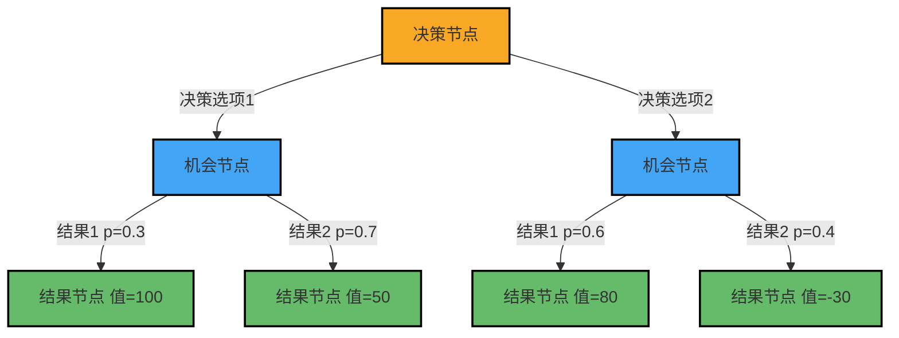
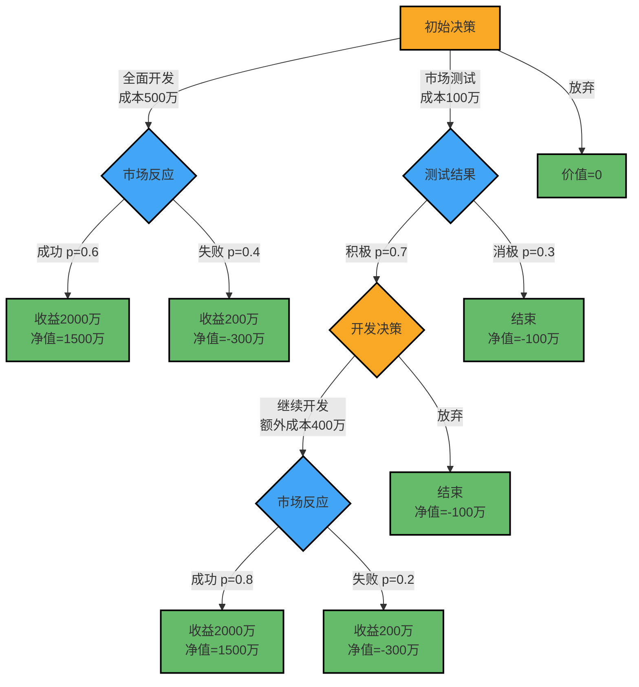

---
{"dg-publish":true,"dg-home":false,"permalink":"/08//notes///","dgPassFrontmatter":true}
---

# 决策树分析

**标签**: #决策分析 #定量方法 #风险评估

## 概述

决策树分析是一种结构化、图形化的决策支持工具，通过树状图展示决策过程、可能的结果及其概率和价值。作为商业分析师的核心工具之一，决策树帮助分析复杂决策情境下的各种可能性，评估风险与收益，最终选择最优决策路径。

## 决策树的基本结构

决策树由以下基本元素组成：

### 1. 决策节点(Decision Node)

- **表示形式**：通常用方形(□)表示
- **含义**：代表决策者必须做出的选择点
- **特点**：由决策者完全控制，代表可选的行动方案
- **示例**：是否推出新产品、选择哪种营销策略、是否进入新市场

### 2. 机会节点(Chance Node)

- **表示形式**：通常用圆形(○)表示
- **含义**：代表随机或不确定事件的发生
- **特点**：不受决策者控制，但有已知或估计的概率分布
- **示例**：市场反应、竞争对手行动、经济环境变化

### 3. 结果节点(Terminal Node)

- **表示形式**：通常用三角形(△)或矩形表示
- **含义**：代表决策路径的最终结果
- **特点**：包含结果值(通常为货币价值或效用值)
- **示例**：项目收益、成本减少、市场份额增长

### 4. 分支(Branch)

- **表示形式**：连接节点的线条
- **含义**：代表从一个节点到下一个节点的路径
- **特点**：
  - 从决策节点出发的分支代表不同决策选项
  - 从机会节点出发的分支代表不同可能发生的事件，标有概率值
  - 所有从机会节点出发的分支概率之和必须等于1

## 决策树分析的构建步骤

### 1. 定义决策问题

- 明确决策目标和评估标准
- 确定分析的时间范围和边界
- 识别关键利益相关者和约束条件

### 2. 构建决策树结构

- 确定初始决策节点和可能的决策选项
- 识别每个决策后可能发生的随机事件
- 继续扩展树，直到达到所有可能的结果节点

### 3. 估计概率和结果值

- 为每个机会节点的分支分配概率
- 为每个结果节点分配价值(通常为货币价值)
- 使用历史数据、专家判断或统计模型进行估计

### 4. 计算期望值

- **期望货币价值(EMV)**：从树的右侧(结果)向左侧(初始决策)计算
- 对于机会节点：计算所有分支的加权平均值(概率×结果值)
- 对于决策节点：选择期望值最高的分支

### 5. 敏感性分析和情景测试

- 改变关键假设和概率，观察对最优决策的影响
- 识别决策结果对特定参数变化最敏感的地方
- 测试极端情况和最坏情景

## 决策树分析的数学基础

### 期望货币价值(EMV)计算

对于机会节点，EMV计算公式为：

$$EMV = \sum_{i=1}^{n} p_i \times V_i$$

其中：
- $p_i$ 是第i个结果的概率
- $V_i$ 是第i个结果的价值
- $n$ 是可能结果的数量

### 风险中性决策准则

标准决策树分析假设决策者是风险中性的，即决策者只关心期望值，而不考虑风险程度。在实际应用中，可通过以下方式调整：

- **效用函数**：将货币价值转换为效用值，反映决策者的风险偏好
- **风险调整折现率**：对高风险方案的期望值应用更高的折现率
- **风险溢价**：要求高风险决策提供额外的期望收益

## 决策树分析的应用场景

### 1. 产品开发决策

使用决策树评估新产品开发的风险和收益，包括：
- 是否投资开发新产品
- 选择哪种开发路径或技术平台
- 确定最佳市场进入时机和策略
- 评估产品定价策略

### 2. 项目和投资评估

帮助管理层做出资本配置决策：
- 评估不同投资方案的期望回报
- 分析项目继续或终止的决策点
- 确定最佳项目实施顺序
- 比较不同融资选项

### 3. 风险管理决策

支持风险评估和管理：
- 评估风险缓解策略的成本效益
- 分析是否购买保险或对冲风险
- 制定应急计划和风险响应策略
- 优化安全投资组合

### 4. 业务战略规划

协助制定战略决策：
- 评估市场进入或退出策略
- 分析垂直整合或外包决策
- 评估收购或内部发展选项
- 制定竞争响应策略

### 5. 运营决策优化

支持日常运营决策：
- 优化库存管理和供应链策略
- 分析设备维护或更换决策
- 评估生产扩张或收缩选项
- 确定最佳人力资源配置

## 决策树分析实践案例

### 案例：新产品开发决策分析

#### 背景
一家科技公司正在考虑开发一款新的软件产品。管理层面临三个初始选择：立即全面开发、先进行市场测试再决定、或放弃这个想法。

#### 决策树建模

#### EMV计算

1. **全面开发策略**的EMV：
   - 成功的净价值：2000万 - 500万 = 1500万
   - 失败的净价值：200万 - 500万 = -300万
   - EMV = 0.6 × 1500万 + 0.4 × (-300万) = 900万 - 120万 = 780万

2. **市场测试策略**中"继续开发"决策的EMV：
   - 成功的净价值：2000万 - 100万 - 400万 = 1500万
   - 失败的净价值：200万 - 100万 - 400万 = -300万
   - EMV = 0.8 × 1500万 + 0.2 × (-300万) = 1200万 - 60万 = 1140万

3. **市场测试策略**中"放弃"决策的EMV：
   - 净价值 = -100万

4. **市场测试**机会节点后的最优决策是"继续开发"，EMV = 1140万

5. 因此，**市场测试策略**的总EMV：
   - EMV = 0.7 × 1140万 + 0.3 × (-100万) = 798万 - 30万 = 768万

6. **放弃策略**的EMV：
   - EMV = 0

#### 分析结果

| 策略选项 | 期望货币价值 | 风险特征 |
|---------|------------|---------|
| 全面开发 | 780万 | 高回报，高风险，40%概率损失300万 |
| 市场测试 | 768万 | 较平衡，风险分散，最大可能损失100万 |
| 放弃 | 0 | 无风险，无回报 |

基于纯EMV分析，"全面开发"是最优选择，但其优势相对"市场测试"策略非常微小(仅12万差异)。考虑到风险因素，"市场测试"策略可能更为可取，因为：

1. 它提供了"实物期权"价值 - 在获得更多信息后再做决策
2. 它限制了最大可能损失(100万 vs 300万)
3. 它在测试结果积极时提供了更高的成功概率

#### 敏感性分析

改变关键假设，观察对决策的影响：

1. **如果全面开发的成功概率从60%降至55%**：
   - 新EMV = 0.55 × 1500万 + 0.45 × (-300万) = 825万 - 135万 = 690万
   - 此时"市场测试"策略(768万)变成最优选择

2. **如果市场测试后开发的成本从400万增至450万**：
   - 成功净值 = 2000万 - 100万 - 450万 = 1450万
   - 失败净值 = 200万 - 100万 - 450万 = -350万
   - 新EMV = 0.8 × 1450万 + 0.2 × (-350万) = 1160万 - 70万 = 1090万
   - 市场测试策略的EMV = 0.7 × 1090万 + 0.3 × (-100万) = 763万 - 30万 = 733万
   - 此时仍然是"全面开发"策略最优

#### 决策建议

1. **主要建议**：进行市场测试策略
   - 虽然EMV略低于全面开发，但风险更低，更具灵活性
   - 提供分阶段投资机会，避免一次性大额投入

2. **关键监控指标**：
   - 市场测试参与者的反馈评分和采用意愿
   - 竞争产品的价格和功能变化
   - 目标客户群的规模和购买力变化

3. **预期风险因素**：
   - 测试群体可能不完全代表真实市场
   - 竞争对手可能加快类似产品开发
   - 技术发展可能影响产品价值主张

## 决策树分析的优势与局限性

### 优势

1. **结构化决策过程**
   - 强制系统化思考
   - 明确决策标准和选项
   - 展示决策逻辑和依据

2. **可视化复杂决策**
   - 直观展示决策路径和可能结果
   - 传达决策逻辑给利益相关者
   - 易于理解和讨论

3. **量化风险和不确定性**
   - 明确考虑不确定性
   - 考虑多种可能结果
   - 促进基于数据的决策

4. **识别信息价值**
   - 揭示额外信息的潜在价值
   - 指导数据收集和研究重点
   - 支持渐进式决策

### 局限性

1. **依赖主观估计**
   - 概率和结果值通常基于主观判断
   - 易受估计偏差影响
   - 可能导致错误决策信心

2. **简化复杂现实**
   - 难以捕捉所有相关因素和关系
   - 可能忽略重要的相互依赖性
   - 假设决策点是离散的

3. **静态模型**
   - 不易捕捉动态变化的环境
   - 难以表示连续时间内的决策
   - 不自动更新随着新信息获取

4. **计算复杂性**
   - 大型决策树可能变得难以管理
   - 多维决策问题导致组合爆炸
   - 计算资源需求可能很高

## 决策树分析的最佳实践

### 1. 合理设定决策树规模

- 聚焦关键决策点和主要不确定因素
- 避免过度复杂化模型
- 考虑合并类似结果或低影响因素

### 2. 使用多种数据源估计概率

- 结合历史数据、市场研究和专家意见
- 使用德尔菲法等结构化专家判断方法
- 考虑使用贝叶斯更新随着信息增加调整概率

### 3. 进行全面的敏感性分析

- 测试关键概率和价值假设的合理变化范围
- 识别决策"翻转点"(决策改变的阈值)
- 考虑极端情况和最坏情景

### 4. 整合风险偏好

- 调整结果值以反映组织的风险容忍度
- 考虑使用效用函数代替纯货币价值
- 评估不同利益相关者的风险观点

### 5. 与其他分析方法结合

- 使用[[08-财务专业/商业分析师/notes/分析方法/SWOT分析\|SWOT分析]]识别纳入决策树的因素
- 结合[[08-财务专业/商业分析师/notes/分析方法/5W2H分析法\|5W2H分析法]]全面定义决策问题
- 利用[[情景规划\|情景规划]]探索未来可能性
- 结合[[08-财务专业/商业分析师/notes/分析方法/价值分析\|价值分析]]评估非货币结果

## 决策树分析软件工具

| 工具名称 | 特点 | 适用场景 |
|---------|------|---------|
| TreePlan (Excel插件) | 简单易用，与Excel集成 | 基础决策分析，小型模型 |
| Precision Tree | 强大的敏感性分析，与Excel集成 | 专业决策分析，中等复杂度 |
| DPL (Decision Programming Language) | 高级建模能力，支持复杂依赖关系 | 复杂决策问题，专业分析 |
| GeNIe | 图形化界面，支持贝叶斯网络 | 概率推理，复杂依赖分析 |
| BigML | 机器学习集成，自动化决策树构建 | 数据驱动决策，预测分析 |

## 思考问题

1. 在你的组织中，哪些类型的决策可能受益于决策树分析？当前这些决策是如何做出的？
2. 决策树分析如何与组织的风险管理流程整合？
3. 如何平衡决策树模型的复杂性和可用性？在哪些情况下应该简化模型？

## 相关资源

- [[定量分析方法\|定量分析方法]]
- [[风险分析与管理\|风险分析与管理]]
- [[情景规划\|情景规划]]
- [[贝叶斯分析\|贝叶斯分析]]
- [[项目投资评估\|项目投资评估]]
- [[08-财务专业/商业分析师/notes/方法论/商业分析方法论体系\|商业分析方法论体系]] 