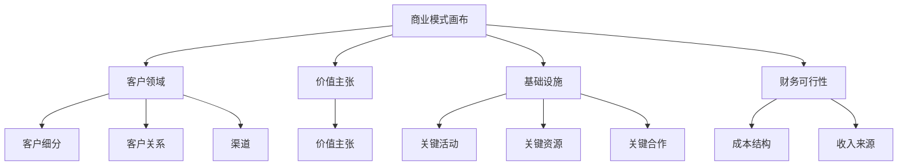

---
{"dg-publish":true,"dg-home":false,"permalink":"/08-财务专业/商业分析师/notes/分析方法/商业模式画布/","dgPassFrontmatter":true}
---

# 商业模式画布分析方法

**标签**: #商业模式 #战略分析 #价值创造 #商业创新 #商业规划

## 1. 概述

商业模式画布(Business Model Canvas, BMC)是由瑞士商业理论家亚历山大·奥斯特瓦德(Alexander Osterwalder)和伊夫·皮尼厄(Yves Pigneur)在2010年出版的《商业模式新生代》一书中提出的战略管理和精益创业工具。它通过九个基本构建模块直观地描述组织如何创造、传递和获取价值，为理解、设计和改进商业模式提供了一个统一的框架。

商业模式画布已经成为当代商业分析和战略规划的核心工具之一，被创业者、企业内部创新团队、战略顾问和业务分析师广泛采用。它提供了一种结构化但富有灵活性的方法，帮助分析现有商业模式或设计全新的价值创造方式。

## 2. 框架结构

商业模式画布由九个关键构建模块组成，这些模块涵盖了一个企业的四个主要业务领域：客户、价值主张、基础设施和财务可行性。

## 3. 九大构建模块详解

### 3.1 客户细分 (Customer Segments)

识别企业服务的不同人群或组织。

**关键问题**:
- 我们为谁创造价值？
- 谁是我们最重要的客户？
- 他们有哪些共同特征和需求？

**分析技巧**:
- 根据人口统计、行为、需求等维度进行细分
- 明确定义目标市场和利基市场
- 区分多边市场、细分市场、大众市场等客户类型

### 3.2 价值主张 (Value Propositions)

描述为特定客户细分创造的产品和服务的价值。

**关键问题**:
- 我们为客户提供什么价值？
- 我们解决了客户的什么问题？
- 我们满足了客户的哪些需求？
- 我们的产品和服务包有哪些特点？

**分析技巧**:
- 确定产品/服务的独特价值
- 分析价值的定量因素(价格、效率)和定性因素(体验、设计)
- 评估价值主张与客户需求的匹配度

### 3.3 渠道 (Channels)

描述企业如何与客户细分沟通并达成价值主张。

**关键问题**:
- 通过哪些渠道接触客户？
- 哪些渠道最有效？
- 渠道如何整合到客户日常活动中？

**分析技巧**:
- 区分直接渠道和间接渠道
- 评估渠道的五个阶段(认知、评估、购买、交付、售后)
- 分析渠道效率、成本和体验质量

### 3.4 客户关系 (Customer Relationships)

描述企业与特定客户细分建立和维持的关系类型。

**关键问题**:
- 客户期望我们与他们建立什么样的关系？
- 已建立哪些关系？
- 这些关系如何与商业模式的其他部分整合？
- 它们的成本如何？

**分析技巧**:
- 评估个人服务、自助服务、社区、共同创造等关系类型
- 分析客户获取、客户保留和销售增加的策略
- 评估客户关系的深度和广度

### 3.5 收入来源 (Revenue Streams)

代表企业从客户细分获得的现金。

**关键问题**:
- 客户愿意为什么价值付费？
- 他们目前如何付费？
- 他们希望如何付费？
- 每种收入来源对总收入的贡献如何？

**分析技巧**:
- 区分一次性交易收入和经常性收入
- A分析不同的定价机制(固定定价、动态定价)
- 评估资产销售、使用费、订阅费、租赁等收入类型

### 3.6 关键资源 (Key Resources)

描述使企业商业模式运作所需的最重要资产。

**关键问题**:
- 我们的价值主张需要哪些关键资源？
- 我们的分销渠道需要哪些资源？
- 客户关系需要哪些资源？
- 收入来源需要哪些资源？

**分析技巧**:
- 分析物理资源、知识资源、人力资源和财务资源
- 评估自有资源与外部获取资源
- 识别关键资源的可持续性和独特性

### 3.7 关键活动 (Key Activities)

描述企业商业模式运作所必须进行的最重要行动。

**关键问题**:
- 我们的价值主张需要哪些关键活动？
- 分销渠道需要哪些活动？
- 客户关系需要哪些活动？
- 收入来源需要哪些活动？

**分析技巧**:
- 分析生产活动、问题解决活动和平台/网络活动
- 评估活动的价值贡献和效率
- 确定可外包和必须内部执行的活动

### 3.8 关键合作 (Key Partnerships)

描述使商业模式运作的供应商和合作伙伴网络。

**关键问题**:
- 谁是我们的关键合作伙伴？
- 谁是我们的关键供应商？
- 我们从合作伙伴那里获得哪些关键资源？
- 合作伙伴进行哪些关键活动？

**分析技巧**:
- 分析战略联盟、合作、合资企业和买卖关系
- 评估合作的动机(优化与规模经济、风险减少、资源获取)
- 分析合作伙伴的依赖性和替代可能性

### 3.9 成本结构 (Cost Structure)

描述经营商业模式所产生的所有成本。

**关键问题**:
- 最重要的成本是什么？
- 哪些关键资源最昂贵？
- 哪些关键活动最昂贵？
- 如何实现成本优势？

**分析技巧**:
- 区分成本驱动型和价值驱动型结构
- 分析固定成本和可变成本
- 评估规模经济和范围经济的影响

## 4. 商业模式画布的应用方法

### 4.1 应用步骤

1. **准备阶段**
   - 确定分析目的(创新、优化或评估现有模式)
   - 组建多学科团队
   - 准备工作材料(大尺寸画布、便利贴、马克笔)

2. **现状分析**
   - 填写九大构建模块的现状
   - 从客户细分和价值主张开始
   - 使用不同颜色区分不同客户细分

3. **评估与洞察**
   - 评估现有模式的优势和劣势
   - 识别内部一致性问题和外部适应性挑战
   - 使用SWOT分析评估每个构建模块

4. **创新与设计**
   - 进行头脑风暴生成替代方案
   - 探索不同的商业模式原型
   - 测试假设和验证关键假设

5. **实施与调整**
   - 制定实施路线图
   - 建立关键绩效指标
   - 规划定期回顾和调整机制

### 4.2 实用技巧

- 使用大型实体画布，便于团队协作
- 使用便利贴填写内容，方便调整和修改
- 从右到左填写(从市场到基础设施)，确保以客户为中心
- 使用图像和符号增强视觉理解
- 创建多个版本进行比较和选择
- 结合讲故事的方式展示商业模式

## 5. 案例分析：小米商业模式画布

### 5.1 小米商业模式概述

小米科技成立于2010年，从一家专注于MIUI系统和智能手机的公司，发展成为一个包含硬件、软件和互联网服务的生态系统企业。

### 5.2 小米商业模式画布分析

**客户细分**:
- 互联网一代年轻用户(18-35岁)
- 科技发烧友和早期采用者
- 价格敏感但追求品质的消费者
- 智能家居用户

**价值主张**:
- "为发烧而生"的高性价比产品
- 极致性能与设计的平衡
- 生态系统互联互通体验
- 社区参与感和归属感

**渠道**:
- 线上官方商城和自营电商平台
- 线下小米之家体验店
- 第三方电子商务平台
- 社交媒体和粉丝社区

**客户关系**:
- 粉丝经济与社区互动
- 用户参与产品开发和反馈
- 高效的在线客户服务
- 透明的沟通和价格策略

**收入来源**:
- 硬件产品销售(智能手机、智能家居等)
- 互联网服务收入(广告、游戏、应用内购买)
- 增值服务收费(会员服务、云存储)
- 内容分发平台收入

**关键资源**:
- 研发团队和技术专利
- 供应链管理能力
- 品牌认知度
- 用户数据和洞察
- MIUI操作系统

**关键活动**:
- 产品研发与创新
- 供应链优化与管理
- 社区运营与用户互动
- 线上线下渠道建设
- 生态系统构建与拓展

**关键合作**:
- 核心零部件供应商
- ODM/OEM制造合作伙伴
- 内容和应用开发者
- 物流和售后服务提供商
- 生态链企业

**成本结构**:
- 研发投入
- 制造成本
- 营销与推广费用
- 渠道建设成本
- 供应链管理成本
- 人力资源投入

### 5.3 小米商业模式演变

小米的商业模式从初期的"硬件+软件+互联网服务"三位一体模式，逐步演变为"手机×AIoT"的双引擎战略，构建了更加完善的生态系统。这一演变体现在商业模式画布的多个方面:

1. **客户细分扩展**：从智能手机用户扩展到全场景智能生活用户
2. **价值主张升级**：从单一高性价比扩展到全生态智能体验
3. **渠道多元化**：增加全球市场渠道布局
4. **收入来源多样化**：硬件收入占比下降，服务收入占比上升

## 6. 商业模式画布的优势与局限性

### 6.1 优势

1. **可视化与简洁性**：提供直观、全面的业务模式概览
2. **系统性思考**：强调构建模块之间的联系和整体一致性
3. **协作工具**：促进跨职能团队共同讨论和设计
4. **灵活性**：适用于新创企业、成熟企业和非营利组织
5. **创新促进**：提供结构化框架进行商业模式创新

### 6.2 局限性

1. **静态描述**：难以充分表达业务的动态演变过程
2. **简化抽象**：可能忽略特定行业的复杂细节
3. **外部环境关注不足**：专注于内部结构，较少关注外部环境因素
4. **实施挑战**：从画布到实际操作存在转化难度
5. **定量分析不足**：主要提供定性框架，缺乏深入的数据分析

## 7. 商业模式画布与其他战略分析工具的结合

### 7.1 与SWOT分析结合

可以对商业模式画布的每个构建模块进行SWOT分析，识别优势、劣势、机会和威胁。

### 7.2 与价值链分析结合

价值链分析可以深入评估关键活动模块，帮助识别价值创造的关键环节和优化机会。

### 7.3 与波特五力模型结合

波特五力模型可以补充对外部竞争环境的分析，影响商业模式的客户细分和价值主张设计。

### 7.4 与PEST分析结合

PEST分析提供宏观环境视角，帮助评估外部因素对商业模式各构建模块的影响。

## 8. 实践应用建议

1. **循序渐进**：从现有模式分析开始，再探索创新可能
2. **定期更新**：将商业模式画布作为动态工具，定期回顾和更新
3. **多层次应用**：企业层面、业务单元层面和产品层面都可应用
4. **数据支持**：用市场数据和客户洞察支持画布中的假设
5. **情景规划**：创建多个画布版本探索不同市场条件下的适应性
6. **持续学习**：利用市场反馈不断调整和优化商业模式

## 9. 思考与讨论问题

1. 你的企业当前商业模式中最强大和最脆弱的构建模块是什么？
2. 如何利用商业模式画布识别创新机会和突破点？
3. 数字化转型如何影响你的商业模式各个构建模块？
4. 你的商业模式是否具有足够的差异化和可持续性？
5. 商业模式中的哪些假设需要进一步验证？

## 10. 相关资源

1. 《商业模式新生代》 - Alex Osterwalder & Yves Pigneur
2. 《价值主张设计》 - Alex Osterwalder等
3. Strategyzer网站工具与资源
4. 商业模式画布在线课程与工作坊
5. 商业模式创新案例库

---

> 本文档为商业模式画布分析方法的概述，实际应用中需结合组织特点和行业情况进行调整。 