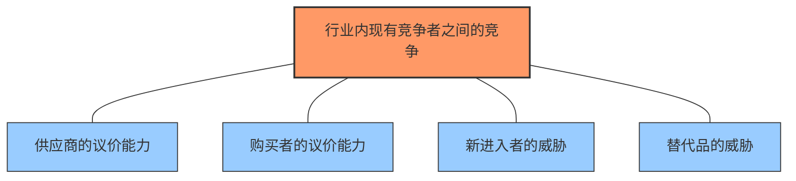

---
{"dg-publish":true,"dg-home":false,"permalink":"/08//notes///","dgPassFrontmatter":true}
---

# 波特五力模型分析

## 概述

波特五力模型(Porter's Five Forces)是由哈佛商学院教授迈克尔·波特(Michael E. Porter)于1979年提出的分析行业竞争结构和盈利能力的战略框架。该模型认为行业竞争程度和盈利潜力由五种力量共同决定，通过分析这五种力量的强弱，企业可以评估行业吸引力，识别战略机会和威胁，并制定更有效的竞争战略。

五力模型与价值链分析相辅相成：五力模型关注外部行业环境，而价值链分析关注企业内部价值创造活动。结合使用这两种工具，可以全面理解企业的竞争地位和战略选择。

## 五力模型结构

### 1. 行业内现有竞争者之间的竞争

现有竞争者间的竞争强度是五力模型的中心，直接影响行业盈利水平。

**关键影响因素**：
- **行业集中度**：竞争者数量和规模分布
- **行业增长率**：低增长加剧争夺市场份额的竞争
- **产品差异化程度**：低差异化导致价格竞争
- **固定成本或存储成本**：高固定成本促使企业扩大产量
- **产能利用率**：过剩产能加剧竞争
- **退出壁垒**：高退出壁垒迫使企业留在低利润行业
- **战略利害关系**：竞争者的多元化战略目标

**竞争强度高的特征**：
- 频繁的价格战
- 持续的营销活动和新产品推出
- 企业利润率普遍较低
- 市场份额变动频繁

### 2. 供应商的议价能力

供应商可以通过提高价格或降低提供的产品/服务质量来挤压行业利润。

**供应商议价能力高的情况**：
- 供应商行业高度集中
- **供应商产品具有高度差异化或转换成本高**
- 缺乏替代品
- 供应商可能向前整合
- 行业客户对供应商不重要

**评估指标**：
- **供应商集中度**
- **转换成本**
- **供应商产品差异化**
- **供应商对行业的重要性**

### 3. 购买者的议价能力

强势买家可以通过压低价格、要求更高质量或更多服务来影响行业盈利能力。

**购买者议价能力高的情况**：
- **买家集中或采购量大**
- 产品标准化或差异小
- 买家转换成本低
- 买家利润率低或面临压力
- 买家可能向后整合
- 产品对买家不重要
- 买家拥有完整信息

**评估指标**：
- **客户集中度**
- **产品在客户成本中的比重**
- **产品差异化程度**
- **客户盈利状况**

### 4. 新进入者的威胁

新竞争者带来新产能和获取市场份额的愿望，可能降低行业盈利水平。

**进入壁垒高的情况**：
- **规模经济显著**
- 品牌认同度高
- 转换成本高
- 资本需求大
- 渠道通路受控
- 政府政策限制
- 现有企业的报复预期

**评估指标**：
- **进入壁垒高度**
- **现有企业反击能力**
- **行业增长前景**
- **近期进入历史**

### 5. 替代品的威胁

替代品限制了行业的价格天花板，从而限制潜在回报。

**替代品威胁大的情况**：
- **替代品性价比高**
- 转换成本低
- 买家倾向于替代
- 替代行业利润率高且扩张能力强

**评估指标**：
- **替代品性价比**
- **转换成本**
- **买家替代倾向**
- **替代品发展趋势**

## 分析方法与工具

### 五力强度评估矩阵

| 力量 | 关键因素 | 强度评分(1-5) | 趋势 | 战略意义 |
|------|---------|--------------|------|---------|
| 现有竞争 | 竞争者数量 增长率 产品差异化 退出壁垒 | 4 | ↑ | 需要差异化策略 |
| 供应商议价能力 | 供应商集中度 替代难度 转换成本 向前整合威胁 | 3 | → | 发展多元供应商 |
| 买家议价能力 | 买家集中度 产品重要性 转换成本 价格敏感度 | 5 | ↑ | 增强产品差异化 |
| 新进入者威胁 | 资本需求 规模经济 渠道准入 政府政策 | 2 | ↓ | 强化现有优势 |
| 替代品威胁 | 替代性价比 转换成本 替代趋势 买家倾向 | 4 | ↑ | 提高产品独特价值 |

### 竞争态势变动分析

跟踪五力变化趋势对战略调整至关重要：

1. **短期变化监测**：
   - 现有竞争者动态(价格变动、新产品、并购等)
   - 客户需求变化
   - 供应链变动

2. **中期变化分析**：
   - 技术发展对行业的影响
   - 新进入者的影响评估
   - 替代品发展趋势

3. **长期趋势预测**：
   - 行业结构演变方向
   - 价值链可能的重构
   - 潜在颠覆性变化

### 综合评分方法

对五力分别进行1-5分评分，3分表示中等影响力，1分表示非常弱，5分表示非常强：

1. 计算总分 = 五力得分之和（范围：5-25）
2. 评判标准：
   - 5-10分：行业非常有吸引力，具有高盈利潜力
   - 11-17分：行业适度有吸引力，有合理盈利空间
   - 18-25分：行业吸引力低，盈利挑战大

## 应用场景

### 1. 战略规划

- 评估现有业务所处行业的吸引力
- 识别行业中的战略机会和威胁
- 指导业务组合决策和资源分配

### 2. 新业务开发

- 评估潜在进入行业的吸引力
- 识别进入壁垒和可能的进入策略
- 预测现有竞争对手可能的反应

### 3. 竞争策略制定

- 确定最佳竞争战略（成本领先、差异化或聚焦）
- 识别改变行业结构的机会
- 提前应对行业力量变化

### 4. 并购分析

- 评估潜在并购目标所处行业的吸引力
- 分析并购如何改变行业竞争格局
- 识别并购后可能面临的竞争威胁

### 5. 投资决策

- 评估特定行业的长期投资价值
- 识别影响行业结构的关键趋势
- 预测行业未来盈利能力变化

## 案例分析：中国在线食品外卖行业五力分析

### 行业背景

中国在线食品外卖行业在过去十年经历了爆发式增长，主要由美团和饿了么等平台主导，形成了寡头竞争格局。

### 五力分析

#### 1. 现有竞争者之间的竞争 - 强(4.5/5)

- **市场集中度**：美团和饿了么占据90%以上市场份额，形成双寡头格局
- **竞争焦点**：补贴战、商户独家合作、配送效率和覆盖范围
- **增长情况**：增长率逐渐放缓，竞争从扩张转向精细化运营
- **竞争特点**：
  - 持续的补贴和促销活动
  - 不断扩大的服务品类
  - 对配送效率的持续投入
  - 高营销支出争夺用户心智

#### 2. 供应商的议价能力 - 弱(2/5)

- **主要供应商**：餐厅、骑手、技术服务商
- **餐厅议价能力**：
  - 大多数餐厅高度依赖平台带来的订单
  - 平台抽成比例较高(15-25%)且难以谈判
  - 高端或特色餐厅有一定议价能力
- **骑手议价能力**：
  - 个体骑手议价能力低
  - 第三方配送公司议价能力中等
- **技术供应商**：可替代性高，议价能力有限

#### 3. 购买者的议价能力 - 中等(3/5)

- **用户特点**：
  - 数量庞大但高度分散
  - 转换成本低，可轻松在平台间切换
  - 价格敏感度高，受促销影响大
- **制约因素**：
  - 平台间服务同质化严重
  - 用户忠诚度低，促销驱动选择
- **增强因素**：
  - 网络效应和用户习惯形成粘性
  - 会员计划增加转换成本

#### 4. 新进入者的威胁 - 弱(2/5)

- **进入壁垒**：
  - 需要巨额资本投入构建平台和物流网络
  - 现有平台已形成强大网络效应
  - 需要大量商户资源和骑手团队
- **现有巨头优势**：
  - 规模经济（配送网络利用率）
  - 数据优势（用户习惯、商户表现、配送优化）
  - 品牌认知和用户习惯
- **潜在进入者**：
  - 其他互联网巨头（如京东、拼多多）
  - 社区团购平台延伸

#### 5. 替代品的威胁 - 中等(3/5)

- **主要替代品**：
  - 传统堂食消费
  - 自行烹饪
  - 社区团购的半成品食材
  - 即食食品（方便食品、速冻食品）
- **替代趋势**：
  - 预制菜兴起提供新选择
  - 智能厨电降低自行烹饪门槛
  - 社区生鲜配送加速发展

### 综合评估

- **总体评分**：14.5/25，行业吸引力中等
- **行业盈利前景**：
  - 规模大但利润率受压
  - 向多元化服务延伸（如同城配送、社区服务）
  - 龙头企业有望通过规模效应和多元化实现盈利
- **战略意义**：
  - 现有平台应专注效率提升和多元化发展
  - 新进入者需考虑特定细分市场或差异化模式
  - 餐厅应平衡线上线下渠道，减少对单一平台依赖

## 与其他分析工具的结合

### 波特五力与SWOT分析结合

- 使用五力分析确定行业机会和威胁
- SWOT分析中的外部因素(OT)可从五力分析获取
- 内部因素(SW)则通过价值链分析获得

### 波特五力与价值链分析结合

- 五力分析识别外部竞争环境
- 价值链分析评估内部活动价值创造
- 结合确定如何调整价值链活动应对竞争力量

### 波特五力与PEST分析结合

- PEST分析宏观环境变化
- 五力分析行业结构
- 结合分析宏观因素如何影响行业五力变化

## 数字经济时代的五力模型应用

数字化转型对传统五力模型产生了深远影响：

### 1. 平台经济的影响

- **网络效应**成为新的进入壁垒
- **多边市场**同时服务多个客户群体
- **赢者通吃**现象加剧行业集中度

### 2. 数据作为竞争要素

- 数据成为核心战略资源
- 数据分析能力影响竞争优势
- 数据网络效应形成正反馈循环

### 3. 生态系统竞争

- 竞争从企业间扩展到生态系统间
- 互补产品提供者角色日益重要
- 跨行业边界变得模糊

### 4. 颠覆性创新加速

- 技术变革加速行业结构重组
- 降低了某些传统进入壁垒
- 创造了新的竞争维度

## 波特五力模型的优势与局限性

### 优势

1. **结构化框架**：提供系统评估行业竞争和盈利能力的方法
2. **全面视角**：考虑多方面力量，而不仅是直接竞争对手
3. **战略指导**：帮助确定合适的竞争策略和定位
4. **行业比较**：可用于比较不同行业的吸引力
5. **变化分析**：可用于分析行业结构随时间的变化

### 局限性

1. **静态分析**：难以充分捕捉行业快速变化的动态性
2. **过于简化**：某些行业可能受五力之外的因素影响更大
3. **假设局限**：基于完全竞争市场假设，可能不适用于新兴或高度管制行业
4. **互补性因素**：原始模型忽略了互补产品的重要性
5. **社会因素欠缺**：未充分考虑社会责任和可持续发展等现代因素

## 实践应用要点

### 分析前的准备工作

1. **明确界定行业边界**：
   - 确定分析的具体行业和地理范围
   - 考虑产品市场和客户细分

2. **收集相关数据**：
   - 行业报告和市场研究
   - 竞争对手年报和战略声明
   - 客户和供应商调研
   - 行业专家访谈

3. **组建多功能分析团队**：
   - 包括营销、运营、财务等多部门视角
   - 避免单一视角偏见

### 分析的深度与广度

1. **定性与定量结合**：
   - 使用数据支持对五力强度的判断
   - 建立可比较的评分标准

2. **历史趋势分析**：
   - 追踪五力强度的历史变化
   - 分析导致变化的关键因素

3. **未来趋势预测**：
   - 评估可能改变行业结构的趋势
   - 预测五力未来变化方向

### 从分析到行动

1. **战略调整**：
   - 基于五力分析调整竞争战略
   - 决定是进攻性改变行业结构还是适应现有结构

2. **资源分配**：
   - 将资源集中于能应对关键竞争力量的活动
   - 强化应对主要威胁的能力

3. **持续监测**：
   - 建立定期监测行业五力变化的机制
   - 设置预警指标识别重大变化

## 思考问题

1. 您所在行业的五力结构如何，哪种力量最强？
2. 数字化转型如何改变了您行业的竞争格局？
3. 您的企业如何利用行业结构特点建立竞争优势？
4. 未来五年内，哪些因素可能改变您行业的五力结构？
5. 您的企业是否应该尝试改变行业结构，或者更好地适应现有结构？

## 参考资源

1. Porter, M. E. (1979). *How Competitive Forces Shape Strategy*, Harvard Business Review
2. Porter, M. E. (2008). *The Five Competitive Forces That Shape Strategy*, Harvard Business Review
3. Magretta, J. (2012). *Understanding Michael Porter: The Essential Guide to Competition and Strategy*
4. 行业分析方法与案例(哈佛商学院案例集)
5. 竞争战略：行业与竞争者分析技术(波特著) 