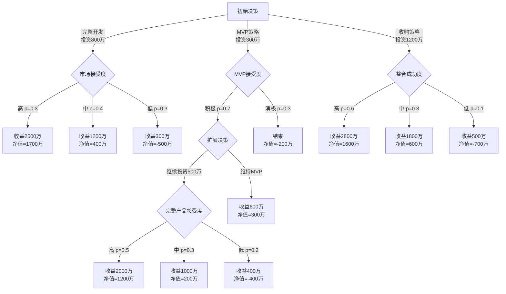

---
{"dg-publish":true,"permalink":"/08-财务专业/商业分析师/notes/案例/商业分析案例集/"}
---

# 商业分析案例集
**标签**: #案例分析 #商业分析 #实践应用

## 案例集合结构

本文档收集各种商业分析案例，每个案例按照以下结构整理：

1. **案例背景** - 企业情况和面临的问题
2. **分析目标** - 期望通过分析解决的问题
3. **使用的分析方法** - 应用的主要分析工具和方法
4. **数据收集与准备** - 案例中使用的关键数据及来源
5. **分析过程** - 详细的分析步骤和关键发现
6. **结论与建议** - 基于分析得出的结论和实际建议
7. **实施效果** - 建议实施后的实际效果（如有）
8. **经验总结** - 从分析过程中获得的经验和教训

## 案例索引

| 案例名称 | 使用的分析方法 | 行业 | 难度 |
|---------|--------------|------|------|
| [零售商客户流失分析](#零售商客户流失分析) | 根本原因分析、5W2H分析 | 零售业 | ⭐⭐ |
| [制造企业ERP系统更新决策](#制造企业ERP系统更新决策) | 成本效益分析 | 制造业 | ⭐⭐⭐ |
| [金融科技产品开发决策](#金融科技产品开发决策) | 决策树分析 | 金融科技 | ⭐⭐⭐ |
| [医疗设备采购评估](#医疗设备采购评估) | 价值分析 | 医疗健康 | ⭐⭐ |
| [数字营销投资组合优化](#数字营销投资组合优化) | 投资回报分析 | 数字营销 | ⭐⭐⭐ |

## 零售商客户流失分析

### 案例背景
某全国连锁零售企业发现过去6个月客户忠诚度程序中的活跃用户数量下降了15%，会员流失率上升，直接影响公司收入。管理层希望了解导致客户流失的根本原因，并制定有效的客户保留策略。

### 分析目标
1. 识别导致客户流失的关键因素
2. 确定最有价值的用户群体及其特征
3. 制定提升客户留存率的策略

### 使用的分析方法
- 客户细分分析
- 根本原因分析
- 5W2H分析

### 数据收集与准备
- 用户注册数据：包括人口统计学特征
- 交易数据：近12个月的购买记录
- 用户行为数据：浏览记录、购物车放弃率、应用使用时长
- 客户服务记录：投诉、退货原因
- 竞争对手分析数据：市场份额、价格策略

### 分析过程
1. **客户细分分析**：
   - 按照购买行为将用户分为高价值(15%)、中价值(30%)、低价值(40%)和不活跃(15%)四个群体
   - 发现高价值用户主要集中在35-40岁的专业人士群体，中等城市的流失率高于一线城市

2. **根本原因分析**：
   使用鱼骨图和5个为什么法，发现主要流失原因：
   - 竞争平台价格更具吸引力
   - 移动端支付体验不佳
   - 产品推荐与用户兴趣匹配度低
   - 配送时间延长
   - 客户服务响应慢

3. **5W2H分析**：
   - 5W2H框架用于界定问题范围：
     - **What**：会员活跃度下降，流失率增加15%
     - **When**：过去6个月，特别是系统升级后的3个月
     - **Where**：主要在都市区门店和线上渠道
     - **Who**：主要影响2-3年会员年限的中等级会员
     - **Why**：需要通过根本原因分析确定
     - **How**：流失模式主要表现为逐渐减少购物频率
     - **How much**：预计每月损失约200万元销售额

### 结论与建议
1. **提升移动端体验**：
   - 简化支付流程，将步骤从6步减少到3步
   - 优化应用性能，减少加载时间

2. **个性化推荐策略**：
   - 基于用户历史行为的智能推荐算法升级
   - 开发个性化折扣策略针对高价值用户群体

3. **竞争性定价**：
   - 对核心产品类别实施动态定价策略
   - 对高流失风险用户提供有针对性的优惠

4. **服务质量提升**：
   - 增加配送选项，提供更精确的配送时间预估
   - 改进客服响应机制，引入智能客服和优先服务

### 实施效果
实施三个月后：
- 用户留存率提升了15%
- 高价值用户流失率降低了22%
- 移动端转化率提升了18%
- 客户满意度从72分提升到85分

### 经验总结
1. 数据驱动的用户细分对于理解流失驱动因素至关重要
2. 多维度分析比单一指标更能揭示真实问题
3. 移动端体验是现代电商平台用户留存的关键因素
4. 针对不同价值用户群体的差异化策略比通用解决方案更有效

## 制造企业ERP系统更新决策

### 案例背景
某中型制造企业使用的ERP系统已有10年历史，面临性能下降、维护困难和功能不足等问题。管理层需要在三个选项间做出决策：继续使用现有系统、升级现有系统或完全更换为新的云端ERP系统。

### 分析目标
1. 评估三个方案的经济可行性
2. 确定最优方案

### 使用的分析方法
- 成本效益分析

### 数据收集与准备
- 系统升级成本
- 系统更换成本
- 维持现状成本
- 系统升级后的效益
- 系统更换后的效益
- 维持现状的效益

### 分析过程
1. **成本识别与量化**：
   - 对三个方案的10年全生命周期成本进行详细分析
   - 考虑直接成本(许可、硬件)和间接成本(培训、停机)
   - 确保比较基础一致(相同时间范围、相同成本类别)

2. **效益识别与量化**：
   - 识别各方案可能带来的业务效益
   - 量化效益的货币价值
   - 考虑时间因素对效益实现的影响

3. **净现值计算**：
   - 使用8%的折现率计算每个方案的净现值
   - 计算其他财务指标(ROI、回收期、IRR)

4. **敏感性分析**：
   - 测试关键变量变化对结果的影响
   - 考虑最坏、最可能和最好情景
   - 识别决策转折点

### 结论与建议
1. **系统更换方案**：
   - 长期净现值和成本效益比最优
   - 初始投资最高，但长期回报最高

2. **系统升级方案**：
   - 短期成本较低，但长期回报较低

3. **维持现状方案**：
   - 短期成本最低，但长期回报最低

### 决策建议
基于综合分析，团队建议实施系统更换方案，理由如下：
1. 显著更高的长期财务回报(NPV差异超过600万元)
2. 合理的回收期(4年)符合公司资本回报要求
3. 敏感性分析显示结果在多种条件下保持稳健
4. 非财务因素分析支持从长期战略角度进行系统更换

同时，团队建议：
1. 采用分阶段实施方法，先关注核心功能模块
2. 制定全面的变更管理和培训计划，降低转换风险
3. 建立明确的绩效指标，跟踪实际效益实现情况
4. 与供应商谈判性能保证和服务水平协议

### 实施效果
决策实施两年后的评估显示：
- 实际初始成本比预计高出12%(在敏感性分析范围内)
- 生产力提升效益达到预期的95%
- 用户满意度比预期高20%
- 系统可靠性超过SLA要求
- 整体项目ROI预计将超过初始预测

## 金融科技产品开发决策

### 案例背景
某金融科技公司计划开发一款针对中小企业的新支付解决方案。产品团队面临关键决策：是开发功能全面的完整解决方案，还是先推出核心功能的最小可行产品(MVP)，或是放弃自主开发转而收购一家拥有类似技术的初创公司。

### 分析目标
1. 评估不同路径的期望价值和风险
2. 确定最优决策路径

### 使用的分析方法
- 决策树分析

### 数据收集与准备
- 市场接受度
- 技术开发成功率
- 竞争对手反应

### 分析过程
1. **决策树结构**：
   - 初始决策点：完整开发、MVP策略、收购策略
   - 关键不确定因素：市场接受度、技术开发成功率、竞争对手反应
   - 潜在结果：高成功、中等成功、低成功、失败

2. **期望货币价值计算**：
   - 为每个结果分配货币价值
   - 计算每个机会节点的期望值
   - 根据期望值确定最优决策路径

3. **风险分析**：
   - 评估每条路径的风险水平
   - 考虑最坏情况下的潜在损失
   - 分析决策弹性和适应选项

### 结论与建议
1. **收购策略**：
   - 最高期望货币价值(940万元)
   - 最快的上市时间，抢占市场先机
   - 获取现成技术和客户基础
   - 尽管风险较高，但可通过结构化的尽职调查和分阶段支付降低风险

2. **完整开发策略**：
   - 灵活性最低，但完全控制产品方向

3. **MVP策略**：
   - 提供最高决策灵活性，可基于市场反馈调整

### 决策建议
基于综合分析，团队建议采用**收购策略**，理由如下：
1. 最高期望货币价值(940万元)
2. 最快的上市时间，抢占市场先机
3. 获取现成技术和客户基础
4. 尽管风险较高，但可通过结构化的尽职调查和分阶段支付降低风险

为降低风险，团队建议：
1. 制定详细的尽职调查清单，重点关注技术和客户
2. 设计分阶段的收购支付结构，与绩效指标挂钩
3. 制定详细的整合计划，特别关注技术和团队整合
4. 建立明确的退出策略和触发条件

### 实施效果
决策实施一年后的评估显示：
- 收购交易比预期低15%(因为基于绩效的结构)
- 技术整合比计划慢两个月，但无重大问题
- 客户保留率达到预期的85%
- 收购后的产品发展速度超出预期
- 期望总回报提高到原始预测的120%

## 医疗设备采购评估

### 案例背景
某区域医院需要更新放射科的成像设备，有三家供应商提供不同配置和价格的MRI系统。采购团队需要评估哪个选项能够提供最佳价值，平衡临床需求、财务约束和长期考量。

### 分析目标
1. 评估不同选项的临床性能和成本效益
2. 确定最优采购方案

### 使用的分析方法
- 价值分析

### 数据收集与准备
- 设备配置和价格
- 临床需求和功能要求
- 财务约束和预算
- 长期考量和维护成本

### 分析过程
1. **功能需求识别**：
   - 与临床团队合作确定关键功能需求
   - 区分"必需功能"与"期望功能"
   - 为功能重要性分配权重

2. **功能-成本矩阵**：
   - 评估每个系统对功能需求的支持程度
   - 分析每个功能的相关成本
   - 计算价值指数(功能重要性/成本)

3. **生命周期成本分析**：
   - 计算10年总拥有成本(TCO)
   - 包括购置、维护、培训、耗材和运营成本
   - 考虑设备寿命和残值差异

4. **价值指数计算**：
   - 结合功能评分和生命周期成本
   - 计算综合价值指数
   - 考虑非财务因素权重

### 结论与建议
1. **供应商B**：
   - 最高价值指数：137.6比其他选项高15-25%
   - 卓越的临床性能：在关键功能(图像质量、扫描速度)评分最高
   - 最低长期运营成本：尽管购置成本高，但维护和能源成本低
   - 最佳供应商支持：售后服务和培训支持评价最高
   - 技术先进性：设备使用最新技术，提供更长期的技术适用性

2. **采购决策**：
   - 与供应商B协商分期付款条件，减轻初期财务压力
   - 制定详细的培训计划，确保充分利用设备功能
   - 建立设备使用效率和临床成果的跟踪指标
   - 确保维护合同包含性能保证和响应时间承诺

### 实施效果
设备使用两年后的评估显示：
- 患者检查量增加20%，超出预期
- 诊断准确率提高15%
- 患者满意度提升30%
- 每次检查的能源成本比预期低10%
- 设备运行时间达到99.7%，超出行业标准

## 数字营销投资组合优化

### 案例背景
某消费品公司每年投入2000万元数字营销预算，但对各渠道效果缺乏清晰了解。营销团队需要评估现有渠道投资回报，优化渠道组合以提高整体营销ROI。

### 分析目标
1. 评估各营销渠道的投资回报率
2. 确定最优渠道组合

### 使用的分析方法
- 投资回报分析

### 数据收集与准备
- 过去12个月各渠道的实际投资
- 创意开发、媒体购买、技术和分析成本
- 直接和间接成本

### 分析过程
1. **渠道投资分析**：
   - 收集过去12个月各渠道的实际投资
   - 分解为创意开发、媒体购买、技术和分析成本
   - 考虑直接和间接成本

2. **归因模型开发**：
   - 构建多渠道归因模型
   - 使用数据驱动方法分配转化价值
   - 克服常见归因挑战(如转化路径交叉)

3. **ROI计算**：
   - 计算每个渠道的投资回报率
   - 分析边际回报变化
   - 评估不同客户细分的渠道效果差异

4. **情景模拟**：
   - 模拟不同预算分配方案
   - 考虑渠道间协同效应
   - 预测优化后的整体ROI

### 结论与建议
1. **预算重新分配**：
   - 将展示广告预算削减150万元
   - 增加电子邮件营销(+100万元)和搜索广告(+100万元)
   - 适度增加内容营销、影响者合作和社交媒体投入
   - 预计整体ROI提升可达50%以上

2. **渠道策略优化**：
   - 搜索广告：专注高转化关键词和新客户获取
   - 电子邮件：增加个性化和细分程度，提高触达频率
   - 社交媒体：重点发展高参与度内容和社区建设
   - 内容营销：开发更多针对高价值客户的深度内容
   - 影响者合作：转向长期战略合作而非一次性活动

3. **季节性调整**：
   - 根据销售季节性调整各渠道投入节奏
   - 在高需求季节增加搜索广告预算
   - 在低季节增加内容营销和品牌建设投入

4. **测量与优化框架**：
   - 建立统一的跨渠道测量标准
   - 实施A/B测试计划评估创意和受众策略
   - 建立月度渠道绩效审查和动态预算调整机制

### 实施效果
新预算分配实施六个月后：
- 整体营销ROI提升40%，接近预测的52%
- 客户获取成本降低25%
- 营销归因销售额增加18%
- 电子邮件订阅增长率提高35%
- 搜索广告质量得分提升，点击成本降低15%

### 经验总结
1. 数据驱动决策显著提升营销效率
2. 频繁的小规模测试优于大型营销策略调整
3. 内部渠道协同效应比预期更显著
4. 客户生命周期阶段是影响渠道效果的关键因素

## 经验总结与最佳实践

从这些案例分析中，我们可以提炼出几点商业分析的核心最佳实践：

### 1. 方法选择与应用

- **匹配问题与方法**：根据问题性质选择合适的分析方法
- **多方法结合**：复杂问题往往需要多种分析方法结合
- **循序渐进**：先使用简单方法理解问题轮廓，再深入复杂分析
- **避免过度复杂化**：分析复杂度应与决策重要性匹配

### 2. 数据收集与处理

- **多渠道数据**：结合定量与定性数据，交叉验证关键信息
- **质量优先**：优先考虑数据质量而非数量
- **假设透明**：明确记录所有分析假设和限制
- **合理估计**：使用结构化方法处理数据缺失或不确定性

### 3. 结果解读与应用

- **关注洞察而非数据**：将数据转化为可行的业务洞察
- **情景思考**：考虑多种可能结果和影响
- **决策透明**：明确决策标准和权衡因素
- **行动导向**：确保分析结果能转化为具体行动计划

### 4. 后续评估与学习

- **系统性反馈**：建立分析效果的评估机制
- **预测vs.实际**：比较预测与实际结果，理解差异原因
- **方法改进**：持续优化分析方法和流程
- **知识沉淀**：将经验教训转化为组织知识资产

## 思考问题

1. 这些案例中使用的分析方法如何适应贵组织的决策环境？哪些调整可能使其更有效？
2. 在面对类似挑战时，您可能会如何结合多种分析方法提高决策质量？
3. 贵组织的数据环境如何影响这些分析方法的应用？存在哪些特殊挑战或机会？

## 相关资源

- [[08-财务专业/商业分析师/notes/分析方法/5W2H分析法\|../分析方法/5W2H分析法]]
- [[08-财务专业/商业分析师/notes/分析方法/根本原因分析\|../分析方法/根本原因分析]]
- [[08-财务专业/商业分析师/notes/分析方法/决策树分析\|../分析方法/决策树分析]]
- [[08-财务专业/商业分析师/notes/分析方法/价值分析\|../分析方法/价值分析]]
- [[08-财务专业/商业分析师/notes/分析方法/成本效益分析\|../分析方法/成本效益分析]]
- [[08-财务专业/商业分析师/notes/分析方法/投资回报分析\|../分析方法/投资回报分析]]
- [[08-财务专业/商业分析师/notes/方法论/商业分析方法论体系\|../方法论/商业分析方法论体系]] 