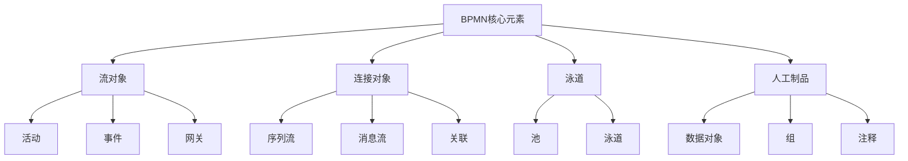
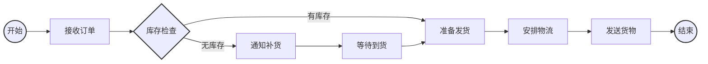
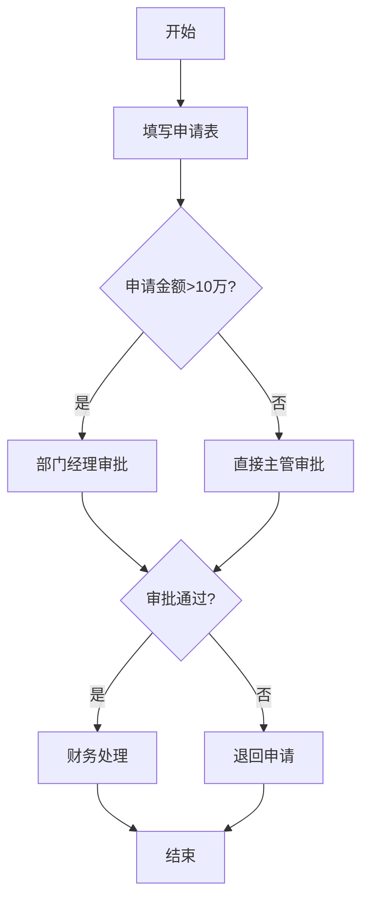
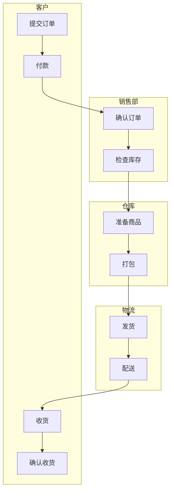
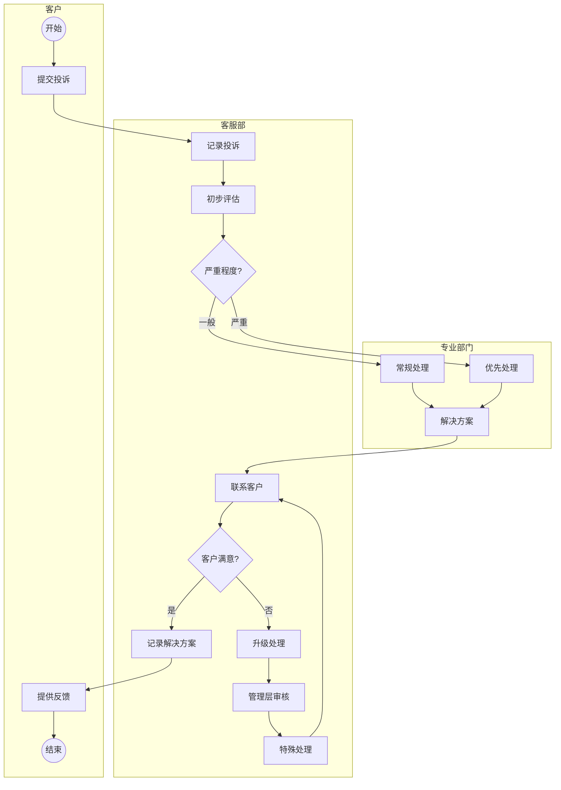

---
{"dg-publish":true,"dg-home":false,"permalink":"/08-财务专业/商业分析师/笔记/业务建模/业务流程建模/","dgPassFrontmatter":true}
---

**标签**: #业务建模 #流程分析 #BPMN

## 概述

业务流程建模是商业分析师的核心技能之一，通过可视化方式描述组织中的业务流程，帮助理解、分析和改进业务运作。流程模型展示了活动、事件、决策点及其之间的关系，为流程优化和系统设计提供基础。

## 业务流程建模的目的

1. **理解现有流程**: 记录和理解组织当前如何运作
2. **发现优化机会**: 识别低效、冗余或瓶颈环节
3. **设计未来流程**: 设计改进后的流程，支持业务目标
4. **沟通与协作**: 提供清晰的视觉化工具，促进利益相关者沟通
5. **系统需求导出**: 为IT系统设计提供业务流程基础
6. **标准化操作**: 建立一致的业务操作标准

## 常用业务流程建模技术

### 1. BPMN (业务流程建模符号)

BPMN (Business Process Model and Notation) 是一种国际标准化的业务流程建模语言，提供了直观的图形符号表达复杂业务流程。

#### BPMN核心元素

#### BPMN符号简介

| 符号类别 | 符号 | 描述 | 用途 |
|---------|-----|------|-----|
| **活动** | 圆角矩形 | 执行的工作或任务 | 表示流程中的任务、子流程或活动 |
| **事件** | 圆圈 | 流程中发生的事件 | 表示开始、中间和结束事件 |
| **网关** | 菱形 | 控制流程分支或合并 | 表示决策点、分支或并行处理 |
| **连接** | 箭头线 | 连接流对象 | 表示活动顺序和信息流 |
| **泳道** | 长方形容器 | 组织角色或部门 | 表示职责分配和组织边界 |
| **数据** | 文档图标 | 信息或数据 | 表示输入/输出数据或文档 |

#### BPMN示例流程

下面是一个简化的客户订单处理流程BPMN图:

### 2. 流程图

传统流程图是一种简单直观的流程表示方法，使用标准符号表示不同类型的操作和决策。

#### 流程图基本符号

| 符号 | 名称 | 用途 |
|-----|------|-----|
| 椭圆 | 开始/结束 | 表示流程的起点和终点 |
| 矩形 | 处理 | 表示流程中的操作或活动 |
| 菱形 | 决策 | 表示条件判断和流程分支 |
| 箭头 | 流向 | 表示活动的顺序和方向 |
| 平行四边形 | 输入/输出 | 表示数据的输入或输出 |

#### 流程图示例

### 3. 泳道图

泳道图是流程图的一种变体，通过水平或垂直"泳道"划分不同参与者的责任范围。

#### 泳道图特点

- 清晰展示流程中的职责分配
- 显示跨部门/角色的流程交互
- 帮助识别交接点和潜在延迟
- 便于明确责任和优化协作

#### 泳道图示例

## 业务流程建模步骤

### 1. 准备阶段

- **确定建模目的**: 明确为什么需要建模
- **确定流程范围**: 定义流程的起点和终点
- **收集信息**: 通过访谈、观察、文档分析等方式收集流程信息
- **选择建模方法**: 基于目的和复杂度选择合适的建模技术

### 2. 建模阶段

- **识别主要活动**: 列出流程中的主要步骤和活动
- **确定流程顺序**: 定义活动之间的逻辑顺序
- **添加分支和条件**: 识别决策点和条件分支
- **分配角色和职责**: 确定谁负责执行每个活动
- **添加其他元素**: 如数据输入/输出、系统交互等

### 3. 分析与完善

- **验证模型准确性**: 与流程参与者确认模型是否准确反映实际流程
- **检查完整性**: 确保所有路径和异常情况都被考虑
- **优化模型**: 简化复杂部分，提高可读性
- **添加详细描述**: 补充活动详情、决策规则等

### 4. 应用与维护

- **分享和讨论**: 与利益相关者分享流程模型
- **应用于目标**: 用于流程改进、系统设计等
- **定期更新**: 随着流程变化更新模型

## 业务流程建模实践案例

### 客户投诉处理流程建模

以下是某公司客户投诉处理流程的BPMN建模示例：

### 关键分析要点

1. **交接点分析**: 流程在部门之间交接时可能出现延迟和信息丢失
2. **决策点优化**: "严重程度"判断需要明确标准
3. **循环路径控制**: 客户不满意的循环路径需要限制次数，避免无限循环
4. **响应时间**: 每个环节应该设定响应时间标准

## 建模工具推荐

1. **专业BPMN工具**:
   - Bizagi Modeler (免费)
   - Camunda Modeler (开源)
   - Visual Paradigm

2. **通用图表工具**:
   - Lucidchart
   - Microsoft Visio
   - draw.io (免费)

3. **协作建模平台**:
   - Miro
   - Figma

## 业务流程建模最佳实践

1. **保持简单**: 流程模型应该尽可能简单，仅包含必要细节
2. **使用一致的符号**: 在整个组织内使用统一的建模符号和命名规范
3. **分层建模**: 从高层概况到详细流程，使用分层方法处理复杂流程
4. **关注异常路径**: 不仅关注"阳光路径"，还要考虑异常和错误处理
5. **迭代改进**: 流程模型应随业务变化不断更新
6. **结合数据**: 将流程分析与性能数据结合，识别改进机会

## 流程建模常见问题及解决方法

| 问题 | 解决方法 |
|-----|---------|
| 过度复杂的模型 | 分解为子流程，使用分层方法 |
| 缺乏一致性 | 建立组织建模标准和规范 |
| 模型与实际不符 | 定期验证和更新，与实际操作人员确认 |
| 缺乏模型维护 | 指定流程所有者，建立更新机制 |
| 建模工具不统一 | 标准化建模工具和导出格式 |

## 与其他建模方法的关系

业务流程建模通常与其他建模方法结合使用：

- 结合[[数据流图\|数据流图]]理解数据移动和转换
- 结合[[用例图\|用例图]]理解系统功能需求
- 结合[[实体关系图\|实体关系图]]理解业务实体和数据关系
- 结合[[价值流图\|价值流图]]分析价值创造过程

## 思考问题

1. 你所在组织的核心业务流程是否已经被记录和建模？如果没有，最应该优先建模的是哪些流程？
2. 流程建模与流程改进之间是什么关系？一个好的流程模型如何帮助流程优化？
3. 在复杂流程建模中，如何平衡细节完整性和模型可理解性？

## 相关资源

- [[流程分析技术\|流程分析技术]]
- [[流程优化方法\|流程优化方法]]
- [[业务建模概述\|业务建模概述]]
- [[08-财务专业/商业分析师/笔记/方法论/商业分析方法论体系\|商业分析方法论体系]] 