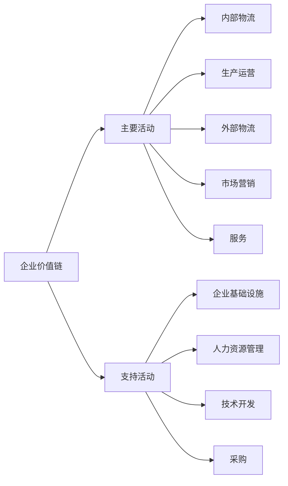

---
{"dg-publish":true,"permalink":"/08-财务专业/商业分析师/笔记/价值链分析/"}
---


# 价值链分析

## 概念介绍

价值链分析(Value Chain Analysis)是由迈克尔·波特(Michael Porter)于1985年在其著作《竞争优势》中提出的一种战略分析工具。它将企业视为一系列创造价值的活动的集合，通过系统地检视这些活动如何相互关联以及各自的成本和价值贡献，从而找出企业的竞争优势来源或改进机会。

价值链的核心理念是：每个企业都是设计、生产、营销、交付和支持其产品或服务的活动集合。所有这些活动都可以用价值链来表示，企业通过执行这些活动创造价值，最终体现为客户愿意为产品或服务支付的总金额。

### 价值链的基本结构

价值链由两大类活动组成：



#### 主要活动（Primary Activities）

直接涉及产品的物理创造、销售、维护的活动：

1. **内部物流(Inbound Logistics)**：接收、存储和分配投入物的活动，如原材料处理、仓储、库存控制等。
2. **生产运营(Operations)**：将投入转化为最终产品的活动，如加工、组装、包装、设备维护等。
3. **外部物流(Outbound Logistics)**：收集、存储和向买方配送产品的活动，如成品仓储、订单处理、配送等。
4. **市场营销与销售(Marketing & Sales)**：使买方购买产品并诱导他们这样做的活动，如广告、促销、定价、渠道管理等。
5. **服务(Service)**：提供服务以增强或维持产品价值的活动，如安装、维修、培训、零部件供应等。

#### 支持活动（Support Activities）

支持主要活动和彼此的活动：

1. **企业基础设施(Firm Infrastructure)**：支持整个价值链的活动，如一般管理、计划、财务、法律、政府关系等。
2. **人力资源管理(Human Resource Management)**：涉及招聘、培训、开发和薪酬等活动。
3. **技术开发(Technology Development)**：涉及产品和流程改进的活动，如研发、产品设计、知识管理等。
4. **采购(Procurement)**：获取价值链所需投入的活动，如供应商管理、原材料采购等。

## 价值链分析的步骤

### 1. 识别活动

首先需要将企业分解为关键的价值创造活动，具体包括：
- 梳理企业的主要活动和支持活动
- 关注那些对客户价值和成本结构有显著影响的活动
- 区分不同的战略业务单元(SBU)的活动

### 2. 分配成本

为每项活动分配直接成本、间接成本和资产：
- 计算每项活动的运营成本
- 识别价值链中的成本驱动因素
- 了解各活动间的成本关系

### 3. 识别价值驱动因素

确定使每项活动对客户具有独特价值的因素：
- 确定能够增加客户感知价值的活动特征
- 分析客户愿意支付更高价格的原因
- 评估差异化的来源

### 4. 识别联系

分析活动之间的联系如何影响成本或价值：
- 内部联系：价值链内活动之间的关系
- 外部联系：与供应商和客户价值链的关系
- 寻找协同效应或优化机会

### 5. 开发竞争优势策略

基于分析结果开发战略选择：
- 成本领先策略：降低活动成本或重新配置价值链
- 差异化策略：提高特定活动的价值或创建新的价值活动
- 聚焦策略：为特定细分市场重新设计价值链

## 价值链分析的方法与工具

### 活动分析表

| 价值链活动 | 关键过程 | 成本占比 | 价值贡献 | 竞争地位 | 改进机会 |
|------------|----------|----------|----------|----------|----------|
| 内部物流   | 原材料接收<br>库存管理<br>运输管理 | 15% | 中 | 优 | 自动化库存管理 |
| 生产运营   | 生产计划<br>质量控制<br>生产执行 | 35% | 高 | 良 | 精益生产 |
| 外部物流   | 订单处理<br>配送管理<br>库存控制 | 20% | 中 | 良 | 物流优化 |
| 市场营销   | 市场调研<br>品牌建设<br>销售管理 | 20% | 高 | 优 | 数字营销 |
| 售后服务   | 客户支持<br>维修服务<br>客户关系 | 10% | 高 | 优 | CRM系统 |

### 成本-价值矩阵

将价值链活动映射到成本-价值矩阵，帮助确定战略优先级：

```
高 |        | 高价值     | 战略优势  |
  |        | 低成本     | 高价值    |
  |        |            | 高成本    |
价 |--------|------------|-----------|
值 |        |            |           |
  | 低价值  | 低价值     | 重新考虑  |
  | 低成本  | 高成本     |           |
低 |        |            |           |
   ----------|------------|------------
             低           高
                成本
```

## 价值链分析的应用场景

### 1. 战略规划与定位

- 确定企业在哪些价值活动上应该投入资源
- 识别核心竞争力，确定是否应该外包非核心活动
- 定位企业在产业价值链中的最佳位置

### 2. 业务流程优化

- 识别低效或冗余的业务流程
- 重新设计内部价值创造活动
- 实施流程改进计划

### 3. 成本控制与效率提升

- 分析高成本活动的成本驱动因素
- 确定降低成本的机会
- 重新配置资源以优化成本结构

### 4. 产品开发与创新

- 识别能够增加产品差异化的价值活动
- 确定创新的重点领域
- 设计新产品的最佳价值配置

### 5. 并购与战略联盟决策

- 评估潜在并购目标的价值链互补性
- 识别战略联盟可能创造的协同效应
- 评估整合的复杂性和风险

### 6. 数字化转型规划

- 识别可通过数字技术增强的价值活动
- 评估数字化对价值链结构的潜在影响
- 确定数字化转型的优先顺序

## 案例分析：星巴克的价值链分析

### 公司背景
星巴克(Starbucks)是全球领先的特色咖啡零售商，拥有超过30,000家门店，分布在80多个国家。

### 价值链活动分析

#### 主要活动

1. **内部物流**
   - 全球咖啡豆采购网络（直接贸易关系）
   - 高标准原料筛选系统
   - 区域性烘焙工厂与配送中心

2. **生产运营**
   - 精细化咖啡豆烘焙工艺
   - 标准化门店操作流程
   - 严格的质量控制系统

3. **外部物流**
   - 高效的门店供应链管理
   - 新鲜度保证配送系统
   - 季节性产品轮换机制

4. **市场营销与销售**
   - 高端品牌定位
   - 全球统一的店面设计与氛围
   - 会员忠诚度计划（星享卡）
   - 数字营销与社交媒体战略

5. **服务**
   - "第三空间"顾客体验
   - 定制化饮品服务
   - 专业咖啡知识培训与分享

#### 支持活动

1. **企业基础设施**
   - 全球一致的企业文化与价值观
   - 强大的财务管理能力
   - 社会责任计划

2. **人力资源管理**
   - "伙伴"而非员工的理念
   - 全面的员工福利与教育计划
   - 职业发展通道

3. **技术开发**
   - 移动支付与订单系统
   - 门店设计与设备创新
   - 产品研发（咖啡配方、食品）

4. **采购**
   - 道德采购标准
   - 咖啡农改善计划
   - 环保包装材料开发

### 竞争优势分析

1. **差异化优势**
   - 通过"第三空间"体验差异化
   - 门店环境、音乐、氛围的精心设计
   - 个性化的产品与服务体验

2. **协同效应**
   - 利用数字渠道与实体店的整合
   - 星享卡计划连接产品、体验与忠诚度
   - 品牌价值与社会责任的协同

3. **创新重点**
   - 移动应用与数字体验
   - 可持续发展实践
   - 门店模式创新（快取店、甄选店等）

### 战略建议

基于价值链分析，星巴克可以：

1. 进一步强化其在高端咖啡市场的差异化优势
2. 利用数字化工具优化内部物流和运营效率
3. 加强与咖啡种植者的直接合作，确保可持续供应
4. 扩展产品线以满足不同消费场景的需求
5. 持续创新门店体验，应对新的消费趋势

## 价值链分析的优势与局限性

### 优势

1. **系统性视角**：提供了观察企业所有活动的整体框架
2. **战略聚焦**：帮助企业聚焦于能够创造竞争优势的关键活动
3. **成本-价值平衡**：同时关注成本控制和价值创造
4. **多维度分析**：可以从多个角度（成本、差异化、联系）分析企业
5. **行业适应性**：适用于各种行业和企业类型

### 局限性

1. **数据需求高**：需要详细的成本和价值数据，可能难以获取
2. **静态分析**：不能完全捕捉市场动态变化
3. **内部导向**：过于关注内部运营，可能忽视外部市场变化
4. **复杂性**：在大型多元化企业中实施可能过于复杂
5. **主观判断**：价值评估往往涉及主观判断

## 数字化时代的价值链分析

数字化转型正在重塑传统价值链：

1. **价值链解构**：数字技术打破了传统价值链的线性结构
2. **平台模式**：从线性价值链到价值网络或平台生态系统
3. **数据作为价值源泉**：数据本身成为价值创造的核心资源
4. **客户共创**：客户从价值接收者变为价值共同创造者
5. **敏捷价值交付**：从批量生产到持续创新和快速迭代

在数字化背景下，价值链分析应关注：

- 数字技术如何重新定义传统价值活动
- 数据流如何贯穿并连接各价值活动
- 生态系统伙伴如何共同创造和分享价值
- 客户体验如何成为价值链的中心

## 思考问题

1. 您所在的企业或熟悉的企业的核心价值活动是什么？
2. 数字化转型如何改变了您所在行业的价值链结构？
3. 如何将价值链分析与其他战略工具（如波特五力模型、SWOT分析）结合使用？
4. 在全球化和本地化之间，如何优化企业的价值链配置？
5. 可持续发展趋势将如何影响企业价值链的重构？

## 相关资源

- 波特, M. (1985). 《竞争优势》
- 波特, M. (1996). 《什么是战略》, 哈佛商业评论
- 斯塔伯尔, P. & 菲杰林克, V. (2016). 《价值链分析和价值创造》
- 商业模式画布 (Osterwalder)
- 蓝海战略 (Kim & Mauborgne) 