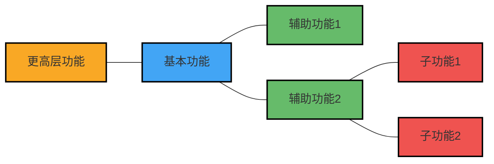

---
{"dg-publish":true,"permalink":"/08-财务专业/商业分析师/笔记/分析方法/价值分析/"}
---

**标签**: #需求分析 #成本效益 #价值评估

## 概述

价值分析是一种系统性评估产品、服务、流程或解决方案实际价值的方法论，通过识别功能、优化成本和提升价值来支持决策。作为商业分析师的核心工具之一，价值分析帮助组织区分真正需要的功能与可能被过度设计的部分，平衡成本与价值，确保资源投入产生最大回报。

## 价值分析的核心概念

### 1. 价值的定义

在价值分析中，价值通常定义为：

$$价值 = \frac{功能}{成本}$$

其中：
- **功能**：指产品、服务或流程满足用户需求的程度
- **成本**：指提供该功能所需的全部资源投入

价值增加可通过以下方式实现：
- 保持成本不变的情况下增加功能
- 保持功能不变的情况下降低成本
- 功能增加的比例大于成本增加的比例
- 成本降低的比例大于功能降低的比例

### 2. 功能分类

价值分析将功能分为以下几类：

- **基本功能**：产品或服务必须提供的核心功能，没有这些功能将无法满足基本需求
- **辅助功能**：支持基本功能的次要功能，提升用户体验但不是必需的
- **不必要功能**：既不支持基本功能也不显著提升用户体验的功能，可能是过度设计

### 3. 成本分析维度

价值分析中的成本通常包括：

- **直接成本**：材料、人力、设备等直接投入
- **间接成本**：管理、维护、培训等支持性投入
- **生命周期成本**：从设计到退役的全生命周期投入
- **机会成本**：投入到此项目而放弃其他机会的潜在收益

## 价值分析的方法论步骤

### 1. 准备阶段

- **确定分析对象**：明确要分析的产品、服务、流程或解决方案
- **组建分析团队**：跨职能团队，包括业务专家、技术专家和财务专家
- **收集信息**：了解用户需求、市场环境、技术限制和业务目标

### 2. 信息分析阶段

- **功能分析**：
  - 识别所有功能并分类（基本/辅助/不必要）
  - 绘制功能分解结构图(FAST)，展示功能间的层级关系
  - 确定每个功能的重要性和价值贡献

- **成本分析**：
  - 分解各功能的成本结构
  - 识别高成本区域
  - 分析成本与功能贡献的匹配度

### 3. 创新阶段

- **头脑风暴替代方案**：为每个功能寻求多种实现路径
- **应用创新技术**：考虑新技术、新材料或新方法的应用
- **功能重组**：重新组合或整合功能以提高效率

### 4. 评估阶段

- **方案筛选**：根据可行性、风险和潜在价值初步筛选
- **成本效益分析**：评估每个替代方案的成本和预期收益
- **风险评估**：分析每个方案的实施风险和不确定性

### 5. 实施与验证阶段

- **实施计划**：制定详细的实施路线图
- **变更管理**：规划所需的组织变更和传播策略
- **效果验证**：设计指标体系，监控实施效果并与预期对比

## 价值分析的工具与技术

### 1. 功能分析系统技术(FAST)

FAST是价值分析中常用的功能建模工具，它以图形化方式展示"如何"和"为什么"的功能关系链：

从左向右阅读回答"如何"实现功能，从右向左阅读回答"为什么"需要这个功能。

### 2. 功能-成本矩阵

将功能重要性与成本进行对照分析的矩阵工具：

| 功能 | 重要性(1-10) | 成本占比 | 价值指数(重要性/成本) | 优化潜力 |
|-----|------------|----------|-------------------|---------|
| 功能A | 9 | 15% | 0.60 | 中 |
| 功能B | 8 | 10% | 0.80 | 低 |
| 功能C | 5 | 30% | 0.17 | 高 |
| 功能D | 10 | 25% | 0.40 | 中 |
| 功能E | 3 | 20% | 0.15 | 高 |

价值指数低的功能通常代表高优化潜力区域。

### 3. 价值工程工作坊(VE Workshop)

结构化的团队活动，通常持续3-5天，集中解决特定价值问题：

- **第1天**：信息收集与功能分析
- **第2天**：创意生成与方案开发
- **第3天**：方案评估与筛选
- **第4-5天**：行动计划制定与报告准备

### 4. 投资回报率(ROI)和净现值(NPV)分析

评估价值改进方案的财务可行性：

$$ROI = \frac{收益 - 投资成本}{投资成本} \times 100\%$$

$$NPV = \sum_{t=0}^{n} \frac{C_t}{(1+r)^t}$$

其中：
- $C_t$ 是第t期的现金流
- $r$ 是折现率
- $n$ 是项目周期

## 价值分析的应用场景

### 1. 产品开发与优化

- **新产品设计**：确保产品功能与客户需求匹配，避免过度设计
- **产品改进**：优化现有产品，提高价值/成本比
- **产品系列规划**：合理设计产品线，确定功能差异化策略

### 2. 流程优化

- **业务流程再造**：消除低价值活动，重新设计核心流程
- **精益管理**：识别并消除浪费，提升流程效率
- **服务设计**：优化服务交付流程，提升客户体验

### 3. 需求管理

- **需求优先级排序**：基于价值/成本比对需求进行排序
- **需求验证**：确保需求真正创造价值，而非仅是"想要"
- **MVP定义**：确定最小可行产品的核心功能集合

### 4. 投资决策

- **项目评估**：评估项目投资的价值回报
- **供应商选择**：超越价格，基于总价值进行供应商评估
- **合作伙伴评价**：评估战略合作的价值创造潜力

### 5. 组织变革

- **组织结构优化**：分析部门功能与价值贡献
- **资源配置**：基于价值导向进行资源分配
- **战略调整**：评估战略方向的价值创造能力

## 价值分析实践案例

### 案例：企业CRM系统选型的价值分析

#### 背景
某中型零售企业计划实施客户关系管理(CRM)系统，有三个候选解决方案：高端定制方案、中端商业软件和低成本开源方案。管理层需要决定哪个选择能提供最佳价值。

#### 应用价值分析

**1. 功能分析**

首先，团队确定了CRM系统的必要功能，并按重要性分级：

| 功能类别 | 功能描述 | 重要性(1-10) |
|---------|----------|------------|
| 基本功能 | 客户数据管理 | 10 |
| 基本功能 | 销售跟踪 | 9 |
| 基本功能 | 报表与分析 | 8 |
| 辅助功能 | 市场活动管理 | 7 |
| 辅助功能 | 客户服务管理 | 7 |
| 辅助功能 | 移动访问 | 6 |
| 辅助功能 | 社交媒体集成 | 5 |
| 辅助功能 | 电子邮件营销 | 5 |
| 辅助功能 | 客户门户 | 4 |
| 可选功能 | 高级分析 | 3 |
| 可选功能 | AI客户洞察 | 2 |

**2. 候选方案功能覆盖评估**

团队评估了三个候选方案对这些功能的支持程度(满分10分)：

| 功能 | 重要性 | 高端定制方案 | 中端商业软件 | 开源方案 |
|-----|--------|------------|-------------|---------|
| 客户数据管理 | 10 | 10 | 9 | 7 |
| 销售跟踪 | 9 | 9 | 8 | 7 |
| 报表与分析 | 8 | 10 | 8 | 5 |
| 市场活动管理 | 7 | 9 | 7 | 6 |
| 客户服务管理 | 7 | 9 | 8 | 5 |
| 移动访问 | 6 | 9 | 7 | 4 |
| 社交媒体集成 | 5 | 8 | 7 | 3 |
| 电子邮件营销 | 5 | 9 | 8 | 6 |
| 客户门户 | 4 | 8 | 6 | 3 |
| 高级分析 | 3 | 9 | 5 | 2 |
| AI客户洞察 | 2 | 8 | 4 | 0 |
| **加权总分** | - | **846** | **725** | **499** |

加权总分 = 求和(功能重要性 × 支持程度)

**3. 成本分析**

团队分析了三种方案的全生命周期成本(5年)：

| 成本类别 | 高端定制方案 | 中端商业软件 | 开源方案 |
|---------|------------|-------------|---------|
| 软件许可/开发 | 800,000 | 400,000 | 0 |
| 实施与集成 | 400,000 | 200,000 | 300,000 |
| 年度维护与支持 | 160,000 | 80,000 | 100,000 |
| 培训与变更管理 | 150,000 | 100,000 | 200,000 |
| 硬件与基础设施 | 100,000 | 80,000 | 120,000 |
| 升级与定制开发 | 200,000 | 300,000 | 500,000 |
| **5年总成本** | **2,450,000** | **1,480,000** | **1,620,000** |

**4. 价值指数计算**

将功能得分与成本相结合，计算价值指数：

$$价值指数 = \frac{功能加权总分}{5年总成本(万元)}$$

| 方案 | 功能加权总分 | 5年总成本(万元) | 价值指数 |
|-----|------------|--------------|---------|
| 高端定制方案 | 846 | 245 | 3.45 |
| 中端商业软件 | 725 | 148 | 4.90 |
| 开源方案 | 499 | 162 | 3.08 |

**5. 风险评估**

团队还评估了各方案的风险因素：

| 风险因素 | 高端定制方案 | 中端商业软件 | 开源方案 |
|---------|------------|-------------|---------|
| 实施失败风险 | 中 | 低 | 高 |
| 超预算风险 | 高 | 低 | 中 |
| 供应商依赖风险 | 高 | 中 | 低 |
| 技术支持风险 | 低 | 低 | 高 |
| 扩展性风险 | 低 | 中 | 高 |
| 用户采纳风险 | 低 | 低 | 高 |

**6. 决策建议**

基于价值分析结果，团队建议选择中端商业软件方案，理由如下：

1. **最高价值指数**：中端商业软件的价值指数最高(4.90)，表明其提供了最佳的功能/成本比
2. **平衡的功能覆盖**：虽然功能评分低于高端方案，但主要差距在低优先级功能上
3. **适中的总成本**：总成本最低，比开源方案还低约9%
4. **较低的整体风险**：实施风险和后期支持风险相对可控

该建议还包含了风险缓解计划和实施路线图，确保项目成功执行。

## 价值分析与相关方法的整合

### 与需求工程的结合

价值分析可在需求生命周期的不同阶段应用：

- **需求发现**：帮助识别真正的价值来源
- **需求分析**：评估需求的价值贡献，消除低价值需求
- **需求规格化**：确保功能描述与价值创造保持一致
- **需求验证**：验证需求确实能够交付预期价值

### 与项目管理的结合

价值分析支持项目决策过程：

- **项目选择**：选择高价值项目进行投资
- **范围管理**：确保项目范围聚焦于价值创造
- **变更控制**：评估变更请求的价值影响
- **项目阶段关卡**：在关键决策点评估继续投资的价值

### 与战略管理的结合

价值分析支持战略决策：

- **战略选择**：评估不同战略方向的价值创造潜力
- **资源配置**：优化组织资源分配，最大化价值创造
- **能力建设**：识别需要发展的核心能力以创造竞争优势
- **战略退出**：评估何时应放弃低价值业务或产品线

## 价值分析的挑战与应对

### 常见挑战

1. **价值量化困难**
   - 许多价值因素难以用货币衡量
   - 长期价值与短期收益权衡
   - 不同利益相关者对价值的认知差异

2. **功能分析复杂性**
   - 功能间相互依赖，难以真正分离
   - 隐含功能可能被忽视
   - 功能重要性评定主观性强

3. **组织阻力**
   - 对现有解决方案的依恋
   - 对变更的自然抵抗
   - 部门利益保护

4. **成本数据不完整**
   - 隐性成本难以识别
   - 生命周期成本预测困难
   - 缺乏精确的历史成本数据

### 应对策略

1. **价值评估框架**
   - 建立多维度价值评估模型
   - 结合定量与定性评估方法
   - 使用价值树分解复杂价值因素

2. **跨职能团队协作**
   - 确保不同视角的参与
   - 促进开放讨论和集体决策
   - 建立共同的价值认知

3. **迭代和持续改进**
   - 采用渐进式价值分析
   - 建立价值假设验证机制
   - 持续监控和评估价值实现

4. **知识管理**
   - 建立功能与成本数据库
   - 记录价值分析过程和经验教训
   - 开发价值分析案例集

## 商业分析师的价值分析工作指南

### 价值分析的准备工作

1. **确定分析边界和目标**
   - 明确分析对象(产品、流程、系统等)
   - 设定价值分析的具体目标
   - 确定决策时间表和约束条件

2. **组建价值分析团队**
   - 识别关键利益相关者
   - 确保技术、业务和财务专业的平衡
   - 为团队成员分配明确角色和责任

3. **收集必要数据和信息**
   - 用户需求和期望
   - 成本结构和财务数据
   - 技术和业务限制条件
   - 竞争和市场信息

### 价值分析实施步骤

1. **价值机会识别**
   - 功能分解和分析
   - 成本-功能映射
   - 识别价值改进机会

2. **价值提升方案开发**
   - 创意生成与头脑风暴
   - 方案概念开发
   - 初步可行性评估

3. **方案评估与决策**
   - 详细成本效益分析
   - 风险评估
   - 决策建议与行动计划

### 价值分析成果沟通指南

1. **针对不同受众的报告定制**
   - 高管层：聚焦战略价值和ROI
   - 技术团队：关注功能和实施可行性
   - 财务部门：强调成本节约和财务影响

2. **报告关键内容**
   - 价值分析摘要和主要发现
   - 推荐方案及其理由
   - 实施路线图和风险缓解计划
   - 价值实现监控指标

3. **可视化呈现**
   - 使用图表展示比较结果
   - 价值模型可视化
   - 关键决策点和价值影响

## 思考问题

1. 在你的组织中，如何平衡短期价值与长期价值的权衡？
2. 不同利益相关者对价值的认知通常有哪些差异？商业分析师如何协调这些差异？
3. 价值分析如何与敏捷方法论相结合，特别是在MVP(最小可行产品)定义中的应用？

## 相关资源

- [[08-财务专业/商业分析师/笔记/分析方法/成本效益分析\|成本效益分析]]
- [[08-财务专业/商业分析师/笔记/分析方法/决策树分析\|决策树分析]]
- [[需求优先级排序\|需求优先级排序]]
- [[08-财务专业/商业分析师/笔记/分析方法/投资回报分析\|08-财务专业/商业分析师/笔记/分析方法/投资回报分析]]
- [[08-财务专业/商业分析师/笔记/方法论/商业分析方法论体系\|商业分析方法论体系]] 