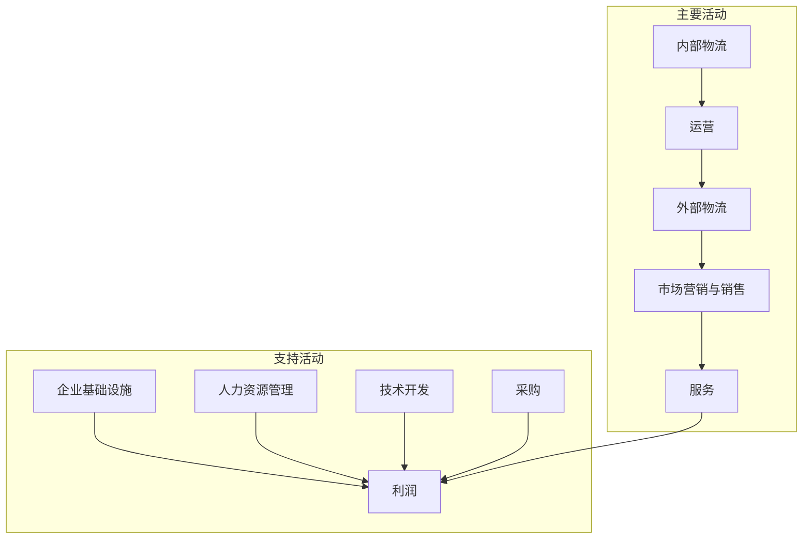

---
{"dg-publish":true,"permalink":"/08-财务专业/商业分析师/笔记/分析方法/价值链分析/"}
---

# 价值链分析

## 概述

价值链分析(Value Chain Analysis)是由迈克尔·波特(Michael Porter)于1985年在其著作《竞争优势》中提出的一种战略分析工具，用于系统地审视企业如何创造价值。这一方法将企业视为一系列活动的集合，这些活动如何执行以及它们之间如何协调，共同决定了企业的成本结构和差异化能力，进而决定了企业的竞争优势。

价值链分析与波特的其他战略工具（如五力模型）互为补充：五力模型关注外部竞争环境，而价值链分析则聚焦于企业内部的价值创造过程。

## 价值链结构

价值链包括两大类活动：

### 主要活动（Primary Activities）

主要活动直接参与产品或服务的创造、销售、交付和售后支持：

1. **内部物流(Inbound Logistics)**
   - 接收、储存和分配生产投入
   - 包括：原材料管理、仓储系统、供应商关系管理等
   - 示例：沃尔玛的高效配送中心和JIT（准时制）库存系统

2. **运营(Operations)**
   - 将投入转化为最终产品或服务
   - 包括：生产流程、装配、包装、设备维护、测试等
   - 示例：丰田的精益生产系统

3. **外部物流(Outbound Logistics)**
   - 收集、存储和向客户分配产品
   - 包括：成品仓储、订单处理、运输等
   - 示例：亚马逊的物流配送网络

4. **市场营销与销售(Marketing & Sales)**
   - 引导客户购买产品并提供购买方式
   - 包括：广告、促销、定价、渠道管理、销售团队等
   - 示例：苹果的品牌营销和零售店体验

5. **服务(Service)**
   - 维持或提升产品价值
   - 包括：安装、维修、培训、零部件供应、产品调整等
   - 示例：IBM的全方位企业IT支持服务

### 支持活动（Support Activities）

支持活动为主要活动提供基础设施和投入，使其能够进行：

1. **采购(Procurement)**
   - 获取价值链所需资源
   - 包括：供应商选择、采购策略、采购流程等
   - 示例：宝洁的全球采购网络

2. **技术开发(Technology Development)**
   - 提升产品和流程的技术
   - 包括：研发、流程设计、技术选择、设备设计等
   - 示例：谷歌的持续创新和20%自由时间政策

3. **人力资源管理(Human Resource Management)**
   - 员工招聘、培训、发展和薪酬
   - 包括：人才招聘、培训体系、绩效管理、企业文化等
   - 示例：奈飞的高绩效文化和自由与责任政策

4. **企业基础设施(Firm Infrastructure)**
   - 支持整个价值链的活动
   - 包括：总体管理、规划、财务、会计、法务、政府关系等
   - 示例：通用电气的管理系统和六西格玛质量管理

## 价值链分析步骤

### 1. 识别活动

- 将企业分解为分立的活动
- 判断每项活动对价值创造的贡献
- 在每个主要类别中识别具体活动

### 2. 分配成本

- 确定每项活动的成本
- 识别成本驱动因素
- 评估活动间成本联系

### 3. 识别价值驱动因素

- 确定哪些活动最能创造客户价值
- 评估差异化机会
- 分析客户感知价值

### 4. 确定竞争优势来源

- 识别成本优势领域
- 确定差异化领域
- 找出价值链中的战略机会

### 5. 制定战略

- 确定如何重组价值链活动
- 制定提升竞争地位的战略
- 创建可持续竞争优势

## 分析方法与工具

### 成本分析法

分析每项活动的成本构成，找出成本优势或劣势：

1. 计算各活动相对成本
2. 识别主要成本驱动因素
3. 与竞争对手成本结构比较
4. 确定成本优化机会

### 差异化分析法

确定哪些活动能创造独特价值：

1. 识别价值驱动因素
2. 评估客户愿意支付额外费用的属性
3. 分析竞争对手差异化策略
4. 确定可持续差异化来源

### 价值链图表法

使用图形化表示法展示价值链活动及其关系：

### 链接分析法

分析价值链内部活动之间的联系：

1. 识别活动间依赖关系
2. 分析内部协调改进机会
3. 评估价值系统整合机会

## 应用场景

1. **竞争战略制定**
   - 识别成本领导或差异化机会
   - 确定战略重点领域

2. **业务流程再造**
   - 诊断低效活动
   - 重新设计价值创造流程

3. **外包决策分析**
   - 评估核心与非核心活动
   - 确定外包候选活动

4. **并购战略分析**
   - 识别价值链互补性
   - 评估协同效应机会

5. **全球业务布局**
   - 确定活动地理分布
   - 优化全球价值链配置

## 案例分析：星巴克的价值链

### 背景
星巴克是全球领先的特色咖啡零售商，通过精心设计的价值链创造了独特的竞争优势。

### 星巴克的价值链分析

#### 主要活动

1. **内部物流**
   - 直接从咖啡生产国采购优质咖啡豆
   - 建立C.A.F.E.实践标准确保咖啡品质与可持续性
   - 与供应商建立长期合作关系

2. **运营**
   - 专有的咖啡烘焙技术和标准
   - 严格的员工培训("咖啡大师"认证)
   - 标准化但可定制的饮品制作流程

3. **外部物流**
   - 高效的配送系统将产品送达全球各门店
   - 新鲜度管理系统确保产品质量

4. **市场营销与销售**
   - 打造"第三空间"的店内体验
   - 会员忠诚度计划(星享卡)
   - 强大的品牌营销

5. **服务**
   - 个性化的顾客互动
   - "顾客满意保证"政策
   - 移动应用程序提升服务便捷性

#### 支持活动

1. **企业基础设施**
   - 社会责任理念融入企业文化
   - 扁平化管理结构
   - 完善的财务管理系统

2. **人力资源管理**
   - 员工称为"伙伴"，提供医疗保险等福利
   - 全面的培训与职业发展计划
   - 股票奖励计划增强归属感

3. **技术开发**
   - 持续的产品创新
   - 数字化客户体验(如移动支付、预订)
   - 可持续包装研发

4. **采购**
   - 道德采购实践
   - 与农民直接合作提高咖啡品质
   - 全球采购网络确保原料质量

### 星巴克的竞争优势

1. **差异化优势**
   - 高品质咖啡产品
   - 独特的店内体验
   - 品牌溢价能力

2. **关键成功因素**
   - 垂直整合的供应链控制
   - 以人为本的企业文化
   - 全渠道整合能力

## 价值链分析的优势与局限性

### 优势

1. **全面系统视角**
   - 提供企业价值创造的整体视图
   - 避免功能孤岛思维

2. **战略聚焦工具**
   - 明确企业竞争优势来源
   - 指导资源分配决策

3. **比较分析框架**
   - 便于与竞争对手比较
   - 识别最佳实践机会

### 局限性

1. **内部视角局限**
   - 可能忽视外部环境变化
   - 需要与外部分析工具结合使用

2. **静态分析性质**
   - 难以捕捉动态市场变化
   - 需要定期更新分析

3. **数据收集难度**
   - 某些活动成本难以准确分配
   - 竞争对手数据获取困难

## 新兴商业模式中的价值链转变

数字经济和平台商业模式正在改变传统价值链结构：

1. **价值网络取代线性价值链**
   - 多方参与者共同创造价值
   - 平台协调价值交换

2. **用户参与价值创造**
   - 用户生成内容
   - 用户反馈驱动产品开发

3. **数据成为关键价值驱动**
   - 数据收集和分析成为核心活动
   - 数据变现模式兴起

## 价值链整合策略

企业可以通过以下方式整合价值链：

1. **垂直整合**
   - 向上游整合(如供应商)
   - 向下游整合(如渠道或客户)

2. **水平整合**
   - 扩展相同价值链阶段
   - 获取规模经济

3. **协作整合**
   - 与互补企业建立战略联盟
   - 构建共享价值网络

## 相关分析方法

- **波特五力模型** - 分析产业竞争态势
- **核心能力分析** - 识别企业独特能力
- **业务流程重组** - 重新设计价值链活动
- **业务生态系统分析** - 扩展价值链视角

## 总结与实践要点

1. 价值链分析是理解企业竞争优势来源的强大工具
2. 需要同时关注成本和差异化两个维度
3. 应定期更新分析以适应市场变化
4. 结合其他战略工具使用效果最佳
5. 重点关注创造最多客户价值的活动

## 思考问题

1. 您的企业当前价值链中哪些活动创造最多价值？
2. 数字化转型如何改变您行业的传统价值链？
3. 您的主要竞争对手在价值链的哪些环节具有优势？
4. 您是否可以通过重组价值链活动创造新的竞争优势？
5. 全球化如何影响您企业的价值链配置？

## 参考资源

1. Porter, M. E. (1985). *Competitive Advantage: Creating and Sustaining Superior Performance*
2. Stabell, C. B., & Fjeldstad, Ø. D. (1998). *Configuring value for competitive advantage: On chains, shops, and networks*
3. Global Value Chains: Concepts & Tools (Duke University Global Value Chains Center)
4. Value Chain Analysis for Strategy and Competitive Advantage (Coursera) 