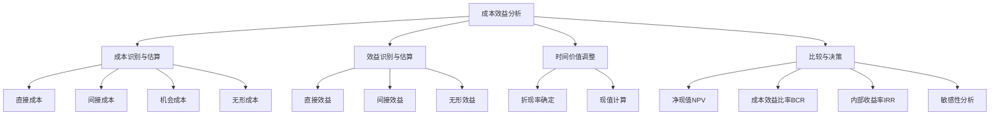

---
{"dg-publish":true,"permalink":"/08-财务专业/商业分析师/笔记/分析方法/成本效益分析/"}
---

# 成本效益分析

**标签**: #决策分析 #财务评估 #项目评估 #投资决策

## 概述

成本效益分析(Cost-Benefit Analysis, CBA)是一种系统性评估项目、政策或决策经济合理性的分析方法，通过货币化量化各种成本和效益，计算净效益或成本效益比率，为决策提供客观依据。该方法广泛应用于公共政策、项目投资、业务变革、产品开发等领域，帮助决策者在有限资源下做出最优选择。

成本效益分析的核心思想是将所有相关成本和效益（包括直接和间接、有形和无形）转化为货币价值，使其在同一标准下可比较，从而评估方案的经济合理性。它是财务决策、资源配置和项目评估的基础工具。

## 成本效益分析的基本框架

### 核心要素

### 1. 成本类别

**直接成本**:
- 初始投资成本（设备采购、建设成本等）
- 运营成本（人力成本、材料成本、维护费用等）
- 管理成本（行政管理、培训费用等）
- 合规成本（许可证费用、税收等）

**间接成本**:
- 支持活动成本
- 基础设施成本
- 外部协调成本
- 过渡/转型成本

**机会成本**:
- 放弃的替代方案价值
- 资源占用的机会损失

**无形/难以量化成本**:
- 环境影响
- 社会成本
- 组织文化影响
- 风险成本

### 2. 效益类别

**直接效益**:
- 收入增加
- 成本节约
- 生产力提升
- 质量改善

**间接效益**:
- 协同效应
- 竞争优势
- 市场份额增加
- 客户满意度提升

**无形/难以量化效益**:
- 员工满意度/体验改善
- 品牌价值提升
- 创新能力增强
- 社会和环境效益

### 3. 时间价值调整

**折现率**:
- 风险调整后的资本成本
- 通货膨胀因素
- 行业/项目风险溢价

**时间维度**:
- 项目/投资生命周期
- 分析期限确定
- 终值估算（如适用）

### 4. 决策指标

**净现值(NPV)**:
- 所有效益现值减去所有成本现值
- 正值表示项目创造价值

**效益成本比率(BCR)**:
- 效益现值除以成本现值
- 比率>1表示项目值得投资

**内部收益率(IRR)**:
- 使项目NPV等于零的折现率
- 通常与资本成本或要求回报率比较

**回收期**:
- 初始投资回收所需时间
- 未折现回收期和折现回收期

## 成本效益分析的步骤

### 1. 确定分析范围与目标

- 明确分析对象（项目、政策、投资等）
- 确定相关利益相关者
- 设定分析时间范围
- 确定评估视角（私人、社会、组织等）

### 2. 识别并量化所有成本

- 列出所有相关成本项
- 估算每项成本的货币价值
- 确定成本发生的时间点
- 处理难以量化的成本

### 3. 识别并量化所有效益

- 列出所有相关效益项
- 估算每项效益的货币价值
- 确定效益实现的时间点
- 处理难以量化的效益

### 4. 调整时间价值

- 确定适当的折现率
- 计算成本和效益的现值
- 考虑通货膨胀影响
- 处理不同时期的风险变化

### 5. 计算决策指标

- 计算净现值(NPV)
- 计算效益成本比率(BCR)
- 计算内部收益率(IRR)
- 计算回收期

### 6. 执行敏感性分析

- 识别关键不确定变量
- 测试不同假设下的结果变化
- 确定结果的稳健性
- 识别决策的风险因素

### 7. 形成结论与建议

- 综合评估分析结果
- 考虑难以量化的因素
- 提出明确建议
- 说明分析局限性

## 成本效益分析的数学模型

### 净现值(NPV)计算

$$NPV = \sum_{t=0}^{n} \frac{B_t - C_t}{(1 + r)^t}$$

其中：
- $B_t$ = 第t期的效益
- $C_t$ = 第t期的成本
- $r$ = 折现率
- $n$ = 分析期限（年数）

### 效益成本比率(BCR)计算

$$BCR = \frac{\sum_{t=0}^{n} \frac{B_t}{(1 + r)^t}}{\sum_{t=0}^{n} \frac{C_t}{(1 + r)^t}}$$

### 内部收益率(IRR)计算

内部收益率是使NPV等于零的折现率，即：

$$\sum_{t=0}^{n} \frac{B_t - C_t}{(1 + IRR)^t} = 0$$

### 折现回收期计算

寻找使以下等式成立的最小整数t：

$$\sum_{i=0}^{t} \frac{B_i - C_i}{(1 + r)^i} \geq 0$$

## 应用场景

### 1. 公共项目评估

- 基础设施建设（道路、桥梁、公共交通等）
- 公共服务项目（医院、学校等）
- 环境保护项目
- 公共政策评估

### 2. 企业投资决策

- 新产品研发
- 产能扩张
- 设备更新改造
- 并购决策

### 3. 流程改进与变革

- 业务流程重组
- 数字化转型项目
- 自动化/机器人项目
- 组织结构调整

### 4. IT项目评估

- 企业信息系统建设
- 软件开发项目
- 技术升级
- 网络基础设施

### 5. 营销与业务发展

- 营销活动评估
- 新市场进入
- 渠道发展
- 品牌建设

## 案例分析：制造企业自动化改造项目

### 项目背景

某中型制造企业计划投资自动化生产线改造，替代现有的人工生产线，以提高效率、降低成本并改善产品质量。该项目预计投资500万元，分析期为5年。

### 成本效益分析过程

#### 1. 成本识别与估算

**初始投资成本**:
- 自动化设备采购: 400万元
- 安装与调试: 50万元
- 系统集成: 30万元
- 员工培训: 20万元
- **初始总投资**: 500万元

**年度运营成本**:
- 设备维护: 15万元/年
- 系统升级: 10万元/年
- 能源消耗: 25万元/年
- 技术支持: 20万元/年
- **年度运营成本总计**: 70万元/年

**转型成本**:
- 生产中断损失: 30万元(仅第一年)
- 员工安置费用: 50万元(仅第一年)

#### 2. 效益识别与估算

**直接效益**:
- 人力成本节约: 150万元/年(减少25名操作工)
- 材料浪费减少: 40万元/年
- 能源效率提升: 15万元/年
- 质量提升(减少返工): 30万元/年
- **年度直接效益总计**: 235万元/年

**间接效益**:
- 生产效率提升(增加产量): 60万元/年
- 交付周期缩短: 25万元/年
- 工作环境改善: 10万元/年
- **年度间接效益总计**: 95万元/年

#### 3. 净现金流计算

假设折现率为10%，计算各年净现金流:

| 年份 | 成本(万元) | 效益(万元) | 净现金流(万元) | 折现系数(10%) | 折现后净现金流(万元) |
|------|-----------|-----------|--------------|--------------|-------------------|
| 0    | 500       | 0         | -500         | 1.0000       | -500.00           |
| 1    | 150(70+80)| 330       | 180          | 0.9091       | 163.64            |
| 2    | 70        | 330       | 260          | 0.8264       | 214.86            |
| 3    | 70        | 330       | 260          | 0.7513       | 195.34            |
| 4    | 70        | 330       | 260          | 0.6830       | 177.58            |
| 5    | 70        | 330       | 260          | 0.6209       | 161.43            |

#### 4. 计算决策指标

**净现值(NPV)**:
NPV = -500 + 163.64 + 214.86 + 195.34 + 177.58 + 161.43 = 412.85万元

**效益成本比率(BCR)**:
折现后总效益 = 330×(0.9091 + 0.8264 + 0.7513 + 0.6830 + 0.6209) = 1,262.74万元
折现后总成本 = 500 + 150×0.9091 + 70×(0.8264 + 0.7513 + 0.6830 + 0.6209) = 849.89万元
BCR = 1,262.74 / 849.89 = 1.49

**内部收益率(IRR)**:
通过求解NPV = 0的方程，得到IRR约为39.18%

**折现回收期**:
累计折现净现金流在第3年初转为正值，因此折现回收期约为2.62年。

#### 5. 敏感性分析

测试关键变量变化对NPV的影响：

| 变量变化              | NPV变化        | 影响程度 |
|----------------------|---------------|---------|
| 初始投资+10%         | NPV减少50万元  | 中      |
| 人力成本节约-10%     | NPV减少61.5万元| 高      |
| 折现率变为15%        | NPV减少89.6万元| 高      |
| 项目寿命减少1年      | NPV减少161.4万元| 很高    |

#### 6. 结论与建议

- **项目评价**: 基于NPV为正(412.85万元)、BCR大于1(1.49)和IRR(39.18%)显著高于折现率(10%)，该自动化改造项目在经济上是可行的。
- **风险评估**: 敏感性分析表明，项目对人力成本节约的变化和项目寿命最为敏感，应重点关注这些因素。
- **建议**: 推荐实施自动化改造项目，但需密切监控实际人力成本节约情况，并确保设备使用寿命达到预期。
- **实施计划**: 建议分阶段实施，先进行试点，验证效益后再全面推广，降低风险。

## 成本效益分析的优势与局限性

### 优势

1. **标准化决策框架**
   - 提供结构化、系统化的决策方法
   - 便于比较不同项目或方案

2. **全面性**
   - 考虑项目全生命周期成本和效益
   - 包含直接和间接影响

3. **货币量化**
   - 将不同类型的成本效益转换为统一货币单位
   - 便于综合评估和比较

4. **时间价值考量**
   - 考虑资金时间价值
   - 反映长期项目的真实价值

5. **风险评估整合**
   - 通过敏感性分析评估不确定性
   - 帮助识别关键风险因素

### 局限性

1. **难以量化的因素**
   - 某些社会、环境和战略效益难以货币化
   - 可能低估无形效益

2. **假设和预测不确定性**
   - 依赖对未来情况的预测
   - 长期项目预测难度更大

3. **折现率选择的主观性**
   - 折现率选择对结果影响显著
   - 缺乏确定最佳折现率的客观方法

4. **分配公平性问题**
   - 不直接考虑成本和效益在不同群体间的分配
   - 可能忽视社会公平问题

5. **计算复杂性**
   - 全面分析需要大量数据和复杂计算
   - 可能导致过度简化或分析成本增加

## 成本效益分析的最佳实践

### 数据收集与估算

1. **使用多种数据来源**
   - 历史数据、市场调研、专家判断相结合
   - 交叉验证重要数据点

2. **采用适当估算方法**
   - 参数估算（单位成本×数量）
   - 类比估算（与类似项目比较）
   - 专家判断（德尔菲法等）

3. **记录假设和来源**
   - 清晰记录所有假设及其依据
   - 保留数据来源，便于验证和更新

### 分析执行

1. **场景分析**
   - 构建基础、乐观和悲观场景
   - 计算不同场景下的决策指标

2. **考虑定性因素**
   - 建立评分卡补充定量分析
   - 明确指出难以量化的重要因素

3. **模型透明度**
   - 构建清晰、可追踪的分析模型
   - 便于检查、更新和验证

### 结果呈现与应用

1. **平衡定量与定性**
   - 定量结果为主，定性考虑为辅
   - 避免过度依赖单一指标

2. **明确限制和风险**
   - 清晰说明分析局限性
   - 突出关键风险和不确定性

3. **提供决策建议**
   - 基于分析提出明确建议
   - 包括实施条件和风险缓解措施

## 与其他分析方法的结合

### 与SWOT分析结合

- SWOT识别的机会和威胁转化为成本效益分析的输入
- 成本效益结果支持SWOT分析中的战略选择

### 与决策树分析结合

- 决策树提供不同情景概率
- 成本效益计算每个决策路径的期望值

### 与价值链分析结合

- 价值链分析识别改进机会
- 成本效益分析评估改进方案的经济性

### 与风险管理整合

- 风险分析提供概率分布
- 成本效益计算风险调整后的期望值

## 数字化工具与资源

### 专业软件工具

| 工具类别 | 推荐工具 | 主要功能 |
|---------|---------|---------|
| 电子表格 | Microsoft Excel Google Sheets | 基础计算、数据表和图表 |
| 财务分析 | @RISK Crystal Ball | 蒙特卡洛模拟、概率分析 |
| 项目管理 | Microsoft Project Primavera | 项目计划、资源配置、成本追踪 |
| 商业智能 | Power BI Tableau | 数据可视化、情景分析 |
| 专业CBA | TREDIS MicroBENCOST | 专业成本效益分析，含预定义模型 |

### 学习资源

1. **书籍**
   - 《Cost-Benefit Analysis: Concepts and Practice》 - Boardman et al.
   - 《Applied Cost-Benefit Analysis》 - Brent
   - 《经济评价与项目分析》 - 世界银行

2. **在线课程**
   - Coursera: "Cost-Benefit Analysis" by University of Michigan
   - edX: "Economic Analysis for Business Decisions" by MIT

3. **专业组织资源**
   - 世界银行项目评估指南
   - OECD成本效益分析最佳实践指南
   - 各国政府CBA指南(如美国OMB Circular A-94)

## 思考问题

1. 在您的组织中，如何处理成本效益分析中难以量化的无形效益？有哪些创新方法可以考虑？

2. 成本效益分析如何适应高不确定性环境？在数字化转型等快速变化的领域，如何提高分析可靠性？

3. 从伦理角度考虑，成本效益分析可能忽视哪些重要的社会和道德因素？如何在分析中更好地反映这些因素？

4. 人工智能和大数据如何改变传统成本效益分析方法？未来CBA可能如何演变？

5. 如何平衡短期财务指标与长期战略效益？在强调短期业绩的组织文化中，如何确保长期价值创造？

## 相关资源

- [[08-财务专业/商业分析师/笔记/分析方法/投资回报分析\|08-财务专业/商业分析师/笔记/分析方法/投资回报分析]] - 评估投资效率的相关方法
- [[08-财务专业/商业分析师/笔记/分析方法/决策树分析\|决策树分析]] - 结构化决策支持工具
- [[08-财务专业/财务BP/笔记/财务预测与模型/敏感性分析\|敏感性分析]] - 评估关键变量影响的分析方法
- [[风险评估方法\|风险评估方法]] - 风险分析与管理的系统方法
- [[项目可行性分析\|项目可行性分析]] - 项目评估的综合方法 