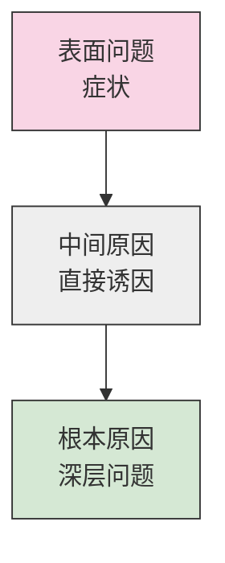
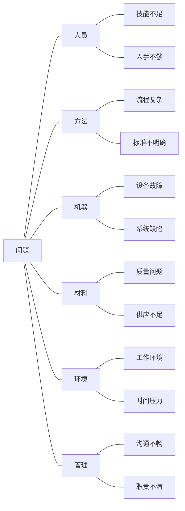
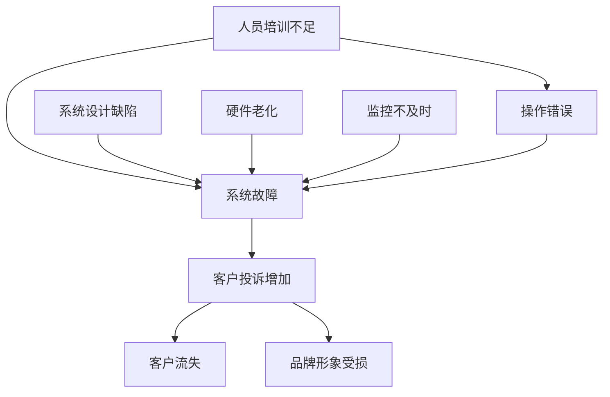
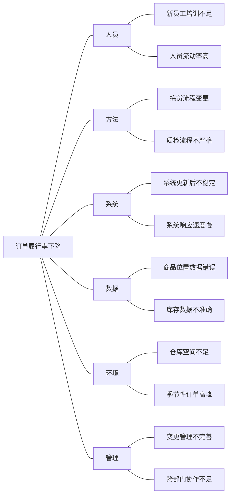

---
{"dg-publish":true,"permalink":"/08-财务专业/商业分析师/笔记/分析方法/根本原因分析/"}
---

# 根本原因分析 (RCA)

**标签**: #问题分析 #分析方法 #方法论

## 概述

根本原因分析(Root Cause Analysis, RCA)是一种系统化方法，用于识别问题的深层次原因，而非仅关注表面现象。作为商业分析师的核心工具，RCA帮助我们找出问题的真正来源，从而制定有效的长期解决方案，防止问题再次发生。

## 为什么需要根本原因分析

解决问题时，我们常常只关注症状而非根本原因，导致：

1. **问题反复出现**：只修复表面症状，根本原因依然存在
2. **资源浪费**：反复解决同一问题消耗大量资源
3. **机会丧失**：未能从根本改进业务流程和系统
4. **问题扩散**：未解决的根本原因可能导致其他问题

根本原因分析秉持"深入挖掘、从源头解决"的理念，确保问题得到永久性解决。

## 根本原因分析的层次

- **表面问题**：直接可见的问题症状，如"客户投诉增加"
- **中间原因**：导致表面问题的直接因素，如"客服响应时间过长"
- **根本原因**：系统性缺陷或深层问题，如"客服系统设计不合理"或"人员培训不足"

## 根本原因分析步骤

### 1. 问题定义

明确界定需要分析的问题，确保所有相关方对问题有共同理解。

**关键问题**:
- 问题是什么？具体表现如何？
- 问题的边界和范围？
- 问题的影响和严重程度？
- 我们如何衡量问题？

**输出物**:
- 清晰、具体、可衡量的问题陈述
- 问题的基线数据和指标

### 2. 数据收集

收集与问题相关的数据和信息，确保分析基于事实而非假设。

**数据来源**:
- 业务系统数据
- 观察记录
- 访谈记录
- 流程文档
- 历史记录和趋势
- 客户反馈

**数据类型**:
- 定量数据：如错误率、响应时间、成本
- 定性数据：如客户反馈、员工观点

### 3. 原因识别

通过系统化方法识别所有可能的原因，避免主观假设。

**常用方法**:
- 头脑风暴
- 5个为什么（5 Whys）
- 鱼骨图分析
- 过程映射
- 变更分析

### 4. 根本原因验证

验证识别出的原因是否真正导致了问题，避免误判。

**验证方法**:
- 数据验证：收集数据验证假设
- 逻辑测试：检查因果关系的逻辑合理性
- 相关性分析：分析原因与问题的相关程度
- 专家评审：由领域专家评估可能原因

### 5. 解决方案制定

基于根本原因，开发能够永久解决问题的方案。

**解决方案要求**:
- 直接针对根本原因
- 可实施性强
- 成本效益合理
- 获得利益相关者支持
- 考虑短期和长期效果

### 6. 实施与监控

实施解决方案并建立监控机制，确保问题不再发生。

**关键活动**:
- 制定详细实施计划
- 明确责任人和时间表
- 建立指标跟踪解决方案效果
- 定期评估和调整

## 常用根本原因分析工具

### 1. 5个为什么（5 Whys）

通过连续问"为什么"至少五次，深入挖掘问题的底层原因。

**使用步骤**:
1. 明确起始问题
2. 问第一个"为什么"
3. 基于回答继续问"为什么"
4. 重复直到找到根本原因（通常需要5-7个为什么）

**示例**:
- 问题：客户满意度下降
- 为什么？客户抱怨产品交付延迟
- 为什么？仓库发货流程变慢
- 为什么？新订单处理系统导致效率下降
- 为什么？系统操作界面复杂，员工操作困难
- 为什么？系统设计未考虑用户实际操作流程和需求
- 根本原因：系统开发过程中缺乏对用户需求的充分调研和用户参与

### 2. 鱼骨图（石川图）

将问题的各类原因按类别组织成鱼骨结构，系统化识别可能原因。

**常用类别（6M）**:
- 人员(Man)：与人相关的因素
- 方法(Method)：流程、程序、方法相关
- 机器(Machine)：设备、系统、工具相关
- 材料(Material)：原材料、输入相关
- 环境(Environment)：工作环境、外部条件
- 管理(Management)：管理实践、政策

### 3. 因果图

展示不同因素之间的因果关系和相互影响。

### 4. 变更分析

分析问题出现前后的变化，找出可能的触发因素。

**关键问题**:
- 问题出现前发生了什么变化？
- 变化是如何实施的？
- 变化的范围和影响是什么？
- 有哪些没有按计划执行的变化？

### 5. 障碍分析

识别阻碍流程或系统正常运行的障碍。

**分析维度**:
- 物理障碍
- 流程障碍
- 文化障碍
- 组织障碍
- 资源障碍

## 根本原因分析案例

### 案例：电子商务公司订单履行率下降

#### 问题定义
- 最近3个月订单按时履行率从98%下降到85%
- 每天约有15%的订单延迟发货
- 客户投诉增加30%，主要针对配送延迟

#### 数据收集
- 订单处理时间数据
- 仓库操作日志
- 客户投诉记录
- 员工访谈结果
- 流程观察记录

#### 5个为什么分析
- 问题：订单按时履行率下降
- 为什么？仓库拣货时间增加
- 为什么？订单拣货错误率上升
- 为什么？仓库人员难以找到正确商品位置
- 为什么？仓库管理系统更新后商品位置信息不准确
- 为什么？系统更新时数据迁移不完整，且未进行全面测试
- 根本原因：系统变更管理流程不完善，缺乏充分的测试和验证

#### 鱼骨图分析

#### 验证和根本原因确认
- 数据分析显示系统更新后错误率立即增加
- 员工反馈确认商品位置数据问题
- 测试验证显示约25%的商品位置数据有误
- IT团队确认数据迁移过程中存在问题
- 缺乏变更管理流程和充分测试被确认为根本原因

#### 解决方案
- 短期：手动核对并修正商品位置数据
- 中期：完善系统数据修复和验证
- 长期：建立完善的系统变更管理流程，包括:
  - 详细的变更计划和风险评估
  - 完整的数据验证测试
  - 变更前后的性能监控
  - 回滚计划和应急措施

#### 实施和结果
- 数据修正后的第一周，订单履行率提升到92%
- 一个月后，订单履行率恢复到97%
- 建立了新的变更管理流程，未来系统更新需经过严格测试
- 建立了关键业务指标的监控仪表板，提前发现问题

## 根本原因分析最佳实践

### 1. 基于事实而非假设
- 收集充分数据和证据
- 避免基于个人经验的主观判断
- 通过多种渠道验证信息

### 2. 聚焦系统而非个人
- 避免责备个人，关注系统性问题
- 分析流程、政策和系统设计缺陷
- 创造开放讨论的环境

### 3. 保持开放思维
- 考虑多种可能原因
- 避免过早聚焦单一因素
- 鼓励不同视角和创新思考

### 4. 明确区分相关性和因果关系
- 仅因为两个事件同时发生不意味着因果关系
- 通过逻辑分析和数据验证确认因果
- 考虑偶然因素和系统复杂性

### 5. 关注可控因素
- 识别组织能够影响和改变的因素
- 区分内部和外部因素
- 优先解决对问题影响最大且可控的因素

## 常见挑战与对策

| 挑战 | 对策 |
|-----|------|
| 停留在表面原因 | 使用5个为什么等工具强制深入思考 |
| 证据不足 | 建立系统化的数据收集流程 |
| 团队防御心态 | 创造无责备的分析环境，聚焦改进 |
| 复杂问题难以分析 | 将问题分解为可管理的部分 |
| 组织缺乏行动 | 建立明确的责任制和跟进机制 |
| 分析偏差 | 纳入多样化团队，交叉验证结果 |

## 根本原因分析与其他方法的结合

- 与[[流程分析\|流程分析]]结合，理解问题在流程中的位置和影响
- 与[[数据分析\|数据分析]]结合，提供量化证据支持原因识别
- 与[[决策分析\|决策分析]]结合，评估解决方案的成本效益
- 与[[业务流程优化\|业务流程优化]]结合，从源头改进流程设计

## 思考问题

1. 在你的组织中，问题解决通常停留在哪个层次（症状、中间原因或根本原因）？这导致了什么结果？
2. 什么样的组织文化和环境更有利于有效的根本原因分析？
3. 如何平衡快速解决问题的压力和深入分析根本原因的需要？

## 相关资源

- [[问题分析方法\|问题分析方法]]
- [[08-财务专业/商业分析师/笔记/分析方法/5W2H分析法\|5W2H分析法]]
- [[鱼骨图分析\|鱼骨图分析]]
- [[系统思维\|系统思维]]
- [[08-财务专业/商业分析师/笔记/方法论/商业分析方法论体系\|商业分析方法论体系]] 