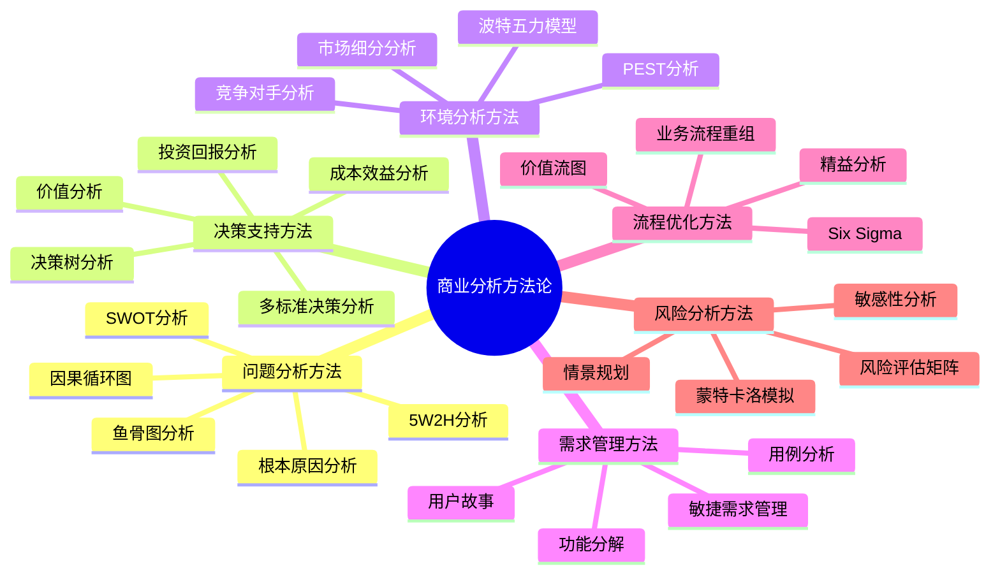
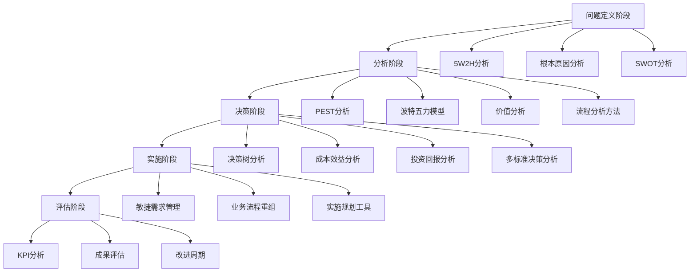

---
{"dg-publish":true,"permalink":"/08-财务专业/商业分析师/笔记/方法论/商业分析方法论体系/"}
---

**标签**: #方法论 #商业分析 #体系框架

## 概述

商业分析方法论体系是一套结构化的分析工具和框架集合，旨在帮助商业分析师和决策者系统性地识别、分析和解决业务问题。本文档构建了一个全面的商业分析方法论图谱，根据方法的性质、应用阶段和目的进行分类，并说明各类方法之间的关联和适用场景。

## 方法论分类体系

## 核心方法论详解

### 1. 问题分析方法

这类方法主要用于问题的定义和深入理解，通常在分析初期使用。

| 方法名称 | 核心目的 | 典型应用场景 | 优势 | 局限性 |
|---------|--------|-------------|------|---------|
| **5W2H分析** | 全面界定问题 | 项目启动、需求定义 | 结构化、全面 | 不深入问题本质 |
| **根本原因分析** | 识别问题根源 | 故障分析、问题解决 | 避免表面处理 | 可能陷入过度分析 |
| **SWOT分析** | 内外部条件评估 | 战略规划、市场进入 | 综合全面 | 过于主观 |
| **鱼骨图分析** | 分类查找原因 | 质量问题、流程改进 | 直观可视 | 难以量化 |

这些方法常结合使用，例如，可以先用5W2H框架界定问题范围，再用根本原因分析或鱼骨图深入分析问题原因。

### 2. 决策支持方法

这类方法主要用于在多个备选方案中做出合理决策，通常在分析中后期使用。

| 方法名称 | 核心目的 | 典型应用场景 | 优势 | 局限性 |
|---------|--------|-------------|------|---------|
| **决策树分析** | 评估多路径决策 | 风险评估、投资决策 | 结构化、概率化 | 依赖概率估计 |
| **成本效益分析** | 经济可行性评估 | 项目选择、资源配置 | 财务量化 | 难以计量间接效益 |
| **价值分析** | 评估价值与成本比 | 产品评估、服务优化 | 关注价值和功能 | 需要主观判断 |
| **投资回报分析** | 投资效率评估 | 资本预算、营销分析 | 财务导向明确 | 忽略非财务因素 |

这些方法倾向于从不同角度评估决策，例如，可以先用价值分析识别关键价值点，再用成本效益分析进行财务评估，最后用决策树处理不确定因素。

### 3. 环境分析方法

这类方法主要用于分析组织的外部环境和竞争态势，通常在战略规划阶段使用。

| 方法名称 | 核心目的 | 典型应用场景 | 优势 | 局限性 |
|---------|--------|-------------|------|---------|
| **PEST分析** | 宏观环境分析 | 战略规划、市场进入 | 全面系统 | 难以量化影响 |
| **波特五力模型** | 行业竞争分析 | 战略定位、竞争策略 | 结构化框架 | 静态分析 |
| **竞争对手分析** | 竞争优劣势评估 | 竞争策略、市场定位 | 针对性强 | 信息可能不全 |
| **市场细分分析** | 识别目标市场 | 营销策略、产品开发 | 客户导向 | 需大量数据 |

这些方法通常结合使用，例如，先用PEST分析宏观环境，再用波特五力分析行业竞争，最后进行详细的竞争对手分析和市场细分。

### 4. 需求管理方法

这类方法主要用于识别、收集、组织和优先级排序利益相关者需求。

| 方法名称 | 核心目的 | 典型应用场景 | 优势 | 局限性 |
|---------|--------|-------------|------|---------|
| **用户故事** | 描述用户需求 | 敏捷开发、产品设计 | 用户中心、简洁 | 缺乏细节 |
| **功能分解** | 系统化需求拆分 | 复杂系统设计 | 结构化、全面 | 可能过于技术导向 |
| **敏捷需求管理** | 迭代式需求处理 | 软件开发、创新项目 | 适应变化 | 需要高参与度 |
| **用例分析** | 交互流程描述 | 系统设计、流程优化 | 情境化、详细 | 编写耗时 |

这些方法可以根据项目性质选择或结合，例如，敏捷环境中常用用户故事，而复杂系统可能需要功能分解和用例分析结合。

### 5. 流程优化方法

这类方法主要用于分析和改进业务流程，提高效率和质量。

| 方法名称 | 核心目的 | 典型应用场景 | 优势 | 局限性 |
|---------|--------|-------------|------|---------|
| **价值流图** | 识别流程浪费 | 流程优化、精益生产 | 可视化价值流 | 实施复杂 |
| **业务流程重组** | 流程根本重设计 | 组织转型、数字化 | 变革性强 | 风险高 |
| **精益分析** | 消除浪费 | 制造、服务优化 | 专注价值 | 需文化支持 |
| **Six Sigma** | 减少缺陷和变异 | 质量控制、流程改进 | 数据驱动 | 实施成本高 |

这些方法可以根据改进的范围和深度选择，例如，渐进式改进可采用精益分析，而大规模变革可能需要业务流程重组。

### 6. 风险分析方法

这类方法主要用于识别、评估和管理潜在风险，通常贯穿整个分析过程。

| 方法名称 | 核心目的 | 典型应用场景 | 优势 | 局限性 |
|---------|--------|-------------|------|---------|
| **风险评估矩阵** | 风险分级评估 | 项目管理、安全分析 | 简单直观 | 主观判断 |
| **情景规划** | 多情景分析 | 战略规划、长期决策 | 应对不确定性 | 情景选择挑战 |
| **蒙特卡洛模拟** | 概率性风险模拟 | 财务规划、风险量化 | 处理复杂不确定性 | 技术要求高 |
| **敏感性分析** | 关键变量影响分析 | 投资决策、预算规划 | 识别关键因素 | 单一变量局限 |

这些方法可以根据风险复杂性和数据可用性选择，例如，简单环境可用风险评估矩阵，而高不确定性环境可能需要情景规划或蒙特卡洛模拟。

## 方法选择框架

在实际应用中，商业分析师需要根据具体问题情境选择合适的方法组合。以下框架可以指导方法选择：

### 基于分析阶段的方法选择

### 基于问题类型的方法选择

| 问题类型 | 推荐主要方法 | 辅助方法 |
|---------|------------|---------|
| **战略决策问题** | PEST分析、波特五力 | 情景规划、SWOT |
| **运营优化问题** | 价值流图、精益分析 | 根本原因分析、流程重组 |
| **投资决策问题** | 成本效益分析、ROI | 决策树、敏感性分析 |
| **产品/服务问题** | 价值分析、市场细分 | 用户故事、竞争对手分析 |
| **组织变革问题** | 利益相关者分析、SWOT | 变革管理框架、风险评估 |
| **技术选型问题** | 多标准决策分析、价值分析 | TCO分析、风险评估 |

## 方法之间的关联与整合

商业分析方法之间存在多种关联和整合方式，形成分析链条：

1. **问题分析→环境分析→决策支持**  
   示例：使用根本原因分析识别问题→PEST分析评估外部环境→决策树评估解决方案

2. **环境分析→需求管理→流程优化**  
   示例：波特五力分析竞争态势→用户故事捕获需求→价值流图优化流程

3. **需求管理→价值分析→成本效益分析**  
   示例：功能分解识别需求→价值分析评估价值→成本效益分析评估可行性

4. **全流程整合分析链**  
   示例：5W2H定义问题→根本原因分析→SWOT分析→价值分析→决策树→投资回报分析→实施规划

## 实践指南与最佳实践

1. **方法适配**：根据问题复杂性、可用数据、时间约束选择合适方法
2. **简单优先**：先使用简单方法，需要时再应用复杂方法
3. **数据驱动**：尽可能基于数据而非仅凭直觉
4. **利益相关者参与**：确保关键利益相关者参与分析过程
5. **灵活应用**：灵活调整方法以适应具体情境需要
6. **多方法整合**：结合多种方法获得全面视角
7. **持续迭代**：通过反馈循环不断改进分析结果

## 方法论应用成熟度模型

组织在商业分析方法应用上可以分为五个成熟度级别：

1. **初始级**：方法使用随机，缺乏系统性
2. **重复级**：基本方法能够重复使用，但缺乏标准
3. **定义级**：方法选择有标准，分析流程已定义
4. **管理级**：方法应用受到度量和控制，有持续改进
5. **优化级**：方法创新和定制，分析能力成为竞争优势

## 相关资源与工具

- [[08-财务专业/商业分析师/笔记/分析方法/5W2H分析法\|5W2H分析法]]
- [[08-财务专业/商业分析师/笔记/分析方法/根本原因分析\|根本原因分析]]
- [[08-财务专业/商业分析师/笔记/分析方法/决策树分析\|决策树分析]]
- [[08-财务专业/商业分析师/笔记/分析方法/价值分析\|价值分析]]
- [[08-财务专业/商业分析师/笔记/分析方法/成本效益分析\|成本效益分析]]
- [[08-财务专业/商业分析师/笔记/分析方法/投资回报分析\|08-财务专业/商业分析师/笔记/分析方法/投资回报分析]]
- [[08-财务专业/商业分析师/笔记/案例/商业分析案例集\|商业分析案例集]]

## 思考问题

1. 你所在的组织目前处于商业分析方法论应用的哪个成熟度级别？
2. 在面对复杂业务问题时，你通常会采用哪些方法组合？为什么？
3. 数字化转型如何改变了传统商业分析方法的应用？新兴技术(如AI、大数据)如何与这些方法整合？ 