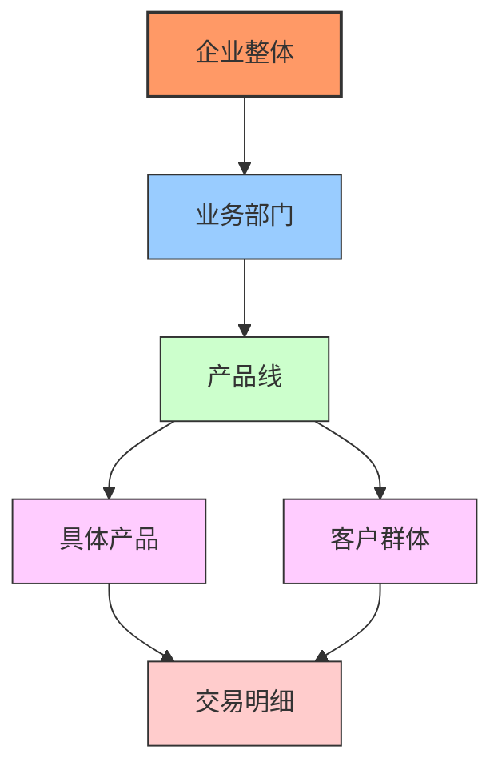
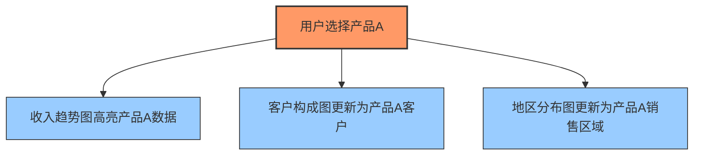

---
{"dg-publish":true,"permalink":"/08-财务专业/财务BI看板项目/笔记/交互设计/财务看板交互指南/"}
---

# 财务看板交互设计指南

#交互设计 #用户体验 #看板设计

有效的交互设计是财务BI看板成功的关键因素，它决定了用户如何与数据进行互动，以及获取所需信息的流畅度。本文档提供财务看板交互设计的核心原则和具体实施指南。

## 交互设计原则

财务BI看板的交互设计应遵循以下核心原则：

1. **简单直观**：操作方式简单明了，减少用户学习成本
2. **一致性**：保持交互模式的一致，提高用户操作效率
3. **反馈明确**：对用户操作提供及时、清晰的反馈
4. **容错性**：允许用户犯错并提供恢复机制
5. **针对性**：根据财务分析需求优化交互流程
6. **高效性**：最小化操作步骤，快速达成分析目标

## 财务看板交互模型

财务看板的交互设计遵循"概览-筛选-钻取-导出"的基本模型：


1. **概览**：提供整体财务状况的高层视图
2. **筛选**：根据时间、组织、产品等维度过滤数据
3. **钻取**：深入查看详细数据和根本原因
4. **导出/分享**：将分析结果保存或分享给他人

## 筛选与过滤设计

### 1. 全局筛选器

全局筛选器影响整个看板的所有视图，通常放置在看板顶部。

```
┌───────────────────────────────────────────────────────────────┐
│ 时间范围: [2023年Q1 ▼] | 业务单元: [全部 ▼] | 产品线: [全部 ▼] │
└───────────────────────────────────────────────────────────────┘
```

设计要点：
- 提供默认值（如当前月份/季度）
- 显示清晰的当前选择状态
- 支持保存常用筛选条件组合
- 提供快速重置选项

### 2. 上下文筛选器

上下文筛选器只影响特定图表或部分，通常放置在相关视图附近。

实现方式：
- **直接选择**：点击图表中的元素（如柱形、饼图扇区）
- **筛选控件**：视图旁的专用筛选下拉框
- **切片器**：可折叠的筛选面板

### 3. 筛选状态指示

```
当前筛选：时间=2023年Q1 | 业务单元=北美区域 | 产品线=全部 [清除全部]
```

- 始终显示当前激活的筛选条件
- 提供快速移除单个筛选或清除所有筛选的选项
- 使用视觉指示（如高亮色）标识激活的筛选条件

## 钻取与导航设计

### 1. 层级钻取

从汇总数据逐层深入查看明细，设计思路：



实现方式：
- **点击钻取**：直接点击图表元素进入下一层级
- **右键菜单**：提供多种钻取选项
- **面包屑导航**：显示当前路径，支持快速返回上级

### 2. 多维分析导航

在不同分析维度间切换，如从"按产品"切换到"按地区"：

```
[按产品分析] | [按客户分析] | [按地区分析] | [按时间分析]
```

设计要点：
- 使用标签页或按钮组实现快速切换
- 保持切换前后的其他筛选条件
- 提供视觉提示指明当前所在维度

### 3. 关联导航

基于当前数据点导航到相关分析：

```
查看 "产品A" 的：[成本分析] [客户构成] [趋势预测] [库存状况]
```

设计要点：
- 根据所选数据点动态生成相关路径
- 使用上下文菜单或快捷按钮提供导航选项
- 确保导航前后的上下文连贯性

## 交互反馈设计

### 1. 悬停反馈

当用户鼠标悬停在数据点上时：
- 显示详细信息工具提示
- 高亮相关数据点
- 显示可能的交互操作提示

```
┌─────────────────────────┐
│ 产品A                   │
│ 收入: ¥1,234,567        │
│ 同比: ↑15.2%            │
│ 占总收入比: 32.5%       │
│                         │
│ 点击可查看详情 ↓        │
└─────────────────────────┘
```

### 2. 点击反馈

当用户点击交互元素时：
- 提供视觉反馈（如按钮状态变化）
- 显示数据加载状态指示器
- 应用筛选效果（如其他未选中项变淡）

### 3. 操作确认

对于重要或不可逆操作（如导出、重置筛选条件等）：
- 提供确认对话框
- 清晰说明操作结果
- 提供取消选项

## 高级交互功能

### 1. 视图联动

当用户在一个视图中选择数据时，其他相关视图同步更新：



实现要点：
- 定义清晰的视图间联动关系
- 联动应即时反应，无明显延迟
- 提供取消联动选择的方式

### 2. 个性化配置

允许用户个性化看板显示：
- 调整图表大小和位置
- 添加/移除关心的指标
- 设置默认筛选条件和时间范围
- 保存个人视图配置

### 3. 智能交互

根据用户操作提供智能建议：
- 推荐相关分析路径
- 突出显示异常数据点
- 预测用户可能需要的下一步操作

```
您正在分析产品A的毛利下降，是否需要：
[查看成本构成] [分析价格变化] [比较同类产品]
```

## 特定场景交互设计

### 1. 时间序列分析

财务数据分析中时间维度至关重要，交互设计：
- 提供灵活的时间范围选择器
- 支持同比、环比、滚动N期比较
- 时间轴缩放功能（如季度→月→日）

```
┌───────────────────────────────────────────────┐
│                                               │
│   [2023] [Q1▼] 与 [2022] [Q1▼] 比较           │
│                                               │
│   [同比] [环比] [连续4季度] [年度累计]         │
│                                               │
└───────────────────────────────────────────────┘
```

### 2. 差异分析

对比实际结果与预算或预测的差异：
- 提供方差高亮显示
- 支持按贡献度排序
- 差异原因钻取分析

```
┌────────────────────────────────────────┐
│ 方差分析:                              │
│ ○ 绝对差异  ● 相对差异 (%)             │
│ ○ 按金额排序 ● 按百分比排序            │
│ [显示Top 5差异] [显示全部]             │
└────────────────────────────────────────┘
```

### 3. 假设情境分析

允许用户探索"假如"情境：
- 参数调整滑块/输入框
- 实时结果更新
- 多情境对比视图

```
利润模拟：
价格调整: [-10%]────○────[+10%]
销量变化: [-20%]──────○──[+20%]
成本变动: [-5%]───○─────[+5%]

模拟结果: 利润增加12.3%
[保存此情境] [重置]
```

## 移动端交互适配

随着移动设备使用增加，财务看板需适配移动交互：

### 1. 触摸操作优化
- 增大交互区域，适应手指点触
- 支持常见触摸手势（如滑动、缩放）
- 简化操作流程，减少输入需求

### 2. 内容组织调整
- 采用纵向滚动布局
- 核心指标优先展示
- 合理分组，减少同屏信息量

### 3. 响应式交互
- 根据屏幕大小调整交互组件
- 在小屏幕上合并或简化筛选器
- 优化工具提示和菜单显示方式

## 数据导出与分享

### 1. 导出选项
- **图表图像**：PNG/JPG格式
- **原始数据**：CSV/Excel格式
- **完整报告**：PDF格式
- **交互式仪表板**：链接分享

### 2. 分享功能
- 生成包含当前筛选条件的链接
- 邮件直接发送报告
- 定期自动发送功能
- 带注释的截图分享

## 交互设计测试与验证

### 1. 用户测试方法
- 任务完成测试：评估用户完成特定分析任务的效率
- 可用性测试：识别交互中的摩擦点和障碍
- A/B测试：比较不同交互设计的效果

### 2. 评估指标
- 任务完成时间
- 操作错误率
- 用户满意度评分
- 学习曲线陡峭程度

## 实施建议

### 1. 分阶段交互实现
1. **基础交互**：筛选、简单钻取、导出
2. **增强交互**：视图联动、多维分析、个性化配置
3. **高级交互**：智能推荐、情境分析、协作注释

### 2. 培训与引导
- 提供交互功能快速指南
- 设计引导式教程
- 在界面中加入提示信息
- 制作操作视频教程

## 关联应用模板

- [[全局筛选器设计\|全局筛选器设计]] - 详细的筛选控件设计指南
- [[钻取交互模式\|钻取交互模式]] - 财务数据钻取模式设计
- [[多维分析设计\|多维分析设计]] - 不同维度间切换的交互设计

---

**相关笔记**：
- [[用户行为分析\|用户行为分析]]
- [[财务分析工作流程\|财务分析工作流程]]
- [[交互原型设计工具\|交互原型设计工具]] 