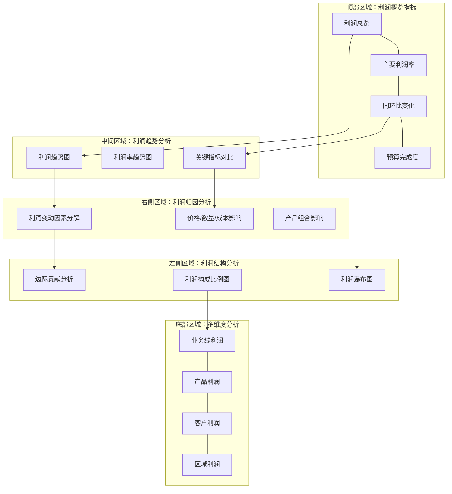

---
{"dg-publish":true,"permalink":"/08-财务专业/财务BI看板项目/笔记/看板设计/核心看板模块/利润分析看板设计/"}
---

# 利润分析看板设计

#看板设计 #利润分析 #核心模块

利润分析看板是财务BI系统的核心组成部分，专注于企业盈利能力的深度分析，帮助决策者了解利润来源、结构变化和影响因素。本文档详细说明利润分析看板的设计方案。

## 设计目标

1. **利润构成分析**：揭示企业利润的构成来源和结构
2. **趋势跟踪**：监控关键利润指标的历史变化趋势
3. **差异分析**：对比实际利润与预算/目标的差异及原因
4. **归因分析**：分析影响利润变化的关键因素
5. **预测展望**：基于历史数据预测未来利润走势

## 用户需求分析

利润分析看板的主要用户包括：

- **财务总监/CFO**：需要全面了解企业利润状况
- **业务部门负责人**：关注各自业务线的利润贡献
- **产品经理**：关注产品级别的盈利能力
- **高管团队**：需要利润决策支持信息

主要使用场景：
- 月度利润分析会议
- 季度业绩回顾与展望
- 产品盈利能力评估
- 预算与实际差异分析

## 看板布局设计

利润分析看板采用多区块布局，从整体到局部，从结果到原因进行展示：



## 核心组件设计

### 1. 利润概览指标

展示关键利润指标及其变化，采用卡片式布局：

```
┌─────────────────┐ ┌─────────────────┐ ┌─────────────────┐ ┌─────────────────┐
│    总利润       │ │    毛利率       │ │    净利率       │ │    EBITDA率     │
│                 │ │                 │ │                 │ │                 │
│ 2,500万元       │ │ 42.5%           │ │ 18.3%           │ │ 25.6%           │
│ 同比: ↑12.5%    │ │ 同比: ↑2.1%     │ │ 同比: ↑1.5%     │ │ 同比: ↑0.8%     │
│ 预算完成率: 95% │ │ 目标差距: +0.5% │ │ 目标差距: -0.7% │ │ 目标差距: +1.6% │
└─────────────────┘ └─────────────────┘ └─────────────────┘ └─────────────────┘
```

利润指标卡片包含：
1. **总利润/净利润**：当期净利润及其同比变化、预算完成率
2. **毛利率**：当期毛利率及其同比变化、与目标的差距
3. **净利率**：当期净利率及其同比变化、与目标的差距
4. **EBITDA率**：当期EBITDA率及其同比变化、与目标的差距
5. **ROE/ROA**：资本回报率指标及其变化

### 2. 利润结构分析区

#### 2.1 利润瀑布图

使用瀑布图展示从收入到净利润的构成过程：

```
利润瀑布图
^
|
|   ┌─┐
|   │ │                                 ┌─┐
|   │ │                                 │ │
|   │ │       ┌─┐                       │ │
|   │ │       │ │                       │ │
|   │ │       │ │        ┌─┐            │ │
|   │ │       │ │        │ │    ┌─┐     │ │
|   │ │       │ │        │ │    │ │     │ │
+───┴─┴───────┴─┴────────┴─┴────┴─┴─────┴─┴─────>
  收入  销售成本 毛利  运营费用 税前 所得税 净利润
                                 利润
```

设计要点：
- 清晰显示各环节占比及金额
- 可切换绝对值/相对值显示
- 支持与上期/去年同期对比

#### 2.2 利润构成比例图

使用饼图/环形图展示利润在不同维度的分布：
- 按业务线/产品线的利润分布
- 按客户群/区域的利润分布
- 可切换不同的分类维度

#### 2.3 边际贡献分析

采用散点图或气泡图展示各产品/业务线的边际贡献：
- X轴：销售额
- Y轴：边际贡献率
- 气泡大小：总边际贡献

### 3. 利润趋势分析区

#### 3.1 利润趋势图

使用组合图表展示利润指标随时间的变化：

```
利润趋势（季度）
^
|                                      o
|                               o      |
|                        o      |      |
|                 o      |      |      |
|          o      |      |      |      |
|    o     |      |      |      |      |      x
|    |     |      |      |      |      |      |
|    |     |      |      |      |      |      |
+----+-----+------+------+------+------+------+----->
   2021Q1 2021Q2 2021Q3 2021Q4 2022Q1 2022Q2 2022Q3

   ◆ 收入  o 毛利  x 净利润  --- 趋势线
```

设计要点：
- 多指标并列显示：收入、毛利、净利润等
- 支持时间粒度切换：年/季/月
- 显示趋势线及预测延伸
- 标记重大事件点

#### 3.2 利润率趋势图

使用折线图展示各类利润率的变化趋势：
- 毛利率趋势线
- 营业利润率趋势线
- 净利率趋势线
- 可添加行业平均或标杆对比

#### 3.3 关键指标对比

使用雷达图展示多维度利润指标的对比：
- 本期vs上期
- 本期vs去年同期
- 实际vs预算
- 自身vs行业平均

### 4. 利润归因分析区

#### 4.1 利润变动因素分解

使用桥接图展示利润同比/环比变动的影响因素：

```
净利润变动归因
^
|                  ┌───┐
|                  │   │
|          ┌───┐   │   │            ┌───┐
|          │   │   │   │            │   │
|   ┌───┐  │   │   │   │   ┌───┐    │   │
|   │   │  │   │   │   │   │   │    │   │
|   │   │  │   │   │   │   │   │    │   │
+───┴───┴──┴───┴───┴───┴───┴───┴────┴───┴────>
  上期  销量  价格  成本  费用  税率  本期
  利润  变化  变化  变化  变化  变化  利润
```

设计要点：
- 展示各因素的正负影响
- 可按金额/占比切换
- 支持钻取查看详情

#### 4.2 价格/数量/成本影响分析

使用表格或热力图展示价格/数量/成本对利润的影响：
- 识别利润提升的主要驱动因素
- 显示各因素影响的相对重要性
- 高亮显示最大影响因素

#### 4.3 产品组合影响

使用组合图表展示产品组合变化对整体利润率的影响：
- 不同毛利产品的销售比例变化
- 产品组合优化建议
- 高低毛利产品的销售趋势

### 5. 多维度分析区

使用表格或小型图表阵列，展示不同维度的利润分析：

```
┌───────────────────────────────────────────────────────┐
│ 业务线利润分析                                  [展开▼] │
├─────────┬───────┬───────┬────────┬────────┬───────────┤
│ 业务线  │ 收入  │ 毛利率 │ 净利润  │ 净利率 │ 同比增长  │
├─────────┼───────┼───────┼────────┼────────┼───────────┤
│ 业务线A │ 5000万│ 45.5% │ 950万   │ 19.0%  │ ↑15.3%    │
│ 业务线B │ 3200万│ 38.2% │ 520万   │ 16.3%  │ ↑8.5%     │
│ 业务线C │ 2800万│ 40.1% │ 440万   │ 15.7%  │ ↓5.2%     │
└─────────┴───────┴───────┴────────┴────────┴───────────┘
```

设计要点：
- 提供业务线、产品、客户、区域等多角度分析
- 支持排序、筛选和钻取
- 使用迷你图表展示趋势
- 支持导出详细数据

## 交互设计

利润分析看板提供以下交互功能：

1. **筛选与过滤**：
   - 时间范围选择（年/季/月/自定义）
   - 组织层级筛选（公司/业务线/部门）
   - 产品/客户群/地区筛选

2. **分析维度切换**：
   - 按产品/服务分析
   - 按客户/客户群分析
   - 按销售渠道分析
   - 按区域/市场分析

3. **比较分析**：
   - 实际vs预算
   - 实际vs去年同期
   - 实际vs行业标杆
   - 不同时期对比

4. **归因分析**：
   - 价格/数量/成本拆分
   - 差异原因分解
   - 影响因素排序

5. **钻取功能**：
   - 从整体到局部的层层钻取
   - 从结果到原因的逻辑钻取
   - 从摘要到明细的数据钻取

## 高级分析功能

### 1. 利润敏感性分析

提供交互式利润模拟工具：
- 调整价格、数量、成本等参数
- 实时查看对利润的影响
- 寻找利润最优组合

### 2. 盈亏平衡分析

展示企业盈亏平衡点分析：
- 计算盈亏平衡销售额
- 显示安全边际
- 预测不同产量/销量的利润状况

### 3. 杜邦分析

使用杜邦分析模型展示ROE的拆解：
- 净利率、资产周转率、权益乘数三因素分解
- 各因素的历史变化趋势
- 与行业平均的对比

## 视觉设计

### 配色方案

1. **主色调**：蓝色系 (#1A73E8)，专业且易于阅读
2. **辅助色**：
   - 绿色 (#34A853)：表示增长/好转
   - 红色 (#EA4335)：表示下降/恶化
   - 橙色 (#FBBC04)：表示注意/预警
3. **图表配色**：使用中性色调的渐变色系，确保可读性
4. **背景色**：白色/浅灰色，减少视觉干扰

### 数据可视化规范

1. **条形图/柱状图**：用于比较不同类别的数值
2. **折线图**：展示时间序列数据和趋势
3. **饼图/环形图**：展示构成比例（限制在5-7个类别内）
4. **瀑布图**：展示利润构成和变动归因
5. **散点图/气泡图**：展示多变量关系
6. **热力图**：展示多维度数据的分布情况

## 数据需求

### 1. 数据来源

- **财务系统**：利润表、成本数据
- **销售系统**：销售额、销量、价格
- **预算系统**：预算目标、计划数据
- **行业数据**：行业平均、标杆对比

### 2. 数据粒度

- **时间粒度**：日/周/月/季/年
- **组织粒度**：公司/业务线/部门
- **产品粒度**：产品类别/产品/SKU
- **客户粒度**：客户类别/客户
- **地区粒度**：区域/市场/国家

### 3. 指标定义

- **毛利** = 收入 - 销售成本
- **毛利率** = 毛利 / 收入
- **营业利润** = 毛利 - 运营费用
- **营业利润率** = 营业利润 / 收入
- **净利润** = 营业利润 - 所得税费用
- **净利率** = 净利润 / 收入
- **边际贡献** = 收入 - 变动成本
- **边际贡献率** = 边际贡献 / 收入

## 实施建议

1. **数据准备阶段**：
   - 梳理数据来源和计算逻辑
   - 建立数据质量控制机制
   - 确定更新频率和责任人

2. **开发实施阶段**：
   - 优先实现核心利润趋势和结构分析
   - 其次开发归因分析功能
   - 最后实现高级分析功能

3. **用户培训阶段**：
   - 对关键用户进行分析方法培训
   - 制作使用指南和案例库
   - 建立反馈和持续优化机制

## 成功标准

1. **使用频率**：月度/季度利润分析会议中的常规使用
2. **决策支持**：基于看板的分析产生明确的行动建议
3. **用户评价**：关键用户的满意度评分≥4.5（满分5分）
4. **分析效率**：将利润分析工作时间减少50%以上

---

**相关笔记**：
- [[08-财务专业/财务BI看板项目/笔记/布局规划/财务BI看板模块规划\|财务BI看板模块规划]]
- [[08-财务专业/财务BI看板项目/笔记/指标设计/财务核心指标体系\|财务核心指标体系]]
- [[利润相关指标\|利润相关指标]] 