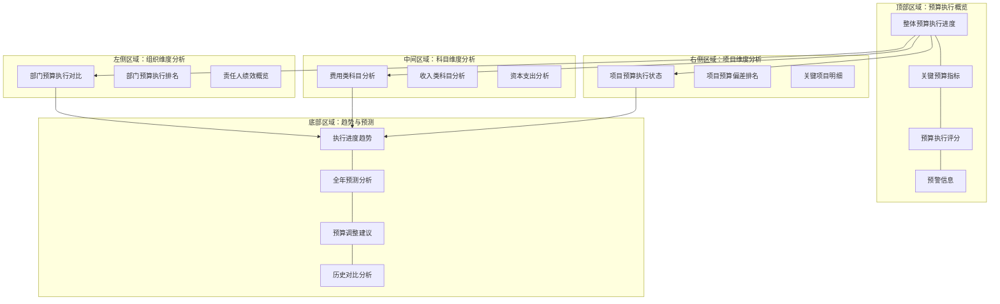

---
{"dg-publish":true,"permalink":"/08-财务专业/财务BI看板项目/笔记/看板设计/核心看板模块/预算执行看板设计/"}
---

# 预算执行看板设计

#看板设计 #预算执行 #核心模块

预算执行看板是财务BI系统中的核心功能模块，聚焦于企业预算的实际执行情况与计划的对比分析，帮助管理层及时发现偏差，采取纠偏措施，实现精细化预算管理。本文档详细说明预算执行看板的设计方案。

## 设计目标

1. **预算执行监控**：实时追踪企业各部门、项目和科目的预算执行进度
2. **偏差分析**：精准定位预算执行与计划之间的差异及原因
3. **趋势预测**：基于历史数据和执行进度预测全年预算完成情况
4. **责任追踪**：明确预算执行责任，支持问责和改进
5. **决策支持**：为预算调整和资源重分配提供数据支持

## 用户需求分析

预算执行看板的主要用户包括：

- **财务总监/CFO**：关注整体预算执行情况和重大偏差
- **预算管理部门**：负责预算执行的日常监控和分析
- **业务部门负责人**：关注本部门预算执行情况和资源利用效率
- **项目经理**：关注项目预算执行进度和成本控制

主要使用场景：
- 月度/季度预算执行分析会议
- 预算调整决策过程
- 部门业绩考核评估
- 年度预算编制参考

## 看板布局设计

预算执行看板采用多层次布局，从宏观到微观，从整体到局部：



## 核心组件设计

### 1. 预算执行概览区

展示整体预算执行情况和关键指标，采用卡片式布局：

```
┌──────────────────┐ ┌──────────────────┐ ┌──────────────────┐ ┌──────────────────┐
│ 年度预算执行进度 │ │ 季度预算完成率   │ │ 预算偏差率       │ │ 预算执行评分     │
│                  │ │                  │ │                  │ │                  │
│ 58.3%            │ │ 92.7%            │ │ +3.8%            │ │ 86 (良好)        │
│ 目标: 50.0%      │ │ 目标: 100%       │ │ 阈值: ±5.0%      │ │ 较上期: ↑4分     │
│ 状态: ●正常      │ │ 状态: ●正常      │ │ 状态: ●正常      │ │ 状态: ●良好      │
└──────────────────┘ └──────────────────┘ └──────────────────┘ └──────────────────┘
```

预算执行指标卡片包含：
1. **年度预算执行进度**：已使用预算/年度总预算，与时间进度比较
2. **当前周期完成率**：当前周期实际支出/当前周期预算
3. **预算偏差率**：(实际值-预算值)/预算值，正值表示超支，负值表示结余
4. **预算执行评分**：综合各项指标的预算执行评分

附加指标卡片：
- **预算执行趋势**：最近6个月执行率的简化趋势图
- **预算修订次数**：本年度预算调整的次数
- **预算线上预警数**：当前存在的预算预警数量
- **预算弹性指数**：预算调整的灵活度评分

### 2. 组织维度分析区

#### 2.1 部门预算执行对比

使用条形图对比各部门预算执行情况：

```
部门预算执行率对比
              0%    20%   40%   60%   80%  100%  120%
              |     |     |     |     |     |     |
市场部         |====================>| 75.3%
销售部         |======================>| 82.7%
研发部         |=================>| 65.2%
生产部         |======================>| 83.1%
财务部         |==================>| 68.9%
行政部         |=======================>| 86.4%
              |     |     |     |     |     |     |
              0%    20%   40%   60%   80%  100%  120%

   — 执行率   | 时间进度线(58.3%)   ! 预警线
```

设计要点：
- 对比各部门预算执行率与时间进度
- 颜色编码显示状态：正常、超前、滞后、预警
- 支持按执行率/偏差率/预算金额等排序

#### 2.2 部门预算执行排名

使用表格形式展示部门预算执行情况排名：

```
┌────────────────────────────────────────────────────────────────────────┐
│ 部门预算执行排名 [按偏差率]                                     [导出▼]│
├────────┬──────────┬──────────┬──────────┬───────────┬─────────┬────────┤
│ 部门   │年度预算  │已用预算  │执行进度  │偏差率    │偏差趋势 │状态    │
├────────┼──────────┼──────────┼──────────┼───────────┼─────────┼────────┤
│行政部  │650万元   │562万元   │86.4%     │+28.1%     │   ↑     │  ⚠️    │
│生产部  │3,200万元 │2,660万元 │83.1%     │+24.8%     │   →     │  ⚠️    │
│销售部  │1,800万元 │1,488万元 │82.7%     │+24.4%     │   ↑     │  ⚠️    │
│市场部  │1,200万元 │904万元   │75.3%     │+17.0%     │   ↓     │  ⚠️    │
│财务部  │580万元   │399万元   │68.9%     │+10.6%     │   ↓     │  ⚠️    │
│研发部  │2,500万元 │1,630万元 │65.2%     │+6.9%      │   ↓     │  ⚠️    │
│人力部  │870万元   │432万元   │49.7%     │-8.6%      │   ↓     │  ✓     │
│IT部    │950万元   │342万元   │36.0%     │-22.3%     │   ↓     │  ⚠️    │
└────────┴──────────┴──────────┴──────────┴───────────┴─────────┴────────┘
```

设计要点：
- 清晰展示各部门的预算关键数据
- 支持多种排序方式（按执行率、偏差率、预算额等）
- 状态图标直观展示预算健康状况

#### 2.3 责任人绩效概览

使用散点图展示预算责任人的绩效情况：
- X轴：预算规模
- Y轴：预算执行偏差率
- 点大小：表示预算重要性
- 颜色：表示执行状态（红色表示超支严重，绿色表示良好）

### 3. 科目维度分析区

#### 3.1 费用类科目分析

使用树形图或瀑布图展示费用科目的预算执行情况：

```
费用预算执行分析
[11,280万元 / 15,800万元 = 71.4%]
├── 人力成本 [5,900万元 / 8,200万元 = 72.0%]
│   ├── 工资薪金 [4,200万元 / 5,800万元 = 72.4%]
│   ├── 福利费用 [980万元 / 1,400万元 = 70.0%]
│   └── 培训费用 [720万元 / 1,000万元 = 72.0%]
├── 运营费用 [3,500万元 / 4,800万元 = 72.9%]
│   ├── 办公费用 [520万元 / 700万元 = 74.3%]
│   ├── 差旅费用 [480万元 / 620万元 = 77.4%] ⚠️
│   └── 租赁费用 [2,500万元 / 3,480万元 = 71.8%]
└── 营销费用 [1,880万元 / 2,800万元 = 67.1%]
    ├── 广告费用 [980万元 / 1,580万元 = 62.0%]
    ├── 促销费用 [650万元 / 920万元 = 70.7%]
    └── 市场调研 [250万元 / 300万元 = 83.3%] ⚠️
```

设计要点：
- 层级展示费用科目及其预算执行情况
- 预算执行异常科目用醒目标记
- 支持钻取到单个科目的详细分析

#### 3.2 收入类科目分析

使用组合图表展示收入预算达成情况：

```
收入预算达成情况
^
|
|  ┌───┐      ┌───┐      ┌───┐      ┌───┐
|  │   │      │   │      │   │      │   │
|  │   │      │   │      │   │      │   │      目标线
|  │   │- - - │   │- - - │   │- - - │   │- - - - -
|  │   │      │   │      │   │      │   │
|  │   │      │   │      │   │      │   │
|  │   │      │   │      │   │      │   │
+──┴───┴──────┴───┴──────┴───┴──────┴───┴────────>
    Q1         Q2         Q3         Q4(预)
   98.2%      95.5%      93.7%      96.1%(预)

   █ 实际收入   --- 预算目标   •••• 上年同期
```

设计要点：
- 对比收入预算与实际达成情况
- 显示达成率和同比变化
- 基于当前趋势提供未来预测

#### 3.3 资本支出分析

使用柱状图和进度条展示资本性支出的预算执行情况：

```
资本支出预算执行情况
                                   已用/预算    执行进度    状态
IT基础设施     █████████████▒▒▒▒▒   325/500万元   65.0%      ✓
设备更新       ████████▒▒▒▒▒▒▒▒▒▒▒   480/980万元   49.0%      ✓
厂房扩建       ███████████████▒▒▒▒▒  1680/2100万元  80.0%     ⚠️
研发设备       ██████▒▒▒▒▒▒▒▒▒▒▒▒▒▒   230/850万元   27.1%     ⚠️
办公改造       ████████████████████   570/570万元   100.0%     ✓
新市场拓展     ███▒▒▒▒▒▒▒▒▒▒▒▒▒▒▒▒▒▒  150/920万元   16.3%     ⚠️
          0%  10%  30%  50%  70%  90% 110%
```

设计要点：
- 显示大型资本项目的预算执行进度
- 标注关键里程碑和时间节点
- 突出显示需要关注的偏差项目

### 4. 项目维度分析区

#### 4.1 项目预算执行状态

使用热力图或状态图展示项目预算执行状况：

```
项目预算执行状态

高  ┌───────┬───────┬───────┬───────┐
预  │       │       │       │P05,P12│
算  │       │P09,P18│P03,P08│P01    │
重  ├───────┼───────┼───────┼───────┤
要  │       │       │P07,P11│       │
性  │P16    │P13    │P02    │P10    │
    ├───────┼───────┼───────┼───────┤
    │P14,P17│P04,P19│       │       │
    │       │       │P20    │       │
低  └───────┴───────┴───────┴───────┘
      低     正常     高      超高
         预算执行偏差程度
```

设计要点：
- 通过矩阵展示项目预算执行状况和优先级
- 颜色编码显示预算健康状态
- 项目代码链接至详细分析页面

#### 4.2 项目预算偏差排名

使用表格列出预算偏差最大的项目：

```
┌──────────────────────────────────────────────────────────────────────┐
│ 预算偏差最大的10个项目                                        [展开▼]│
├────────┬─────────┬──────────┬──────────┬───────┬────────┬────────────┤
│项目编号│项目名称 │预算金额  │实际支出  │偏差率 │责任人  │偏差原因    │
├────────┼─────────┼──────────┼──────────┼───────┼────────┼────────────┤
│P01     │产品升级 │850万元   │1,105万元 │+30.0% │张经理  │范围扩大    │
│P10     │市场推广 │600万元   │750万元   │+25.0% │李经理  │竞争加剧    │
│P05     │设备更新 │780万元   │950万元   │+21.8% │王经理  │价格上涨    │
│P12     │信息化   │950万元   │1,150万元 │+21.1% │赵总监  │需求变更    │
│...     │...      │...       │...       │...    │...     │...         │
└────────┴─────────┴──────────┴──────────┴───────┴────────┴────────────┘
```

设计要点：
- 聚焦于偏差显著的项目
- 显示偏差原因和责任人
- 支持按不同维度排序和筛选

#### 4.3 关键项目明细

针对重点关注的项目，提供详细的预算执行分析：

```
关键项目: 产品升级(P01) - 预算执行明细
┌──────────────────────────────────────────────────┐
│项目基本信息:                                     │
│预算总额: 850万元  已用: 1,105万元  剩余: -255万元│
│开始日期: 2023-03-15  计划完成: 2023-11-30       │
│当前进度: 78%  预算进度: 130%  时间进度: 85%      │
└──────────────────────────────────────────────────┘

┌───────────────────────────────────────────────────────────────────┐
│子项目预算执行情况:                                               │
├───────────┬─────────┬─────────┬─────────┬──────────┬─────────────┤
│子项目     │预算     │实际     │偏差     │偏差率    │状态         │
├───────────┼─────────┼─────────┼─────────┼──────────┼─────────────┤
│需求分析   │120万元  │115万元  │-5万元   │-4.2%     │✓ 已完成     │
│产品设计   │180万元  │210万元  │+30万元  │+16.7%    │✓ 已完成     │
│开发实现   │350万元  │480万元  │+130万元 │+37.1%    │⚠️ 进行中    │
│测试验证   │120万元  │180万元  │+60万元  │+50.0%    │⚠️ 进行中    │
│部署上线   │80万元   │120万元  │+40万元  │+50.0%    │⏱️ 未开始    │
└───────────┴─────────┴─────────┴─────────┴──────────┴─────────────┘
```

设计要点：
- 提供项目预算执行的详细视图
- 分解显示各子项目或阶段的执行情况
- 标明里程碑和关键节点的完成状态

### 5. 趋势与预测区

#### 5.1 执行进度趋势

使用折线图展示预算执行的历史趋势：

```
预算执行进度趋势
^
|
|                                    o
|                            o-------
|                    o-------
|            o-------
|    o-------                        x
|o---                        x-------
|                    x-------
|            x-------
|    x-------
+------------------------------------------------->
  1月  2月  3月  4月  5月  6月  7月  8月  9月

  o 实际执行率   x 计划执行率   --- 线性(实际)
```

设计要点：
- 追踪预算执行率的历史变化
- 对比计划执行曲线与实际执行曲线
- 通过趋势线预测未来执行情况

#### 5.2 全年预测分析

使用预测模型展示年度预算执行的预测结果：

```
┌────────────────────────────────────────────────────────┐
│ 年度预算执行预测 (基于当前数据)                        │
│                                                        │
│ 预计年度总支出: 12,850万元 (预算: 11,950万元)         │
│ 预计预算偏差: +900万元 (+7.5%)                        │
│ 预计完成日期: 提前达到预算上限(预计10月底)            │
│                                                        │
│ 预测置信区间: ±3.2%                                   │
│ 预测模型: 时间序列+季节性分析                         │
└────────────────────────────────────────────────────────┘
```

设计要点：
- 基于历史数据和当前进度预测全年执行情况
- 计算预算缺口或节余
- 提供多种预测场景

#### 5.3 预算调整建议

针对预算执行偏差，提供智能调整建议：

```
┌────────────────────────────────────────────────────────┐
│ 预算调整建议:                                          │
│                                                        │
│ 1. 营销费用超支严重，建议缩减Q4广告投放预算           │
│    • 当前超支: +180万元                               │
│    • 建议缩减: 150-200万元                            │
│                                                        │
│ 2. IT部门预算执行滞后，建议调整资源分配               │
│    • 当前未执行: 608万元                              │
│    • 建议重分配: 300-400万元至紧缺项目                │
│                                                        │
│ 3. 研发设备采购可延期至下年度                         │
│    • 可释放预算: 约500万元                            │
└────────────────────────────────────────────────────────┘
```

设计要点：
- 基于预算执行情况提供调整建议
- 量化调整空间和影响
- 提供多个可选调整方案

#### 5.4 历史对比分析

使用雷达图对比不同时期的预算执行情况：

```
预算执行历史对比
                预算完成率
                     |
                     |
                     |
                     |
预算偏差率 ---------+--------- 预算调整次数
                     |
                     |
                     |
                     |
                节奏一致性
               
   — 本年度   --- 上年度   ··· 最佳年度
```

设计要点：
- 多维度对比不同年度预算执行表现
- 标识改进点和退步领域
- 借鉴历史最佳实践

## 交互设计

预算执行看板提供以下交互功能：

1. **时间维度控制**：
   - 周期选择（月度/季度/年度）
   - 历史比较（同比/环比/自定义期间）
   - 预测期间设置（未来3个月/6个月/全年）

2. **组织维度筛选**：
   - 公司/子公司/部门层级筛选
   - 责任中心/成本中心筛选
   - 项目/产品线筛选

3. **预算维度切换**：
   - 费用预算/收入预算/资本预算
   - 固定预算/弹性预算
   - 按科目/项目/责任人分组

4. **深度钻取功能**：
   - 从汇总到明细的多层级钻取
   - 异常指标的根因分析
   - 预算调整历史追踪

5. **预算调整模拟**：
   - 实时调整预算分配并查看影响
   - 评估不同调整方案的效果
   - 保存调整方案供决策参考

## 高级功能设计

### 1. 预算执行异常检测

使用统计和机器学习方法识别预算执行异常：
- 基于历史模式识别非典型执行模式
- 计算偏差置信区间，标记超出正常范围的执行数据
- 提供异常原因的初步分析和验证

### 2. 预算弹性管理

支持预算弹性管理和动态调整：
- 设置预算弹性阈值和触发条件
- 预算在不同科目或项目间的动态调配
- 弹性预算使用的审批流和追踪

### 3. 情景模拟分析

通过情景模拟评估不同业务情况对预算执行的影响：
- 设置不同业务假设（如销售增长/下滑）
- 模拟计算各情景下的预算需求和执行偏差
- 制定相应的应急预算调整方案

## 视觉设计

### 配色方案

1. **主色调**：深绿色系 (#0F766E)，表示财务和稳健
2. **辅助色**：
   - 绿色 (#059669)：表示正常/结余
   - 黄色 (#F59E0B)：表示警告/接近预算上限
   - 红色 (#DC2626)：表示超支/预算危机
3. **图表配色**：使用渐变色表示执行进度，冷色系表示低执行率，暖色系表示高执行率
4. **背景色**：浅灰色或白色，确保数据可读性

### 数据可视化规范

1. **进度条/仪表盘**：直观展示预算执行进度
2. **条形图/柱状图**：对比不同部门或项目的预算执行情况
3. **热力图/矩阵图**：展示多维度预算执行状态
4. **折线图/面积图**：展示预算执行趋势和预测
5. **树形图/层次图**：展示预算结构和执行分布
6. **散点图/气泡图**：分析预算规模、重要性与执行状况的关系

## 数据需求

### 1. 数据来源

- **预算系统**：年度预算计划和历史数据
- **财务系统**：实际收支数据和会计凭证
- **项目管理系统**：项目进度和成本数据
- **人力资源系统**：组织结构和责任人信息

### 2. 更新频率

- **高频指标**：每日更新（如大额支出）
- **核心指标**：每周更新（如部门执行数据）
- **分析报告**：每月更新（如趋势和预测）

### 3. 关键指标定义

- **预算执行率** = 实际支出 / 预算金额
- **预算进度偏差** = 预算执行率 - 时间进度率
- **预算执行效率** = 业务产出 / 预算执行
- **预算弹性指数** = 实际调整金额 / 总预算金额
- **预算预测准确率** = 1 - |预测值-实际值|/实际值

## 实施建议

1. **数据集成阶段**：
   - 整合预算、财务和业务系统数据
   - 建立预算执行数据仓库和分析模型
   - 确保数据流程的及时性和准确性

2. **功能分步实施**：
   - 第一阶段：核心预算执行监控看板
   - 第二阶段：偏差分析和预警系统
   - 第三阶段：预测分析和情景模拟
   - 第四阶段：智能建议和决策支持

3. **用户培训建议**：
   - 对预算管理人员进行系统操作培训
   - 对业务部门进行预算执行理念培训
   - 对管理层进行决策应用培训

## 效果评估指标

1. **预算管理效率**：预算编制和调整时间减少
2. **预算执行准确性**：预算偏差率降低
3. **决策支持效果**：基于看板做出的预算决策数量
4. **用户满意度**：预算管理人员和业务部门满意度

---

**相关笔记**：
- [[08-财务专业/财务BI看板项目/笔记/布局规划/财务BI看板模块规划\|财务BI看板模块规划]]
- [[预算管理流程\|预算管理流程]]
- [[预算分析指标体系\|预算分析指标体系]] 