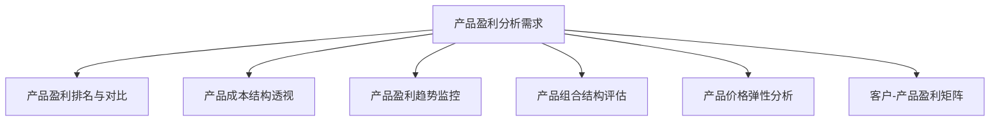
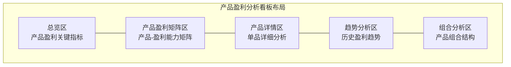

---
{"dg-publish":true,"permalink":"/08-财务专业/财务BI看板项目/设计稿/看板设计/专题分析模块/产品盈利分析看板设计/"}
---

# 产品盈利分析看板设计

#看板设计 #产品盈利 #专题分析

产品盈利分析看板是财务BI系统中的专题分析模块，聚焦于企业各产品线和产品的盈利能力分析，帮助管理层洞察产品业务绩效，优化产品结构和定价策略，实现产品组合利润最大化。本文档详细说明产品盈利分析看板的设计方案。

## 一、设计目标

产品盈利分析看板作为财务BI系统的专题分析模块，旨在提供多维度的产品盈利能力分析视图，帮助企业了解产品的真实盈利状况及其贡献。具体设计目标包括：

1. **产品盈利全景**：直观展示企业各产品线、产品类别和单品的盈利状况
2. **盈利结构分析**：分析产品收入、成本和利润的构成，识别盈利驱动因素
3. **产品组合优化**：评估产品组合结构，识别明星产品和低效产品
4. **产品生命周期**：监控产品在不同生命周期阶段的盈利表现
5. **定价策略支持**：为产品定价策略优化提供数据支持

## 二、用户需求分析

### 1. 主要用户群体

- **产品管理者**：需要了解产品盈利状况和竞争力
- **销售管理者**：需要掌握产品销售与盈利的关系
- **市场营销团队**：需要分析产品市场表现与盈利贡献
- **财务分析师**：需要深入分析产品成本结构和利润率
- **高层决策者**：需要评估产品战略和资源配置

### 2. 用户核心需求

### 3. 应用场景

- **产品组合审查**：定期评估企业产品组合盈利状况
- **新产品上市决策**：基于现有产品盈利模式评估新产品预期
- **产品淘汰决策**：识别长期低盈利或亏损产品
- **促销策略制定**：分析价格调整对产品盈利的影响
- **年度产品规划**：为产品资源分配提供决策依据

## 三、看板布局设计

产品盈利分析看板采用多维度组合设计，包括总览区、产品盈利矩阵区、产品详情区、趋势分析区和组合分析区。

### 1. 布局结构

### 2. 布局说明

- **总览区**：页面顶部，展示产品盈利总体情况和关键指标
- **产品盈利矩阵区**：左上区域，展示产品盈利能力与销售额的矩阵分布
- **产品详情区**：右上区域，展示选定产品的详细盈利分析
- **趋势分析区**：左下区域，展示产品盈利的历史趋势
- **组合分析区**：右下区域，展示产品组合结构和优化建议

## 四、核心组件设计

### 1. 总览区设计

总览区采用卡片设计，展示产品盈利的核心指标，包括：

- **总收入卡片**：显示产品总收入、环比变化和同比变化
- **总毛利卡片**：显示产品总毛利、环比变化和同比变化
- **毛利率卡片**：显示整体毛利率、环比变化和行业对标
- **产品数量卡片**：显示盈利/亏损产品数量及占比
- **明星产品卡片**：显示毛利贡献最高的前3个产品

### 2. 产品盈利矩阵区设计

产品盈利矩阵区采用四象限分析图，展示产品盈利能力与销售规模的关系：

- **四象限矩阵**：
  - X轴：销售收入（规模）
  - Y轴：毛利率（盈利能力）
  - 气泡大小：表示毛利额贡献
  - 气泡颜色：表示不同产品线或类别
  
- **矩阵象限说明**：
  - 第一象限（右上）：明星产品（高销售额、高毛利率）
  - 第二象限（左上）：潜力产品（低销售额、高毛利率）
  - 第三象限（左下）：问题产品（低销售额、低毛利率）
  - 第四象限（右下）：量产型产品（高销售额、低毛利率）

### 3. 产品详情区设计

产品详情区采用级联设计，可选择产品后展示其详细盈利情况：

- **产品盈利结构**：瀑布图展示从收入到毛利的构成
  - 收入 → 各类成本（原材料、人工、制造费用等）→ 毛利
  
- **产品盈利对比**：
  - 与同类产品毛利率对比
  - 与历史最佳表现对比
  - 与预算目标对比
  
- **客户-产品分析**：热力图展示产品在不同客户群体的盈利能力

### 4. 趋势分析区设计

趋势分析区采用多维趋势图，展示产品盈利的历时变化：

- **产品收入趋势**：折线图展示产品收入随时间的变化
- **产品毛利趋势**：折线图展示产品毛利随时间的变化
- **产品毛利率趋势**：折线图展示产品毛利率随时间的变化
- **产品排名变化**：展示产品盈利贡献排名的动态变化

### 5. 组合分析区设计

组合分析区采用多种图表，展示产品组合结构和优化方向：

- **产品组合结构**：
  - 饼图展示不同产品类别的收入占比
  - 饼图展示不同产品类别的毛利贡献占比
  
- **产品生命周期分析**：
  - 矩阵图展示处于不同生命周期阶段产品的分布
  - 柱状图展示不同生命周期阶段产品的盈利贡献
  
- **产品组合优化建议**：
  - 基于盈利能力和市场表现的产品投资优先级
  - 需要关注或可能淘汰的产品清单

## 五、交互设计

### 1. 产品维度交互

- **产品层级选择器**：支持在产品线、产品类别和单品之间切换
- **产品多选功能**：支持选择多个产品进行对比分析
- **产品搜索过滤**：支持按名称、编码、属性等快速定位产品

### 2. 时间维度交互

- **时间范围选择器**：可选择查看不同时间范围的产品盈利数据
- **周期比较功能**：支持同比、环比、定基比等多种比较方式
- **季节性分析**：支持按季节、月度等周期比较产品表现

### 3. 分析维度交互

- **维度切换**：支持按不同维度（如区域、客户、渠道）分析产品盈利
- **排序功能**：支持按收入、毛利、毛利率等指标排序
- **筛选功能**：支持按盈利能力、增长率等条件筛选产品

## 六、高级功能设计

### 1. 产品价格弹性分析

分析产品价格变动对销量和盈利的影响：

- **价格弹性曲线**：展示不同价格点下的销量预测
- **价格-盈利模拟**：模拟不同定价策略对产品盈利的影响
- **最优价格推荐**：基于利润最大化原则推荐产品定价

### 2. 产品成本驱动因素分析

深入分析影响产品成本的关键因素：

- **成本驱动因素分解**：识别影响产品成本的关键因素
- **成本敏感性分析**：分析原材料、人工等成本变动对产品盈利的影响
- **成本优化建议**：针对高成本环节提供优化建议

### 3. 产品组合模拟

通过模拟不同产品组合结构，评估对整体盈利的影响：

- **产品组合调整模拟**：调整产品投资占比，模拟盈利变化
- **新产品引入模拟**：评估新产品对现有产品组合的影响
- **产品淘汰影响分析**：评估淘汰低效产品对整体盈利的影响

## 七、视觉设计

### 1. 配色方案

产品盈利分析看板采用专业商务的配色方案：

- **基础配色**：使用蓝紫色系作为主色调，体现专业和洞察
- **产品类别配色**：不同产品类别使用不同颜色，保持区分度和一致性
- **盈利能力配色**：使用从红到绿的渐变色表示盈利能力，红色表示亏损，绿色表示高盈利
- **对比色使用**：在关键对比场景使用对比色提高可读性

### 2. 数据可视化标准

- **产品盈利能力**：使用条形图、热力图和仪表盘表示
- **产品对比分析**：使用雷达图、并列条形图和散点图表示
- **趋势变化分析**：使用折线图、面积图和阶梯图表示
- **结构关系分析**：使用饼图、树图和桑基图表示

## 八、数据需求

### 1. 数据源

- **ERP系统**：产品主数据、销售数据、成本数据
- **CRM系统**：客户-产品关联数据、产品反馈数据
- **财务系统**：产品收入、成本和利润数据
- **市场调研数据**：行业对标数据、市场份额数据

### 2. 数据粒度

- **产品粒度**：产品线、产品类别、SKU级别
- **时间粒度**：年、季、月、周、日
- **客户粒度**：客户群体、客户类型、单个客户
- **区域粒度**：全球、区域、国家、省市

### 3. 计算指标

- **基础指标**：产品收入、产品成本、产品毛利
- **比率指标**：毛利率、成本率、收入贡献率
- **复合指标**：盈利增长率、盈利波动性、价格敏感度
- **排名指标**：盈利贡献排名、毛利率排名、增长率排名

## 九、实施建议

### 1. 分步实施策略

1. **第一阶段**：基础产品盈利分析，包括总览和产品盈利矩阵
2. **第二阶段**：产品详情分析和趋势分析功能
3. **第三阶段**：产品组合分析和生命周期管理
4. **第四阶段**：高级功能，如价格弹性分析和组合模拟

### 2. 关键成功因素

- **数据一致性**：确保产品、成本和收入数据的准确性和一致性
- **用户培训**：确保用户理解产品盈利分析的方法和应用
- **定期更新**：保持数据的及时更新，确保决策基于最新信息
- **系统集成**：与ERP、CRM等系统有效集成，保障数据流通畅

### 3. 预期效果

- **优化产品组合**：调整产品资源分配，提高整体盈利能力
- **改进定价策略**：基于数据优化产品定价策略
- **提高决策效率**：加速产品相关决策流程
- **增强盈利意识**：培养组织内的产品盈利意识

## 十、相关看板

- [财务概览看板](./财务概览看板设计.md)
- [利润分析看板](./利润分析看板设计.md)
- [成本分析看板](./成本分析看板设计.md)
- [客户价值分析看板](客户价值分析看板设计.md)

---

**相关笔记**：
- [[08-财务专业/财务BI看板项目/设计稿/布局规划/财务BI看板模块规划\|财务BI看板模块规划]]
- [[产品盈利分析方法论\|产品盈利分析方法论]]
- [[产品生命周期管理\|产品生命周期管理]] 