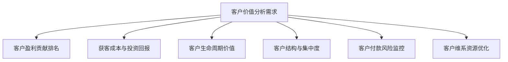
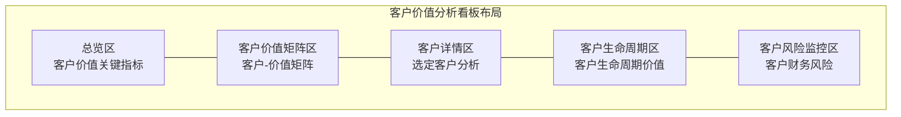

---
{"dg-publish":true,"dg-home":false,"permalink":"/08-财务专业/财务BI看板项目/设计稿/看板设计/专题分析模块/客户价值分析看板设计/","dgPassFrontmatter":true}
---

#看板设计 #客户价值 #专题分析

客户价值分析看板是财务BI系统中的专题分析模块，聚焦于客户层面的财务贡献和价值评估，帮助企业从财务视角理解客户结构、盈利能力和长期价值，为客户关系管理和市场资源配置提供数据驱动决策支持。本文档详细说明客户价值分析看板的设计方案。

## 一、设计目标

客户价值分析看板作为财务BI系统的专题分析模块，旨在提供多维度的客户财务价值分析视图，帮助企业了解客户的真实盈利贡献和投资回报。具体设计目标包括：

1. **客户盈利分析**：全面展示客户收入贡献、成本消耗和盈利能力
2. **客户获取成本监控**：分析客户获取和维护的成本效率
3. **客户生命周期价值评估**：预测和评估客户的长期价值
4. **客户组合优化**：识别高价值客户群体，优化客户结构
5. **客户风险监控**：识别财务风险较高的客户关系

## 二、用户需求分析

### 1. 主要用户群体

- **销售管理者**：需要了解各客户的盈利贡献和价值潜力
- **市场营销团队**：需要评估获客成本和营销投资回报
- **客户关系经理**：需要掌握客户健康度和潜在风险
- **财务分析师**：需要分析客户相关的财务表现
- **高层决策者**：需要把握客户结构和战略方向

### 2. 用户核心需求

### 3. 应用场景

- **客户战略制定**：基于客户价值分析制定差异化客户战略
- **营销资源分配**：根据客户价值潜力优化营销资源分配
- **客户关系管理**：强化对高价值客户的关系维护
- **价格谈判准备**：为不同价值客户制定合理的价格策略
- **财务风险管理**：监控和管理客户相关的财务风险

## 三、看板布局设计

客户价值分析看板采用多维度组合设计，包括总览区、客户价值矩阵区、客户详情区、客户生命周期区和客户风险监控区。

### 1. 布局结构

### 2. 布局说明

- **总览区**：页面顶部，展示客户价值的核心指标和整体情况
- **客户价值矩阵区**：左上区域，展示客户盈利能力与收入贡献的矩阵分布
- **客户详情区**：右上区域，展示选定客户的详细财务分析
- **客户生命周期区**：左下区域，展示客户生命周期价值和发展趋势
- **客户风险监控区**：右下区域，展示客户财务风险警示和管理建议

## 四、核心组件设计

### 1. 总览区设计

总览区采用卡片设计，展示客户价值的核心指标，包括：

- **客户收入卡片**：显示总客户收入、环比变化和同比变化
- **客户贡献利润卡片**：显示客户贡献利润、环比变化和同比变化
- **客户获取成本卡片**：显示平均获客成本和同比变化
- **客户留存率卡片**：显示价值客户的留存率和同比变化
- **客户集中度卡片**：显示前20%客户贡献的收入占比

### 2. 客户价值矩阵区设计

客户价值矩阵区采用四象限分析图，展示客户盈利能力与收入贡献的关系：

- **四象限矩阵**：
  - X轴：客户收入贡献（规模）
  - Y轴：客户利润率（盈利能力）
  - 气泡大小：表示客户关系时长
  - 气泡颜色：表示不同客户类型或行业
  
- **矩阵象限说明**：
  - 第一象限（右上）：核心价值客户（高收入、高利润率）
  - 第二象限（左上）：高效能客户（低收入、高利润率）
  - 第三象限（左下）：低价值客户（低收入、低利润率）
  - 第四象限（右下）：高维护客户（高收入、低利润率）

### 3. 客户详情区设计

客户详情区采用级联设计，可选择客户后展示其详细财务状况：

- **客户盈利结构**：瀑布图展示从收入到利润的构成
  - 收入 → 产品成本 → 服务成本 → 营销成本 → 客户服务成本 → 贡献利润
  
- **客户产品组合**：展示客户购买的产品/服务组合及其盈利情况
  - 饼图展示产品收入分布
  - 表格展示各产品的利润贡献
  
- **客户时间趋势**：展示客户收入、利润和订单量的历史趋势
  - 折线图展示关键指标的时间变化
  - 条形图展示季节性购买模式

### 4. 客户生命周期区设计

客户生命周期区聚焦于客户长期价值分析：

- **客户生命周期价值(CLV)计算**：
  - 显示客户未来预期贡献的现值
  - 比较不同客户群体的CLV差异
  
- **客户获取成本(CAC)分析**：
  - 展示获取不同类型客户的成本
  - 分析CAC与CLV的比率及回收期
  
- **客户价值发展阶段**：
  - 展示客户处于哪个价值发展阶段（获取、成长、成熟、衰退）
  - 预测客户未来价值变化趋势

### 5. 客户风险监控区设计

客户风险监控区关注客户相关的财务风险：

- **客户付款风险**：
  - 应收账款账龄分析
  - 客户历史付款行为分析
  
- **客户集中度风险**：
  - 收入集中度指标
  - 依赖性高的客户关系识别
  
- **客户稳定性评估**：
  - 客户订单波动性分析
  - 客户关系风险评分系统

## 五、交互设计

### 1. 客户维度交互

- **客户层级选择器**：支持在客户群体、客户类型和单个客户之间切换
- **客户多选功能**：支持选择多个客户进行对比分析
- **客户搜索过滤**：支持按名称、编码、行业等快速定位客户

### 2. 时间维度交互

- **时间范围选择器**：可选择查看不同时间范围的客户价值数据
- **周期比较功能**：支持同比、环比、定基比等多种比较方式
- **趋势分析交互**：可在趋势图上选择特定时间点查看详细数据

### 3. 分析维度交互

- **维度切换**：支持按不同维度（如产品、区域、销售渠道）分析客户价值
- **排序功能**：支持按收入、利润、增长率等指标排序
- **筛选功能**：支持按价值等级、风险等级等条件筛选客户

## 六、高级功能设计

### 1. 客户细分分析

基于财务价值和行为特征对客户进行多维度细分：

- **价值细分**：基于收入和利润贡献的RFM模型分析
- **行为细分**：基于购买频率、产品组合的行为模式分析
- **增长潜力细分**：基于历史增长率和市场潜力的预测

### 2. 客户投资回报分析

分析针对不同客户的营销和服务投入的回报情况：

- **营销ROI分析**：不同客户群体的营销投入回报率
- **客户服务效率分析**：客户服务成本与客户价值的关联
- **客户资源优化建议**：优化客户投资分配的建议

### 3. 客户价值预测

通过预测模型评估客户未来价值：

- **客户流失预警**：识别有流失风险的高价值客户
- **客户价值增长预测**：预测客户价值的增长潜力
- **客户终身价值模拟**：基于不同情景的客户终身价值模拟

## 七、视觉设计

### 1. 配色方案

客户价值分析看板采用专业而温暖的配色方案：

- **基础配色**：使用蓝色调作为主色调，体现专业性和信任感
- **客户类型配色**：不同客户类型或行业使用不同颜色，保持区分度
- **价值等级配色**：使用从红到绿的渐变色表示客户价值等级
- **风险等级配色**：使用从绿到红的渐变色表示客户风险等级

### 2. 数据可视化标准

- **客户价值对比**：使用条形图、热力图和散点图表示
- **客户结构分析**：使用饼图、树图和堆叠图表示
- **时间趋势分析**：使用折线图、面积图和阶梯图表示
- **客户生命周期**：使用漏斗图、流程图和路径图表示

## 八、数据需求

### 1. 数据源

- **CRM系统**：客户基础信息、互动历史、关系阶段
- **财务系统**：客户收入、成本、利润和应收账款数据
- **ERP系统**：客户订单、产品交付和服务记录
- **营销系统**：客户获取成本、营销活动数据

### 2. 数据粒度

- **客户粒度**：客户群、客户类型、单个客户
- **时间粒度**：年、季、月、周、日
- **产品粒度**：产品线、产品类别、单个产品
- **渠道粒度**：销售渠道、销售代表

### 3. 计算指标

- **基础价值指标**：客户收入、客户成本、客户利润
- **高级价值指标**：客户生命周期价值(CLV)、客户获取成本(CAC)、CLV/CAC比率
- **客户健康指标**：回购率、客户留存率、客户增长率
- **风险指标**：付款行为评分、应收账款账龄比率、订单波动率

## 九、实施建议

### 1. 分步实施策略

1. **第一阶段**：基础客户价值分析，包括总览和客户价值矩阵
2. **第二阶段**：客户详情分析和生命周期分析
3. **第三阶段**：客户风险监控和预警
4. **第四阶段**：高级功能，如客户细分和价值预测

### 2. 关键成功因素

- **数据集成**：确保CRM、财务和ERP系统的客户数据一致性
- **分析方法统一**：明确客户价值计算方法和生命周期模型
- **全面培训**：确保用户理解客户价值分析的方法和应用
- **持续更新**：根据业务变化持续优化分析模型和指标

### 3. 预期效果

- **优化客户结构**：合理分配资源，强化高价值客户关系
- **提高获客效率**：降低获客成本，提高营销投资回报
- **减少客户流失**：及早识别风险，防止高价值客户流失
- **增强决策支持**：为客户战略提供数据驱动的决策依据

## 十、相关看板

- [财务概览看板](./财务概览看板设计.md)
- [产品盈利分析看板](产品盈利分析看板设计.md)
- [区域业绩分析看板](区域业绩分析看板设计.md)
- [营销效果分析看板](./营销效果分析看板设计.md)

---

**相关笔记**：
- [[08-财务专业/财务BI看板项目/设计稿/财务BI看板模块规划\|财务BI看板模块规划]]
- [[客户价值评估方法\|客户价值评估方法]]
- [[客户生命周期管理\|客户生命周期管理]] 