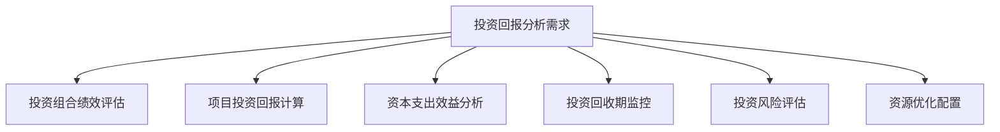
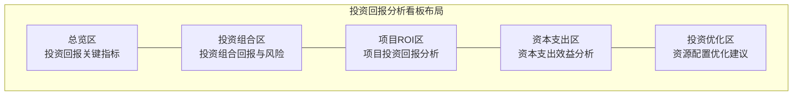

---
{"dg-publish":true,"permalink":"/08-财务专业/财务BI看板项目/设计稿/看板设计/专题分析模块/投资回报分析看板设计/"}
---

#看板设计 #投资回报 #专题分析

投资回报分析看板是财务BI系统中的专题分析模块，聚焦于企业各类投资项目、资本支出和资源配置的财务回报分析，帮助管理层评估投资效果，优化资源分配，提高资本使用效率。本文档详细说明投资回报分析看板的设计方案。

## 一、设计目标

投资回报分析看板作为财务BI系统的专题分析模块，旨在提供企业各类投资的全面回报分析视图，帮助企业评估投资绩效并优化投资决策。具体设计目标包括：

1. **投资组合全景**：全面展示企业各类投资项目的收益状况和风险水平
2. **项目ROI分析**：评估各投资项目的回报率和回收期
3. **资本支出效益**：分析资本支出项目的投入产出比和使用效率
4. **投资风险评估**：识别和监控投资项目的财务风险
5. **资源优化决策**：为投资资源的最佳配置提供决策支持

## 二、用户需求分析

### 1. 主要用户群体

- **投资决策者**：需要了解投资组合表现和做出优化决策
- **财务管理者**：需要分析各类投资的财务回报和风险
- **项目经理**：需要跟踪项目投资回报和效益实现情况
- **业务部门负责人**：需要评估本部门资本支出的效益
- **董事会/投资者**：需要了解企业资本使用效率和投资回报

### 2. 用户核心需求

### 3. 应用场景

- **投资审批决策**：评估新投资项目的预期回报和风险
- **投资组合管理**：优化现有投资组合的结构和配置
- **预算资源分配**：为不同部门和项目分配资本预算
- **投资后评估**：评价已完成投资项目的实际回报
- **资产处置决策**：评估低效资产的处置可行性和时机

## 三、看板布局设计

投资回报分析看板采用多维度组合设计，包括总览区、投资组合区、项目ROI区、资本支出区和投资优化区。

### 1. 布局结构

### 2. 布局说明

- **总览区**：页面顶部，展示投资回报的核心指标和整体情况
- **投资组合区**：左上区域，展示投资组合的回报表现和风险状况
- **项目ROI区**：右上区域，展示各项目的ROI和回收期分析
- **资本支出区**：左下区域，分析各类资本支出的效益和使用率
- **投资优化区**：右下区域，提供投资组合优化和资源配置建议

## 四、核心组件设计

### 1. 总览区设计

总览区采用卡片设计，展示投资回报的核心指标，包括：

- **总投资额卡片**：显示企业总投资额和增长率
- **加权平均ROI卡片**：显示所有投资的加权平均回报率
- **平均回收期卡片**：显示投资项目的平均回收期
- **资本效率卡片**：显示总资本产出比和行业对标
- **投资风险评分卡片**：显示投资组合的综合风险评分

### 2. 投资组合区设计

投资组合区采用组合分析视图，展示不同类型投资的回报和风险：

- **投资组合回报矩阵**：
  - X轴：投资风险（波动性）
  - Y轴：投资回报率
  - 气泡大小：投资额
  - 气泡颜色：投资类型
  
- **投资类型分布**：
  - 饼图展示不同类型投资的占比
  - 类型包括：营运资本、固定资产、研发投入、战略投资等
  
- **投资回报趋势**：
  - 折线图展示投资组合整体回报率的历史变化
  - 对比不同投资类型的回报率变化趋势

### 3. 项目ROI区设计

项目ROI区聚焦于具体投资项目的回报分析：

- **项目ROI排名**：
  - 横向条形图展示各项目的ROI排名
  - 颜色编码表示是否达到目标回报率
  
- **项目回收期分析**：
  - 甘特图展示各项目的投资期和回收期
  - 标注预计回收时间点和实际进度
  
- **项目现金流视图**：
  - 折线图或瀑布图展示项目的累计现金流
  - 显示从投资到回收的现金流变化过程

### 4. 资本支出区设计

资本支出区分析企业资本支出的效益和使用情况：

- **资本支出类别分析**：
  - 堆叠柱状图展示不同类别的资本支出及其效益
  - 类别包括：设备购置、IT系统、设施改造、扩张投资等
  
- **资产利用效率**：
  - 仪表盘展示关键资产的利用率
  - 对比不同资产类别的效率差异
  
- **折旧与效益对比**：
  - 双轴图表对比资产折旧和产生的效益
  - 分析资产生命周期中的投入产出关系

### 5. 投资优化区设计

投资优化区提供投资决策和资源优化的建议：

- **投资组合优化建议**：
  - 基于有效前沿理论的投资组合优化模型
  - 展示当前组合与最优组合的对比
  
- **资源重分配建议**：
  - 从高回报项目到低效项目的资源重分配建议
  - 量化重分配可能带来的回报提升
  
- **新投资机会评估**：
  - 评估管道中新投资项目的预期回报和风险
  - 与现有投资组合的协同效应分析

## 五、交互设计

### 1. 投资维度交互

- **投资类型选择器**：支持按不同投资类型筛选和分析
- **项目状态筛选**：支持按计划中、执行中、已完成等状态筛选
- **金额范围筛选**：支持按投资规模大小进行筛选

### 2. 时间维度交互

- **时间范围选择器**：可选择查看不同时间范围的投资回报数据
- **预测期间设置**：可调整未来预测期间的长度
- **历史对比功能**：支持与历史同期投资表现进行对比

### 3. 分析维度交互

- **回报计算方法切换**：支持在ROI、IRR、NPV等不同回报计算方法间切换
- **风险指标切换**：支持在波动性、敏感性、最大回撤等风险指标间切换
- **详情钻取功能**：支持从组合层级钻取到具体项目的详细信息

## 六、高级功能设计

### 1. 敏感性分析

通过调整关键参数，分析对投资回报的影响：

- **变量敏感度分析**：评估关键变量变化对投资回报的影响程度
- **情景模拟分析**：模拟不同经济情景下的投资表现
- **蒙特卡洛模拟**：通过随机模拟评估投资结果的概率分布

### 2. 风险调整回报分析

综合考虑风险因素的投资回报分析：

- **风险调整回报率计算**：计算考虑风险因素后的回报率
- **夏普比率分析**：评估单位风险下的超额收益
- **风险分解**：分解投资风险的来源和构成

### 3. 投资组合优化

基于现代投资组合理论的优化工具：

- **有效前沿分析**：计算和展示风险-回报最优的投资组合
- **资源配置优化**：基于目标函数和约束条件的资源优化配置
- **多目标优化**：考虑回报、风险、流动性等多维目标的优化模型

## 七、视觉设计

### 1. 配色方案

投资回报分析看板采用专业金融的配色方案：

- **基础配色**：使用深蓝色调作为主色调，体现稳健和专业
- **回报等级配色**：使用从红到绿的渐变色表示回报水平
- **风险等级配色**：使用从绿到红的渐变色表示风险水平
- **投资类型配色**：不同投资类型使用不同的互补色，保持区分度

### 2. 数据可视化标准

- **回报分析图表**：使用条形图、散点图和热力图表示
- **时间序列分析**：使用折线图、面积图和阶梯图表示
- **分布与结构分析**：使用饼图、树图和桑基图表示
- **预测与模拟**：使用范围区间图、扇形图和蒙特卡洛点阵图表示

## 八、数据需求

### 1. 数据源

- **财务系统**：投资金额、回报数据、资产账目数据
- **项目管理系统**：项目进度、成本和收益数据
- **预算系统**：资本预算分配和使用数据
- **资产管理系统**：资产利用率和效益数据

### 2. 数据粒度

- **投资粒度**：投资组合、投资类型、单个项目
- **时间粒度**：年、季、月、周
- **组织粒度**：公司级、部门级、业务单元级
- **资产粒度**：资产类别、资产组、单项资产

### 3. 计算指标

- **回报指标**：投资回报率(ROI)、内部收益率(IRR)、净现值(NPV)
- **效率指标**：资本使用效率、投资生产率、单位资本产出
- **风险指标**：回报波动性、敏感性、回报风险比
- **时间指标**：回收期、盈亏平衡点、资本锁定时间

## 九、实施建议

### 1. 分步实施策略

1. **第一阶段**：基础投资回报分析，包括总览和项目ROI分析
2. **第二阶段**：资本支出效益分析和投资组合视图
3. **第三阶段**：投资风险分析和敏感性分析
4. **第四阶段**：高级功能，如投资组合优化和多情景模拟

### 2. 关键成功因素

- **数据一致性**：确保投资数据和财务数据的一致性
- **回报计算标准化**：统一回报计算方法和参数设置
- **适当的风险评估**：建立科学的投资风险评估框架
- **实时数据更新**：确保投资数据的及时更新和准确性

### 3. 预期效果

- **优化投资决策**：基于数据做出更科学的投资决策
- **提高资本效率**：优化资本配置，提高整体回报率
- **控制投资风险**：提前识别和管理投资风险
- **改善资源分配**：优化有限资源在不同投资机会间的分配

## 十、相关看板

- [财务概览看板](./财务概览看板设计.md)
- [预算执行看板](./预算执行看板设计.md)
- [现金流分析看板](./现金流分析看板设计.md)
- [资产负债看板](./资产负债看板设计.md)

---

**相关笔记**：
- [[08-财务专业/财务BI看板项目/设计稿/布局规划/财务BI看板模块规划\|财务BI看板模块规划]]
- [[投资回报计算方法\|投资回报计算方法]]
- [[投资组合管理框架\|投资组合管理框架]] 