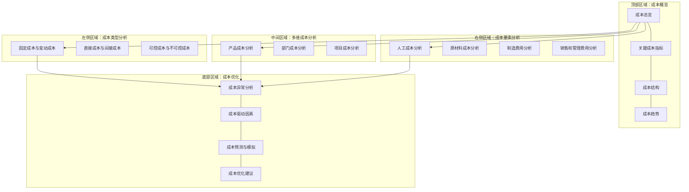

---
{"dg-publish":true,"permalink":"/08-财务专业/财务BI看板项目/设计稿/看板设计/核心看板模块/成本分析看板设计/"}
---

# 成本分析看板设计

#看板设计 #成本分析 #核心模块

成本分析看板是财务BI系统中的核心功能模块，聚焦于企业各类成本的结构分析、趋势监控和优化机会识别，支持管理层精细化成本管理和决策。本文档详细说明成本分析看板的设计方案。

## 设计目标

1. **成本结构透明化**：清晰展示企业各类成本的构成和占比
2. **成本趋势监控**：追踪成本变动趋势，及时发现异常波动
3. **成本驱动因素分析**：识别影响成本的关键因素及其作用机制
4. **成本对比分析**：支持多维度成本对比（同比、环比、预算对比、行业对比）
5. **成本优化机会识别**：挖掘潜在的成本节约空间和优化方向

## 用户需求分析

成本分析看板的主要用户包括：

- **财务总监/CFO**：关注整体成本结构和重大成本问题
- **成本管理部门**：负责成本分析和控制
- **业务部门负责人**：关注本部门成本使用情况和效率
- **产品经理**：关注产品成本构成和盈利能力

主要使用场景：
- 月度/季度成本分析会议
- 成本控制与优化决策
- 产品定价策略制定
- 供应链与采购管理

## 看板布局设计

成本分析看板采用多层次布局，从宏观到微观，从整体到局部：



## 核心组件设计

### 1. 成本概览区

展示企业整体成本状况和关键指标，采用卡片式布局：

```
┌──────────────────┐ ┌──────────────────┐ ┌──────────────────┐ ┌──────────────────┐
│ 总成本           │ │ 成本收入比       │ │ 单位产品成本     │ │ 成本同比增长     │
│                  │ │                  │ │                  │ │                  │
│ ¥86,523,450      │ │ 67.3%            │ │ ¥328.52          │ │ +2.4%            │
│ 预算: ¥90,000,000│ │ 目标: 65.0%      │ │ 目标: ¥320.00    │ │ 行业平均: +3.1%  │
│ 状态: ●良好      │ │ 状态: ●注意      │ │ 状态: ●注意      │ │ 状态: ●良好      │
└──────────────────┘ └──────────────────┘ └──────────────────┘ └──────────────────┘
```

成本指标卡片包含：
1. **总成本**：企业当前周期总成本，与预算对比
2. **成本收入比**：成本/收入，衡量成本控制效率
3. **单位产品成本**：平均单位产品成本，与目标对比
4. **成本同比增长**：与去年同期相比的成本增长率

附加指标卡片：
- **毛利率**：(收入-成本)/收入，与目标对比
- **成本节约额**：实际成本节约与目标的对比
- **固定成本占比**：固定成本/总成本
- **成本变动敏感性**：成本对业务量变化的敏感度

### 2. 成本类型分析区

#### 2.1 固定成本与变动成本分析

使用堆叠柱状图展示固定成本和变动成本的构成和趋势：

```
固定成本与变动成本分析
^
|
|  ┌───┐      ┌───┐      ┌───┐      ┌───┐      ┌───┐      ┌───┐
|  │███│      │███│      │███│      │███│      │███│      │███│
|  │███│      │███│      │███│      │███│      │███│      │███│
|  │███│      │███│      │███│      │███│      │███│      │███│
|  ├───┤      ├───┤      ├───┤      ├───┤      ├───┤      ├───┤
|  │▒▒▒│      │▒▒▒│      │▒▒▒│      │▒▒▒│      │▒▒▒│      │▒▒▒│
|  │▒▒▒│      │▒▒▒│      │▒▒▒│      │▒▒▒│      │▒▒▒│      │▒▒▒│
|  │▒▒▒│      │▒▒▒│      │▒▒▒│      │▒▒▒│      │▒▒▒│      │▒▒▒│
+──┴───┴──────┴───┴──────┴───┴──────┴───┴──────┴───┴──────┴───┴────────>
    1月        2月        3月        4月        5月        6月

   █ 固定成本   ▒ 变动成本   --- 产量
```

设计要点：
- 区分固定成本和变动成本，显示各自占比
- 结合业务量/产量曲线，分析成本弹性
- 支持按不同时间维度查看（月度/季度/年度）

#### 2.2 直接成本与间接成本分析

使用饼图和趋势线展示直接成本和间接成本的构成和变化：

```
直接成本与间接成本分析

┌─────────────────────────┐  ┌─────────────────────────┐
│    直接成本构成 (68%)   │  │    间接成本构成 (32%)   │
│                         │  │                         │
│         ┌──┐            │  │         ┌──┐            │
│     ┌───┘  └───┐        │  │     ┌───┘  └───┐        │
│   ┌─┘          └─┐      │  │   ┌─┘          └─┐      │
│  │   原材料 (58%)  │     │  │  │   制造费用 (45%) │     │
│   └─┐          ┌─┘      │  │   └─┐          ┌─┘      │
│     └───┐  ┌───┘        │  │     └───┐  ┌───┘        │
│         └──┘            │  │         └──┘            │
│      直接人工 (42%)      │  │      管理费用 (55%)      │
└─────────────────────────┘  └─────────────────────────┘

┌─────────────────────────────────────────────────────┐
│ 直接成本与间接成本比率变化趋势                      │
│                                                     │
│ 80% ┌───────────────────────────────────────────┐   │
│     │                                           │   │
│ 60% │ ═════════════════════════════════════════ │   │
│     │                                           │   │
│ 40% │                                           │   │
│     │ ─────────────────────────────────────────────│
│ 20% │                                           │   │
│     │                                           │   │
│  0% └───────────────────────────────────────────┘   │
│      Q1-2022  Q2-2022  Q3-2022  Q4-2022  Q1-2023   │
│                                                     │
│     ═ 直接成本   ─ 间接成本                        │
└─────────────────────────────────────────────────────┘
```

设计要点：
- 展示直接成本和间接成本的内部构成
- 追踪直接成本和间接成本比例的变化趋势
- 分析不同成本类型的增长率差异

#### 2.3 可控成本与不可控成本分析

使用组合图表分析可控成本的管控效果：

```
可控成本管控效果分析
                 成本节约率
                   
部门A    █████████████▒▒▒▒▒   13.5%    ↑2.1%
部门B    ███████▒▒▒▒▒▒▒▒▒▒▒▒   7.2%    ↓0.8%
部门C    ██████████████▒▒▒▒▒   15.6%    ↑3.3%
部门D    ████▒▒▒▒▒▒▒▒▒▒▒▒▒▒▒   4.9%    ↓1.5%
部门E    ███████████▒▒▒▒▒▒▒▒   11.8%    ↑0.7%
部门F    ██████████████████▒   19.2%    ↑5.4%

         0%  5%  10%  15%  20%

         █ 实际节约率  ▒ 目标节约率  ↑↓ 同比变化
```

设计要点：
- 分析各部门对可控成本的管控效果
- 对比实际节约率与目标节约率
- 显示同比变化，标识改进和退步

### 3. 多维成本分析区

#### 3.1 产品成本分析

使用瀑布图展示产品成本构成，帕累托图展示产品成本分布：

```
产品A成本构成分析 (单位：元)
^
|
|  ┌───┐      
|  │   │      ┌───┐
|  │   │      │   │      ┌───┐
|  │   │      │   │      │   │      ┌───┐
|  │   │      │   │      │   │      │   │      ┌───┐
|  │   │      │   │      │   │      │   │      │   │      ┌───┐
|  │   │      │   │      │   │      │   │      │   │      │   │
+──┴───┴──────┴───┴──────┴───┴──────┴───┴──────┴───┴──────┴───┴─────>
  原材料     直接人工   制造费用   物流成本   销售费用   管理分摊   总成本
  (180)      (75)      (40)      (25)      (35)      (20)     (375)

产品成本分布分析
            100%
            90%
            80%
            70%
            60%
            50%
            40%
            30%
            20%
            10%
            0%
      产品A  产品B  产品C  产品D  产品E  产品F  产品G  产品H  其他

      █ 产品成本   --•-- 累计百分比
```

设计要点：
- 通过瀑布图详细拆解单个产品的成本构成
- 通过帕累托图识别成本集中的产品
- 支持按产品线、产品类别等维度分组

#### 3.2 部门成本分析

使用树形图或热力图展示部门成本分布：

```
部门成本分析 [9,850万元]
├── 生产部门 [4,720万元]
│   ├── 主生产车间 [3,280万元]
│   │   ├── 原材料成本 [2,450万元]
│   │   ├── 人工成本 [630万元]
│   │   └── 制造费用 [200万元]
│   ├── 辅助生产车间 [860万元]
│   └── 质量控制部 [580万元]
├── 销售部门 [2,350万元]
│   ├── 市场推广 [1,280万元]
│   ├── 销售团队 [820万元]
│   └── 售后服务 [250万元]
├── 管理部门 [1,950万元]
│   ├── 行政管理 [680万元]
│   ├── 人力资源 [450万元]
│   ├── 财务部门 [620万元]
│   └── 信息技术 [200万元]
└── 研发部门 [830万元]
    ├── 产品研发 [580万元]
    └── 技术创新 [250万元]
```

设计要点：
- 层级展示各部门及其下属单位的成本
- 标注成本异常的部门
- 支持钻取到部门成本的详细构成

#### 3.3 项目成本分析

使用组合图表展示项目成本状况：

```
项目成本分析
┌──────────────────────────────────────────────────────────┐
│ 关键项目成本状态                            [按超支排序↓]│
├──────────┬──────────┬──────────┬───────────┬─────────────┤
│项目名称  │预算成本  │实际成本  │成本差异   │完成进度     │
├──────────┼──────────┼──────────┼───────────┼─────────────┤
│新产品开发│850万元   │935万元   │+85万元(10%)│78%  ███████▒▒│
│设备升级  │620万元   │668万元   │+48万元(7.7%)│92%  █████████▒│
│市场拓展  │480万元   │502万元   │+22万元(4.6%)│85%  ████████▒▒│
│信息化建设│720万元   │705万元   │-15万元(-2.1%)│65%  ██████▒▒▒▒▒│
│流程优化  │380万元   │352万元   │-28万元(-7.4%)│100% ██████████│
└──────────┴──────────┴──────────┴───────────┴─────────────┘

项目成本效率分析 (每1%进度消耗预算百分比)
         0.5   0.7   0.9   1.1   1.3   1.5
         |     |     |     |     |     |
新产品开发      |======================>| 1.28
设备升级        |================>| 1.08
市场拓展        |==============>| 1.05
信息化建设      |==========>| 0.93
流程优化        |=======>| 0.78
         |     |     |     |     |     |
         0.5   0.7   0.9   1.1   1.3   1.5

   — 实际效率   | 标准效率(1.0)
```

设计要点：
- 展示项目成本与预算的偏差
- 结合项目进度，分析成本效率
- 识别成本超支风险大的项目

### 4. 成本要素分析区

#### 4.1 人工成本分析

使用组合图表分析人工成本趋势和效率：

```
人工成本趋势与效率
^
|                                         /
|                                      /
|                               /‾‾‾\/
|                         /‾‾‾/
|                    /‾‾‾/
|               /‾‾‾/
|          /‾‾‾/
|     /‾‾‾/
+------------------------------------------------->
  1月  2月  3月  4月  5月  6月  7月  8月  9月

  - 人工成本   ---- 人均产出   •••• 人工成本比率
```

设计要点：
- 追踪人工成本的变化趋势
- 分析人均产出效率的变化
- 监控人工成本占总成本的比率变化

#### 4.2 原材料成本分析

使用组合图表分析原材料成本的构成和价格趋势：

```
原材料成本分析
                                  均价变动   成本占比   状态
原材料A     █████████████▒▒▒▒▒    +5.3%      37.2%     ⚠️
原材料B     ████████▒▒▒▒▒▒▒▒▒▒▒   +2.1%      21.8%     ✓
原材料C     ██████████▒▒▒▒▒▒▒▒▒   -1.5%      18.4%     ✓
原材料D     ████▒▒▒▒▒▒▒▒▒▒▒▒▒▒▒   +7.8%      11.0%     ⚠️
原材料E     ███▒▒▒▒▒▒▒▒▒▒▒▒▒▒▒▒   +3.2%       8.5%     ✓
其他原材料  ██▒▒▒▒▒▒▒▒▒▒▒▒▒▒▒▒▒   +1.8%       3.1%     ✓
         0%  10%  20%  30%  40%

         █ 实际占比  ▒ 目标占比  ↑↓ 价格变动
```

设计要点：
- 分析主要原材料的成本构成
- 监控原材料价格变动趋势
- 评估原材料使用效率

#### 4.3 制造费用分析

使用饼图和趋势线分析制造费用构成和趋势：

```
制造费用构成                  制造费用趋势(万元)
            ┌──┐                 ^
        ┌───┘  └───┐             |
      ┌─┘          └─┐           |                     ___
     │    折旧 (38%)  │           |                 ___/
      └─┐          ┌─┘           |             ___/
        │          │             |         ___/
        │          │             |     ___/
      ┌─┘          └─┐           | ___/
     │   水电费 (23%)  │           +----------------------->
      └─┐          ┌─┘             Q1  Q2  Q3  Q4  Q1
        │          │  
        │          │               - 总额   -- 单位产品
      ┌─┘          └─┐
     │   维修费 (15%)  │
      └─┐          ┌─┘
        │          │
        │          │
      ┌─┘          └─┐
     │   其他 (24%)   │
      └─┐          ┌─┘
        └───┐  ┌───┘
            └──┘
```

设计要点：
- 展示制造费用的内部构成
- 追踪制造费用总额和单位产品制造费用的趋势
- 识别制造费用控制的异常点

#### 4.4 销售和管理费用分析

使用组合图表分析销售和管理费用的效率：

```
销售费用效率分析                管理费用效率分析
                                
销售费用率: 8.5%               管理费用率: 5.3%
目标: 7.0%                     目标: 5.0%
同比: +0.3%                    同比: -0.2%

每元销售费用产生收入:           管理费用人均分摊:
¥11.76                         ¥57,350
目标: ¥14.28                   目标: ¥55,000
同比: -4.8%                    同比: +2.1%

┌────────────────────┐        ┌────────────────────┐
│销售费用趋势        │        │管理费用趋势        │
│                    │        │                    │
│                    │        │                    │
│    /‾‾\  /‾        │        │        /‾‾‾‾       │
│   /    \/          │        │       /            │
│  /                 │        │    /‾/             │
│ /                  │        │   /                │
│/                   │        │  /                 │
└────────────────────┘        └────────────────────┘
```

设计要点：
- 分析销售费用和管理费用的使用效率
- 追踪费用率的变化趋势
- 评估费用投入与产出的关系

### 5. 成本优化区

#### 5.1 成本异常分析

使用异常检测图表标识成本异常：

```
成本异常检测
^
|
|                                 *
|                            
|               *                               *
|        
| - - - - - - - - - - - - - - - - - - - - - - - - - - - -
|        
|                                       *
|              
|                      *
+------------------------------------------------->
  1月  2月  3月  4月  5月  6月  7月  8月  9月

  • 实际值   — 预期值   --- 允许偏差范围   * 异常点
```

设计要点：
- 自动识别成本数据中的异常点
- 分析异常点的原因和影响
- 提供异常处理建议

#### 5.2 成本驱动因素分析

使用多因素分析图表识别关键成本驱动因素：

```
成本驱动因素分析
┌──────────────────────────────────────────────────────────┐
│ 影响成本的关键因素                            [详情查看↓]│
├──────────────┬───────────┬──────────────┬────────────────┤
│驱动因素      │影响度     │近期变化      │控制难度        │
├──────────────┼───────────┼──────────────┼────────────────┤
│原材料价格    │★★★★★    │↑ 上升        │★★★☆☆        │
│生产效率      │★★★★☆    │→ 稳定        │★★☆☆☆        │
│能源成本      │★★★☆☆    │↑ 上升        │★★★★☆        │
│库存水平      │★★★☆☆    │↓ 下降        │★★☆☆☆        │
│人工效率      │★★★☆☆    │→ 稳定        │★★★☆☆        │
│设备利用率    │★★☆☆☆    │↑ 上升        │★★☆☆☆        │
│废品率        │★★☆☆☆    │↓ 下降        │★★☆☆☆        │
└──────────────┴───────────┴──────────────┴────────────────┘

影响度与控制难度矩阵
  ^
高 │       ●原材料价格
控 │
制 │   ●能源成本     
难 │                   ●人工效率
度 │
  │●设备利用率  ●库存水平
低 │   ●废品率       ●生产效率
  +-------------------------------->
    低                             高
               影响度
```

设计要点：
- 识别影响成本的关键驱动因素
- 评估各因素的影响度和控制难度
- 提供因素关联分析

#### 5.3 成本预测与模拟

使用预测模型展示成本趋势预测：

```
┌────────────────────────────────────────────────────────┐
│ 成本趋势预测 (未来6个月)                               │
│                                                        │
│ ^                                                      │
│ |                                  _----.              │
│ |                           _----¨                     │
│ |                     _----¨                           │
│ |               _----¨                                 │
│ |         _----¨                                       │
│ |    ----¨                                             │
│ |---¨                                                  │
│ +------------------------------------------------------> │
│   10月  11月  12月  1月   2月   3月                    │
│                                                        │
│   — 历史数据   ---- 预测值   ···· 预测区间            │
│                                                        │
│ 预测模型: ARIMA+季节性                                 │
└────────────────────────────────────────────────────────┘
```

设计要点：
- 基于历史数据预测未来成本趋势
- 提供置信区间表示预测不确定性
- 支持多种情景的成本模拟

#### 5.4 成本优化建议

提供智能化的成本优化建议：

```
┌────────────────────────────────────────────────────────┐
│ 成本优化机会                                          │
│                                                        │
│ 1. 原材料采购策略优化                                 │
│    • 潜在节约: 320-380万元/年                         │
│    • 建议: 扩大供应商评估范围，实施批量采购策略       │
│    • 难度: ★★★☆☆                                    │
│                                                        │
│ 2. 生产流程再造                                       │
│    • 潜在节约: 280-350万元/年                         │
│    • 建议: 优化生产布局，减少中间环节                 │
│    • 难度: ★★★★☆                                    │
│                                                        │
│ 3. 能源使用优化                                       │
│    • 潜在节约: 150-200万元/年                         │
│    • 建议: 引入能源管理系统，实施峰谷用电策略         │
│    • 难度: ★★☆☆☆                                    │
└────────────────────────────────────────────────────────┘
```

设计要点：
- 根据数据分析提供具体成本优化建议
- 量化潜在的成本节约空间
- 评估实施难度和潜在风险

## 交互设计

成本分析看板提供以下交互功能：

1. **时间维度控制**：
   - 周期选择（日/周/月/季/年）
   - 历史比较（同比/环比/自定义期间）
   - 趋势分析期间设置

2. **业务维度筛选**：
   - 公司/子公司/部门层级筛选
   - 产品线/产品类别筛选
   - 成本中心/责任中心筛选

3. **成本类型切换**：
   - 按成本性质分类（固定/变动、直接/间接）
   - 按成本要素分类（材料/人工/制造费用）
   - 按成本责任分类（可控/不可控）

4. **深度钻取功能**：
   - 从汇总到明细的多层级钻取
   - 异常成本的根因分析
   - 跨维度关联分析

5. **成本模拟功能**：
   - 业务量变化对成本的影响模拟
   - 成本结构调整效果模拟
   - 价格变动影响评估

## 高级功能设计

### 1. 成本敏感性分析

评估各因素对成本的敏感程度：
- 构建成本敏感性模型，量化影响因素
- 设置敏感因素的监控阈值
- 提供因素波动的预警机制

### 2. 成本基准比较

与行业标准或历史最佳实践对标：
- 引入行业成本基准数据
- 对比分析差距和原因
- 提供改进方向和目标

### 3. 成本优化情景模拟

通过情景模拟评估不同优化策略的效果：
- 设置不同优化策略的情景
- 模拟计算各情景下的成本节约和投资回报
- 评估实施风险和难度

## 视觉设计

### 配色方案

1. **主色调**：蓝色系 (#1E40AF)，表示专业和理性
2. **辅助色**：
   - 绿色 (#10B981)：表示成本降低/节约
   - 红色 (#EF4444)：表示成本上升/超支
   - 黄色 (#F59E0B)：表示提醒/关注
3. **图表配色**：使用渐变色表示成本变化，冷色调表示理想状态，暖色调表示需要关注的状态
4. **背景色**：浅灰色或白色，确保数据可读性

### 数据可视化规范

1. **趋势图**：展示成本变化趋势，应明确标注同比、环比变化
2. **构成图**：使用饼图、树形图展示成本构成和占比
3. **对比图**：使用条形图、雷达图对比不同维度的成本差异
4. **关系图**：使用散点图、气泡图分析成本与其他因素的关系
5. **异常图**：使用控制图、箱线图识别成本异常
6. **预测图**：使用线图加置信区间表示成本预测

## 数据需求

### 1. 数据来源

- **财务系统**：原始成本数据和会计科目明细
- **ERP系统**：生产订单、物料消耗和库存数据
- **人力资源系统**：人工成本和人员配置数据
- **采购系统**：原材料价格和采购数据
- **行业数据库**：行业成本基准和对标数据

### 2. 更新频率

- **核心指标**：每日更新
- **汇总分析**：每周更新
- **预测模型**：每月更新
- **基准数据**：每季度更新

### 3. 关键指标定义

- **单位产品成本** = 总成本 / 产品数量
- **成本收入比** = 总成本 / 总收入
- **固定成本占比** = 固定成本 / 总成本
- **成本节约率** = (标准成本 - 实际成本) / 标准成本
- **成本增长率** = (本期成本 - 上期成本) / 上期成本

## 实施建议

1. **数据集成阶段**：
   - 整合各系统成本数据
   - 建立成本数据模型和成本分摊规则
   - 清洗历史数据，建立基准

2. **功能分步实施**：
   - 第一阶段：基础成本分析看板
   - 第二阶段：多维成本分析和异常检测
   - 第三阶段：成本预测和优化建议
   - 第四阶段：情景模拟和高级分析工具

3. **用户培训建议**：
   - 对财务人员进行成本分析方法培训
   - 对业务部门进行成本意识培养
   - 对管理层进行决策应用培训

## 效果评估指标

1. **成本可视化效果**：成本结构透明度提升
2. **成本控制效果**：成本增长率下降
3. **决策支持效果**：基于成本分析做出的决策数量
4. **优化效果**：成本优化建议产生的实际节约

---

**相关笔记**：
- [[08-财务专业/财务BI看板项目/设计稿/布局规划/财务BI看板模块规划\|财务BI看板模块规划]]
- [[成本核算原则\|成本核算原则]]
- [[成本优化策略\|成本优化策略]] 