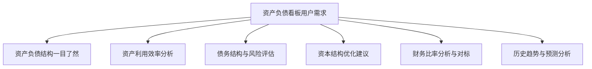

---
{"dg-publish":true,"permalink":"/08-财务专业/财务BI看板项目/设计稿/看板设计/核心看板模块/资产负债看板设计/"}
---

#看板设计 #资产负债 #核心模块

资产负债看板是财务BI系统中的重要组成部分，聚焦于企业资产结构、负债水平和财务稳健性的分析与监控，帮助决策者全面了解企业财务状况，评估财务风险，优化资本结构。本文档详细说明资产负债看板的设计方案。

## 一、设计目标

资产负债看板作为财务BI系统的核心组成部分，旨在提供企业资产、负债和所有者权益的全面视图，帮助管理层了解企业财务状况、财务风险和资本结构。具体设计目标包括：

1. **财务状况透视**：直观展示企业资产、负债和所有者权益的结构和变化
2. **资本结构分析**：分析企业资本结构的合理性和变化趋势
3. **财务风险监控**：识别和监控企业财务风险指标及其变化
4. **财务健康评估**：通过关键财务比率评估企业财务健康状况
5. **资产负债优化**：提供资产负债结构优化的决策支持

## 二、用户需求分析

### 1. 主要用户群体

- **财务总监/CFO**：需要全面了解企业财务状况和资本结构
- **财务经理**：需要分析资产负债结构并提供优化建议
- **投资关系部门**：需要向投资者解释企业财务状况
- **审计与合规团队**：需要监控财务风险指标和合规状况
- **董事会成员**：需要高层次了解企业财务健康状况

### 2. 用户核心需求

### 3. 应用场景

- **月度财务状况审查**：评估企业资产负债状况变化
- **季度董事会报告**：汇报企业财务健康状况
- **融资决策支持**：分析当前债务结构提供融资决策依据
- **年度战略规划**：基于资产负债分析调整战略方向
- **风险防控**：及时发现资产负债表中的风险信号

## 三、看板布局设计

资产负债看板采用分区设计，包括总览区、结构分析区、趋势分析区、比率分析区和风险监控区。

### 1. 布局结构

### 2. 布局说明

- **总览区**：页面顶部，展示总资产、总负债、净资产等关键指标
- **结构分析区**：左上区域，展示资产和负债的类别构成
- **趋势分析区**：右上区域，展示资产负债关键指标的变化趋势
- **比率分析区**：左下区域，展示流动比率、资产负债率等关键财务比率
- **风险监控区**：右下区域，展示财务风险预警指标和信号

## 四、核心组件设计

### 1. 总览区设计

总览区采用卡片设计，展示企业资产负债表的核心指标，包括：

- **总资产卡片**：显示总资产金额、环比变化和同比变化
- **总负债卡片**：显示总负债金额、环比变化和同比变化
- **所有者权益卡片**：显示净资产金额、环比变化和同比变化
- **资产负债率卡片**：显示资产负债率、环比变化和企业警戒线
- **流动比率卡片**：显示流动比率、环比变化和行业基准

### 2. 结构分析区设计

结构分析区采用双饼图和树图结合的方式，展示资产和负债的构成：

- **资产构成分析**：
  - 饼图展示流动资产与非流动资产占比
  - 树图展示各类资产的具体构成（现金、应收账款、存货、固定资产等）
  
- **负债构成分析**：
  - 饼图展示流动负债与非流动负债占比
  - 树图展示各类负债的具体构成（短期借款、应付账款、长期借款等）

### 3. 趋势分析区设计

趋势分析区采用折线图和面积图结合的方式，展示关键指标的历史变化：

- **资产负债总额趋势**：折线图展示总资产、总负债和净资产的历史变化
- **资产负债结构趋势**：面积图展示流动资产、非流动资产、流动负债、非流动负债的历史变化
- **资产负债率趋势**：折线图展示资产负债率的历史变化，并标注警戒线和行业平均线

### 4. 比率分析区设计

比率分析区采用雷达图和环形进度条结合的方式，展示关键财务比率：

- **流动性比率**：流动比率、速动比率、现金比率
- **偿债能力比率**：资产负债率、利息保障倍数、负债权益比率
- **营运能力比率**：总资产周转率、应收账款周转率、存货周转率
- **对标分析**：与行业平均水平和历史最佳水平对比

### 5. 风险监控区设计

风险监控区采用指标卡片和警示灯结合的方式，监控潜在财务风险：

- **流动性风险指标**：流动比率、速动比率低于警戒线的警示
- **偿债风险指标**：资产负债率、利息保障倍数超出安全范围的警示
- **资产质量风险**：应收账款周转率下降、坏账率上升的警示
- **资本结构风险**：负债权益比率过高、长短期负债结构不合理的警示

## 五、交互设计

### 1. 时间维度交互

- **时间范围选择器**：可选择查看不同时间范围的资产负债数据
- **周期比较功能**：支持选择基准期和比较期进行对比分析
- **趋势分析交互**：可在趋势图上选择特定时间点查看详细数据

### 2. 组织维度交互

- **组织筛选器**：可按不同子公司、部门或业务单元筛选资产负债数据
- **组织对比分析**：支持多个组织单元的资产负债结构对比
- **合并视图切换**：支持在合并报表和单体报表之间切换

### 3. 深度分析交互

- **钻取功能**：支持从资产负债总览钻取到具体类别，再到具体科目
- **假设分析**：支持通过调整关键参数进行资本结构优化模拟
- **智能提示**：系统自动识别异常变化并提供分析建议

## 六、高级功能设计

### 1. 资产负债模拟

允许用户通过调整关键参数（如增加负债、出售资产等）来模拟不同决策对资产负债结构的影响：

- **负债结构调整模拟**：调整短期负债和长期负债的比例
- **资产优化模拟**：模拟低效资产处置对资产回报率的影响
- **扩张决策模拟**：模拟业务扩张对资产负债结构的影响

### 2. 对标分析功能

提供与行业标准、竞争对手或历史最佳状态的比较分析：

- **行业对标**：与行业平均水平对比关键财务比率
- **竞争对手对标**：与主要竞争对手的资产负债结构对比
- **历史最优对标**：与企业历史最佳状态对比

### 3. 预警系统

基于预设阈值和人工智能模型，提供资产负债相关风险的预警：

- **流动性风险预警**：当流动比率低于安全阈值时预警
- **债务风险预警**：当债务水平或结构超出安全范围时预警
- **资产质量预警**：当资产质量指标恶化时预警
- **趋势预警**：基于历史数据分析，预测潜在的不良发展趋势

## 七、视觉设计

### 1. 配色方案

资产负债看板采用稳重专业的配色方案，以蓝色和绿色为主：

- **资产相关**：使用蓝色系表示，不同类型资产使用不同深浅的蓝色
- **负债相关**：使用紫色系表示，不同类型负债使用不同深浅的紫色
- **所有者权益**：使用绿色系表示
- **风险警示**：使用红、黄、绿三色系统表示不同风险等级

### 2. 数据可视化标准

- **资产负债规模**：使用条形图和面积图表示规模和变化
- **资产负债结构**：使用饼图、环形图和树图表示结构关系
- **财务比率**：使用仪表盘、雷达图和进度条表示
- **趋势变化**：使用折线图和面积图表示时间序列变化

## 八、数据需求

### 1. 数据源

- **财务系统**：资产负债表数据、财务比率数据
- **ERP系统**：资产管理数据、负债管理数据
- **行业数据库**：行业基准数据、竞争对手公开数据
- **历史数据库**：企业历史财务数据

### 2. 数据粒度

- **时间粒度**：日/周/月/季/年度数据
- **组织粒度**：集团/子公司/部门/业务单元
- **科目粒度**：一级科目到明细科目的不同层级

### 3. 计算指标

- **资产负债比率**：资产负债率、流动比率、速动比率等
- **资产质量指标**：资产回报率、坏账率、资产周转率等
- **负债质量指标**：债务成本率、债务结构比率等
- **趋势指标**：环比增长率、同比增长率、复合增长率等

## 九、实施建议

### 1. 分步实施策略

1. **第一阶段**：基础资产负债结构分析，包括总览和结构分析
2. **第二阶段**：趋势分析和比率分析功能
3. **第三阶段**：风险监控和预警系统
4. **第四阶段**：高级功能，如模拟分析和对标分析

### 2. 关键成功因素

- **数据质量保障**：确保财务数据的准确性和及时性
- **合理的阈值设置**：根据行业特点和企业实际情况设置合理的预警阈值
- **用户培训**：确保用户理解资产负债指标的含义和解读方法
- **系统集成**：与其他财务看板和业务系统有效集成

### 3. 预期效果

- **提高透明度**：使企业资产负债状况更加透明清晰
- **优化决策**：为资本结构优化提供数据支持
- **风险防控**：及早识别财务风险，预防财务危机
- **提升沟通**：改善与投资者、董事会关于财务状况的沟通效果

## 十、相关看板

- [财务概览看板](../布局规划/财务概览看板.md)
- [利润分析看板](./利润分析看板.md)
- [现金流分析看板](./现金流分析看板.md)
- [预算执行看板](./预算执行看板.md)

---

**相关笔记**：
- [[08-财务专业/财务BI看板项目/设计稿/财务BI看板模块规划\|财务BI看板模块规划]]
- [[资产负债相关指标\|资产负债相关指标]]
- [[财务风险监控\|财务风险监控]] 