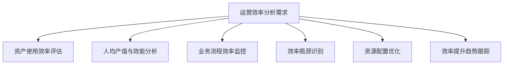
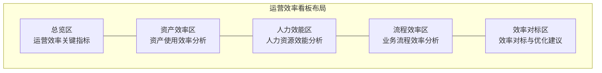

---
{"dg-publish":true,"permalink":"/08-财务专业/财务BI看板项目/设计稿/看板设计/高级分析模块/运营效率看板设计/"}
---

# 运营效率看板设计

#看板设计 #运营效率 #高级分析

运营效率看板是财务BI系统中的高级分析模块，聚焦于企业资源使用效率和业务流程效能的量化分析，帮助管理层发现效率瓶颈，优化资源配置，提高企业整体运营效率和生产力。本文档详细说明运营效率看板的设计方案。

## 一、设计目标

运营效率看板作为财务BI系统的高级分析模块，旨在提供企业运营效率的综合分析视图，帮助企业优化资源使用和提高流程效率。具体设计目标包括：

1. **资产效率分析**：评估企业各类资产的使用效率和回报状况
2. **人力效能评估**：分析人力资源投入产出比和效能状况
3. **流程效率监控**：评估业务流程的效率、周期和瓶颈
4. **资源优化决策**：为资源配置优化提供数据支持
5. **效率基准对比**：与行业标杆和历史最佳水平进行效率对比

## 二、用户需求分析

### 1. 主要用户群体

- **运营管理者**：需要了解和优化整体运营效率
- **财务分析师**：需要分析资源投入与产出的关系
- **业务部门负责人**：需要优化本部门的资源使用效率
- **人力资源管理者**：需要评估人力资源效能
- **流程优化团队**：需要识别和改进低效流程

### 2. 用户核心需求

### 3. 应用场景

- **资源配置决策**：为资源分配优化提供数据支持
- **效率改进项目**：识别效率提升机会并跟踪改进效果
- **部门绩效评估**：基于效率指标评估部门绩效
- **流程再造决策**：识别需要优化或再造的低效流程
- **成本控制分析**：从效率角度分析成本控制机会

## 三、看板布局设计

运营效率看板采用多维度组合设计，包括总览区、资产效率区、人力效能区、流程效率区和效率对标区。

### 1. 布局结构

### 2. 布局说明

- **总览区**：页面顶部，展示运营效率的核心指标和整体情况
- **资产效率区**：左上区域，展示企业各类资产的使用效率
- **人力效能区**：右上区域，展示人力资源投入与产出效率
- **流程效率区**：左下区域，分析业务流程的效率状况和瓶颈
- **效率对标区**：右下区域，提供与行业标杆和历史最佳的对比分析

## 四、核心组件设计

### 1. 总览区设计

总览区采用卡片设计，展示运营效率的核心指标，包括：

- **资产周转率卡片**：显示总资产周转率及其变化趋势
- **人均产值卡片**：显示员工人均创造的收入/利润
- **流程效率卡片**：显示关键业务流程的平均周期和效率
- **运营杠杆卡片**：显示固定成本与可变成本比率及杠杆效应
- **效率提升卡片**：显示总体效率提升幅度和主要贡献因素

### 2. 资产效率区设计

资产效率区采用多维分析视图，展示资产的使用效率：

- **资产周转分析**：
  - 条形图展示不同资产类别的周转率
  - 时间序列图展示周转率的历史变化
  - 雷达图对比不同业务单元的资产效率
  
- **资产回报分析**：
  - 散点图展示资产规模与回报率的关系
  - 矩阵图识别高效/低效资产
  - 瀑布图分析资产效率变化的贡献因素

### 3. 人力效能区设计

人力效能区聚焦于人力资源的效率分析：

- **人均产值分析**：
  - 条形图对比不同部门/团队的人均产值
  - 时间序列图展示人均产值的变化趋势
  - 散点图分析人力投入与产出的关系
  
- **人力结构效率**：
  - 饼图展示直接/间接人力比例
  - 堆叠图分析不同职能的人力构成
  - 雷达图评估人力结构的合理性

### 4. 流程效率区设计

流程效率区分析企业业务流程的效率状况：

- **流程周期分析**：
  - 甘特图展示关键流程的时间周期
  - 瀑布图分解流程各阶段的时间消耗
  - 趋势图监控流程周期的历史变化
  
- **流程瓶颈分析**：
  - 热力图识别流程中的瓶颈环节
  - 帕累托图展示延迟原因的分布
  - 漏斗图分析流程中的效率损失

### 5. 效率对标区设计

效率对标区提供效率比较和优化建议：

- **行业对标分析**：
  - 并列条形图对比企业与行业平均/最佳水平
  - 雷达图全方位对比多项效率指标
  - 百分位图显示企业在行业中的效率排名
  
- **效率优化建议**：
  - 矩阵图识别效率提升的优先领域
  - 树图展示效率提升的潜在收益
  - 时间序列预测实施优化后的效率变化

## 五、交互设计

### 1. 组织维度交互

- **组织层级选择器**：支持在企业、部门、团队等不同层级间切换
- **业务单元筛选**：支持按不同业务单元筛选效率数据
- **职能领域筛选**：支持按不同职能领域（生产、销售、管理等）筛选

### 2. 时间维度交互

- **时间范围选择器**：可选择查看不同时间范围的效率数据
- **周期比较功能**：支持不同时期效率水平的对比分析
- **趋势分析交互**：可在趋势图上选择特定时点查看详细数据

### 3. 资源维度交互

- **资源类型切换**：支持在资产、人力、资金等不同资源类型间切换
- **效率指标切换**：支持在不同效率指标（周转率、产出比等）间切换
- **详情钻取功能**：支持从汇总效率指标钻取到明细数据

## 六、高级功能设计

### 1. 效率归因分析

深入分析影响效率的关键因素：

- **多因素贡献度分析**：量化不同因素对效率变化的贡献
- **效率变化路径分析**：追踪效率变化的路径和关键转折点
- **结构性vs周期性影响分解**：区分结构性因素和周期性因素的影响

### 2. 效率优化模拟

通过模拟不同优化方案，评估对效率的潜在影响：

- **资源重配置模拟**：模拟不同资源分配方案的效率影响
- **流程改进模拟**：模拟流程优化对周期和效率的影响
- **结构调整模拟**：模拟组织结构调整对效率的影响

### 3. 预测性效率分析

基于历史数据和趋势预测未来效率表现：

- **效率趋势预测**：预测关键效率指标的未来走势
- **效率风险预警**：识别可能导致效率下降的风险因素
- **效率提升机会识别**：主动识别潜在的效率提升机会

## 七、视觉设计

### 1. 配色方案

运营效率看板采用专业高效的配色方案：

- **基础配色**：使用深青色调作为主色调，体现高效和专业
- **效率等级配色**：使用从红到绿的渐变色表示效率水平
- **对比分析配色**：使用互补色系表示基准与实际的对比
- **趋势变化配色**：使用不同饱和度表示趋势的强弱

### 2. 数据可视化标准

- **效率对比分析**：使用条形图、雷达图和热力图表示
- **时间序列分析**：使用折线图、面积图和甘特图表示
- **结构与分布**：使用饼图、树图和漏斗图表示
- **关系与影响**：使用散点图、气泡图和网络图表示

## 八、数据需求

### 1. 数据源

- **财务系统**：收入、成本、资产价值等财务数据
- **资产管理系统**：资产使用率、维护记录等数据
- **人力资源系统**：人员编制、工时、人工成本数据
- **业务系统**：订单流程、生产周期、服务时长等数据

### 2. 数据粒度

- **组织粒度**：企业级、部门级、团队级、个人级
- **时间粒度**：日、周、月、季、年数据
- **资源粒度**：资产类别、人员类型、流程环节
- **业务粒度**：产品线、项目、客户群体

### 3. 计算指标

- **资产效率指标**：总资产周转率、固定资产周转率、库存周转率
- **人力效率指标**：人均产值、人均利润、人力投入产出比
- **流程效率指标**：流程周期、完成率、流程中断率
- **综合效率指标**：运营杠杆、资本生产率、全要素生产率

## 九、实施建议

### 1. 分步实施策略

1. **第一阶段**：基础效率指标分析，包括总览和资产效率分析
2. **第二阶段**：人力效能分析和流程效率分析
3. **第三阶段**：效率对标分析和效率优化建议
4. **第四阶段**：高级功能，如效率归因分析和优化模拟

### 2. 关键成功因素

- **指标定义明确**：确保效率指标的定义清晰且前后一致
- **数据可靠完整**：保证用于效率计算的基础数据可靠和完整
- **分析维度合理**：选择适合企业特点的效率分析维度
- **整合业务理解**：将效率分析与业务实际相结合，避免脱离实际

### 3. 预期效果

- **识别效率瓶颈**：快速识别企业运营中的效率瓶颈
- **资源优化配置**：基于效率数据优化资源配置
- **持续改进流程**：推动业务流程的持续优化和改进
- **提升运营效能**：提高企业整体运营效能和竞争力

## 十、相关看板

- [财务概览看板](./财务概览看板设计.md)
- [成本分析看板](./成本分析看板设计.md)
- [预算执行看板](./预算执行看板设计.md)
- [资产负债看板](./资产负债看板设计.md)

---

**相关笔记**：
- [[财务BI看板模块规划\|财务BI看板模块规划]]
- [[效率指标体系设计\|效率指标体系设计]]
- [[流程效率分析框架\|流程效率分析框架]] 