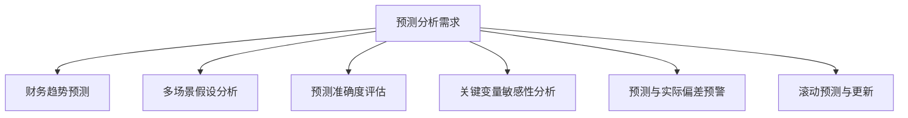

---
{"dg-publish":true,"permalink":"/08-财务专业/财务BI看板项目/设计稿/看板设计/高级分析模块/预测分析看板设计/"}
---

# 预测分析看板设计

#看板设计 #预测分析 #高级分析

预测分析看板是财务BI系统中的高级分析模块，运用统计模型和机器学习技术对企业关键财务指标进行前瞻性分析和预测，帮助管理层把握未来趋势，提前做好资源规划和风险应对，增强企业的前瞻性决策能力。本文档详细说明预测分析看板的设计方案。

## 一、设计目标

预测分析看板作为财务BI系统的高级分析模块，旨在提供多维度的财务预测能力，帮助企业科学预判未来发展趋势。具体设计目标包括：

1. **关键指标预测**：对收入、利润、现金流等关键财务指标进行科学预测
2. **多场景模拟**：支持不同假设条件下的财务情景模拟分析
3. **预测准确性评估**：分析历史预测的准确度，持续改进预测模型
4. **早期预警机制**：识别潜在的财务风险和偏离预期的趋势
5. **资源规划支持**：为基于预测的资源规划和预算编制提供决策支持

## 二、用户需求分析

### 1. 主要用户群体

- **财务规划分析师**：需要建立和使用预测模型进行财务规划
- **高级管理层**：需要了解企业未来发展趋势和可能的风险机会
- **业务部门负责人**：需要预测业务发展和资源需求
- **预算管理团队**：需要基于预测编制和调整预算
- **投资者关系团队**：需要向投资者解释预期财务表现

### 2. 用户核心需求

### 3. 应用场景

- **年度财务规划**：为年度规划提供基于数据的预测支持
- **季度业务展望**：定期更新季度和年度业务预期
- **投资者沟通**：为投资者关系活动提供可靠的财务展望
- **战略决策评估**：评估不同战略选择对未来财务的影响
- **危机管理规划**：模拟极端情况对企业财务的影响

## 三、看板布局设计

预测分析看板采用时间轴与多场景结合的设计方法，包括总览区、趋势预测区、情景模拟区、预测准确性区和关键驱动因素区。

### 1. 布局结构

### 2. 布局说明

- **总览区**：页面顶部，展示关键财务指标的当前值和预测值
- **趋势预测区**：左上区域，展示关键指标的历史趋势和未来预测
- **情景模拟区**：右上区域，提供不同假设条件下的预测结果
- **预测准确性区**：左下区域，评估历史预测的准确性和可靠度
- **关键驱动因素区**：右下区域，展示影响预测结果的关键变量和敏感性

## 四、核心组件设计

### 1. 总览区设计

总览区采用卡片设计，展示关键财务指标的预测概览，包括：

- **收入预测卡片**：显示年度/季度收入预测值和增长率
- **利润预测卡片**：显示年度/季度利润预测值和增长率
- **现金流预测卡片**：显示年度/季度现金流预测值和变化趋势
- **预测置信度卡片**：显示预测模型的置信水平和不确定性范围
- **预警指标卡片**：显示预测中需要关注的异常指标或趋势

### 2. 趋势预测区设计

趋势预测区采用时间序列图表，展示关键指标的历史和预测趋势：

- **多指标趋势预测**：
  - 折线图展示历史数据和未来预测值
  - 预测区域显示置信区间范围
  - 支持同比/环比/累计等多种视图切换
  
- **预测周期视图**：
  - 支持月度/季度/年度等不同预测周期
  - 支持短期/中期/长期预测视图切换
  - 显示不同时间段的预测准确度变化

### 3. 情景模拟区设计

情景模拟区提供多场景假设分析功能：

- **情景设置面板**：
  - 允许用户设置关键变量的不同假设值
  - 预设乐观/中性/保守等多种标准情景
  - 支持自定义情景参数设置
  
- **情景对比视图**：
  - 并列图表展示不同情景下的预测结果
  - 差异分析图表突出显示各情景间的关键差异
  - 蝴蝶图展示不同情景的概率分布

### 4. 预测准确性区设计

预测准确性区评估历史预测的准确度：

- **预测vs实际对比**：
  - 双线图对比历史预测值与实际值
  - 计算均方误差、平均偏差等技术指标
  - 展示不同时期的预测准确度变化
  
- **模型表现评估**：
  - 评估不同预测模型的表现
  - 对比简单与复杂模型的准确度
  - 提供模型调整和优化建议

### 5. 关键驱动因素区设计

关键驱动因素区分析影响预测的关键变量：

- **变量影响力分析**：
  - 瀑布图展示各变量对预测结果的贡献
  - 排序图表显示最具影响力的变量
  
- **敏感性分析**：
  - 展示关键变量变化对结果的敏感度
  - 提供敏感性热力图直观显示变量重要性
  - 支持交互式变量调整和实时影响分析

## 五、交互设计

### 1. 时间维度交互

- **预测范围调整**：可滑动调整预测的起始点和终止点
- **预测粒度切换**：支持在日/周/月/季/年等不同粒度间切换
- **历史长度调整**：可调整用于预测的历史数据长度

### 2. 预测模型交互

- **模型选择**：支持选择不同的预测算法和模型
- **参数调整**：允许调整预测模型的关键参数
- **特征变量选择**：可选择纳入预测模型的变量和特征

### 3. 情景模拟交互

- **参数调整器**：提供滑块调整关键假设参数
- **情景保存/加载**：支持保存和加载自定义情景设置
- **敏感度分析器**：允许设置变量变化范围进行敏感性测试

## 六、高级功能设计

### 1. 机器学习预测模型

应用先进的机器学习算法提高预测精度：

- **时间序列分析**：ARIMA、指数平滑、Prophet等时间序列模型
- **回归模型**：多元回归、岭回归、LASSO等算法应用
- **机器学习模型**：决策树、随机森林、神经网络等高级模型
- **集成模型**：组合多种预测模型以提高准确性和稳健性

### 2. 异常检测与预警

自动识别预测中的异常模式并提供预警：

- **异常值检测**：识别偏离预期的异常指标和趋势
- **突变点分析**：检测预测趋势中的关键转折点
- **阈值预警系统**：当预测指标超出阈值范围时发出警报
- **早期信号识别**：检测潜在问题的早期信号

### 3. 预测解释性分析

提供预测结果的可解释性分析，增强用户信任和决策支持：

- **特征重要性分析**：量化各变量对预测结果的贡献
- **预测路径追踪**：解释预测结果的形成路径
- **假设影响分析**：分析假设变化对预测结果的影响
- **历史相似期比较**：与历史类似情况进行模式对比

## 七、视觉设计

### 1. 配色方案

预测分析看板采用专业前瞻的配色方案：

- **基础配色**：使用深紫色调作为主色调，体现前瞻性和智能
- **时间区分配色**：历史数据、当前数据和预测数据使用不同色调
- **情景区分配色**：不同情景使用差异明显且有规律的色彩
- **置信度配色**：使用渐变色或透明度表示预测的置信度

### 2. 数据可视化标准

- **时间序列预测**：使用折线图、带置信区间的区域图
- **情景对比分析**：使用分组柱状图、雷达图、平行坐标图
- **敏感性与分布**：使用热力图、瀑布图、蝴蝶图、箱线图
- **准确度评估**：使用散点图、误差条形图、混淆矩阵可视化

## 八、数据需求

### 1. 数据源

- **历史财务数据**：至少3-5年的详细财务数据
- **外部经济指标**：GDP、通胀率、利率等宏观经济指标
- **行业指标数据**：行业增长率、市场规模等行业数据
- **业务运营数据**：销售数据、客户数据、生产数据等

### 2. 数据粒度

- **时间粒度**：日、周、月、季、年数据
- **业务粒度**：产品线、部门、区域、客户群体
- **财务粒度**：科目级、汇总级、报表级
- **预测粒度**：短期(1-3个月)、中期(1年)、长期(3-5年)

### 3. 计算指标

- **基础预测指标**：收入预测、利润预测、现金流预测
- **精度评估指标**：平均绝对误差(MAE)、均方根误差(RMSE)、平均百分比误差(MAPE)
- **情景分析指标**：不同情景下的关键指标预测
- **敏感度指标**：变量影响系数、弹性系数

## 九、实施建议

### 1. 分步实施策略

1. **第一阶段**：基础趋势预测，包括关键指标预测和简单模型
2. **第二阶段**：情景模拟功能和预测准确性评估
3. **第三阶段**：关键驱动因素分析和敏感性测试
4. **第四阶段**：高级功能，如机器学习模型和异常检测

### 2. 关键成功因素

- **数据质量保障**：确保历史数据的准确性、完整性和一致性
- **模型选择合理**：根据数据特性和预测需求选择合适的模型
- **定期模型评估**：持续评估和调整预测模型以提高准确性
- **商业理解融合**：将统计预测与业务理解相结合，避免纯机械预测

### 3. 预期效果

- **提高预测准确度**：通过科学模型提高财务预测的准确性
- **增强决策支持**：为战略和战术决策提供可靠的未来视图
- **提前识别风险**：及早发现潜在的财务风险和偏离趋势
- **优化资源规划**：基于可靠预测进行更精准的资源规划

## 十、相关看板

- [财务概览看板](./财务概览看板设计.md)
- [预算执行看板](./预算执行看板设计.md)
- [现金流分析看板](./现金流分析看板设计.md)
- [风险监控看板](风险监控看板设计.md)

---

**相关笔记**：
- [[08-财务专业/财务BI看板项目/设计稿/布局规划/财务BI看板模块规划\|财务BI看板模块规划]]
- [[财务预测模型选择指南\|财务预测模型选择指南]]
- [[多情景分析最佳实践\|多情景分析最佳实践]] 