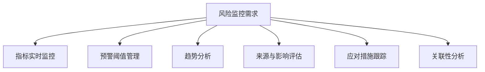
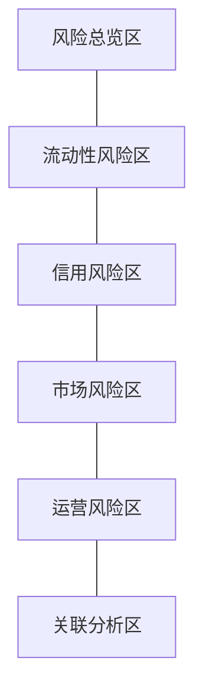

---
{"dg-publish":true,"permalink":"/08-财务专业/财务BI看板项目/设计稿/看板设计/高级分析模块/风险监控看板设计/"}
---

#看板设计 #风险监控 #高级分析

风险监控看板是财务BI系统中的高级分析模块，专注于全方位识别、量化、跟踪和管理企业面临的各类财务风险，帮助管理层及时发现潜在风险，采取预防和应对措施，增强企业的风险防范能力。本文档详细说明风险监控看板的设计方案。

## 设计目标

风险监控看板作为财务BI系统的高级分析模块，旨在构建全面的财务风险监控体系，帮助企业提前识别和有效管理各类风险。具体设计目标包括：

1. **风险全景视图**：提供企业面临的主要财务风险的全景概览
2. **预警系统构建**：建立多层次的风险预警机制，及时发现风险信号
3. **风险趋势监控**：跟踪风险指标的变化趋势和风险暴露程度
4. **关联风险分析**：分析不同风险之间的关联性和传导路径
5. **风险应对支持**：为风险管理决策提供数据支持和方案评估

## 用户需求分析

### 1. 主要用户群体

- **风险管理负责人**：需要全面掌握企业风险状况
- **财务总监/CFO**：需要了解财务风险及其对财务表现的影响
- **审计委员会**：需要监督企业风险管理的有效性
- **业务部门负责人**：需要了解业务相关的特定风险
- **合规与内控团队**：需要评估风险控制措施的有效性

### 2. 用户核心需求

### 3. 应用场景

- **季度风险审查**：定期评估企业面临的主要风险
- **风险事件应对**：在风险事件发生时提供决策支持
- **管理层风险报告**：为管理层会议提供风险状况报告
- **风险政策制定**：为风险管理政策的制定提供数据支持
- **年度风险规划**：帮助规划年度风险管理重点

## 看板布局设计

风险监控看板采用风险分类与预警级别相结合的布局方式，包括风险总览区、流动性风险区、信用风险区、市场风险区、运营风险区和风险关联分析区。

### 1. 布局结构

### 2. 布局说明

- **风险总览区**：页面顶部，展示综合风险状况和关键预警指标
- **流动性风险区**：左上区域，监控现金流和短期偿债能力相关风险
- **信用风险区**：右上区域，分析应收账款和客户信用相关风险
- **市场风险区**：左中区域，监测汇率、利率和商品价格相关风险
- **运营风险区**：右中区域，关注成本、效率和运营稳定性相关风险
- **风险关联分析区**：底部区域，分析各类风险之间的关联性和综合影响

## 核心组件设计

### 1. 风险总览区设计

风险总览区采用仪表盘和预警信号灯设计，提供直观的风险状况概览：

- **风险热力图**：
  - 矩阵式展示主要风险的严重程度和发生概率
  - 不同颜色代表不同风险等级（红-高风险，黄-中风险，绿-低风险）
  - 支持按风险类别、部门等维度筛选

- **预警指标总览**：
  - 信号灯面板展示各类预警指标状态
  - 按预警级别（紧急、警告、注意、正常）分组显示
  - 显示预警变化趋势（新增、持续、缓解）

- **风险评分卡片**：
  - 显示企业综合风险评分及变化趋势
  - 各类风险评分的雷达图对比
  - 与行业基准或历史平均的对比分析

### 2. 流动性风险区设计

流动性风险区监控企业的短期和长期偿债能力：

- **现金流预测指标**：
  - 未来30/60/90天现金流预测图表
  - 现金流入/流出缺口分析
  - 现金余额与最低安全水平对比

- **流动性比率监控**：
  - 流动比率、速动比率的趋势图
  - 营运资金变化趋势
  - 债务到期分布时间轴

- **流动性压力测试**：
  - 极端情况下的现金流状况模拟
  - 不同情景下的偿债能力评估
  - 关键资金风险点标识

### 3. 信用风险区设计

信用风险区分析客户信用和应收账款相关风险：

- **应收账款风险监控**：
  - 账龄分析图表，突出显示超期应收款
  - 坏账风险评估指标
  - 客户付款表现趋势分析

- **客户信用评估**：
  - 客户信用评分分布
  - 高风险客户集中度分析
  - 信用限额使用情况监控

- **行业信用风险暴露**：
  - 按行业分布的风险暴露热力图
  - 行业信用环境变化指标
  - 行业链条风险传导分析

### 4. 市场风险区设计

市场风险区监测外部市场因素带来的财务风险：

- **汇率风险监控**：
  - 关键汇率走势和波动监控
  - 外币资产/负债敞口分析
  - 汇率变动敏感性分析

- **利率风险评估**：
  - 利率走势监控和预测
  - 利率敏感性缺口分析
  - 债务结构和再融资风险评估

- **商品价格风险**：
  - 关键原材料/商品价格趋势
  - 价格波动对毛利率的影响分析
  - 采购/销售合同风险评估

### 5. 运营风险区设计

运营风险区关注企业内部运营相关的风险因素：

- **成本结构风险**：
  - 成本构成分析和异常波动检测
  - 固定成本/变动成本比例风险
  - 成本上升趋势预警

- **运营效率风险**：
  - 关键运营指标波动监控
  - 效率异常下降预警
  - 产能利用率风险评估

- **供应链风险**：
  - 供应商集中度风险分析
  - 供应中断风险评估
  - 库存风险监控（积压、短缺）

### 6. 风险关联分析区设计

风险关联分析区分析各类风险之间的关联性：

- **风险关联网络图**：
  - 网络图展示不同风险之间的关联性
  - 风险传导路径可视化
  - 风险节点的影响力和脆弱性分析

- **情景影响分析**：
  - 特定风险事件的连锁反应模拟
  - 关键风险因素对多个业务领域的影响分析
  - 综合风险冲击的财务影响评估

- **风险聚类分析**：
  - 风险类型的聚类分析
  - 识别需要整体管理的风险组合
  - 展示风险集中区域和分散区域

## 交互设计

### 1. 风险阈值设置交互

- **自定义阈值设置**：允许用户设定不同风险指标的预警阈值
- **阈值等级调整**：支持调整预警级别（紧急、警告、注意）的界定标准
- **阈值模板管理**：支持保存和加载不同的阈值设置模板

### 2. 风险深度分析交互

- **下钻分析**：从高层次风险指标下钻至更详细的风险来源
- **根因追踪**：交互式分析风险指标异常的根本原因
- **历史回溯**：查看风险指标的历史变动和预警记录

### 3. 情景模拟交互

- **风险冲击模拟**：模拟特定风险因素变化对企业的影响
- **综合压力测试**：设置多个风险因素同时变化的压力情景
- **应对措施评估**：评估不同风险应对措施的预期效果

## 高级功能设计

### 1. 智能风险预警系统

应用高级算法提升风险预警的准确性：

- **异常检测算法**：应用统计和机器学习方法检测异常模式
- **预警信号优先级排序**：根据严重性、紧急性和可控性排序风险信号
- **动态阈值调整**：基于历史数据和环境变化自动调整预警阈值
- **预警有效性验证**：跟踪历史预警的准确性，持续优化预警模型

### 2. 风险量化模型

对关键风险进行科学量化评估：

- **风险价值(VaR)计算**：计算市场风险的风险价值
- **信用风险评分模型**：客户信用风险的量化评分系统
- **财务危机预测模型**：基于财务指标的企业财务危机预警
- **综合风险评分体系**：将各类风险整合为统一的风险评分框架

### 3. 风险归因分析

分析风险的来源和影响因素：

- **风险拆解分析**：将复合风险拆解为基础风险因素
- **贡献因素分析**：识别对风险变化贡献最大的因素
- **敏感性和弹性测试**：分析关键变量对风险水平的影响
- **结构性风险分析**：识别业务结构中内在的风险因素

## 视觉设计

### 1. 配色方案

风险监控看板采用警示清晰的配色方案：

- **基础配色**：使用深蓝色作为主基调，体现专业性和可靠性
- **风险等级配色**：红色（高风险）、橙色（中高风险）、黄色（中风险）、绿色（低风险）
- **趋势变化配色**：上升风险（红色系）、下降风险（绿色系）、稳定风险（蓝色系）
- **阈值区间配色**：使用色带清晰区分不同风险区间

### 2. 数据可视化标准

- **风险热力图**：使用矩阵图和热力图展示风险分布
- **趋势监控**：使用带阈值线的面积图和折线图
- **预警信号**：使用仪表盘、信号灯和进度条指示器
- **关联分析**：使用网络图、相关性矩阵和桑基图

## 数据需求

### 1. 数据源

- **财务系统数据**：资产负债表、利润表、现金流量表等财务数据
- **业务系统数据**：销售、采购、库存、生产等业务数据
- **外部市场数据**：汇率、利率、商品价格、行业指数等
- **风险管理系统**：已识别风险、风险评估记录、历史风险事件
- **信用评级数据**：客户信用评级、行业信用环境评估

### 2. 数据粒度

- **时间粒度**：日、周、月、季度风险指标数据
- **业务粒度**：按部门、产品线、地区的风险分布
- **风险分类粒度**：主要风险类别、子类别、具体风险点
- **预警粒度**：不同等级预警、预警变化、预警持续时间

### 3. 计算指标

- **流动性风险指标**：流动比率、速动比率、现金流缺口率
- **信用风险指标**：坏账率、逾期率、信用集中度指数
- **市场风险指标**：风险价值(VaR)、波动率、敏感性系数
- **运营风险指标**：成本波动率、供应商风险指数、效率异常指数
- **综合风险指标**：风险评分、风险暴露度、风险变化率

## 实施建议

### 1. 分步实施策略

1. **第一阶段**：基础风险监控，包括关键风险指标监控和简单预警
2. **第二阶段**：分类风险深度分析，包括各风险区详细设计和实施
3. **第三阶段**：风险关联分析和高级预警功能
4. **第四阶段**：智能风险分析和风险量化模型实施

### 2. 关键成功因素

- **风险指标设计合理**：确保风险指标全面且具有预测性
- **阈值设置科学**：基于历史数据和行业标准设置合理的预警阈值
- **数据更新及时**：保证风险数据的及时性和准确性
- **用户参与度高**：让风险管理人员积极参与系统设计和使用

### 3. 预期效果

- **提高风险识别能力**：及早发现潜在风险信号
- **增强风险预测能力**：提前预判风险发展趋势
- **提升风险应对效率**：缩短风险发现到应对的响应时间
- **强化风险管理文化**：促进全企业的风险意识和管理能力

---

**相关笔记**：
- [[财务概览看板\|财务概览看板]]
- [[预测分析看板\|预测分析看板]]
- [[运营效率看板\|运营效率看板]]
- [[风险报告模板\|风险报告模板]]
- [[风险管理工作流工具\|风险管理工作流工具]] 