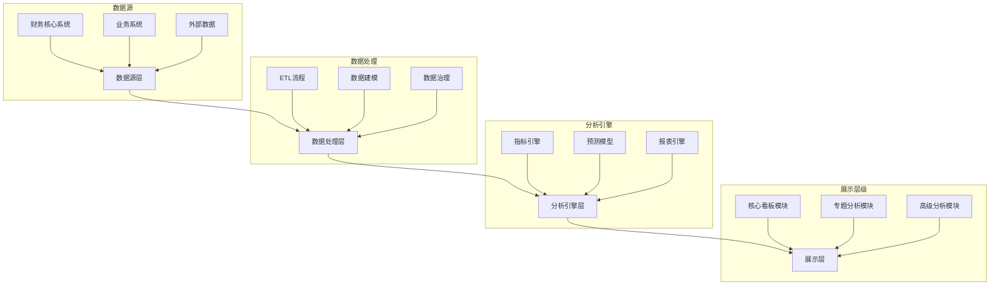
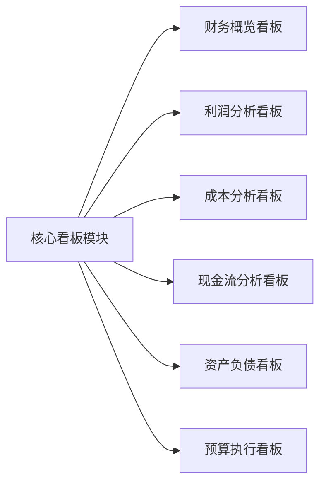
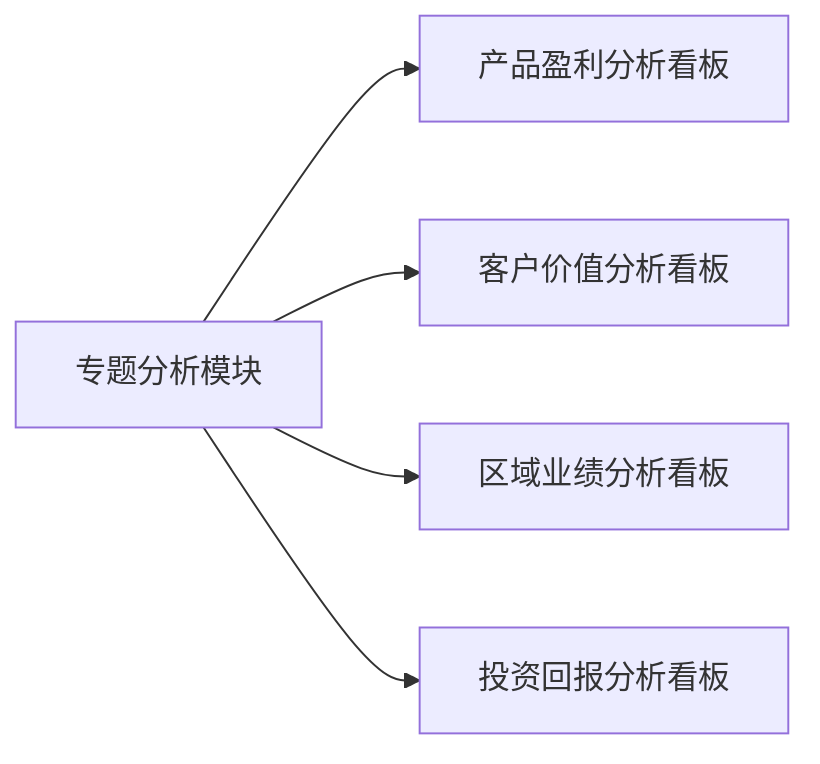
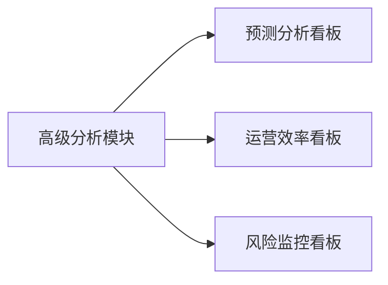
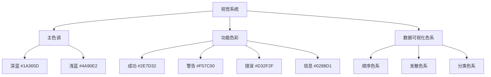
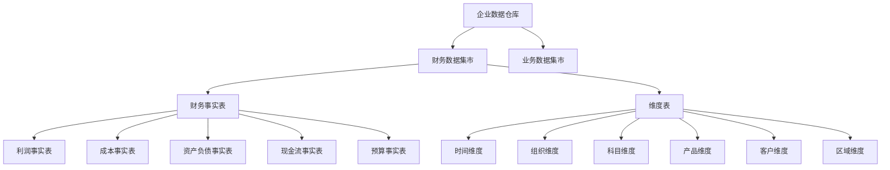
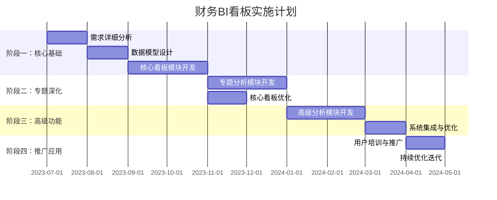

---
{"dg-publish":true,"dg-home":false,"permalink":"/08-财务专业/财务BI看板项目/设计稿/财务BI看板整体设计方案/","dgPassFrontmatter":true}
---

#财务BI #系统设计 #看板整合

本文档提供财务BI看板系统的整体设计方案，整合了各个模块的设计，形成一个完整的系统视图，为财务BI看板的实施和部署提供指导。

## 一、系统概述

### 1. 设计背景与目标

财务BI看板系统旨在通过数据可视化和分析工具，帮助企业管理层和财务团队实现对财务数据的多维度分析，提高决策效率，增强业务洞察力。系统整合企业各类财务数据源，构建多层次的分析模型，并以直观的可视化界面呈现关键财务指标和趋势。

### 2. 系统架构

### 3. 系统模块组成

财务BI看板系统由三大模块组成：

1. **核心看板模块**：提供企业基础财务状况的全面视图
2. **专题分析模块**：针对特定业务领域提供深度分析
3. **高级分析模块**：提供预测、效率分析和风险监控等高级功能

## 二、核心看板模块

### 1. 模块概述

核心看板模块是财务BI系统的基础部分，提供企业财务状况的全景视图，包含六个主要看板：

### 2. 各看板功能概述

- **财务概览看板**：提供企业整体财务状况的宏观视图，包括关键指标、趋势分析、结构分析和预警信息
- **利润分析看板**：深入分析企业盈利能力，包括利润构成、趋势变化、驱动因素和利润预测
- **成本分析看板**：全面分析企业成本结构，包括成本构成、趋势变化、异常波动和优化空间
- **现金流分析看板**：监控企业现金流状况，包括现金流量、流动性分析、现金周期和预测
- **资产负债看板**：分析企业资产负债状况，包括结构分析、比率分析、趋势变化和风险评估
- **预算执行看板**：跟踪企业预算执行情况，包括预算与实际对比、差异分析、调整建议和滚动预测

### 3. 核心看板联动关系

核心看板之间存在密切的联动关系，通过数据共享和跳转链接实现：

- 财务概览与各专项看板的双向跳转
- 利润与成本看板的关联分析
- 现金流与资产负债的协同视图
- 预算执行与其他看板的对比分析

## 三、专题分析模块

### 1. 模块概述

专题分析模块针对特定业务领域提供深度分析功能，满足特定用户群体的需求，包含四个主要看板：

### 2. 各看板功能概述

- **产品盈利分析看板**：多维度分析产品盈利能力，支持产品组合优化和定价策略
- **客户价值分析看板**：评估客户财务价值，支持客户关系管理和资源优化配置
- **区域业绩分析看板**：分析不同区域的财务表现，支持区域战略决策和资源分配
- **投资回报分析看板**：评估投资项目的回报和风险，支持投资决策和组合管理

### 3. 专题看板与核心看板的关联

专题分析看板与核心看板之间建立多种关联：

- 产品盈利分析与成本分析的数据共享
- 客户价值分析与利润分析的协同视图
- 区域业绩分析与预算执行的联动关系
- 投资回报分析与现金流分析的集成视图

## 四、高级分析模块

### 1. 模块概述

高级分析模块提供前瞻性分析和深度洞察，应用先进的分析技术，包含三个主要看板：

### 2. 各看板功能概述

- **预测分析看板**：运用统计和机器学习技术预测关键财务指标，支持多场景模拟和预警
- **运营效率看板**：分析企业资源使用效率和业务流程效能，识别优化机会
- **风险监控看板**：全方位监控企业财务风险，提供早期预警和应对建议

### 3. 高级分析与其他模块的融合

高级分析模块与其他模块深度融合：

- 预测分析对核心指标的前瞻性展望
- 运营效率与成本分析的协同优化
- 风险监控与财务概览的预警集成
- 高级分析见解对专题分析的补充

## 五、交互设计整体框架

### 1. 全局导航与信息架构

系统采用多层次导航结构，确保用户可以高效访问各个模块：

- 顶层导航：核心看板、专题分析、高级分析三大模块
- 二级导航：各模块下的具体看板
- 快捷导航：常用看板和个人收藏
- 面包屑导航：显示当前位置和路径

### 2. 一致性交互模式

所有看板采用一致的交互设计模式，降低学习成本：

- 统一的筛选与维度切换机制
- 一致的钻取和下钻操作流程
- 标准化的图表交互方式
- 通用的数据导出和分享功能

### 3. 个性化与适应性

系统提供灵活的个性化设置和适应性功能：

- 用户自定义看板布局
- 个人偏好设置（如默认视图、更新频率）
- 角色定制化视图
- 响应式设计适应不同设备

## 六、视觉设计规范

### 1. 设计系统与组件库

建立统一的设计系统，确保界面一致性和专业性：

- 组件库：卡片、图表、表格、控件等标准组件
- 网格系统：统一的布局网格和响应式规则
- 交互模式：标准的交互模式和动效规范
- 无障碍设计：符合可访问性标准的设计元素

### 2. 配色方案与品牌融合

### 3. 数据可视化规范

制定严格的数据可视化规范，确保信息清晰有效传达：

- 图表类型选择指南
- 数据密度与清晰度平衡原则
- 标签与注释使用规则
- 色彩编码与对比度标准

## 七、数据架构设计

### 1. 数据模型

设计星型模型和数据集市支持多维分析：

### 2. 指标体系

建立统一的指标体系，确保数据一致性和可比性：

- 基础财务指标：收入、成本、利润、现金流等核心指标
- 派生财务指标：各类财务比率和复合指标
- 业务关联指标：财务与业务的关联指标
- 预测与分析指标：趋势、预测和风险指标

### 3. 数据同步与更新策略

设计合理的数据更新机制，平衡及时性和系统负载：

- 实时数据流：关键指标实时更新
- 定时批处理：大部分数据定时更新
- 手动触发：特定分析和预测的手动更新
- 历史数据管理：历史数据的存储和访问策略

## 八、实施与部署计划

### 1. 分阶段实施策略

采用迭代增量的实施方法，按优先级分阶段推进：

### 2. 关键成功因素

识别实施过程中的关键成功因素：

- 高管支持与资源保障
- 数据质量与治理机制
- 用户参与和反馈循环
- 灵活适应业务变化
- 技术与业务融合

### 3. 验收与评估标准

建立明确的验收标准和持续评估机制：

- 功能完整性与正确性验收
- 性能与可用性测试
- 用户体验与采纳度评估
- 业务价值与ROI评估
- 持续改进机制

## 九、用户培训与支持

### 1. 角色化培训计划

根据不同用户角色设计针对性培训：

- 管理层：战略视图和关键指标解读
- 财务分析师：深度分析功能和建模
- 业务管理者：部门相关看板和决策应用
- 系统管理员：配置管理和维护技能

### 2. 知识资源库

建立全面的知识资源库支持用户学习：

- 操作手册与教程
- 指标解释文档
- 最佳实践案例
- 常见问题解答
- 视频演示和教学

### 3. 持续支持机制

设计多层次的用户支持体系：

- 在线帮助系统
- 用户社区和交流平台
- 技术支持响应流程
- 定期培训和更新通知
- 用户反馈收集与处理

## 十、系统优化与演进

### 1. 持续改进机制

建立系统持续优化的机制：

- 用户反馈收集渠道
- 使用数据分析和行为追踪
- 性能监控和优化
- 定期功能评审和规划

### 2. 技术演进路线

规划系统的技术演进方向：

- 高级分析能力增强
- 人工智能与机器学习集成
- 移动化和跨平台扩展
- 实时分析和决策支持强化

### 3. 业务价值扩展

探索系统业务价值的扩展方向：

- 与战略规划的深度融合
- 跨部门协同决策支持
- 外部数据源与洞察整合
- 预测性决策支持能力提升

## 附录

### 1. 技术架构详情

详细说明系统的技术架构选型：

- 前端框架：React/Vue.js + ECharts/D3.js
- 后端技术：Node.js/Java + RESTful API
- 数据处理：Apache Spark/Python数据处理
- 数据存储：关系型数据库 + 数据仓库

### 2. 相关标准与规范

列出系统遵循的标准和规范：

- 数据安全与隐私标准
- 企业会计准则
- 用户界面设计标准
- 系统性能与可用性标准

### 3. 术语表

提供系统相关术语解释，确保沟通一致性：

- 业务术语定义
- 技术术语解释
- 指标名称与计算方法
- 系统特定概念说明 