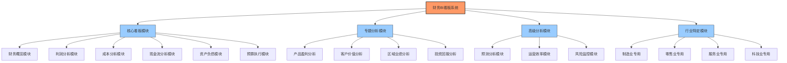
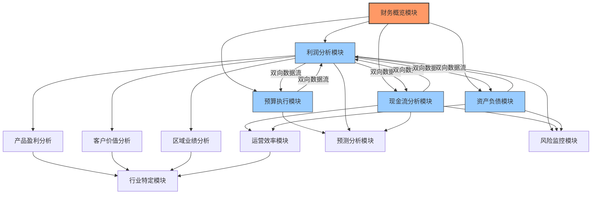
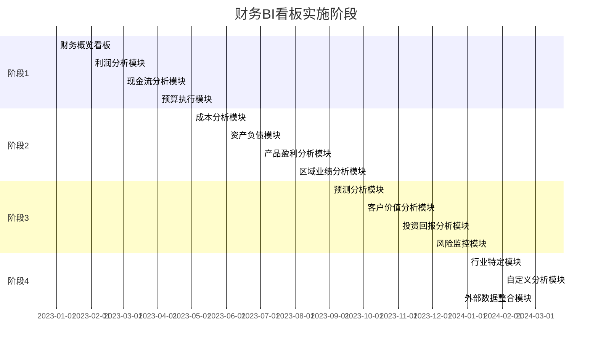
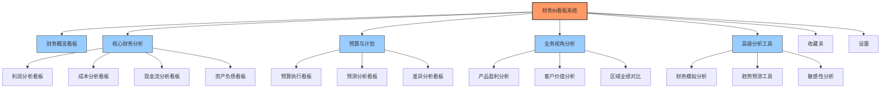

---
{"dg-publish":true,"permalink":"/08-财务专业/财务BI看板项目/设计稿/财务BI看板模块规划/"}
---

#布局设计 #模块规划 #BI看板

财务BI看板系统需要一套完整的模块结构，确保覆盖企业财务管理的各个方面。本文档提供全面的模块规划，指导系统开发与实施。

## 模块架构总览

财务BI看板系统的模块架构采用以下分层结构：

## 核心看板模块

### 1. 财务概览模块
- **财务概览看板**：企业财务状况总览，关键指标一目了然
- **高管决策驾驶舱**：为高层管理者定制的核心指标集中展示

### 2. 利润分析模块
- **利润结构看板**：收入-成本-费用结构分解
- **利润趋势看板**：历史利润变动与预测
- **利润驱动因素分析**：影响利润变化的关键因素

### 3. 成本分析模块
- **成本构成看板**：固定成本与变动成本分析
- **成本趋势看板**：成本随时间变化趋势
- **费用管控看板**：各类费用率监控与分析

### 4. 现金流分析模块
- **现金流概览看板**：经营/投资/筹资活动现金流分析
- **现金流预测看板**：未来现金流预测与规划
- **现金周转周期看板**：存货-应收-应付周转分析

### 5. 资产负债模块
- **资产结构看板**：流动资产与非流动资产分析
- **负债结构看板**：短期负债与长期负债分析
- **偿债能力看板**：流动比率、速动比率等指标分析

### 6. 预算执行模块
- **预算对比看板**：预算与实际对比分析
- **差异分析看板**：预算差异原因分解
- **预算调整看板**：预算执行监控与调整

## 专题分析模块

### 1. 产品盈利分析模块
- **产品毛利看板**：产品级别的毛利分析
- **产品组合看板**：产品结构与贡献分析
- **产品生命周期分析**：不同阶段产品的盈利状况

### 2. 客户价值分析模块
- **客户盈利看板**：客户盈利能力排名与分析
- **客户获取成本看板**：客户获取与维护成本分析
- **客户生命周期价值**：客户长期价值评估

### 3. 区域业绩分析模块
- **区域对比看板**：不同区域业绩对比
- **区域增长看板**：区域增长趋势分析
- **区域市场渗透看板**：市场份额与潜力分析

### 4. 投资回报分析模块
- **投资组合看板**：各项投资的回报分析
- **项目ROI看板**：项目投资回报率分析
- **资本支出分析**：资本支出效益评估

## 高级分析模块

### 1. 预测分析模块
- **趋势预测看板**：关键指标未来趋势预测
- **情景模拟看板**：多种假设情景下的财务预测
- **预测准确度看板**：历史预测准确性评估

### 2. 运营效率模块
- **资产效率看板**：资产利用效率分析
- **人均效能看板**：人力资源效率分析
- **流程效率看板**：业务流程效率分析

### 3. 风险监控模块
- **财务风险看板**：关键财务风险监控
- **流动性风险看板**：短期偿债风险监控
- **合规风险看板**：财务合规状况监控

## 行业特定模块

### 1. 制造业专用模块
- **生产成本分析**：产品成本结构与变动
- **库存周转分析**：原材料与成品库存管理
- **产能利用分析**：设备与产能利用效率

### 2. 零售业专用模块
- **门店业绩分析**：店铺业绩与效率对比
- **商品类别分析**：商品结构与盈利能力
- **促销效果分析**：促销活动投入产出比

### 3. 服务业专用模块
- **项目盈利分析**：服务项目的盈利能力
- **资源利用分析**：人力资源利用效率
- **客户满意度与盈利关联**：服务质量与盈利关系

### 4. 科技业专用模块
- **研发投入分析**：研发费用与产出分析
- **订阅收入分析**：SaaS模式下的订阅收入
- **客户获取成本回收**：CAC与LTV分析

## 模块间数据流与关系

财务BI看板各模块之间存在紧密的数据流转和逻辑关联：

## 实施优先级与阶段

财务BI看板系统的实施采用分阶段策略，确保核心功能优先上线并逐步扩展：

### 第一阶段实施内容
1. 财务概览看板
2. 利润分析模块
3. 现金流分析模块
4. 预算执行模块

### 第二阶段实施内容
1. 成本分析模块
2. 资产负债模块
3. 产品盈利分析模块
4. 区域业绩分析模块

### 第三阶段实施内容
1. 预测分析模块
2. 客户价值分析模块
3. 投资回报分析模块
4. 风险监控模块

### 第四阶段实施内容
1. 行业特定模块（根据企业所属行业选择）
2. 自定义分析模块
3. 外部数据整合模块

## 左侧导航设计

基于上述模块规划，系统左侧导航设计如下：

---

**相关笔记**：
- [[财务概览看板\|财务概览看板]]
- [[看板层级结构\|看板层级结构]]
- [[导航系统设计\|导航系统设计]] 