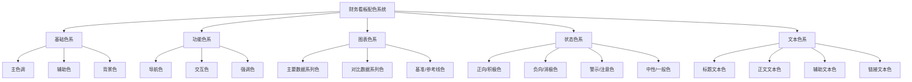
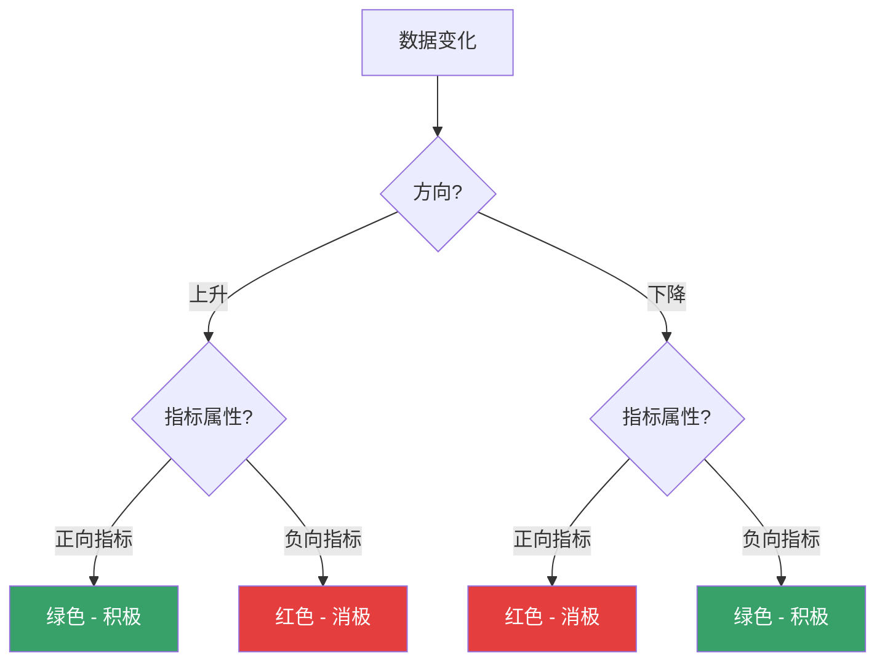

---
{"dg-publish":true,"dg-home":false,"permalink":"/08-财务专业/财务BI看板项目/设计稿/配色方案/财务看板配色系统/","dgPassFrontmatter":true}
---


#配色方案 #视觉设计 #看板设计

科学合理的配色系统是财务BI看板设计的关键要素，它不仅影响视觉美感，更直接关系到数据的可读性、层次感和专业性。本文档提供三套适用于财务看板的配色方案，并详细说明配色原则和应用指南。

## 配色设计原则

财务看板配色应遵循以下基本原则：

1. **专业性**：体现财务主题的严谨和专业
2. **功能性**：服务于数据可视化的清晰度和可读性
3. **一致性**：保持色彩使用的统一规范
4. **区分性**：通过色彩明确区分不同数据类型和状态
5. **无障碍**：考虑色盲友好设计，避免仅依靠颜色传递信息

## 配色系统组成

完整的财务看板配色系统包含以下组成部分：



## 方案一：专业蓝（Classic Blue）

适合传统金融机构、大型企业财务部门使用的专业沉稳配色方案。

### 基础色系

- **主色调**：深蓝色 `#1A365D`
- **辅助色**：
  - 浅蓝色 `#2B6CB0`
  - 灰蓝色 `#4A5568`
- **背景色**：
  - 主背景 `#F7FAFC`
  - 卡片背景 `#FFFFFF`
  - 分隔背景 `#EDF2F7`

### 功能色系

- **导航色**：暗蓝色 `#2D3748`
- **交互色**：亮蓝色 `#3182CE`
- **强调色**：深蓝色 `#2C5282`

### 图表色系

主要数据系列色（按优先级）：
1. `#2B6CB0` - 蓝色
2. `#4299E1` - 淡蓝色
3. `#63B3ED` - 天蓝色
4. `#90CDF4` - 浅蓝色
5. `#BEE3F8` - 极浅蓝色

对比数据系列色：
1. `#718096` - 灰色
2. `#A0AEC0` - 淡灰色
3. `#CBD5E0` - 浅灰色

基准/参考线色：`#4A5568` - 深灰色（虚线）

### 状态色系

- **正向/积极色**：绿色 `#38A169`
- **负向/消极色**：红色 `#E53E3E`
- **警示/注意色**：橙色 `#DD6B20`
- **中性/一般色**：灰色 `#718096`

### 文本色系

- **标题文本色**：深灰蓝 `#1A202C`
- **正文文本色**：灰色 `#4A5568`
- **辅助文本色**：浅灰色 `#718096`
- **链接文本色**：蓝色 `#3182CE`

### 应用示例

```
┌──────────────────────────────────────────────┐
│ [#1A365D]         财务概览看板               │
├──────────────────────────────────────────────┤
│                                              │
│ ┌──────────────┐ ┌──────────────┐            │
│ │ 收入: 1000万 │ │ 利润: 200万  │            │
│ │ [#38A169] ↑15%│ │ [#38A169] ↑8%│            │
│ └──────────────┘ └──────────────┘            │
│                                              │
│ ┌──────────────────────────────────────────┐ │
│ │      [#2B6CB0]                           │ │
│ │      ●━━━━━━━━━━━━━━━━━━●                │ │
│ │   [#4299E1]                              │ │
│ │   ●━━━━━━━━━━━●                          │ │
│ │                                          │ │
│ │           收入与利润趋势                 │ │
│ └──────────────────────────────────────────┘ │
│                                              │
└──────────────────────────────────────────────┘
```

## 方案二：现代活力（Vibrant Modern）

适合科技公司、创新型企业使用的现代活力配色方案。

### 基础色系

- **主色调**：紫色 `#553C9A`
- **辅助色**：
  - 蓝紫色 `#6B46C1`
  - 粉紫色 `#805AD5`
- **背景色**：
  - 主背景 `#F7FAFC`
  - 卡片背景 `#FFFFFF`
  - 分隔背景 `#EDF2F7`

### 功能色系

- **导航色**：深紫色 `#44337A`
- **交互色**：亮紫色 `#6B46C1`
- **强调色**：鲜紫色 `#9F7AEA`

### 图表色系

主要数据系列色（按优先级）：
1. `#6B46C1` - 紫色
2. `#805AD5` - 亮紫色
3. `#9F7AEA` - 浅紫色
4. `#B794F4` - 淡紫色
5. `#D6BCFA` - 极浅紫色

对比数据系列色：
1. `#4FD1C5` - 青绿色
2. `#38B2AC` - 浅绿色
3. `#319795` - 绿色

基准/参考线色：`#4A5568` - 深灰色（虚线）

### 状态色系

- **正向/积极色**：青绿色 `#38B2AC`
- **负向/消极色**：粉红色 `#ED64A6`
- **警示/注意色**：橙色 `#ED8936`
- **中性/一般色**：灰色 `#718096`

### 文本色系

- **标题文本色**：深紫色 `#322659`
- **正文文本色**：灰色 `#4A5568`
- **辅助文本色**：浅灰色 `#718096`
- **链接文本色**：紫色 `#6B46C1`

## 方案三：商业中性（Business Neutral）

适合需要保持高度专业性和通用性的大型企业集团使用。

### 基础色系

- **主色调**：墨绿色 `#276749`
- **辅助色**：
  - 深绿色 `#2F855A`
  - 灰绿色 `#48BB78`
- **背景色**：
  - 主背景 `#F7FAFC`
  - 卡片背景 `#FFFFFF`
  - 分隔背景 `#EDF2F7`

### 功能色系

- **导航色**：深灰色 `#2D3748`
- **交互色**：绿色 `#38A169`
- **强调色**：深绿色 `#276749`

### 图表色系

主要数据系列色（按优先级）：
1. `#276749` - 墨绿色
2. `#2F855A` - 深绿色
3. `#38A169` - 绿色
4. `#48BB78` - 浅绿色
5. `#68D391` - 淡绿色

对比数据系列色：
1. `#4A5568` - 深灰色
2. `#718096` - 灰色
3. `#A0AEC0` - 浅灰色

基准/参考线色：`#2D3748` - 深灰色（虚线）

### 状态色系

- **正向/积极色**：绿色 `#38A169`
- **负向/消极色**：红色 `#E53E3E`
- **警示/注意色**：黄色 `#D69E2E`
- **中性/一般色**：灰色 `#718096`

### 文本色系

- **标题文本色**：深灰色 `#1A202C`
- **正文文本色**：灰色 `#4A5568`
- **辅助文本色**：浅灰色 `#718096`
- **链接文本色**：绿色 `#38A169`

## 配色应用指南

### 1. 图表配色原则

- **一致性原则**：同一指标在不同图表中应使用相同颜色
- **对比度原则**：相邻数据序列应有足够的色彩对比度
- **关联性原则**：相关数据可使用同一色系的不同明度/饱和度
- **重要性原则**：重要数据使用高饱和度颜色，次要数据使用低饱和度颜色

### 2. 状态配色应用



- **正向指标**：值越高越好（如：收入、利润率）
- **负向指标**：值越低越好（如：成本、负债率）

### 3. 不同图表类型的配色建议

#### 折线图
- 主要指标：主色调
- 对比/次要指标：辅助色
- 目标/基准线：状态色或灰色虚线

#### 柱状图/条形图
- 单一系列：主色调
- 多系列：使用渐变色系（如从深到浅）
- 正负值：使用对应的状态色系

#### 饼图/环形图
- 使用同一色系不同明度
- 重要部分使用高饱和度
- 避免过多切片，将小分类合并为"其他"并使用中性色

#### 散点图
- 可使用色彩编码表示第三维数据
- 气泡大小可表示第四维数据
- 确保背景与点之间有足够对比度

### 4. 视觉层级配色

```
┌─────────────────────────────────────┐
│ [深色] 一级标题                      │
├─────────────────────────────────────┤
│ [中等深色] 二级标题                  │
│                                     │
│ [标准色] 正文内容和主要数据显示      │
│                                     │
│ [浅色] 辅助说明和次要信息            │
└─────────────────────────────────────┘
```

### 5. 配色无障碍设计

- **不仅依赖颜色**：同时使用形状、标签、图案等元素传递信息
- **高对比度**：确保文本与背景有足够对比度（WCAG AA标准要求至少4.5:1）
- **避免问题色组合**：红绿组合、蓝紫组合等是常见色盲难以区分的颜色
- **测试验证**：使用色盲模拟工具验证设计效果

## 关联应用模板

- [[财务概览看板\|财务概览看板]] - 应用专业蓝方案
- [[利润分析看板\|利润分析看板]] - 应用专业蓝方案
- [[现金流分析看板\|现金流分析看板]] - 应用商业中性方案

## 技术实现参考

### 1. CSS变量定义

```css
:root {
  /* 基础色系 - 专业蓝方案 */
  --color-primary: #1A365D;
  --color-secondary-1: #2B6CB0;
  --color-secondary-2: #4A5568;
  --color-bg-main: #F7FAFC;
  --color-bg-card: #FFFFFF;
  --color-bg-separator: #EDF2F7;
  
  /* 状态色系 */
  --color-positive: #38A169;
  --color-negative: #E53E3E;
  --color-warning: #DD6B20;
  --color-neutral: #718096;
  
  /* 文本色系 */
  --color-text-heading: #1A202C;
  --color-text-body: #4A5568;
  --color-text-muted: #718096;
  --color-text-link: #3182CE;
}
```

### 2. Power BI主题JSON

```json
{
  "name": "财务专业蓝",
  "dataColors": [
    "#2B6CB0", "#4299E1", "#63B3ED", "#90CDF4", "#BEE3F8",
    "#718096", "#A0AEC0", "#CBD5E0"
  ],
  "background": "#FFFFFF",
  "foreground": "#1A202C",
  "tableAccent": "#2B6CB0"
}
```

---

**相关笔记**：
- [[色彩心理学与财务数据\|色彩心理学与财务数据]]
- [[图表类型选择指南\|图表类型选择指南]]
- [[视觉层级设计\|视觉层级设计]] 