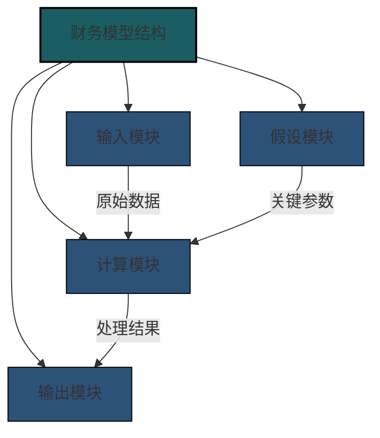
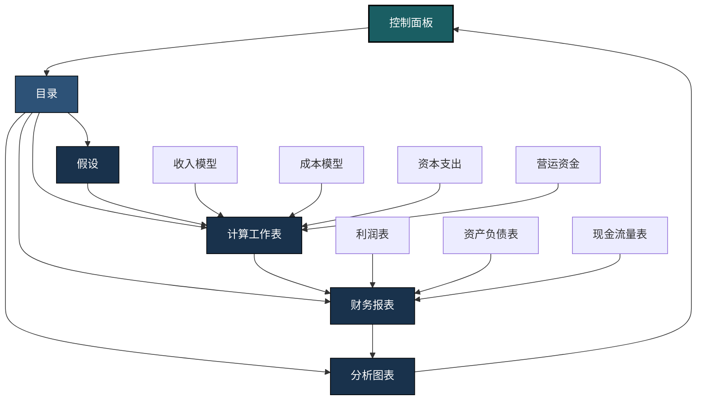
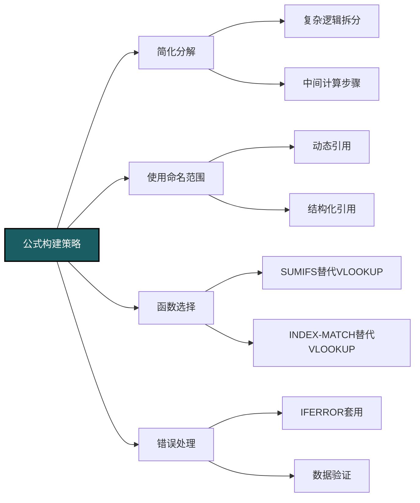
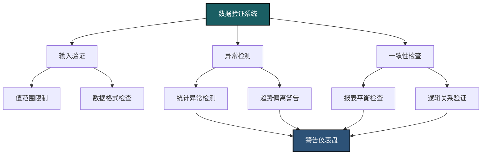
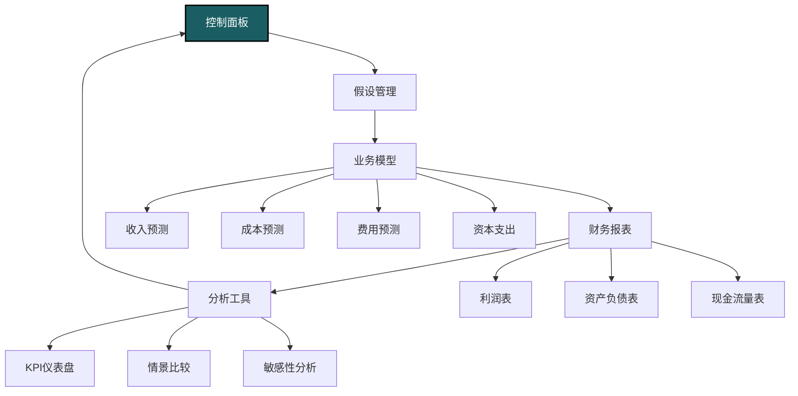

---
{"dg-publish":true,"dg-home":false,"permalink":"/08-财务专业/财务BP/notes/BP工具与模版/Excel模型构建/","dgPassFrontmatter":true}
---

# Excel模型构建

#财务BP #Excel #模型构建 #财务建模 #最佳实践

## 财务模型设计原则

财务模型是财务BP工作的核心工具，一个设计良好的Excel财务模型能够显著提升工作效率、降低错误风险并提供强大的分析支持。构建专业财务模型需遵循以下核心原则：

### 结构化设计原则

**模块化设计**：
- 将模型分割为明确的功能模块（输入、假设、计算、输出）
- 每个工作表承担单一、明确的功能
- 使用统一的工作表命名约定和颜色编码
- 保持工作簿结构的逻辑性和一致性

**数据流设计**：
- 建立清晰的单向数据流动路径
- 避免循环引用和复杂的跨表格引用
- 输入数据与计算逻辑严格分离
- 使用中间计算步骤增强可追踪性

**标准化布局**：
- 采用一致的单元格格式和样式
- 保持相似数据的排列方式一致
- 使用标准化的时间轴（列）和数据类别（行）
- 在所有工作表中保持一致的结构和导航方式

### 易用性与可维护性

**直观的用户界面**：
- 创建明确的导航系统（目录、超链接、控制面板）
- 设计清晰的数据输入区域
- 提供用户指南和操作说明
- 使用条件格式突出关键信息

**文档完备性**：
- 添加详细的模型说明和使用注释
- 对关键计算和假设提供解释
- 包含来源引用和方法说明
- 建立变更日志和版本控制

**错误防护机制**：
- 实施数据验证和输入检查
- 构建错误捕获和警告系统
- 建立一致性检查和平衡验证
- 保护公式和关键计算区域

### 分析与灵活性

**参数化设计**：
- 使用变量和假设表集中管理关键参数
- 避免在公式中嵌入硬编码数值
- 创建灵活的时间轴和预测期
- 设计可调整的报告视图

**情景与分析功能**：
- 构建内置的情景管理系统
- 创建敏感性分析功能
- 设计灵活的比较视图
- 提供动态汇总和下钻功能

**扩展性考虑**：
- 预留未来数据扩展空间
- 设计可重复使用的计算逻辑
- 考虑不同用户的需求
- 支持数据导入导出的便捷性

## 模型结构与布局

专业财务模型通常采用标准化的结构设计，确保信息组织合理、逻辑清晰且易于使用。

### 标准工作表结构

**控制面板工作表**：
- 模型概述和使用说明
- 主要导航链接和控制按钮
- 关键变量输入和调整区域
- 模型状态和版本信息

**目录工作表**：
- 工作簿结构概览
- 所有工作表的超链接及说明
- 颜色编码系统解释
- 快速访问主要功能区域

**假设工作表**：
- 集中存放所有模型假设
- 按类别组织（宏观、业务、财务等）
- 包含历史数据、基准值和预测值
- 提供假设来源和合理性说明

**计算工作表系列**：
- 收入模型（按产品、地区、渠道等）
- 成本模型（固定、变动、直接、间接等）
- 资本支出与折旧模型
- 营运资金计算
- 融资结构模型

**财务报表工作表**：
- 利润表（按月、季、年）
- 资产负债表（预测期各节点）
- 现金流量表（直接法或间接法）
- 支持性明细表

**分析工作表**：
- 财务比率分析
- 敏感性和情景分析
- 图表和可视化
- 差异和趋势分析

### 标准化布局元素

**时间轴设计**：
- 列表示时间（从左到右按时间顺序排列）
- 标准化列宽和时间单位
- 历史期和预测期明确区分
- 灵活的时间粒度设计（月、季、年）

**数据区域布局**：
- 行表示数据项目或类别
- 保持逻辑分组和层次结构
- 使用一致的缩进和格式表示层级
- 保留空行分隔不同数据组

**导航与控制元素**：
- 在所有工作表保持统一位置
- 使用超链接实现无缝导航
- 添加回到目录和控制面板的链接
- 设置冻结窗格和视图控制

### 视觉设计与格式化

**颜色编码系统**：
- 输入单元格：浅蓝色背景
- 假设单元格：浅黄色背景
- 计算单元格：白色背景
- 链接/公式引用：浅绿色背景
- 错误/警告指示：浅红色背景

**字体与格式标准**：
- 使用无衬线字体提高可读性（如Arial或Calibri）
- 标题使用加粗并增大字号
- 数值格式保持一致（小数位、千位分隔等）
- 货币单位明确且一致

**边框与分隔线使用**：
- 使用细边框分隔主要数据区域
- 关键汇总行使用双边框或底边框
- 避免过度使用边框造成视觉混乱
- 使用底纹或阴影突出重要信息

## 公式与函数应用

Excel公式是财务模型的核心，掌握高效的公式编写技巧可以显著提升模型的可靠性和性能。

### 公式设计最佳实践

**简化与分解原则**：
- 将复杂计算拆分为多个简单步骤
- 避免嵌套超过3-4层的复杂公式
- 使用辅助单元格存储中间结果
- 为公式添加注释说明计算逻辑

**公式一致性**：
- 在整列或整行中保持公式一致
- 使用相对/绝对引用的标准模式
- 确保可跨期复制的公式结构
- 建立模板公式并统一应用

**命名范围与表格**：
- 为常用数据区域创建有意义的名称
- 使用结构化引用代替单元格地址
- 建立动态扩展的命名范围
- 利用表格功能增强数据管理

### 核心函数应用

**数据查找和引用函数**：
- INDEX和MATCH组合（替代VLOOKUP提高性能和灵活性）
- OFFSET和INDIRECT（创建动态引用和区域）
- CHOOSE（基于条件选择不同数据源）
- XMATCH和XLOOKUP（Excel 365新函数，提供更强大的查找能力）

**逻辑和条件函数**：
- IF, IFS, SWITCH（条件逻辑处理）
- AND, OR, NOT（复合条件测试）
- SUMIFS, COUNTIFS, AVERAGEIFS（条件聚合）
- MAXIFS, MINIFS（条件极值查找）

**财务和日期函数**：
- NPV, IRR, XIRR（投资评估）
- PMT, RATE, NPER（贷款和融资分析）
- EOMONTH, EDATE（日期操作）
- WORKDAY, NETWORKDAYS（工作日计算）

**数据分析函数**：
- SUMPRODUCT（加权计算和多条件汇总）
- TREND, FORECAST（预测与趋势分析）
- AGGREGATE（多功能汇总，避免错误值）
- SUBTOTAL（动态汇总，可忽略筛选的行）

### 高级公式技巧

**数组公式应用**：
- 动态排名和前N项分析
- 多条件匹配和提取
- 自定义计算和转换
- 在Excel 365中使用新的动态数组函数

**公式嵌套最佳实践**：
- 从内到外构建嵌套逻辑
- 用新行和缩进提高复杂公式可读性
- 在可能的情况下使用辅助计算代替嵌套
- 优先使用专用函数代替复杂嵌套

**常见公式替代方案**：
- 用SUMIFS替代VLOOKUP+SUM组合
- 用SWITCH替代多层嵌套IF
- 用AGGREGATE替代忽略错误的聚合计算
- 用FILTER替代手动筛选和提取(Excel 365)

## 数据验证与检查

在财务模型中，确保数据准确性和完整性是最高优先级之一。有效的验证和检查机制可以降低错误风险。

### 内置验证机制

**数据输入验证**：
- 设置允许值列表和范围限制
- 添加自定义错误消息和提示
- 使用条件格式突出无效输入
- 创建输入手册和选择下拉列表

**一致性检查**：
- 资产负债表平衡验证
- 现金流量连续性检查
- 部分与总计一致性验证
- 跨报表逻辑关系验证

**对账和交叉校验**：
- 设计自动化对账工作表
- 创建关键数据交叉引用检查
- 建立历史趋势合理性检查
- 实施单位一致性验证

### 错误检测与异常提示

**错误识别公式**：
- 使用ISERROR和ISNA检测计算错误
- 创建自定义错误检测函数
- 对关键结果设置合理范围检查
- 建立复杂的逻辑一致性测试

**可视化警告系统**：
- 设计错误和警告指示器
- 使用条件格式自动标记异常值
- 创建控制面板汇总关键警告
- 设置数据质量评分和监控系统

**审计工具应用**：
- 使用Excel追踪箭头功能
- 创建公式依赖关系图
- 利用错误检查工具
- 建立自定义审计宏和函数

### 模型测试与评审

**情景测试**：
- 极端值测试（压力测试）
- 零值和空值处理测试
- 大幅变动响应测试
- 回归测试（确认修改不影响其他计算）

**系统性审查流程**：
- 创建审查清单和标准
- 实施同行评审机制
- 建立模型质量评分系统
- 记录已知问题和局限性

**响应性与性能测试**：
- 评估文件大小和计算速度
- 识别并优化慢速公式
- 测试大数据集的处理能力
- 确认模型在不同Excel版本的兼容性

## 模型优化与性能提升

随着财务模型的复杂性增加，优化性能变得尤为重要。以下技术可以显著提升Excel模型的运行效率。

### 计算优化技术

**减少公式复杂度**：
- 将复杂公式拆分为多个简单步骤
- 避免超长引用链和过度依赖
- 减少波动单元格（经常重新计算的单元格）
- 使用辅助计算区简化关键公式

**精简公式选择**：
- 用SUMIFS替代多个SUMIF
- 用INDEX-MATCH替代VLOOKUP提高性能
- 用AGGREGATE替代多个聚合函数
- 减少INDIRECT和波动引用的使用

**数组处理优化**：
- 限制传统数组公式的使用范围
- 利用Excel 365动态数组提高效率
- 优先使用表格和列计算代替大型数组
- 避免不必要的全列或全行引用

### 结构优化策略

**数据管理优化**：
- 减少不必要的数据复制
- 集中管理重复使用的数据
- 使用表格功能增强数据管理
- 清理未使用的命名范围和公式

**计算设置调整**：
- 使用手动计算模式控制计算时机
- 设置仅计算活动工作表
- 创建计算组和独立计算区域
- 使用数据表替代多次手动计算

**内存使用优化**：
- 减少格式化区域大小
- 清理未使用的单元格和区域
- 优化图表和条件格式使用
- 定期压缩和恢复文件大小

### 高级优化技术

**VBA和Power Query集成**：
- 使用VBA自动化重复任务
- 利用Power Query进行数据准备
- 创建自定义函数优化特定计算
- 仅在必要时使用宏增强功能

**外部数据连接优化**：
- 最小化外部数据连接数量
- 控制数据刷新时机和频率
- 使用查询而非完整数据集
- 实施增量更新而非完全刷新

**专业加载项应用**：
- 评估专业财务建模加载项
- 利用模型审计和优化工具
- 使用专用分析和报告加载项
- 考虑云端协作解决方案

## 案例研究：三年期财务规划模型

以下案例展示了一个中型制造企业三年期财务规划模型的构建过程和关键特点。

### 需求分析与设计

**业务背景**：
- 制造企业需要创建2023-2025三年战略财务规划
- 包含10个产品线和4个地区市场
- 需要评估三种增长情景和投资方案
- 管理层要求灵活的分析视角和决策支持

**设计目标**：
- 构建完整的财务三表预测
- 创建灵活的假设管理系统
- 实现多维度分析和情景规划
- 提供直观的管理层报告界面

### 模型实现

**模型结构设计**：
- 控制面板：情景选择与核心指标展示
- 假设表：关键驱动因素与预测参数
- 产品线预测：详细的产品收入与成本预测
- 运营费用：按功能划分的费用预测
- 资本计划：投资项目与折旧计算
- 融资模型：债务结构与还款计划
- 财务报表：完整的利润表、资产负债表与现金流量表
- 分析视图：KPI追踪、情景比较与敏感性分析

**核心功能特点**：
- 统一驱动因素系统：销量、价格、成本和投资
- 动态时间轴：支持月度、季度和年度视图切换
- 情景管理系统：基础、加速和保守三种情景
- 汇总与明细层级：支持不同层级的分析和汇报
- 敏感性分析：关键假设的影响评估
- 图表仪表盘：核心指标可视化展示

### 实施成果与经验

**成果与效益**：
- 预算周期缩短40%（从6周减至3.5周）
- 情景分析准备时间从3天减至1小时
- 经营决策响应速度显著提升
- 预测准确度提高15%（与实际结果比较）

**关键经验总结**：
- 投入足够时间进行需求梳理和设计
- 建立清晰的数据流和模块化结构
- 构建一致的命名和格式标准
- 设计有效的验证和检查机制
- 实施同行评审提高模型质量
- 提供充分的文档和使用培训

**常见挑战与解决方案**：
- 数据一致性：建立集中式数据管理系统
- 复杂计算：采用分步骤计算提高透明度
- 模型维护：建立版本控制和变更管理
- 用户采用：提供直观界面和必要培训
- 性能问题：定期优化和重构慢速区域 