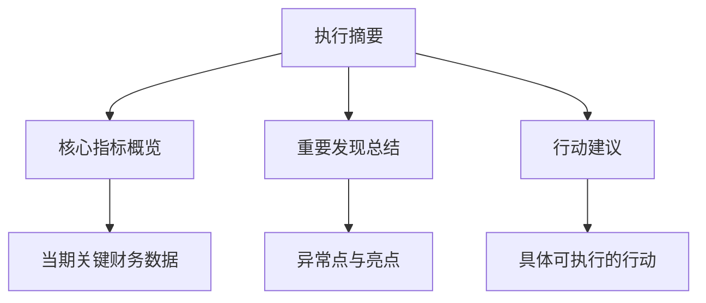

---
{"tags":["财务BP","管理层报告","数据可视化","财务分析","决策支持"],"aliases":["管理报告设计","财务报表设计","管理决策报告"],"created":"2024-03-20","publish":false,"dg-publish":true,"permalink":"/08-财务专业/财务BP/学习内容/BP工具与模板/BP展示技巧/管理层报告设计/","dgPassFrontmatter":true}
---

# 管理层报告设计

## 摘要

本文档详细介绍了面向管理层的财务报告设计方法、结构组成和最佳实践。管理层报告是连接财务部门与企业高层决策的重要纽带，通过科学的设计方法，可以提升报告的有效性，支持管理层做出更明智的决策。

## 一、管理层报告的基本原则

### 1. 目标导向原则
- **决策支持为核心**：报告内容直接支持管理决策需求
- **问题识别为导向**：突出显示异常和需要注意的问题
- **战略关联性**：与企业战略目标保持高度一致

### 2. 信息层次化原则
- **金字塔结构**：主要发现和结论在前，详细分析在后
- **重要性排序**：按照对决策影响程度排列信息
- **深度可选**：提供摘要与详情的双层结构

### 3. 清晰简洁原则
- **消除冗余信息**：仅保留对决策有实质影响的内容
- **直接表达**：使用直接、精确的语言表达
- **标准化格式**：使用一致的格式和术语

## 二、管理层报告的核心组成

### 1. 执行摘要
- **核心指标概览**：3-5个关键财务指标的当期表现
- **重要发现总结**：最关键的财务发现和警示
- **行动建议**：基于分析的具体行动建议

### 2. 财务绩效分析
- **收入分析**：按产品线/地区/客户分类的收入表现
- **成本分析**：成本结构变化与效率分析
- **利润分析**：毛利率、净利率等指标分析
- **同比与环比对比**：历史趋势分析与预算比对

### 3. 现金流与资金状况
- **现金流概览**：经营/投资/融资现金流状况
- **现金周期分析**：库存周转、应收账款、应付账款周期
- **资金需求预测**：短期和中期资金需求分析

### 4. 风险识别与管理
- **主要风险指标**：财务杠杆、流动性、汇率等风险指标
- **风险变化趋势**：风险指标的动态变化
- **风险缓解措施**：已采取和计划采取的风险管理措施

### 5. 前瞻性分析
- **预测更新**：对全年财务预测的调整
- **情景分析**：多种业务情景下的财务影响
- **战略影响**：财务表现对战略目标的支持或挑战

## 三、报告设计方法

### 1. 设计流程
1. **需求分析**：与管理层沟通，明确决策需求
2. **指标选择**：确定关键指标和分析维度
3. **结构设计**：设计报告整体结构和逻辑
4. **可视化设计**：选择合适的图表和展示方式
5. **测试与反馈**：收集使用反馈并不断优化

### 2. 可视化技巧
- **图表选择原则**
  - 趋势分析：折线图、区域图
  - 构成分析：饼图、堆叠柱状图
  - 对比分析：并列柱状图、雷达图
  - 关系分析：散点图、气泡图

- **色彩使用**
  - 使用一致的色彩系统
  - 红色表示负面、绿色表示正面变化
  - 使用对比色突出重点数据

- **数据标注**
  - 直接在图表上标注关键数字
  - 使用箭头和文本说明特殊点
  - 添加趋势线和预测线

### 3. 数字化工具应用
- **BI工具应用**：Power BI, Tableau等工具的应用
- **动态仪表盘**：实时数据更新的管理仪表盘
- **交互式报告**：允许管理层自主钻取数据

## 四、针对不同管理层级的报告定制

### 1. C级管理层报告特点
- **战略关联度高**：直接关联企业战略目标
- **高度综合**：跨部门、跨业务线的综合分析
- **前瞻性强**：更注重未来预测和战略影响

### 2. 中层管理者报告特点
- **业务单元聚焦**：专注于特定业务线或职能
- **执行监控**：侧重计划执行情况监控
- **问题解决导向**：更多关注具体问题的解决方案

### 3. 不同职能部门侧重点
- **销售管理层**：收入、市场份额、客户分析
- **运营管理层**：成本、效率、供应链分析
- **产品管理层**：产品线盈利能力、研发投入回报

## 五、常见问题与解决方案

### 1. 信息过载
- **问题**：报告包含过多细节，管理层难以抓住重点
- **解决方案**：
  - 采用层级式报告，先摘要后详情
  - 设定报告篇幅限制
  - 优先展示异常和警示信息

### 2. 可操作性不足
- **问题**：报告仅提供数据和分析，缺乏行动建议
- **解决方案**：
  - 每个分析部分增加"行动建议"板块
  - 使用"如果...那么..."的决策支持格式
  - 明确提出解决方案选项

### 3. 时效性挑战
- **问题**：报告生成周期长，影响决策时效
- **解决方案**：
  - 建立自动化报告生成系统
  - 分离"快报"和"详细分析"两种报告类型
  - 采用滚动更新方式提供关键指标

## 六、案例分析

### 案例一：科技企业季度管理报告改进

**背景**：某科技企业的季度管理报告过于繁复，包含50多页的详细数据，管理层难以从中获取决策支持。

**改进方法**：
1. 重新设计了一页式执行摘要，包含5个关键财务指标
2. 采用红黄绿灯系统标识各指标状态
3. 增加情景分析，预测不同业务策略的财务影响
4. 使用交互式仪表盘替代静态报告

**效果**：
- 管理层会议时间缩短30%
- 决策速度提升40%
- 跨部门协作改善，执行一致性提高

### 案例二：制造企业管理报告数字化转型

**背景**：传统制造企业依赖月度纸质财务报告，信息延迟严重。

**改进方法**：
1. 构建实时数据集成平台
2. 设计分层管理仪表盘，满足不同层级需求
3. 增加预警功能，自动提示异常情况
4. 添加历史对比和趋势预测功能

**效果**：
- 管理层反应时间从月度缩短至日度
- 库存周转率提升15%
- 现金管理效率提高，减少资金占用

## 七、最佳实践建议

### 1. 设计阶段
- 深入了解管理层的决策需求和使用习惯
- 设计前进行用户访谈，明确核心决策问题
- 建立标准报告模板，保持格式一致性

### 2. 内容组织
- 采用"所以-因为-建议"的逻辑结构
- 将分析洞见直接与管理行动挂钩
- 区分"需知"和"可知"的信息层次

### 3. 持续优化
- 定期收集管理层反馈意见
- 跟踪报告应用于决策的实际效果
- 根据业务环境变化调整报告内容

## 相关链接
- [[08-财务专业/财务BP/学习内容/BP工具与模板/BP展示技巧/有效沟通财务计划\|有效沟通财务计划]]
- [[08-财务专业/财务BP/学习内容/BP工具与模板/基础模板/BP预测工具表格库\|BP预测工具表格库]]
- [[可视化图表选择指南\|可视化图表选择指南]]

## 参考文献
1. 《管理报告设计：从数据到决策》，财务管理出版社，2021年
2. 《有效的财务沟通：弥合数据与决策的鸿沟》，企业管理出版社，2020年
3. Few, S.《信息仪表盘设计》，机械工业出版社，2018年
4. IBCS (International Business Communication Standards)《财务报告标准化指南》，2019年 