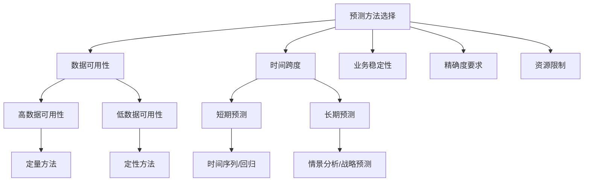
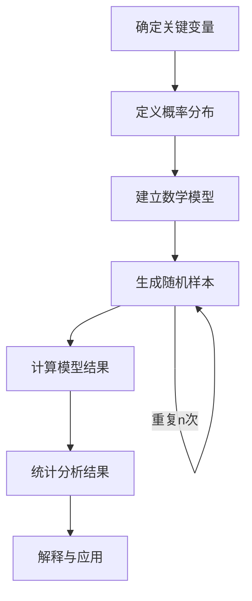
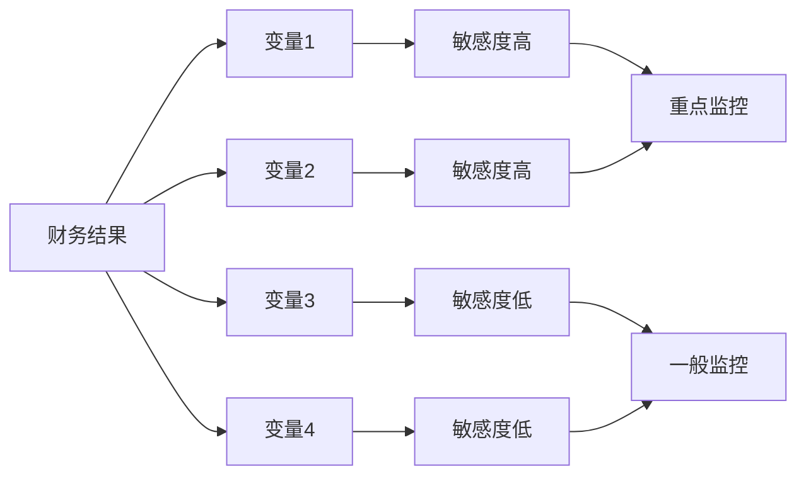
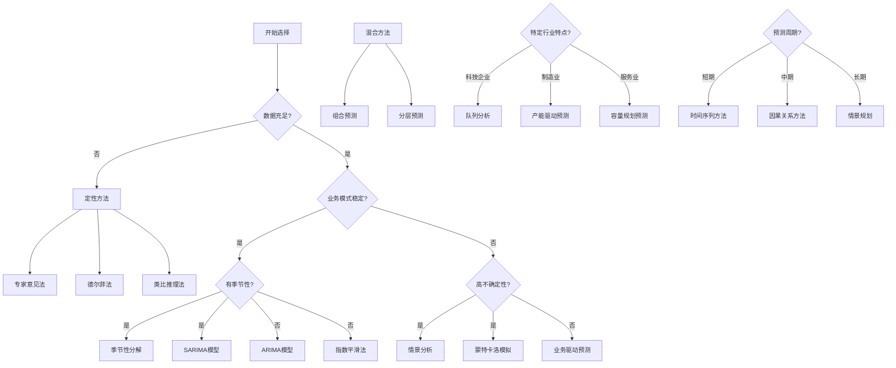

---
{"tags":["财务预测","方法论","BP工具"],"aliases":["财务预测方法","预测技术"],"created":"2023-05-15","dg-publish":true,"permalink":"/08-财务专业/财务BP/学习内容/BP工具与模板/基础模板/BP财务预测方法/","dgPassFrontmatter":true}
---

# BP财务预测方法

## 摘要
本文档提供了财务BP工作中常用的财务预测方法，包括定量与定性方法，帮助财务BP根据不同业务场景选择合适的预测技术，提高预测准确性和业务支持能力。

## 目录
1. [预测方法概述](#预测方法概述)
2. [时间序列预测方法](#时间序列预测方法)
3. [回归分析预测方法](#回归分析预测方法)
4. [基于业务驱动的预测方法](#基于业务驱动的预测方法)
5. [概率模型预测方法](#概率模型预测方法)
6. [情景分析预测方法](#情景分析预测方法)
7. [行业特定预测方法](#行业特定预测方法)
8. [组合预测技术](#组合预测技术)
9. [预测方法选择框架](#预测方法选择框架)
10. [案例分析](#案例分析)
11. [最佳实践](#最佳实践)

## 预测方法概述

财务预测是财务BP工作的核心，选择适当的预测方法对提高预测准确性至关重要。预测方法大致可分为以下几类：

1. **定量预测方法**：基于历史数据和数学模型的预测
   - 时间序列分析
   - 回归分析
   - 概率模型

2. **定性预测方法**：基于专家判断和业务洞察的预测
   - 德尔菲法
   - 专家意见法
   - 情景分析

3. **混合预测方法**：结合定量和定性的综合预测
   - 业务驱动预测
   - 组合预测技术

选择合适的预测方法需考虑以下因素：
- 数据可用性和质量
- 预测的时间跨度
- 业务环境的稳定性
- 预测的精确度要求
- 可用的资源和时间

不同预测方法的适用场景和优缺点将在后续章节详细阐述。 

## 时间序列预测方法

时间序列预测是基于历史数据的时间模式进行未来预测的方法，广泛应用于销售预测、成本预测和财务规划中。

### 移动平均法

**基本原理**：计算过去n个期间的平均值，用于预测下一期间的值。

**适用场景**：
- 数据波动较小的短期预测
- 季节性影响较弱的业务
- 需要快速得出初步预测结果

**计算方法**：
1. 简单移动平均法：$F_{t+1} = \frac{A_t + A_{t-1} + ... + A_{t-n+1}}{n}$
2. 加权移动平均法：$F_{t+1} = \sum_{i=0}^{n-1} w_i \times A_{t-i}$，其中$\sum w_i = 1$

**优点**：
- 计算简单，易于理解和实施
- 减少随机波动的影响

**缺点**：
- 不能捕捉趋势和季节性
- 对异常值敏感
- 预测精度有限

**使用示例**：
用于预测稳定产品的月度销售额或月度固定运营成本。

### 指数平滑法

**基本原理**：赋予近期数据更高权重，远期数据权重随时间指数衰减。

**适用场景**：
- 中短期财务预测
- 有轻微趋势但无明显季节性的数据
- 需要动态调整预测的业务

**计算方法**：
1. 单指数平滑：$F_{t+1} = \alpha A_t + (1-\alpha)F_t$，其中$\alpha$为平滑系数（0-1之间）
2. 双指数平滑（考虑趋势）：结合水平和趋势两个参数
3. 三指数平滑（Holt-Winters法，考虑趋势和季节性）

**优点**：
- 计算效率高，资源需求少
- 能够自动调整对新数据的反应速度
- 比移动平均法更能适应变化

**缺点**：
- 平滑参数的选择影响预测质量
- 对长期预测效果有限
- 对突发性变化反应较慢

**使用示例**：
用于零售业的需求预测、服务业的收入预测或经常性支出的成本预测。

### 季节性分解法

**基本原理**：将时间序列分解为趋势、季节性和随机波动三个组成部分。

**适用场景**：
- 具有明显季节性模式的业务数据
- 中长期财务预测
- 需要了解不同因素影响的深度分析

**计算方法**：
1. 计算移动平均消除季节性影响
2. 计算季节指数
3. 计算去季节化数据的趋势
4. 组合趋势和季节指数进行预测

**优点**：
- 能有效处理季节性业务
- 提供对业务模式的深入理解
- 预测准确度较高

**缺点**：
- 计算相对复杂
- 需要较长的历史数据
- 假设季节模式稳定

**使用示例**：
用于预测季节性强的业务，如假日销售预测、季节性成本变动或旅游业收入预测。

### ARIMA模型

**基本原理**：AutoRegressive Integrated Moving Average（自回归积分移动平均模型），结合自回归、差分和移动平均三个组件。

**适用场景**：
- 复杂的时间序列预测
- 具有趋势和季节性的数据
- 需要高精度预测的关键财务指标

**计算方法**：
1. 识别模型参数(p,d,q)
   - p：自回归项数
   - d：差分次数
   - q：移动平均项数
2. 参数估计和模型训练
3. 模型诊断和优化
4. 预测未来值

**优点**：
- 预测精度高
- 能处理复杂的时间序列
- 可构建季节性ARIMA模型(SARIMA)

**缺点**：
- 需要专业统计知识
- 计算复杂度高
- 需要充足的历史数据

**使用示例**：
用于企业月度销售额预测、重要成本项目预测或现金流预测。

## 回归分析预测方法

回归分析通过建立因变量(Y)与一个或多个自变量(X)之间的关系模型，用于预测和理解业务变量间的关联。

### 简单线性回归

**基本原理**：建立一个自变量(X)与因变量(Y)之间的线性关系。

**公式**: $Y = \beta_0 + \beta_1X + \varepsilon$

**适用场景**：
- 两个变量之间存在线性关系
- 初步分析业务驱动因素
- 简单财务关系的建模

**应用示例**：
- 销售额与营销支出的关系
- 产量与直接材料成本的关系
- 员工数量与人力成本的关系

**优点**：
- 简单直观，易于理解和解释
- 计算负担小，实施快速
- 结果易于可视化

**缺点**：
- 无法捕捉复杂的非线性关系
- 只能考虑单一自变量的影响
- 对异常值敏感

### 多元线性回归

**基本原理**：建立一个因变量与多个自变量之间的线性关系。

**公式**: $Y = \beta_0 + \beta_1X_1 + \beta_2X_2 + ... + \beta_nX_n + \varepsilon$

**适用场景**：
- 因变量受多个因素影响
- 需要综合分析多种业务驱动因素
- 复杂财务指标的预测

**应用示例**：
- 销售额与价格、营销支出、市场规模等多因素的关系
- 成本预测考虑产量、原材料价格、人工成本等因素
- 利润率与多种业务指标的关联分析

**优点**：
- 可以同时考虑多个因素的影响
- 能够识别各因素的相对重要性
- 预测精度通常高于简单回归

**缺点**：
- 变量间可能存在多重共线性
- 模型解释可能变得复杂
- 需要更多的数据支持

### 非线性回归

**基本原理**：建立自变量与因变量之间的非线性关系模型。

**常见形式**：
- 多项式回归: $Y = \beta_0 + \beta_1X + \beta_2X^2 + ... + \beta_nX^n + \varepsilon$
- 对数回归: $Y = \beta_0 + \beta_1\ln(X) + \varepsilon$
- 指数回归: $Y = \beta_0e^{\beta_1X} + \varepsilon$

**适用场景**：
- 业务变量间存在明显的非线性关系
- 建模收益递减或加速增长的情况
- 复杂业务模式的财务分析

**应用示例**：
- 营销支出与销售额的边际效益递减关系
- 产品生命周期内的销售增长模式
- 规模经济下的成本效益关系

**优点**：
- 能够捕捉复杂的非线性业务关系
- 适应更广泛的业务模式
- 在某些场景下预测精度显著提高

**缺点**：
- 模型选择和参数估计更为复杂
- 过拟合风险增加
- 解释性可能不如线性模型直观

### 预测效果评估

回归分析预测方法的效果评估通常使用以下指标：

1. **R平方(R²)**：解释变量能解释的因变量变异比例，越接近1效果越好
2. **调整R平方**：考虑自变量数量的R平方修正版
3. **均方误差(MSE)和均方根误差(RMSE)**：预测值与实际值差异的平方均值及其平方根
4. **平均绝对误差(MAE)**：预测值与实际值绝对差值的平均值
5. **F检验和t检验**：检验模型和参数的统计显著性

在应用回归分析进行财务预测时，还需关注以下事项：

- 数据的正态性和同方差性假设
- 自变量间的相关性分析
- 模型的稳健性和泛化能力
- 定期重新估计模型参数以适应业务变化

## 基于业务驱动的预测方法

基于业务驱动的预测方法结合了定量分析和业务洞察，使用业务活动指标作为预测的驱动因素，建立与财务结果的关联关系。

### 驱动因素分析法

**基本原理**：识别影响财务结果的关键业务驱动因素，建立驱动因素与财务指标之间的数学关系。

**适用场景**：
- 业务模式清晰且有明确驱动逻辑
- 需要提高预测精度并与业务计划协同
- 结合业务战略进行财务预测

**实施步骤**：
1. 识别关键业务驱动因素（如客户数、使用频率、价格等）
2. 建立驱动因素与财务指标的数学关系
3. 预测驱动因素的变化
4. 应用关系模型得出财务预测

**优点**：
- 与业务战略和运营计划紧密结合
- 提高预测的解释性和说服力
- 能够模拟不同业务决策的财务影响

**缺点**：
- 需要深入了解业务模式
- 驱动因素之间可能存在复杂关系
- 驱动因素本身也需要预测

**应用示例**：
- SaaS企业基于客户获取、留存率和客单价预测收入
- 零售企业基于客流量、转化率和客单价预测销售额
- 制造企业基于产能利用率和原材料价格预测成本

### 单位经济模型

**基本原理**：从单个用户、单位产品或单次交易的经济价值出发，结合数量预测整体财务表现。

**适用场景**：
- 业务模式以单位经济为核心的企业
- 需要从微观角度理解业务价值的分析
- 新产品或业务线的财务预测

**实施步骤**：
1. 定义业务的基本单元（如单个用户、单笔交易）
2. 分析单位收入和成本结构
3. 建立单位经济模型
4. 预测单位数量和单位经济变化
5. 得出整体财务预测

**关键指标**：
- 客户获取成本(CAC)
- 客户生命周期价值(LTV)
- 回收期
- 单位贡献毛利
- 规模效应系数

**优点**：
- 提供微观角度的业务理解
- 直观展示业务模式的经济可行性
- 便于分析不同客户群体或产品线的差异

**缺点**：
- 可能忽略规模效应
- 难以完全捕捉固定成本分摊
- 单位经济本身可能随时间变化

**应用示例**：
- 订阅制业务基于用户生命周期价值预测长期收入
- 电商平台基于单个订单经济学预测整体盈利
- 共享经济企业基于单次使用经济学预测业务发展

### 目标导向预测法

**基本原理**：从业务目标出发，反推实现目标所需的关键业务指标和行动计划，再转化为财务预测。

**适用场景**：
- 战略性财务规划
- 业绩目标设定与分解
- 资源配置决策支持

**实施步骤**：
1. 明确业务目标（如收入增长、利润率）
2. 分解为关键业务指标
3. 制定实现指标的行动计划
4. 将行动计划转化为财务预测
5. 评估可行性并调整

**优点**：
- 与战略目标紧密结合
- 促进跨部门协同
- 体现财务BP的业务伙伴角色

**缺点**：
- 目标可能不切实际
- 依赖准确的因果关系理解
- 实施结果存在不确定性

**应用示例**：
- 基于年度收入增长目标制定销售、营销和产品投入计划及预算
- 基于利润率目标规划成本优化措施和相应财务影响
- 基于现金流目标设计融资计划和资本支出预算

## 概率模型预测方法

概率模型预测方法引入不确定性考量，使预测结果不再是单一数值，而是考虑多种可能性及其概率分布，更符合真实商业环境的复杂性。

### 蒙特卡洛模拟

**基本原理**：基于关键变量的概率分布，通过大量随机抽样进行模拟，得出结果的概率分布。

**适用场景**：
- 高度不确定的业务环境
- 需要评估风险和不确定性的决策
- 复杂系统的财务影响分析

**实施步骤**：
1. 确定关键输入变量及其概率分布
2. 设定变量间的数学关系
3. 进行大量随机抽样模拟（通常数千次）
4. 分析结果分布，获取预期值、置信区间等

**优点**：
- 明确考虑不确定性
- 提供结果的概率分布而非单一值
- 能模拟复杂、非线性的系统

**缺点**：
- 计算复杂度高
- 分布假设的准确性影响结果
- 需要专业软件支持

**应用示例**：
- 新产品收入预测的风险分析
- 资本投资项目的财务回报评估
- 长期战略规划的多情境财务模拟

### 情景概率模型

**基本原理**：定义几个典型情景并分配概率，计算概率加权平均结果，并评估各情景的影响。

**适用场景**：
- 存在几个明确的可能结果
- 战略决策的财务影响分析
- 风险评估与敏感性分析

**实施步骤**：
1. 定义关键情景（通常3-5个，如乐观、中性、悲观）
2. 为每个情景分配概率
3. 针对每个情景进行财务预测
4. 计算概率加权平均值作为预期结果
5. 分析不同情景的风险与机会

**优点**：
- 直观易懂，易于沟通
- 提供清晰的风险评估
- 便于决策者理解极端情况

**缺点**：
- 情景数量有限，可能漏掉重要可能性
- 情景定义和概率分配存在主观性
- 无法完全捕捉连续性变化

**应用示例**：
- 新市场拓展的收入预测
- 外部经济环境变化对企业财务的影响评估
- 不同定价策略的财务影响预测

### 贝叶斯预测模型

**基本原理**：结合先验知识与新数据，不断更新预测模型，随着信息增加而提高预测准确性。

**适用场景**：
- 数据稀缺但有专家经验的领域
- 需要动态更新预测的业务
- 新产品或市场的财务预测

**实施步骤**：
1. 确立先验分布（基于历史数据或专家判断）
2. 收集新数据
3. 应用贝叶斯公式更新后验分布
4. 基于后验分布进行预测
5. 随新数据不断迭代

**优点**：
- 能结合定量分析与专家判断
- 随新信息动态调整预测
- 适用于数据有限的情况

**缺点**：
- 数学复杂度较高
- 需要合理的先验分布
- 结果解释可能不够直观

**应用示例**：
- 新产品销售预测随早期销售数据动态调整
- 市场需求预测结合市场调研与实际销售数据
- 新业务线的盈利能力预测随业务发展逐步细化

## 情景分析预测方法

情景分析是一种系统性探索未来可能发展路径的方法，通过分析不同情景下的财务表现，帮助企业制定更加灵活和具有适应性的财务战略。

### 基本情景分析

**基本原理**：定义多个可能的未来情景，针对每种情景进行财务预测，分析不同情景下的财务表现差异。

**适用场景**：
- 高度不确定的业务环境
- 战略规划和长期财务预测
- 重大决策的财务影响评估

**实施步骤**：
1. 确定关键不确定因素
2. 定义多个典型情景（通常3-5个）
3. 描述每个情景的具体特征
4. 针对每个情景进行财务预测
5. 分析不同情景下的财务结果差异

**优点**：
- 促进战略思考和准备
- 避免单一预测的局限性
- 提高对极端情况的应对能力

**缺点**：
- 情景设计存在主观性
- 难以确定每个情景的概率
- 工作量较大

**应用示例**：
- 市场环境变化（如经济衰退、行业变革）对财务的影响
- 重大投资决策的不同结果预测
- 新业务模式尝试的财务影响分析

### 敏感性分析

**基本原理**：分析关键变量变动对财务结果的影响程度，确定最敏感的变量和关键阈值。

**适用场景**：
- 需要识别关键风险因素
- 预算编制和财务模型构建
- 决策支持和风险评估

**实施步骤**：
1. 确定关键输入变量
2. 设定变量变动范围
3. 分析变量变动对结果的影响
4. 识别最敏感的变量和临界值
5. 针对敏感变量制定监控和应对措施

**分析方法**：
- 单因素敏感性分析：一次仅改变一个变量
- 多因素敏感性分析：同时改变多个变量
- 极值分析：测试极端情况下的结果

**优点**：
- 直观展示关键风险因素
- 帮助设定监控指标
- 提高决策者对风险的理解

**缺点**：
- 难以分析变量间的相互作用
- 变量变动范围设定存在主观性
- 可能无法完全模拟实际复杂情况

**应用示例**：
- 分析价格变动、销量变动对毛利率的影响
- 评估成本结构变化对盈利能力的影响
- 测试汇率波动对国际业务财务业绩的影响

### 压力测试

**基本原理**：测试企业在极端不利条件下的财务表现，评估企业的抗风险能力和承压能力。

**适用场景**：
- 风险管理和财务韧性评估
- 资金流动性规划
- 战略决策风险评估

**实施步骤**：
1. 设计极端不利情景
2. 进行财务预测和模拟
3. 评估关键财务指标表现
4. 识别潜在的财务风险和脆弱点
5. 制定应急预案和风险缓解措施

**关注指标**：
- 现金流充足性
- 资金流动性
- 盈利能力韧性
- 资产负债结构稳定性
- 融资能力和财务灵活性

**优点**：
- 提前识别潜在风险
- 增强企业应对极端情况的准备
- 提高企业财务决策的稳健性

**缺点**：
- 极端情景设计困难
- 可能过于保守影响业务发展
- 难以模拟复杂的系统性风险

**应用示例**：
- 评估收入大幅下滑情况下的现金流状况
- 测试融资渠道关闭时的资金承压能力
- 分析关键客户流失对业务可持续性的影响

## 行业特定预测方法

不同行业具有独特的业务模式和财务特点，需要针对行业特性采用定制化的预测方法。本节介绍几个主要行业的特定预测方法。

### 科技企业预测方法

**行业特点**：
- 快速增长和高不确定性
- 订阅收入模式普遍
- 高研发投入和低边际成本
- 网络效应和规模经济明显

**关键预测方法**：

1. **队列分析法**
   - **原理**：按时间划分用户群组，追踪其获取、活跃和留存情况
   - **适用场景**：订阅制业务、SaaS企业
   - **关键指标**：获客成本(CAC)、用户留存率、客户生命周期价值(LTV)

2. **产品指标驱动法**
   - **原理**：基于产品使用指标预测收入和增长
   - **适用场景**：平台型企业、应用开发商
   - **关键指标**：日/月活跃用户(DAU/MAU)、用户参与度、转化率

3. **增长分解法**
   - **原理**：将增长分解为用户数量、使用频率和变现能力三个维度
   - **适用场景**：互联网企业、移动应用
   - **公式**：收入 = 用户数 × 使用频率 × 单次使用收入

**预测挑战与对策**：
- **挑战**：高增长率预测难度大
  - **对策**：使用非线性增长模型，参考行业对标
- **挑战**：产品市场前景不确定
  - **对策**：采用多情景预测，动态调整
- **挑战**：技术迭代快速
  - **对策**：缩短预测周期，保持更新频率

### 制造业预测方法

**行业特点**：
- 资本密集型
- 产能受限制约
- 供应链复杂性
- 周期性明显

**关键预测方法**：

1. **产能利用率法**
   - **原理**：基于产能利用率预测产量和成本
   - **适用场景**：大型制造企业，资本密集型行业
   - **公式**：产量 = 产能 × 利用率，单位成本 = 固定成本/产量 + 变动成本

2. **物料需求计划(MRP)法**
   - **原理**：基于销售预测，逐级分解为原材料需求计划
   - **适用场景**：多级生产制造业
   - **关键步骤**：销售预测 → 生产计划 → 物料需求计划 → 成本预测

3. **采购价格指数法**
   - **原理**：基于原材料价格指数预测成本变动
   - **适用场景**：原材料成本占比高的制造业
   - **关键参数**：原材料价格指数、消耗系数、采购周期

**预测挑战与对策**：
- **挑战**：供应链复杂性和不确定性
  - **对策**：采用情景分析和敏感性分析
- **挑战**：宏观经济周期波动
  - **对策**：引入经济指标作为预测参数
- **挑战**：固定成本分摊难度
  - **对策**：基于产能利用率调整单位成本预测

### 服务业预测方法

**行业特点**：
- 人力资源密集
- 同时性和无形性
- 容量受限
- 需求波动性大

**关键预测方法**：

1. **服务容量规划法**
   - **原理**：基于服务容量和利用率预测收入和成本
   - **适用场景**：酒店、航空等容量受限服务业
   - **公式**：收入 = 容量 × 利用率 × 平均价格

2. **客流量预测法**
   - **原理**：预测客流量，结合转化率和客单价预测收入
   - **适用场景**：零售、餐饮等客流导向型服务业
   - **公式**：收入 = 客流量 × 转化率 × 客单价

3. **人力资源驱动法**
   - **原理**：基于人员效能和成本预测业务表现
   - **适用场景**：咨询、法律等专业服务
   - **公式**：收入 = 专业人员数量 × 计费率 × 计费小时数

**预测挑战与对策**：
- **挑战**：高固定成本与需求波动
  - **对策**：采用收益管理技术，调整定价和容量
- **挑战**：服务质量与成本的平衡
  - **对策**：建立服务水平与成本的关系模型
- **挑战**：人员效能差异大
  - **对策**：细分人员类型，分别预测效能

## 组合预测技术

单一预测方法往往无法完全捕捉复杂业务环境中的所有因素，组合预测技术通过结合多种方法的优势，提高整体预测精度和可靠性。

### 加权平均法

**基本原理**：综合多种方法的预测结果，根据各方法的可靠性分配权重，计算加权平均值。

**计算公式**：$F = \sum_{i=1}^{n} w_i \times F_i$，其中$F_i$是第i种方法的预测结果，$w_i$是其权重，且$\sum w_i = 1$

**权重确定方法**：
- 基于历史预测准确性
- 基于方法适用性评估
- 基于专家判断
- 使用优化算法求解最优权重

**优点**：
- 平滑单一方法的极端预测
- 综合利用多种信息源
- 提高整体预测稳定性

**缺点**：
- 权重确定存在主观性
- 计算复杂度增加
- 可能稀释最佳单一方法的优势

**应用示例**：
- 结合时间序列方法和回归分析预测销售额
- 融合专家预测和统计模型预测新产品表现
- 综合不同数据来源的市场增长预测

### 分层预测法

**基本原理**：将预测任务分解为不同层次或组成部分，对每个部分应用最适合的方法，然后整合结果。

**实施步骤**：
1. 将预测目标分解为有逻辑关联的组成部分
2. 为每个部分选择最适合的预测方法
3. 分别进行预测
4. 根据组成关系整合结果

**分层维度**：
- 产品/服务类别
- 地理区域
- 客户细分
- 时间周期（月、季、年）
- 业务单元

**优点**：
- 匹配不同业务组成部分的特性
- 降低整体预测的复杂度
- 提供更详细的分析洞察

**缺点**：
- 需要更多资源和时间
- 各部分间的相互影响可能被忽略
- 整合过程可能引入新的误差

**应用示例**：
- 按产品线分别预测后整合企业总收入
- 分区域预测市场需求后汇总
- 按客户群体分别预测并整合总体表现

### 贝叶斯模型平均

**基本原理**：从概率角度结合多个模型，考虑模型的不确定性和先验信息。

**数学表示**：后验分布 = $\sum_{i=1}^{n} p(M_i|D) \times p(y|M_i,D)$，其中$p(M_i|D)$是给定数据下模型$M_i$的后验概率。

**实施步骤**：
1. 构建多个候选预测模型
2. 计算每个模型的后验概率
3. 基于后验概率计算预测的加权平均
4. 分析结果的不确定性

**优点**：
- 自然处理模型不确定性
- 提供预测的概率分布
- 能自动调整不同模型的重要性

**缺点**：
- 计算复杂
- 需要专业统计知识
- 先验分布的选择可能影响结果

**应用示例**：
- 综合多种时间序列模型预测需求波动
- 结合不同回归模型预测财务表现
- 融合多种经济指标模型预测市场增长

### 集成学习方法

**基本原理**：借鉴机器学习中的集成方法，通过组合多个基础预测模型以获得更稳健的预测。

**常见技术**：
- **Bagging**：使用不同数据样本训练同一类型模型后综合
- **Boosting**：序列化训练模型，每个新模型关注前一个模型的预测误差
- **Stacking**：使用元模型组合基础模型的预测结果

**适用场景**：
- 数据量大且复杂的预测任务
- 对预测精度要求高的关键指标
- 具备数据科学能力的团队

**优点**：
- 显著提高预测精度
- 减少过拟合风险
- 提高预测的鲁棒性

**缺点**：
- 实施技术门槛高
- 计算资源需求大
- 解释性降低

**应用示例**：
- 多模型预测复杂产品的需求
- 结合多种算法预测客户流失风险
- 精确预测高价值客户的终身价值

## 预测方法选择框架

面对众多预测方法，财务BP需要一个系统性框架来选择最适合特定业务场景的方法。本节提供预测方法选择的结构化思路。

### 选择因素分析

**数据因素**：
- **数据可用性**：历史数据的丰富程度决定是否可采用数据密集型方法
- **数据质量**：数据的准确性、完整性和一致性影响模型可靠性
- **数据更新频率**：决定预测更新的可行性和适当周期

**业务因素**：
- **业务模式复杂性**：简单业务适合基础方法，复杂业务需要多维度分析
- **预测重要性**：关键决策依据的预测需要更精细的方法和验证
- **业务成熟度**：成熟业务有稳定模式，而新兴业务需要更多定性分析

**环境因素**：
- **市场不确定性**：高不确定环境适合情景分析和概率方法
- **变革速度**：快速变化的环境需要灵活和动态调整的预测方法
- **竞争态势**：激烈竞争需要更多考虑竞争反应的预测框架

**资源因素**：
- **时间限制**：紧迫时间下选择简单直接的方法
- **技术能力**：团队技术水平决定可实施的方法复杂度
- **工具支持**：现有工具和系统支持的方法更易实施

### 方法筛选决策树

### 方法评估与优化

选择预测方法后，需要通过持续评估和优化提高预测质量。

**评估指标**：
- **准确性指标**：MAPE(平均绝对百分比误差)、RMSE(均方根误差)
- **偏差指标**：ME(平均误差)、MPE(平均百分比误差)
- **跟踪信号**：预测偏差的累积和与平均绝对偏差的比率

**持续优化流程**：
1. 定期回顾预测准确性
2. 分析预测误差模式
3. 调整预测方法或参数
4. 引入新数据和新方法
5. 建立预测准确性反馈机制

**多方法比较实验**：
- 使用相同历史数据测试不同方法
- 采用滚动预测验证方法稳定性
- 评估方法复杂度与准确性的平衡

## 案例分析

### 案例一：订阅制SaaS企业收入预测

**业务背景**：
- 一家提供企业协作软件的SaaS公司
- 主要收入来源是基于用户数的订阅费
- 具有较高的客户获取成本和客户终身价值
- 需要准确预测收入以支持融资和运营决策

**预测挑战**：
- 客户获取和流失率波动
- 不同价格套餐的转换率不稳定
- 国际业务拓展带来的不确定性
- 竞争加剧可能影响定价能力

**预测方法选择**：
1. **主要方法**：队列分析法
   - 按月度将客户分群，追踪每个队列的留存和升级情况
   - 构建新客户获取与营销支出的关系模型
   - 预测各队列的客户生命周期价值

2. **辅助方法**：
   - 时间序列分析：预测季节性趋势
   - 情景分析：评估不同市场条件下的表现

**实施步骤**：
1. 历史数据准备：收集24个月的客户获取、留存和转换数据
2. 队列模型构建：分析每个月度队列的行为模式
3. 参数估计：计算平均留存率、升级率和降级率
4. 收入预测：基于现有队列和预计新增队列预测未来收入
5. 敏感性分析：评估关键参数变动对预测的影响

**预测效果**：
- 准确度：6个月预测的MAPE为5.2%，优于之前的12.4%
- 深度洞察：识别不同客户群体的价值贡献差异
- 决策支持：为营销预算分配提供数据支持
- 风险管理：提前识别客户流失风险并采取措施

**关键经验**：
- SaaS业务预测需要关注用户生命周期全过程
- 细分客户群体可显著提高预测准确性
- 定期更新留存曲线对长期预测至关重要
- 结合产品使用数据可提前预测客户流失风险

### 案例二：制造企业成本与现金流预测

**业务背景**：
- 一家中型电子设备制造企业
- 生产过程包含多个阶段和复杂供应链
- 原材料价格波动较大，占总成本的65%
- 生产周期长，库存管理压力大

**预测挑战**：
- 原材料价格波动带来的成本不确定性
- 产能利用率变化影响单位固定成本分摊
- 复杂的供应链导致现金流时间差异
- 新产品导入对成本结构的影响

**预测方法选择**：
1. **主要方法**：物料需求计划(MRP)与回归分析结合
   - 基于销售预测分解为物料需求计划
   - 使用回归分析建立原材料价格与成本的关系
   - 基于产能利用率预测固定成本分摊

2. **辅助方法**：
   - 蒙特卡洛模拟：分析原材料价格波动影响
   - 情景分析：评估不同产能利用率的财务影响

**实施步骤**：
1. 成本结构分析：分解固定成本与变动成本
2. 材料价格模型：建立主要原材料价格预测模型
3. 产能规划：基于销售预测制定产能利用计划
4. 成本模拟：结合物料计划和价格预测模拟成本
5. 现金流映射：将成本预测转化为现金流预测

**预测效果**：
- 成本预测准确度提高30%
- 现金流预测偏差从±15%降至±7%
- 为原材料采购决策提供数据支持
- 优化产能规划，提高资源利用效率

**关键经验**：
- 制造业成本预测需要细化到物料和工序层面
- 原材料价格预测是提高准确性的关键
- 产能利用率与单位成本的关系需要动态调整
- 结合供应链周期对现金流预测至关重要

## 最佳实践

以下最佳实践总结了财务BP在预测工作中的经验教训和成功方法，帮助提高预测的准确性、可信度和实用性。

### 预测准备与规划

**预测目标明确化**：
- 明确预测的具体用途和决策场景
- 定义预测的时间跨度和精度要求
- 确定关键预测指标和次要指标

**数据准备优化**：
- 建立数据质量评估机制
- 规范化历史数据收集流程
- 确保数据口径一致和可比性
- 建立数据更新和维护机制

**预测资源配置**：
- 根据预测重要性分配相应资源
- 组建跨部门预测团队
- 提供必要的技术工具和培训
- 确保足够的时间进行分析和验证

### 预测方法应用

**多方法综合运用**：
- 针对同一预测目标使用多种方法
- 根据历史准确性分配不同方法的权重
- 结合定量分析与定性判断
- 适当运用组合预测技术

**层级预测协调**：
- 确保不同层级预测结果的一致性
- 自上而下与自下而上预测结果的协调
- 建立预测差异分析和调整机制
- 明确预测责任与权限边界

**预测迭代更新**：
- 建立预测滚动更新机制
- 根据新信息及时调整预测结果
- 分析预测准确性并持续改进方法
- 建立预测版本管理机制

### 预测结果沟通

**结果可视化与解释**：
- 采用直观的图表展示预测结果
- 提供预测背后的关键驱动因素解释
- 明确说明预测的不确定性和风险
- 针对不同受众调整展示方式

**预测偏差管理**：
- 坦诚沟通预测限制和假设条件
- 避免在预测中加入过度乐观或保守偏见
- 明确区分预测目标与业绩承诺
- 防止预测被用于不恰当的决策场景

**跨部门协作**：
- 与业务部门共同制定关键假设
- 获取业务一线的及时反馈
- 定期举行预测评审会议
- 建立预测信息共享平台

### 预测流程管理

**标准化预测流程**：
- 建立结构化的预测工作流程
- 明确各环节的时间节点和责任人
- 制定预测输入和输出的标准格式
- 建立预测文档管理体系

**预测准确性跟踪**：
- 系统记录预测与实际的差异
- 分析预测偏差的原因和模式
- 基于历史准确性调整预测方法
- 建立预测准确性评估报告机制

**持续学习与改进**：
- 定期回顾预测经验和教训
- 跟踪前沿预测方法和工具
- 进行跨行业和标杆企业学习
- 建立预测知识库和最佳实践分享

### 数字化工具应用

**预测工具选择**：
- 根据需求选择合适的预测软件工具
- 整合预测系统与现有数据系统
- 评估自动化预测工具的适用性
- 平衡工具复杂度与易用性

**数据驱动决策文化**：
- 培养基于预测的决策习惯
- 提高组织对数据分析的重视
- 建立预测与决策的闭环反馈
- 促进预测在战略规划中的应用

**预测技术创新**：
- 探索机器学习在预测中的应用
- 尝试新的数据源和分析方法
- 建立预测技术评估框架
- 与专业机构和学术界保持交流

## 总结与展望

财务预测是财务BP工作的关键环节，直接影响企业的决策质量和业务绩效。本文档系统梳理了各类预测方法及其适用场景，旨在帮助财务BP根据不同业务需求选择合适的预测技术，提高预测的准确性和实用性。

随着数据可用性的提高和分析技术的进步，财务预测方法将不断创新和发展。未来的发展趋势包括：

1. **预测的实时化和动态调整**：从周期性预测向持续预测转变，适应快速变化的市场环境
2. **预测的智能化和自动化**：人工智能和机器学习技术在预测中的广泛应用
3. **预测的整合化和协同化**：跨职能、跨系统的预测整合，提高组织预测一致性
4. **预测的场景化和决策导向**：更加注重预测的实际决策价值和可操作性
5. **预测的风险量化和韧性评估**：强化对不确定性的管理和企业韧性的评估

财务BP应持续提升预测能力，将先进的预测方法与深入的业务理解相结合，为企业创造更大的价值。

## 参考文献

1. Armstrong, J. S. (2001). *Principles of Forecasting: A Handbook for Researchers and Practitioners*. Springer.
2. Makridakis, S., Wheelwright, S. C., & Hyndman, R. J. (2008). *Forecasting: Methods and Applications*. John Wiley & Sons.
3. Hyndman, R. J., & Athanasopoulos, G. (2018). *Forecasting: Principles and Practice*. OTexts.
4. Box, G. E. P., Jenkins, G. M., Reinsel, G. C., & Ljung, G. M. (2015). *Time Series Analysis: Forecasting and Control*. John Wiley & Sons.
5. Chambers, J. C., Mullick, S. K., & Smith, D. D. (1971). *How to Choose the Right Forecasting Technique*. Harvard Business Review, 49(4), 45-74.
6. 张维义 (2018). *企业财务预测与分析*. 中国财政经济出版社.
7. 李明 (2019). *数据驱动的财务决策：预测技术与应用*. 中国人民大学出版社.
8. 王伟 (2020). *财务预测方法与实务*. 清华大学出版社.
9. 中国企业财务管理协会 (2021). *财务业务伙伴最佳实践指南*.
10. 林志勇 (2022). *行业财务预测模型构建与应用*. 经济科学出版社.

## 相关链接

- [BP预测工具表格库](../BP预测工具表格库.md)
- [BP沟通与汇报技巧](../../BP能力提升/BP沟通与汇报技巧.md)
- [BP数据分析方法](../../BP能力提升/BP数据分析方法.md)
- [行业BP特点概览](../../行业应用/行业BP特点概览.md)
