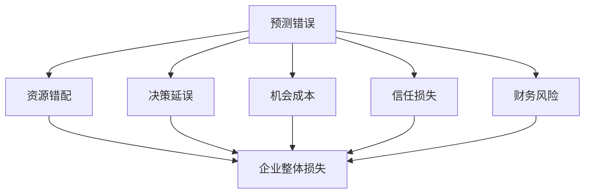
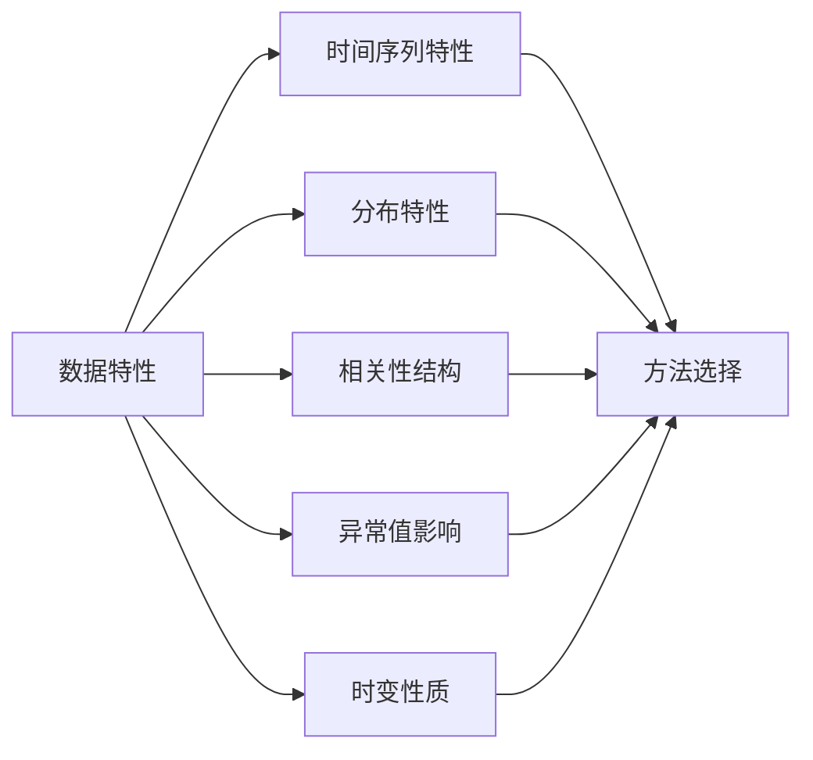
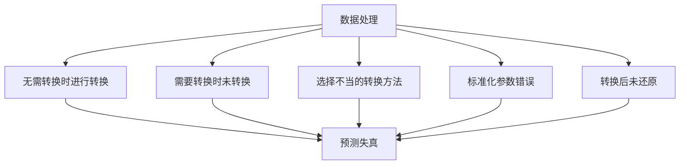
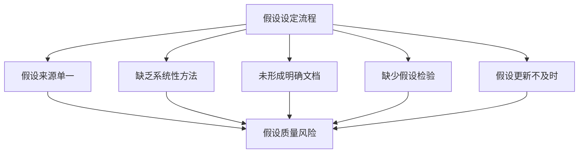
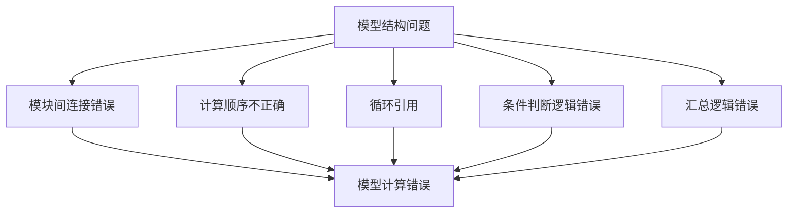
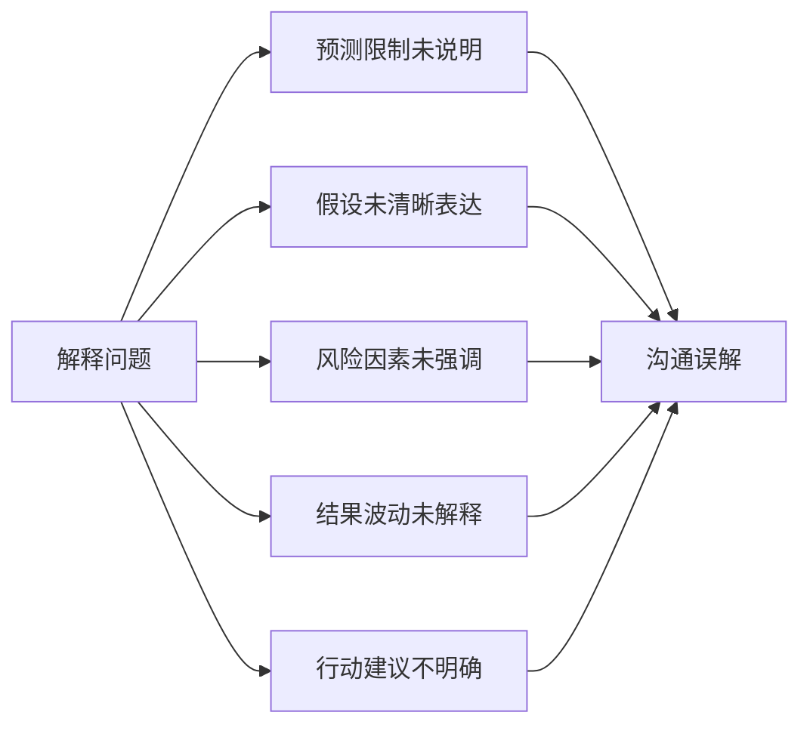
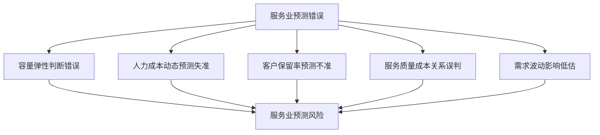
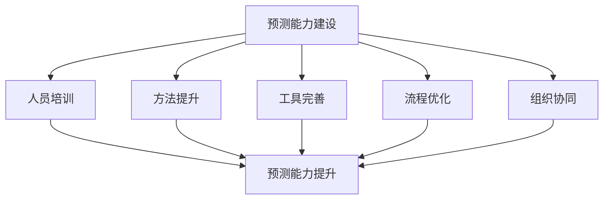

---
{"tags":["财务BP","财务预测","错误分析","风险规避","预测优化"],"aliases":["预测陷阱","预测优化指南","预测质量提升"],"created":"2024-03-20","dg-publish":true,"permalink":"/08-财务专业/财务BP/学习内容/BP工具与模板/财务建模/常见预测错误及规避/","dgPassFrontmatter":true}
---

# 常见预测错误及规避

> [!abstract] 概述
> 本文档系统分析财务BP预测过程中的常见错误类型、产生原因及规避方法。高质量的财务预测是企业决策的重要基础，而识别和避免预测错误则是提升预测质量的关键途径。本文从方法选择、数据处理、假设设定、执行过程和沟通应用等环节，详细剖析预测工作中容易出现的问题，并提供针对性的解决方案和实践指导。

## 一、预测错误的分类与影响

### 1. 预测错误的主要类型
- **系统性错误**：预测结果持续高估或低估实际值
- **随机性错误**：不可预见因素导致的临时性偏差
- **假设错误**：基础假设与实际情况不符
- **方法错误**：选择了不适合的预测方法
- **执行错误**：预测过程中的操作和计算错误

### 2. 预测错误的影响范围

### 3. 错误严重程度评估
- **偏差量级**：预测值与实际值的差距大小
- **影响范围**：错误影响的业务范围和部门数量
- **持续时间**：错误效应的持续长度
- **修正难度**：纠正错误所需的资源和时间
- **决策影响**：对关键决策的误导程度

### 4. 常见错误出现模式
- **周期性错误**：在特定时间周期反复出现
- **累积性错误**：随时间推移逐渐放大的错误
- **突发性错误**：因外部冲击导致的突然错误
- **级联性错误**：一个错误触发一系列连锁错误
- **行业特定错误**：与特定行业特性相关的错误

## 二、方法选择错误

### 1. 模型复杂度不匹配
- **过度简化**：使用过于简单的模型无法捕捉复杂关系
  - *表现*：忽略重要变量，结果过于平滑
  - *规避*：根据预测对象的复杂性选择适当的模型复杂度
  
- **过度复杂**：模型过于复杂，出现过拟合
  - *表现*：模型对历史数据拟合极佳，但预测表现差
  - *规避*：遵循简约原则，只增加能显著提高预测能力的复杂性

### 2. 忽略数据特性

### 3. 方法应用条件违反
- **线性假设违反**：在非线性关系中强行应用线性模型
- **独立性假设违反**：忽略数据间的相关性和依赖性
- **平稳性假设违反**：在非平稳数据上应用假定平稳的方法
- **分布假设违反**：实际数据分布与模型假设不符
- **规避措施**：在应用模型前测试数据是否满足模型假设

### 4. 情境不匹配
- **短期方法用于长期预测**：如将移动平均用于五年预测
- **长期方法用于短期预测**：如将因果模型用于周预测
- **聚合方法用于细分预测**：忽略细分差异的总量预测
- **不考虑行业特性**：忽略行业特有的预测考量
- **规避措施**：根据预测时间跨度、粒度和行业特性选择方法

### 5. 历史可比性错误
- **结构性变化后延续历史模式**：商业模式变化后仍使用历史模型
- **新产品/市场使用历史数据**：新领域缺乏直接可比性
- **异常期间数据直接应用**：如将疫情期间数据用于常态预测
- **忽略变量关系的演变**：假设关系固定不变
- **规避措施**：验证历史数据的可比性，调整或重建不适用的历史模型

## 三、数据处理错误

### 1. 数据质量问题
- **缺失值处理不当**：简单删除或用平均值替代
- **异常值处理不当**：未识别或错误去除有效异常值
- **数据准确性未验证**：接受有系统性误差的输入数据
- **数据一致性问题**：不同来源数据定义和口径不一致
- **规避措施**：建立数据质量检验流程，采用合适的数据修复方法

### 2. 数据转换与标准化错误

### 3. 样本选择偏差
- **生存偏差**：只考虑"存活"下来的数据样本
- **选择性偏差**：数据收集过程中的系统性偏好
- **时间段选择偏差**：选择特定时间段导致代表性不足
- **自我选择偏差**：数据来源于自愿提供的样本
- **规避措施**：审视数据来源的代表性，使用多样化数据源

### 4. 数据分析视角错误
- **分析粒度不当**：过度聚合或过度细分
- **关键分组维度遗漏**：未按重要特征分组分析
- **时间窗口设置不当**：观察期过短或不合适
- **相关性误解为因果**：将相关关系直接视为因果关系
- **规避措施**：选择合适的分析粒度，进行多角度验证分析

### 5. 历史数据过时
- **环境改变**：外部环境变化使历史关系失效
- **客户行为变化**：消费者行为模式重大转变
- **技术革新影响**：技术变革改变市场动态
- **竞争格局变化**：竞争环境变化影响预测基础
- **规避措施**：定期评估历史数据相关性，及时更新数据集

## 四、假设设定错误

### 1. 关键假设不合理
- **增长假设过度乐观**：不切实际的增长预期
- **成本变动假设不合理**：低估成本上升速度或范围
- **市场反应假设错误**：对市场反应速度或程度估计错误
- **竞争反应预估不当**：未充分考虑竞争对手反应
- **规避措施**：进行假设合理性检验，设置多情景假设

### 2. 假设设定流程问题

### 3. 关键驱动因素识别错误
- **遗漏重要驱动因素**：未考虑关键影响变量
- **纳入不相关驱动因素**：引入噪音变量
- **驱动因素权重错误**：对不同因素影响力评估失准
- **驱动因素关系简化**：忽略因素间的交互作用
- **规避措施**：系统性梳理潜在驱动因素，验证其解释力

### 4. 情景设定不全面
- **情景数量不足**：仅考虑一种或很少几种情景
- **情景极端性不足**：未考虑低概率高影响事件
- **情景概率分配不合理**：对各情景可能性估计偏差
- **情景内部一致性问题**：情景内部假设相互矛盾
- **规避措施**：构建全面的情景矩阵，确保情景内在一致性

### 5. 基准选择错误
- **使用不适当的历史基期**：选择异常期间作为基准
- **行业基准选择不当**：参考不具可比性的行业数据
- **竞争对标选择偏差**：选择不具代表性的竞争对手
- **经济周期位置判断错误**：对经济周期阶段判断失准
- **规避措施**：选择多个基准点，进行综合参考分析

## 五、执行过程错误

### 1. 计算与公式错误
- **公式逻辑错误**：公式设计不符合业务逻辑
- **计算引用错误**：引用了错误的单元格或数据源
- **单位与口径不一致**：混用不同单位或统计口径
- **硬编码数值问题**：在公式中嵌入固定数值
- **规避措施**：公式独立检查、单位标准化、避免硬编码

### 2. 模型结构与连接错误

### 3. 更新与维护错误
- **预测未按计划更新**：未按预定频率更新预测
- **部分数据更新导致不一致**：仅更新部分输入数据
- **模型结构需要而未更新**：业务变化后未调整模型
- **版本控制混乱**：多版本并行导致使用错误版本
- **规避措施**：建立预测更新机制，实施版本控制

### 4. 自动化处理错误
- **自动导入数据错误**：数据自动抓取与处理逻辑错误
- **自动计算脚本错误**：计算脚本中的程序错误
- **自动化程序未适应变化**：系统变更后自动化失效
- **自动化过度依赖**：缺乏人工复核和验证
- **规避措施**：设置自动化校验点，保持人工监督

### 5. 审核与检验不足
- **缺少结果合理性检验**：未验证结果是否在合理范围
- **缺少敏感性测试**：未测试关键假设变动的影响
- **未与历史预测比对**：未分析预测偏差的历史模式
- **跨部门协调验证不足**：未获取相关部门的输入和验证
- **规避措施**：建立多层次预测审核机制，实施敏感性分析

## 六、沟通与应用错误

### 1. 结果呈现错误
- **关键信息不突出**：重要发现未得到强调
- **精确度误导**：呈现过高精确度暗示不实存在的准确性
- **视觉表达不当**：图表选择或设计导致误解
- **不确定性未表达**：未清晰表达预测的不确定范围
- **规避措施**：设计清晰的预测呈现标准，突出关键信息

### 2. 解释与说明不足

### 3. 预测使用错误
- **超出适用范围使用**：在不适用的场景应用预测
- **脱离上下文解读**：忽略预测的前提条件
- **过度精确解读**：将预测视为精确数值而非范围
- **选择性使用预测**：只采用支持特定立场的预测
- **规避措施**：明确预测的适用范围和解读方式

### 4. 预测反馈闭环缺失
- **预测效果未跟踪**：缺少预测准确性的系统评估
- **偏差原因未分析**：未深入分析预测失准的原因
- **未将经验教训纳入**：新预测未吸取过往经验
- **用户反馈未收集**：未获取预测使用者的意见
- **规避措施**：建立预测后评估机制，形成持续改进闭环

### 5. 决策者预期管理不当
- **确定性错觉**：向决策者呈现过高的确定性
- **未管理预期准确度**：未明确预测的合理准确度预期
- **缺乏预测局限性教育**：决策者对预测局限理解不足
- **未预先讨论应对方案**：预测失准时的应对未提前规划
- **规避措施**：培养决策者对预测的合理认知，提前规划预测偏差应对

## 七、行业特定预测错误

### 1. 制造业预测常见错误
- **产能约束考虑不足**：忽略产能对增长的限制
- **供应链风险低估**：未充分评估供应链中断风险
- **新产品爬坡曲线误判**：对新产品市场接受度估计错误
- **固定与可变成本划分不清**：导致单位成本预测错误
- **存货价值变动预测失准**：未准确评估库存价值变动

### 2. 服务业预测常见错误

### 3. 科技企业预测常见错误
- **技术采用曲线错估**：对新技术市场接受速度判断错误
- **网络效应影响错估**：低估或高估网络效应的影响力
- **研发进展不确定性低估**：对研发周期和成功率过于乐观
- **竞争反应速度误判**：低估竞争对手的反应能力和速度
- **用户获取成本变动预测失准**：未准确评估获客成本变化

### 4. 初创企业预测常见错误
- **市场教育时间低估**：低估市场教育所需时间
- **扩张速度过于乐观**：高估组织扩张和市场扩张速度
- **资金需求预测不足**：低估业务发展所需资金
- **盈亏平衡点预测失准**：收入高估与成本低估导致
- **竞争进入门槛判断错误**：低估竞争对手进入市场的难度

### 5. 零售业预测常见错误
- **季节性影响误判**：对季节性模式影响估计不准
- **促销效果高估**：高估促销活动的销售提升
- **渠道转移效应忽视**：忽略全渠道间的销售转移
- **消费者价格敏感度变化**：对价格弹性变化反应不及时
- **线上线下互动关系误判**：未准确评估线上线下协同效应

## 八、预测错误系统性防范

### 1. 预测质量管理体系
- **预测标准与规范**：建立预测工作的标准和规范
- **质量检验流程**：构建多层次的预测质量检验机制
- **错误预警指标**：设置预测错误的早期预警指标
- **持续改进机制**：建立预测质量持续改进的机制
- **责任与激励体系**：设计支持预测质量的责任和激励措施

### 2. 预测能力建设

### 3. 多角度预测校验
- **自上而下与自下而上结合**：两种视角的预测比对
- **内部与外部数据验证**：利用内外部数据相互验证
- **定量与定性方法互补**：结合定量分析和定性判断
- **跨部门协同验证**：获取不同部门视角的验证
- **历史表现对比验证**：与历史预测偏差模式比对

### 4. 预测透明度与沟通
- **预测假设公开**：清晰表达预测的基础假设
- **方法学说明**：解释预测方法的选择理由
- **局限性声明**：明确表达预测的局限性
- **预测区间表达**：提供预测区间而非单点预测
- **决策影响分析**：说明预测偏差对决策的潜在影响

### 5. 情境分析与危机预案
- **极端情境测试**：测试极端条件下的预测表现
- **预测失准应急预案**：制定预测严重偏离时的应对方案
- **快速调整机制**：建立预测快速调整的流程
- **弹性资源配置**：保留资源弹性应对预测偏差
- **系统性风险防范**：防范预测错误导致的系统性风险

## 九、案例分析

### 案例1：电子制造企业季节性预测错误
**背景**：某电子制造企业在年度销售预测中，未能准确把握产品季节性波动模式，导致库存管理混乱和生产计划频繁变更。

**问题描述**：
1. 预测方法过于简单，主要基于年度总量增长率
2. 未充分分析过往销售数据中的季节性模式
3. 忽略了不同产品线季节性差异
4. 未考虑重要销售事件(如促销周期)的影响
5. 预测结果未按季节分解，直接平均分配至各月份

**错误影响**：
- 旺季产能不足，缺货率高达30%
- 淡季库存积压，占用大量营运资金
- 紧急生产调度增加，生产成本上升15%
- 客户满意度下降，部分大客户转向竞争对手
- 公司整体利润率下降3个百分点

**改进措施**：
1. **方法改进**
   - 引入季节性分解预测方法
   - 按产品类别单独建立季节性指数
   - 整合重大销售事件影响因素
   - 建立滚动预测更新机制

2. **流程改进**
   - 销售、生产和财务部门共同参与预测审核
   - 建立预测准确性评估体系
   - 实施预测与实际的月度对比分析
   - 优化库存策略，与季节性预测结合

**成效**：
- 预测准确率提升至89%
- 缺货率降低至5%以下
- 库存周转率提高22%
- 应急生产次数减少67%
- 毛利率回升2.1个百分点

### 案例2：科技企业估值模型预测失准
**背景**：某SaaS企业为融资估值建立了五年期财务预测模型，但实际业务发展与预测严重偏离，导致估值重估和融资困难。

**问题描述**：
1. 用户增长速度过于乐观，未考虑潜在市场天花板
2. 低估获客成本上升趋势，忽略竞争加剧因素
3. 用户转化率基于早期数据，未调整随规模扩大的变化
4. 技术和基础设施扩展成本预测不足
5. 企业扩张速度能力预估过高，人力资源与管理能力跟不上

**错误影响**：
- 实际收入达成率仅为预测的62%
- 获客成本超出预测的2.1倍
- 扩张速度延迟，市场份额目标未实现
- 融资估值被迫下调35%
- 管理团队信誉受损，部分高管离职

**改进措施**：
1. **预测方法重构**
   - 引入同期群分析法追踪用户行为演变
   - 构建获客成本动态预测模型
   - 细分市场潜力评估，避免整体过度乐观
   - 建立多情景预测框架，含保守情景

2. **假设验证机制**
   - 关键假设季度验证与调整机制
   - 引入外部专家评审重要假设
   - 建立关键指标预警体系
   - 强化竞争情报收集与分析

**成效**：
- 新轮预测准确率提升至85%
- 成功完成下轮融资，估值合理稳定
- 投资者信心恢复，长期投资意愿增强
- 管理决策更为务实，资源分配更有效
- 建立了数据驱动的预测文化

## 十、最佳实践建议

1. **预测前的准备工作**
   - 明确预测目的和使用场景
   - 评估数据可得性和质量
   - 理解业务模式和关键驱动因素
   - 确定适当的预测粒度和时间周期
   - 考虑历史数据的相关性和可比性

2. **预测方法与模型选择**
   - 基于数据特性和预测目的选择适当方法
   - 优先考虑简单且解释性强的方法
   - 测试方法在历史数据上的表现
   - 考虑组合多种预测方法的优势
   - 避免盲目追求复杂技术和过度拟合

3. **假设设定与验证**
   - 系统性梳理和记录所有关键假设
   - 利用多种信息源验证假设合理性
   - 测试不同假设对预测结果的敏感性
   - 定期回顾和更新关键假设
   - 在团队中公开讨论假设，避免个人偏见

4. **预测执行与监控**
   - 建立标准化的预测流程和时间表
   - 实施多层次的质量检验机制
   - 追踪预测偏差并分析根本原因
   - 建立预测修正的触发机制和流程
   - 保持预测的一致性和可追溯性

5. **预测沟通与应用**
   - 清晰表达预测的不确定性和局限性
   - 针对不同受众调整预测结果的呈现方式
   - 提供预测背景和关键假设说明
   - 引导预测的正确使用和解读
   - 收集预测使用者的反馈并持续完善

## 相关链接

- [[08-财务专业/财务BP/学习内容/BP工具与模板/财务建模/BP财务预测方法\|BP财务预测方法]]
- [[08-财务专业/财务BP/学习内容/BP工具与模板/财务建模/财务模型设计原则\|财务模型设计原则]]
- [[08-财务专业/财务BP/学习内容/预算编制基础/收入预测方法/历史数据分析法\|历史数据分析法]]
- [[数据质量管理\|数据质量管理]]
- [[不确定性管理\|不确定性管理]]

## 参考文献

1. Gilliland, M. (2010). *The Business Forecasting Deal: Exposing Myths, Eliminating Bad Practices, Providing Practical Solutions*. Wiley.
2. Hyndman, R. J., & Athanasopoulos, G. (2018). *Forecasting: Principles and Practice*. OTexts.
3. Armstrong, J. S. (2001). *Principles of Forecasting: A Handbook for Researchers and Practitioners*. Springer.
4. 《财务预测错误分析与防范》，李明，中国财政经济出版社，2020.
5. 《预测分析：方法与实践》，王刚，清华大学出版社，2021.
6. 《商业预测：从数据到决策》，张华，经济管理出版社，2022. 