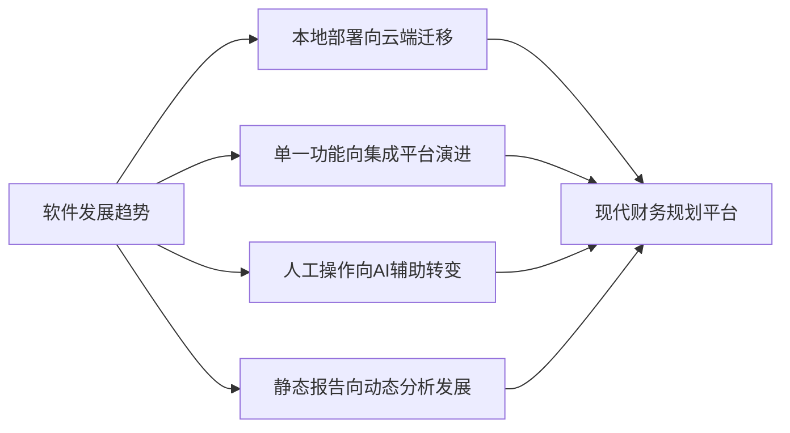
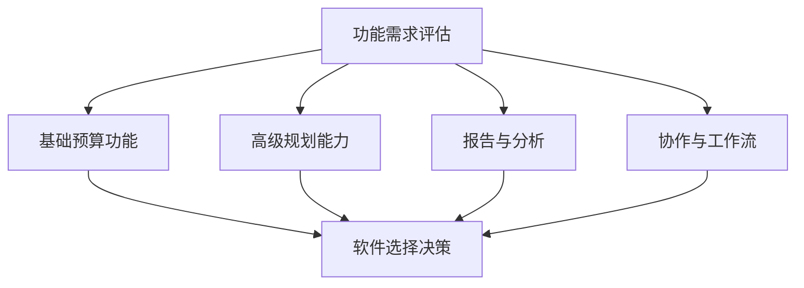

---
{"tags":["财务BP","软件工具","财务规划","预算管理","工具比较"],"aliases":["财务软件比较","预算工具比较"],"created":"2024-03-20","dg-publish":true,"permalink":"/08-财务专业/财务BP/学习内容/BP工具与模板/财务软件应用/常用财务规划软件比较/","dgPassFrontmatter":true}
---

# 常用财务规划软件比较

> [!abstract] 概述
> 本文档全面比较市场上主流财务规划与预算管理软件的功能特性、应用场景与优缺点。财务规划软件是现代企业BP工作的重要工具，选择合适的软件可以显著提高财务团队的工作效率和预测准确性。本文将从功能、易用性、集成性、成本等多个维度进行系统比较，帮助企业选择最适合自身需求的财务规划软件。

## 一、财务规划软件的分类与发展

### 1. 软件类型分类
- **专业财务规划软件**：专为财务规划、预算管理设计
- **ERP系统财务模块**：大型企业资源规划系统中的财务规划功能
- **表格增强工具**：基于Excel的财务规划增强工具
- **云端财务规划平台**：基于云技术的财务规划SaaS服务
- **定制化财务规划系统**：针对特定行业或企业定制开发的系统

### 2. 财务规划软件发展趋势

## 二、主流财务规划软件比较

### 1. 专业财务规划软件

#### Anaplan
**核心功能**：
- 企业级财务规划与分析
- 多维度建模能力
- 协作预算编制
- 实时What-if分析
- 自定义工作流

**优势**：
- 强大的处理能力，适合大型企业
- 灵活的建模能力
- 优秀的可视化功能
- 良好的协作特性

**劣势**：
- 价格较高
- 学习曲线陡峭
- 实施周期长
- 需要专业咨询支持

**适用企业**：大型跨国企业、复杂业务结构企业

#### Oracle Planning and Budgeting Cloud Service
**核心功能**：
- 财务预算与规划
- 滚动预测
- 驱动因素建模
- 情景分析
- 预测与实际对比

**优势**：
- 稳定可靠
- 与Oracle生态系统集成
- 强大的数据处理能力
- 完善的安全机制

**劣势**：
- 用户界面相对复杂
- 定制开发成本高
- 依赖Oracle技术栈
- 移动端体验一般

**适用企业**：使用Oracle ERP的企业、大中型企业

#### Workday Adaptive Planning
**核心功能**：
- 财务规划与预算
- 销售规划
- 人力资源规划
- 自动化报告
- 仪表盘与可视化

**优势**：
- 用户友好的界面
- 较快的实施周期
- 良好的协作功能
- 较低的学习门槛

**劣势**：
- 高级分析功能较弱
- 大数据量处理能力有限
- 定制化灵活性不及Anaplan
- 集成性需提升

**适用企业**：中型企业、追求易用性的企业

### 2. ERP系统财务模块

#### SAP Business Planning and Consolidation
**核心功能**：
- 集成的规划、预算、预测
- 财务合并
- 报告与分析
- 工作流管理
- 数据管理

**优势**：
- 与SAP ERP深度集成
- 全面的功能覆盖
- 强大的数据处理能力
- 成熟的技术支持

**劣势**：
- 复杂性高
- 实施成本高
- 需要专业IT支持
- 灵活性较低

**适用企业**：使用SAP ERP的大型企业

#### Microsoft Dynamics 365 Finance
**核心功能**：
- 财务预算与规划
- 成本会计
- 财务报告
- 现金流预测
- 资产管理

**优势**：
- 与Microsoft生态系统集成
- 熟悉的Office界面
- 较好的用户体验
- Power BI集成分析

**劣势**：
- 专业财务规划功能不如专业软件
- 高级分析能力有限
- 定制开发需求大
- 部分功能需要额外模块

**适用企业**：使用Microsoft生态系统的中型企业

### 3. 表格增强工具

#### Jedox
**核心功能**：
- Excel集成规划
- 在线协作
- 数据可视化
- 移动访问
- 内存数据库

**优势**：
- 与Excel无缝集成
- 学习曲线平缓
- 灵活的自定义能力
- 价格适中

**劣势**：
- 大数据量处理能力有限
- 企业级功能不如专业软件
- 依赖Excel技能
- 高级分析功能较弱

**适用企业**：小型企业、预算不高的中型企业

#### Vena Solutions
**核心功能**：
- Excel为核心的规划
- 工作流管理
- 版本控制
- 报告生成
- 数据整合

**优势**：
- 保留Excel操作习惯
- 相对容易实施
- 成本效益好
- 协作功能强

**劣势**：
- 扩展性有限
- 复杂模型支持不如专业软件
- 数据可视化一般
- API集成有限

**适用企业**：依赖Excel的中小型企业

### 4. 云端财务规划平台

#### Prophix
**核心功能**：
- 预算规划与预测
- 财务合并
- 管理报告
- 产品盈利能力分析
- 现金流规划

**优势**：
- 易于使用
- 实施周期短
- 性价比高
- 全面的云端解决方案

**劣势**：
- 大企业功能不如顶级方案
- 定制化能力有限
- 行业垂直解决方案少
- 数据处理速度一般

**适用企业**：中小型企业、预算有限的组织

#### Board
**核心功能**：
- 统一的规划平台
- 业务智能
- 数据分析
- 仪表盘
- 多维数据分析

**优势**：
- 一体化的BI和CPM平台
- 强大的可视化能力
- 良好的数据处理性能
- 无需编程的界面

**劣势**：
- 价格较高
- 学习曲线陡峭
- 实施复杂度高
- 需要专业咨询

**适用企业**：追求一体化解决方案的中大型企业

## 三、软件选择关键考量因素

### 1. 功能需求匹配度

### 2. 技术架构考量
- **部署模式**：云端、本地或混合
- **性能需求**：数据量大小、运算复杂度
- **安全需求**：数据安全、访问控制
- **集成需求**：与现有系统的集成
- **可扩展性**：未来业务扩展需求

### 3. 成本效益分析
- **许可成本**：软件许可费用
- **实施成本**：咨询、定制、培训费用
- **维护成本**：年度维护费、升级费
- **间接成本**：学习曲线、效率变化
- **投资回报**：预期效益与成本比较

### 4. 组织因素
- **用户技能水平**：财务团队技术能力
- **IT支持能力**：内部IT支持资源
- **变革管理**：组织接受新系统能力
- **战略一致性**：与企业战略的匹配度
- **文化适配性**：与企业文化的契合度

## 四、应用案例分析

### 案例1：制造企业预算管理升级
**背景**：某中型制造企业希望升级预算管理系统，从Excel转向更专业的解决方案。

**需求分析**：
- 多部门协作预算编制
- 生产、销售、采购计划集成
- 滚动预测能力
- 与现有ERP系统集成
- 中等复杂度的分析需求

**解决方案比较**：
1. **Workday Adaptive Planning**
   - 优势：易用性好、实施周期短、协作功能强
   - 劣势：与ERP集成需额外开发

2. **SAP BPC**
   - 优势：与ERP完美集成、功能全面
   - 劣势：成本高、实施复杂

3. **Jedox**
   - 优势：价格适中、Excel友好、灵活性高
   - 劣势：企业级功能较弱

**最终选择**：选择Workday Adaptive Planning，平衡了易用性和功能性，实施周期与成本合理。

**实施效果**：
- 预算编制周期缩短50%
- 预测准确率提高30%
- 部门协作效率提升40%
- 报告生成时间减少70%

### 案例2：跨国集团财务整合
**背景**：某跨国集团拥有20多个子公司，需要一个强大的财务规划与合并解决方案。

**需求分析**：
- 多币种、多语言支持
- 复杂的财务合并
- 高级分析与模拟能力
- 全球范围内的协作
- 严格的合规要求

**解决方案比较**：
1. **Anaplan**
   - 优势：强大的建模能力、全球协作、灵活性高
   - 劣势：价格高、实施复杂

2. **Oracle PBCS**
   - 优势：成熟可靠、强大的合并功能、全球支持网络
   - 劣势：用户体验一般、定制成本高

3. **Board**
   - 优势：一体化平台、分析能力强
   - 劣势：全球支持网络相对弱

**最终选择**：选择Anaplan，其强大的建模能力和协作特性最适合集团复杂的业务需求。

**实施效果**：
- 财务合并时间从10天减少到3天
- 预算编制周期缩短60%
- 分析深度显著提升
- 跨区域协作效率提高80%

## 五、软件实施最佳实践

### 1. 选型阶段建议
- 组建跨部门评估团队
- 明确记录需求与优先级
- 制定详细的评估标准
- 要求供应商演示实际业务场景
- 与参考客户交流实施经验

### 2. 实施阶段建议

### 3. 系统整合建议
- 制定清晰的数据治理策略
- 确保主数据一致性
- 建立健壮的集成架构
- 设计适当的数据转换逻辑
- 实施严格的变更管理

### 4. 持续优化建议
- 定期评估系统使用情况
- 收集用户反馈
- 跟踪技术更新与新功能
- 优化业务流程与系统配置
- 定期培训与知识更新

## 六、未来趋势展望

### 1. 技术趋势
- **人工智能集成**：AI辅助预测与异常检测
- **高级分析能力**：预测分析、机器学习集成
- **实时规划**：从周期性向连续规划转变
- **自然语言处理**：语音查询与报告生成
- **低代码/无代码平台**：降低技术门槛

### 2. 应用趋势
- **业务与财务融合**：运营规划与财务规划一体化
- **ESG规划整合**：将可持续发展目标纳入财务规划
- **敏捷规划方法**：更频繁、更灵活的规划周期
- **自动化程度提高**：减少手动流程和数据处理
- **远程协作能力增强**：适应混合办公环境

## 相关链接

- [[08-财务专业/财务BP/学习内容/BP工具与模板/财务软件应用/软件选择考虑因素\|软件选择考虑因素]]
- [[08-财务专业/财务BP/学习内容/BP工具与模板/财务软件应用/系统整合与数据导入\|系统整合与数据导入]]
- [[08-财务专业/财务BP/学习内容/BP工具与模板/财务软件应用/自动化报告生成\|自动化报告生成]]
- [[08-财务专业/财务BP/笔记/BP工具与模版/Excel模型构建\|Excel模型构建]]
- [[08-财务专业/财务BP/学习内容/BP工具与模板/财务建模/财务模型设计原则\|财务模型设计原则]]

## 参考文献

1. Gartner. (2023). *Magic Quadrant for Financial Planning Software*.
2. Forrester. (2022). *The Forrester Wave™: Enterprise Performance Management*.
3. KPMG. (2021). *Financial Planning and Analysis Technology Trends*.
4. 《企业财务规划软件选型指南》，张明，中国财政经济出版社，2022.
5. 《财务系统实施最佳实践》，李强，财务与会计，2021.
6. 《云端财务管理系统比较研究》，王华，信息系统工程，2020. 