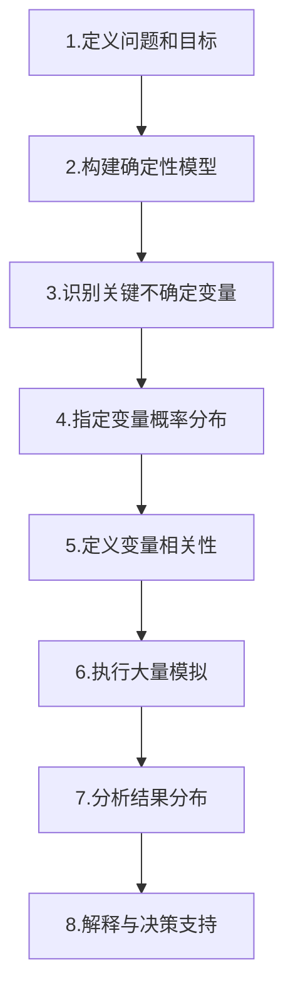

---
{"tags":["财务BP","蒙特卡洛模拟","风险分析","概率模型"],"aliases":["蒙特卡洛分析","MC模拟","随机模拟"],"created":"2023-11-16","dg-publish":true,"permalink":"/08-财务专业/财务BP/学习内容/BP工具与模板/高级分析/Monte Carlo模拟工具/","dgPassFrontmatter":true}
---


# Monte Carlo模拟工具

## 概述

Monte Carlo模拟是财务BP工作中处理复杂不确定性的高级量化分析工具，通过随机抽样和大量迭代计算，模拟各种可能的结果及其概率分布。本文详细介绍Monte Carlo模拟的基本原理、应用方法、实施步骤及案例分析，并提供实用工具模板和最佳实践指南，帮助财务BP在预测、规划和风险管理中有效应对多变量不确定性，提供更全面的决策支持。

## 基本概念

### 定义与原理

Monte Carlo模拟是一种概率模拟方法，通过重复随机抽样来获得数值结果的计算算法。其核心原理包括：

- **随机抽样**：从输入变量的概率分布中随机抽取样本值
- **确定性计算**：将抽样值代入模型进行计算
- **多次迭代**：重复上述过程大量次数（通常数千或数万次）
- **结果分析**：聚合所有模拟结果，形成输出变量的概率分布

### 与传统分析方法的区别

| 特性 | 传统确定性分析 | Monte Carlo模拟 |
|------|----------------|-----------------|
| 输入处理 | 单点估计（最可能值） | 完整概率分布 |
| 考虑不确定性 | 基于情景或敏感性分析 | 综合处理多变量不确定性 |
| 输出形式 | 单一结果 | 完整概率分布及统计指标 |
| 风险洞察 | 有限 | 全面的概率和风险评估 |
| 计算复杂度 | 低 | 高 |

### 适用场景

Monte Carlo模拟特别适用于以下财务BP场景：

- **高度不确定性**：关键变量存在显著不确定性
- **多变量相关**：多个变量同时变化且可能相互关联
- **非线性关系**：变量间存在复杂非线性关系
- **极端事件分析**：需要评估低概率高影响事件
- **风险量化**：需要定量评估风险大小和概率

## 模拟实施方法

### 基本实施步骤



#### 1. 定义问题和目标

- 确定要解决的具体问题
- 明确期望获得的洞察
- 设定模拟的范围和边界条件
- 确定关键输出指标

#### 2. 构建确定性模型

- 建立输入变量与输出变量的数学关系
- 验证模型在确定性条件下的正确性
- 确保模型逻辑和计算公式准确
- 实现易于迭代计算的结构

#### 3. 识别关键不确定变量

- 使用敏感性分析识别关键变量
- 确定哪些变量应作为随机输入
- 保留确定性处理的非关键变量
- 寻找历史数据或专家判断支持

#### 4. 指定变量概率分布

- 为每个不确定变量选择适当的概率分布
- 根据数据或专业知识确定分布参数
- 常用分布包括：
  - **正态分布**：适用于受多种微小随机因素影响的变量
  - **三角分布**：适用于有最小值、最可能值、最大值的变量
  - **均匀分布**：适用于任意值等概率的变量
  - **对数正态分布**：适用于非负且右偏的变量（如价格、销量）
  - **离散分布**：适用于有限可能值集合的变量
  - **自定义分布**：基于历史数据或专家判断构建

#### 5. 定义变量相关性

- 识别并量化变量间的相关性
- 构建相关性矩阵
- 实现相关性约束的抽样方法
- 验证相关性设置的合理性

#### 6. 执行大量模拟

- 使用计算机程序执行模拟
- 进行足够数量的迭代（通常1,000-10,000次）
- 记录每次模拟的输入值和输出结果
- 确保随机数生成器质量

#### 7. 分析结果分布

- 计算统计描述量（均值、中位数、标准差等）
- 生成概率分布图（如直方图、累积分布函数）
- 计算关键结果概率（如目标达成概率）
- 识别极端情况和关键风险点

#### 8. 解释与决策支持

- 转化数学结果为业务见解
- 识别最可能结果和风险
- 提供多维度决策支持信息
- 提出基于模拟的行动建议

### 变量分布选择指南

| 变量类型 | 推荐分布 | 选择依据 |
|----------|----------|----------|
| 市场需求 | 正态、三角形或对数正态 | 取决于预测置信度和可能性偏态 |
| 产品价格 | 对数正态或三角形 | 通常有下限且正偏 |
| 原材料成本 | 三角形或偏正态 | 通常有明确的范围但可能偏高 |
| 项目完成时间 | Beta PERT或三角形 | 基于最悲观、最可能和最乐观估计 |
| 风险事件 | 二项分布或自定义离散 | 基于事件发生概率和影响 |
| 利率变动 | 正态分布或自定义 | 可结合历史波动性和政策预期 |

### 相关性处理方法

- **相关系数矩阵**：定量描述变量两两之间的线性相关程度
- **Cholesky分解法**：数学方法实现相关随机变量的生成
- **Copula函数**：处理非线性相关性的高级方法
- **Rank相关**：处理非参数相关性的方法

## 应用工具与模板

### Excel实现方案

**基础方法**：
- 使用`RAND()`或`RANDBETWEEN()`生成随机数
- 使用数据表功能进行多次模拟
- 利用统计函数分析结果
- 使用图表功能可视化分布

**进阶方法**：
- 使用Excel VBA编程实现大量迭代
- 利用Data Analysis工具包
- 使用宏实现复杂分布抽样
- 构建结构化的报告展示

**Excel模板要素**：
1. 输入参数工作表
2. 分布设置工作表
3. 相关性矩阵工作表
4. 模拟引擎工作表
5. 结果汇总工作表
6. 可视化报告工作表

### 专业模拟软件

**推荐工具**：
1. **@RISK**：Excel插件，专业风险分析软件
2. **Crystal Ball**：Oracle提供的模拟和优化工具
3. **ModelRisk**：直观的风险建模工具
4. **Analytica**：影响图和决策分析软件
5. **R/Python**：开源编程语言，具有强大的统计和模拟能力

**软件选择考虑因素**：
- 业务需求复杂度
- 用户技术熟练度
- 与现有系统集成
- 预算限制
- 报告和可视化需求

### 结果解读与展示技巧

**关键图表**：
- **直方图**：展示结果的频率分布
- **累积分布函数(CDF)**：展示结果的概率累积
- **敏感性龙卷风图**：展示输入变量对结果的影响程度
- **散点图**：分析变量间的相关性
- **瀑布图**：分解贡献因素

**关键指标**：
- **期望值**：平均预期结果
- **中位数**：50%概率达到的结果
- **标准差**：结果的波动程度
- **置信区间**：特定概率范围（如90%置信区间）
- **风险指标**：如VaR (Value at Risk)、尾部风险

**有效沟通技巧**：
- 使用明确的概率语言
- 强调关键业务见解而非技术细节
- 使用直观的可视化
- 将结果与决策选项明确关联
- 提供多维度情境分析

## 在财务BP中的应用

### 收入预测与规划

**应用方式**：
- 模拟销售增长率的不确定性
- 整合市场需求、价格、市场份额等随机因素
- 生成收入的概率分布
- 评估各种增长策略的风险收益特征

**实施要点**：
- 基于历史数据建立关键变量的概率分布
- 考虑宏观经济因素与产品生命周期
- 处理季节性和周期性变动
- 区分新旧产品线的不确定性特征

**效益**：
- 更全面了解收入预测的风险范围
- 制定更稳健的销售目标
- 优化产品组合策略
- 改进销售激励制度设计

### 预算与资源分配

**应用方式**：
- 建立包含不确定性的全面预算模型
- 模拟不同预算方案的结果分布
- 量化预算达成的概率
- 优化资源分配的风险效益平衡

**实施要点**：
- 识别预算中的关键不确定因素
- 设计弹性预算响应机制
- 纳入不同部门预算间的相关性
- 设定基于风险的预算缓冲策略

**效益**：
- 提高预算可信度
- 改进资源分配效率
- 增强预算应对变化的弹性
- 提供更有力的预算辩护依据

### 资本投资评估

**应用方式**：
- 对投资项目的NPV/IRR进行概率模拟
- 整合多种风险因素（市场、技术、操作等）
- 比较不同投资方案的风险收益特征
- 确定最优投资组合和时机

**实施要点**：
- 构建整合现金流量的详细模型
- 准确设定关键变量的概率分布
- 考虑时间相关性和序列相关
- 纳入实物期权价值分析

**效益**：
- 超越单点NPV/IRR分析的局限
- 量化投资风险与回报的完整画面
- 提高资本配置决策质量
- 改进投资后评估的基准设定

### 流动性与资金规划

**应用方式**：
- 模拟未来现金流的概率分布
- 评估流动性风险和资金缺口概率
- 测试不同融资策略的效果
- 优化现金持有与投资组合

**实施要点**：
- 整合经营、投资和融资活动现金流
- 模拟收付款时间的不确定性
- 考虑应急借款额度和成本
- 测试极端情境下的流动性压力

**效益**：
- 提前识别潜在流动性风险
- 优化资金结构和融资时机
- 制定更稳健的股利政策
- 改进营运资金管理

## 案例分析

### 案例一：高科技企业产品开发投资决策

**企业背景**：
某高科技企业计划投资5000万元开发新一代产品，面临市场需求、开发时间、成本和竞争对手反应等多重不确定性。

**应用Monte Carlo模拟过程**：

1. **确定性模型构建**
   - 开发五年期DCF模型计算NPV
   - 确定关键输入变量：开发时间、开发成本、市场规模、市场份额、售价、运营成本

2. **概率分布设定**
   | 变量 | 分布类型 | 参数设置 |
   |------|----------|---------|
   | 开发时间 | 三角分布 | 最小=12个月，最可能=18个月，最大=30个月 |
   | 开发成本 | 对数正态 | 均值=5000万，标准差=1000万 |
   | 市场规模 | 正态分布 | 均值=10亿，标准差=2亿 |
   | 市场份额 | Beta分布 | 根据专家判断设置参数 |
   | 售价 | 三角分布 | 最小=800元，最可能=1000元，最大=1200元 |

3. **相关性设置**
   - 开发时间与开发成本：正相关(0.7)
   - 开发时间与市场份额：负相关(-0.5)
   - 市场规模与售价：负相关(-0.3)

4. **模拟执行**
   - 运行10,000次迭代
   - 记录每次模拟的NPV和IRR

5. **结果分析**
   ```mermaid
   graph LR
       A[模拟结果] --> B[NPV期望值:7500万]
       A --> C[NPV标准差:4200万]
       A --> D[正NPV概率:82%]
       A --> E[IRR>20%概率:65%]
       A --> F[投资回收期<3年概率:45%]
   ```

6. **敏感性分析**
   - 市场份额对NPV影响最大(38%)
   - 其次是开发时间(25%)和售价(18%)
   - 开发成本影响较小(9%)

**决策支持与建议**：
- 项目具有积极的期望NPV，但风险不容忽视
- 关键成功因素是市场份额获取和开发进度管理
- 建议分阶段投资，设立明确的继续/放弃决策点
- 加强市场营销能力，提高市场份额获取概率
- 开发团队设立进度管理激励机制
- 制定针对关键风险的缓解策略

### 案例二：制造企业产能扩张决策

**企业背景**：
某制造企业考虑通过两种方案扩大产能：方案A是立即大规模扩张，方案B是分两阶段小规模扩张。

**Monte Carlo模拟设置与结果**：

1. **模拟变量**
   - 需求增长率
   - 原材料价格
   - 产品售价
   - 产能利用率
   - 建设成本与时间

2. **主要结果**
   - 方案A：期望NPV=3.2亿，标准差=1.8亿，负NPV概率=15%
   - 方案B：期望NPV=2.9亿，标准差=1.1亿，负NPV概率=8%

3. **风险比较**
   ```mermaid
   graph TD
       A[风险-收益分析] --> B[方案A:高收益/高风险]
       A --> C[方案B:中等收益/低风险]
       B --> D[适合风险承受能力强]
       C --> E[适合风险规避倾向]
   ```

**决策支持与建议**：
- 方案选择取决于公司风险偏好
- 方案B提供更大决策灵活性和学习机会
- 建议设计混合策略，先小规模扩张，成功后加速
- 原材料价格锁定可显著降低风险
- 建立需求持续监控机制，作为扩张调整依据

## 实施挑战与应对策略

### 数据质量与可获得性

**常见挑战**：
- 历史数据有限或不可靠
- 新业务领域缺乏参考数据
- 极端事件数据缺乏

**应对策略**：
- 结合定量数据与专家判断
- 使用相似业务或行业数据调整
- 采用贝叶斯方法逐步更新概率
- 明确标示数据局限性及其影响

### 模型复杂度管理

**常见挑战**：
- 过度复杂模型难以维护和解释
- 过于简化模型忽视关键因素
- 计算资源和时间限制

**应对策略**：
- 关注高影响变量，简化次要因素
- 采用分层模型方法
- 平衡精确性与实用性
- 使用高效计算方法（如拉丁超立方抽样）

### 结果解释与沟通

**常见挑战**：
- 决策者对概率理解有限
- 过度关注单一数字而非分布
- 低概率高影响事件认知偏差

**应对策略**：
- 强调关键业务含义而非技术细节
- 使用直观的可视化和类比
- 结合定性分析增强解释力
- 针对不同受众定制不同沟通方式

### 组织接受度

**常见挑战**：
- 传统确定性思维惯性
- 缺乏不确定性处理技能
- 决策流程不适应概率输入

**应对策略**：
- 选择高价值项目证明方法效用
- 提供决策者培训与支持
- 逐步引入，从简单应用开始
- 将模拟结果与传统方法并行展示

## 进阶技术与发展趋势

### 高级模拟技术

- **条件蒙特卡洛**：基于条件概率的模拟方法
- **准蒙特卡洛**：使用低差异序列提高计算效率
- **元建模**：使用代理模型加速复杂模型计算
- **动态蒙特卡洛**：处理时间序列和路径依赖问题
- **马尔可夫链蒙特卡洛(MCMC)**：解决复杂后验分布问题

### 与人工智能的融合

- 使用机器学习改进概率分布估计
- 自动识别关键风险驱动因素
- 动态调整模型结构和参数
- 结合预测模型和模拟分析
- 自然语言生成增强结果解释

### 未来发展趋势

- 实时云计算模拟平台
- 协作型模拟与决策支持系统
- 与大数据分析的深度集成
- 物联网数据驱动的动态模拟
- 增强现实可视化模拟结果

## 最佳实践总结

### 实施成功关键因素

1. **明确目标**：将模拟与具体决策问题紧密关联
2. **数据质量**：投入适当资源确保输入数据质量
3. **专业知识整合**：结合业务专家与技术专家
4. **适度复杂**：避免过度复杂化模型
5. **迭代与验证**：持续改进模型与假设
6. **结果有效沟通**：专注于决策支持而非技术炫耀
7. **组织能力建设**：培养团队概率思维和工具使用能力

### 实施清单

- [ ] 决策问题明确定义
- [ ] 确定性基础模型构建与验证
- [ ] 关键变量识别与确认
- [ ] 概率分布选择与参数设定
- [ ] 变量相关性分析与设置
- [ ] 模拟工具选择与准备
- [ ] 模拟执行与初步验证
- [ ] 结果分析与解释
- [ ] 敏感性和稳健性分析
- [ ] 结果沟通与决策支持
- [ ] 模型文档与维护计划

## 相关链接

- [[08-财务专业/财务BP/学习内容/BP工具与模板/高级分析/敏感性分析工具\|敏感性分析工具]]
- [[08-财务专业/财务BP/学习内容/BP工具与模板/基础方法/决策树分析方法\|决策树分析方法]]
- [[08-财务专业/财务BP/学习内容/BP工具与模板/财务建模/财务建模最佳实践\|财务建模最佳实践]]
- [[风险评估指南\|风险评估指南]]

## 参考文献

1. Raychaudhuri, S. (2018). 《Introduction to Monte Carlo Simulation》. Proceedings of the Winter Simulation Conference, IEEE.
2. Charnes, J. (2019). 《Financial Modeling with Crystal Ball and Excel》, 3rd Edition. Wiley Finance.
3. Winston, W.L. (2017). 《Financial Models Using Simulation and Optimization》. Palisade Corporation.
4. Vose, D. (2018). 《Risk Analysis: A Quantitative Guide》, 4th Edition. Wiley.
5. 张志强, 刘军. (2020). 《蒙特卡洛模拟在企业财务决策中的应用》. 会计研究, 18(5), 87-102.
6. 王立平. (2021). 《不确定环境下的企业投资决策方法研究》. 经济科学, 42(3), 115-129.
7. Brandimarte, P. (2018). 《Handbook in Monte Carlo Simulation: Applications in Financial Engineering, Risk Management, and Economics》. Wiley. 