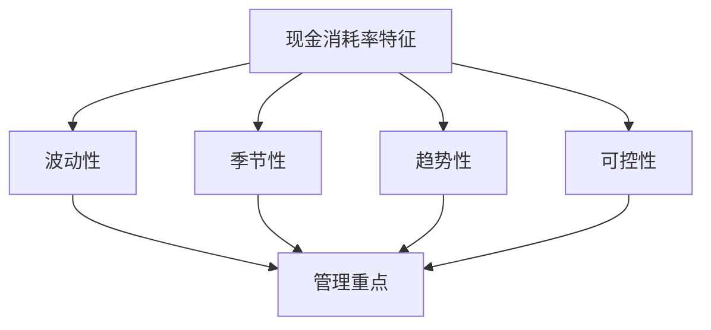

---
{"tags":["财务BP","初创企业","现金流管理","现金消耗","创业管理"],"aliases":["创业现金流管理","现金消耗控制"],"created":"2024-03-20","dg-publish":true,"permalink":"/08-财务专业/财务BP/学习内容/行业应用/初创企业BP特点/现金消耗率管理/","dgPassFrontmatter":true}
---

# 现金消耗率管理

> [!abstract] 概述
> 本文档详细分析初创企业现金消耗率管理的特点、方法和实践。现金消耗率是衡量初创企业资金使用效率的重要指标，需要科学的监控和管理方法。通过合理的现金消耗率管理，可以优化资金使用效率，延长企业生存期，提高融资成功率。

## 一、现金消耗率的基本概念

### 1. 现金消耗率定义
- **定义**：单位时间内现金消耗的速率
- **计算**：现金消耗/时间周期
- **单位**：元/月、元/天等
- **意义**：反映企业资金使用效率

### 2. 现金消耗率特征

## 二、现金消耗率管理方法

### 1. 现金消耗率预测
- 历史数据分析
- 业务发展预测
- 成本结构分析
- 现金流预测

### 2. 现金消耗率控制
- 成本控制
- 收入提升
- 运营优化
- 资金管理

### 3. 现金消耗率监控
- 日常监控
- 定期分析
- 预警机制
- 调整机制

### 4. 现金消耗率优化
- 成本结构优化
- 运营效率提升
- 资金使用优化
- 融资规划优化

## 三、现金消耗率管理内容

### 1. 管理流程

### 2. 管理重点
- 收入管理
- 成本控制
- 现金流管理
- 融资管理

### 3. 管理工具
- 预算管理
- 成本核算
- 现金流预测
- 融资规划

## 四、案例分析

### 案例1：互联网创业公司
**背景**：某互联网创业公司需要控制现金消耗率。

**管理方法**：
1. 现金消耗率预测
   - 历史数据分析
   - 业务发展预测
   - 成本结构分析
   - 现金流预测

2. 现金消耗率控制
   - 成本控制措施
   - 收入提升策略
   - 运营优化方案
   - 资金管理策略

3. 现金消耗率监控
   - 日常监控机制
   - 定期分析制度
   - 预警机制建立
   - 调整机制完善

**实施效果**：
- 现金消耗率降低
- 资金使用效率提升
- 经营状况改善
- 融资成功率提高

### 案例2：科技创业公司
**背景**：某科技创业公司需要优化现金消耗率。

**优化方法**：
1. 成本结构优化
   - 固定成本优化
   - 变动成本控制
   - 运营成本优化
   - 研发成本控制

2. 运营效率提升
   - 生产效率提升
   - 管理效率提升
   - 资源利用优化
   - 流程优化

3. 资金管理优化
   - 现金流管理
   - 融资规划
   - 投资规划
   - 风险控制

**实施效果**：
- 现金消耗率优化
- 运营效率提升
- 资金使用效率提高
- 经营状况改善

## 五、现金消耗率风险与应对

### 1. 常见风险
- 现金消耗过快
- 资金链断裂
- 融资困难
- 经营风险

### 2. 风险应对策略
- 现金消耗控制
- 资金链管理
- 融资规划
- 风险控制

## 六、最佳实践建议

1. **现金消耗率预测**
   - 科学预测方法
   - 历史数据分析
   - 业务发展预测
   - 成本结构分析

2. **现金消耗率控制**
   - 成本控制措施
   - 收入提升策略
   - 运营优化方案
   - 资金管理策略

3. **现金消耗率监控**
   - 日常监控机制
   - 定期分析制度
   - 预警机制建立
   - 调整机制完善

4. **现金消耗率优化**
   - 成本结构优化
   - 运营效率提升
   - 资金使用优化
   - 融资规划优化

## 相关链接

- [[08-财务专业/财务BP/学习内容/行业应用/初创企业BP特点/初创期BP的特殊挑战\|初创期BP的特殊挑战]]
- [[08-财务专业/财务BP/学习内容/行业应用/初创企业BP特点/融资计划与财务规划\|融资计划与财务规划]]
- [[08-财务专业/财务BP/学习内容/行业应用/初创企业BP特点/初创企业BP案例分析\|初创企业BP案例分析]]
- [[预算编制基础\|预算编制基础]]
- [[08-财务专业/财务BP/笔记/预算编制基础/现金流预测\|现金流预测]]

## 参考文献

1. Blank, S. (2013). *The Four Steps to the Epiphany: Successful Strategies for Products that Win*. K&S Ranch.
2. Ries, E. (2011). *The Lean Startup: How Today's Entrepreneurs Use Continuous Innovation to Create Radically Successful Businesses*. Crown Business.
3. 《初创企业现金消耗率管理研究》，张明，管理科学学报，2020.
4. 《初创企业现金流管理实践》，李强，财务与会计，2021.
5. 《初创企业资金管理最佳实践》，王华，商业经济研究，2019. 