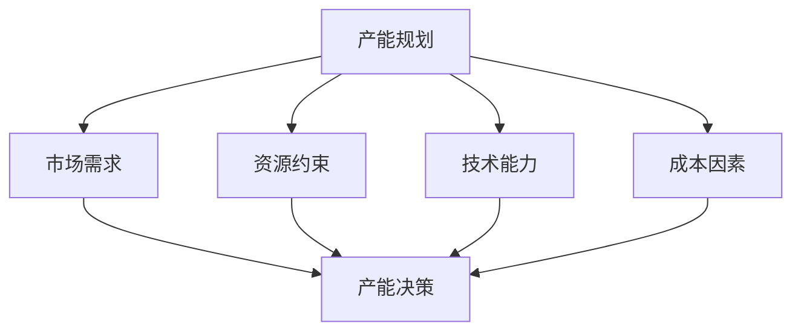

---
{"tags":["财务BP","制造业","产能规划","预算管理","生产管理"],"aliases":["制造业产能预算","生产产能规划"],"created":"2024-03-20","dg-publish":true,"permalink":"/08-财务专业/财务BP/学习内容/行业应用/制造业BP特点/制造业产能规划与预算/","dgPassFrontmatter":true}
---

> [!abstract] 概述
> 本文档详细分析制造业产能规划与预算的特点、方法和实践。制造业产能规划是连接企业战略与运营的重要环节，需要综合考虑市场需求、资源约束、技术能力等多方面因素。通过科学的产能规划与预算，可以优化资源配置，提高生产效率，实现企业战略目标。

## 一、产能规划的基本概念

### 1. 产能定义与分类
- **设计产能**：理论上最大生产能力
- **有效产能**：考虑实际运营因素后的产能
- **实际产能**：实际达到的生产能力
- **瓶颈产能**：制约整体产能的关键环节

### 2. 产能规划的关键要素

## 二、产能规划方法

### 1. 需求驱动法
- 市场预测分析
- 销售订单分析
- 客户需求分析
- 季节性波动分析

### 2. 资源约束法
- 设备能力分析
- 人力资源分析
- 原材料供应分析
- 能源供应分析

### 3. 技术能力法
- 工艺水平评估
- 设备效率分析
- 质量控制能力
- 技术创新影响

### 4. 成本效益法
- 固定成本分析
- 变动成本分析
- 规模经济分析
- 边际效益分析

## 三、产能预算编制

### 1. 预算编制流程

### 2. 预算内容构成
- 设备投资预算
- 人力资源预算
- 原材料预算
- 能源预算
- 维护保养预算
- 质量控制预算

### 3. 预算控制方法
- 关键绩效指标（KPI）监控
- 预算执行分析
- 差异分析
- 调整机制

## 四、案例分析

### 案例1：汽车零部件制造商产能规划
**背景**：某汽车零部件制造商需要规划未来3年的产能。

**规划方法**：
1. 市场需求分析
   - 汽车市场预测
   - 客户订单分析
   - 竞争对手分析
   - 产品生命周期分析

2. 资源能力评估
   - 现有设备能力
   - 人力资源配置
   - 供应链能力
   - 质量控制能力

3. 产能规划方案
   - 产能扩张计划
   - 设备更新计划
   - 人员培训计划
   - 质量控制计划

**预算编制**：
- 设备投资预算
- 人力资源预算
- 运营成本预算
- 质量控制预算

### 案例2：电子制造企业产能优化
**背景**：某电子制造企业需要优化现有产能。

**优化方法**：
1. 瓶颈分析
   - 识别关键瓶颈
   - 分析瓶颈原因
   - 制定优化方案
   - 评估优化效果

2. 效率提升
   - 设备效率提升
   - 工艺流程优化
   - 人员效率提升
   - 质量控制优化

3. 成本控制
   - 固定成本优化
   - 变动成本控制
   - 能源成本管理
   - 维护成本控制

**预算控制**：
- 关键指标监控
- 预算执行分析
- 差异分析
- 调整机制

## 五、产能规划风险与应对

### 1. 常见风险
- 市场需求波动
- 资源供应不稳定
- 技术更新风险
- 成本上升风险

### 2. 风险应对策略
- 柔性产能规划
- 多方案备选
- 应急机制
- 风险预警

## 六、最佳实践建议

1. **数据驱动决策**
   - 建立完整的数据收集体系
   - 运用数据分析工具
   - 定期评估预测准确性

2. **动态调整机制**
   - 建立快速响应机制
   - 定期评估产能规划
   - 及时调整优化方案

3. **跨部门协作**
   - 与销售部门紧密合作
   - 与采购部门协同
   - 与人力资源部门配合

## 相关链接

- [[08-财务专业/财务BP/学习内容/行业应用/制造业BP特点/制造业成本结构特点\|制造业成本结构特点]]
- [[08-财务专业/财务BP/学习内容/行业应用/制造业BP特点/制造业库存管理与预算\|制造业库存管理与预算]]
- [[08-财务专业/财务BP/学习内容/行业应用/制造业BP特点/制造业BP案例分析\|制造业BP案例分析]]
- [[预算编制基础\|预算编制基础]]
- [[08-财务专业/财务BP/笔记/预算编制基础/资本支出预算\|资本支出预算]]

## 参考文献

1. Chase, R. B., & Aquilano, N. J. (2019). *Operations Management for Competitive Advantage*. McGraw-Hill.
2. Slack, N., & Lewis, M. (2018). *Operations Strategy*. Pearson.
3. 《制造业产能规划方法研究》，李明，工业工程与管理，2020.
4. 《制造业产能预算编制实践》，张强，财务与会计，2021.
5. 《制造业产能优化策略》，王华，管理科学学报，2019. 