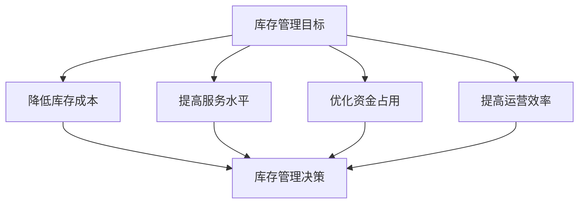

---
{"tags":["财务BP","制造业","库存管理","预算管理","供应链管理"],"aliases":["制造业库存预算","库存管理方法"],"created":"2024-03-20","dg-publish":true,"permalink":"/08-财务专业/财务BP/学习内容/行业应用/制造业BP特点/制造业库存管理与预算/","dgPassFrontmatter":true}
---

> [!abstract] 概述
> 本文档详细分析制造业库存管理与预算的特点、方法和实践。库存管理是制造业运营管理的重要组成部分，直接影响企业的现金流、运营效率和成本控制。通过科学的库存管理与预算，可以优化库存结构，降低库存成本，提高资金使用效率。

## 一、库存管理的基本概念

### 1. 库存分类
- **原材料库存**：生产所需的原材料
- **在制品库存**：生产过程中的半成品
- **成品库存**：待销售的产成品
- **备件库存**：设备维护所需的备件
- **安全库存**：应对不确定性的缓冲库存

### 2. 库存管理目标

## 二、库存管理方法

### 1. 定量订货法
- 经济订货批量（EOQ）
- 再订货点（ROP）
- 安全库存计算
- 订货周期确定

### 2. 定期订货法
- 固定订货周期
- 最大库存水平
- 订货量计算
- 库存检查频率

### 3. 物料需求计划（MRP）
- 主生产计划
- 物料清单（BOM）
- 库存状态
- 采购计划

### 4. 准时制生产（JIT）
- 拉动式生产
- 看板管理
- 供应商管理
- 质量控制

## 三、库存预算编制

### 1. 预算编制流程

### 2. 预算内容构成
- 原材料采购预算
- 在制品库存预算
- 成品库存预算
- 备件库存预算
- 库存持有成本预算
- 库存管理成本预算

### 3. 预算控制方法
- 库存周转率监控
- 库存水平控制
- 库存成本分析
- 预算执行评估

## 四、案例分析

### 案例1：汽车零部件制造商库存管理
**背景**：某汽车零部件制造商需要优化库存管理。

**管理方法**：
1. 库存分析
   - 库存结构分析
   - 库存周转分析
   - 库存成本分析
   - 服务水平分析

2. 库存优化
   - 安全库存优化
   - 订货策略优化
   - 供应商管理优化
   - 库存布局优化

3. 预算控制
   - 库存水平控制
   - 采购成本控制
   - 持有成本控制
   - 管理成本控制

**实施效果**：
- 库存周转率提升
- 库存成本降低
- 服务水平提高
- 资金占用减少

### 案例2：电子制造企业库存管理
**背景**：某电子制造企业需要实施JIT库存管理。

**实施方法**：
1. 供应商管理
   - 供应商评估
   - 供应商开发
   - 供应商协同
   - 供应商考核

2. 生产管理
   - 生产计划优化
   - 看板系统实施
   - 质量控制加强
   - 设备维护优化

3. 库存控制
   - 安全库存优化
   - 在制品控制
   - 成品库存控制
   - 备件库存控制

**实施效果**：
- 库存水平显著降低
- 生产周期缩短
- 质量水平提高
- 成本显著降低

## 五、库存管理风险与应对

### 1. 常见风险
- 需求预测偏差
- 供应中断风险
- 价格波动风险
- 质量风险
- 库存积压风险

### 2. 风险应对策略
- 需求预测优化
- 供应商多元化
- 价格风险管理
- 质量控制加强
- 库存预警机制

## 六、最佳实践建议

1. **数据驱动决策**
   - 建立完整的数据收集体系
   - 运用数据分析工具
   - 定期评估预测准确性

2. **供应链协同**
   - 与供应商紧密合作
   - 信息共享机制
   - 协同计划与预测

3. **持续优化**
   - 定期评估库存策略
   - 及时调整优化方案
   - 持续改进管理方法

## 相关链接

- [[08-财务专业/财务BP/学习内容/行业应用/制造业BP特点/制造业成本结构特点\|制造业成本结构特点]]
- [[08-财务专业/财务BP/学习内容/行业应用/制造业BP特点/制造业产能规划与预算\|制造业产能规划与预算]]
- [[08-财务专业/财务BP/学习内容/行业应用/制造业BP特点/制造业BP案例分析\|制造业BP案例分析]]
- [[预算编制基础\|预算编制基础]]
- [[08-财务专业/财务BP/笔记/预算编制基础/成本预测方法\|成本预测方法]]

## 参考文献

1. Chopra, S., & Meindl, P. (2019). *Supply Chain Management: Strategy, Planning, and Operation*. Pearson.
2. Silver, E. A., Pyke, D. F., & Peterson, R. (2018). *Inventory Management and Production Planning and Scheduling*. Wiley.
3. 《制造业库存管理方法研究》，张明，工业工程与管理，2020.
4. 《制造业库存预算编制实践》，李强，财务与会计，2021.
5. 《制造业库存优化策略》，王华，管理科学学报，2019. 