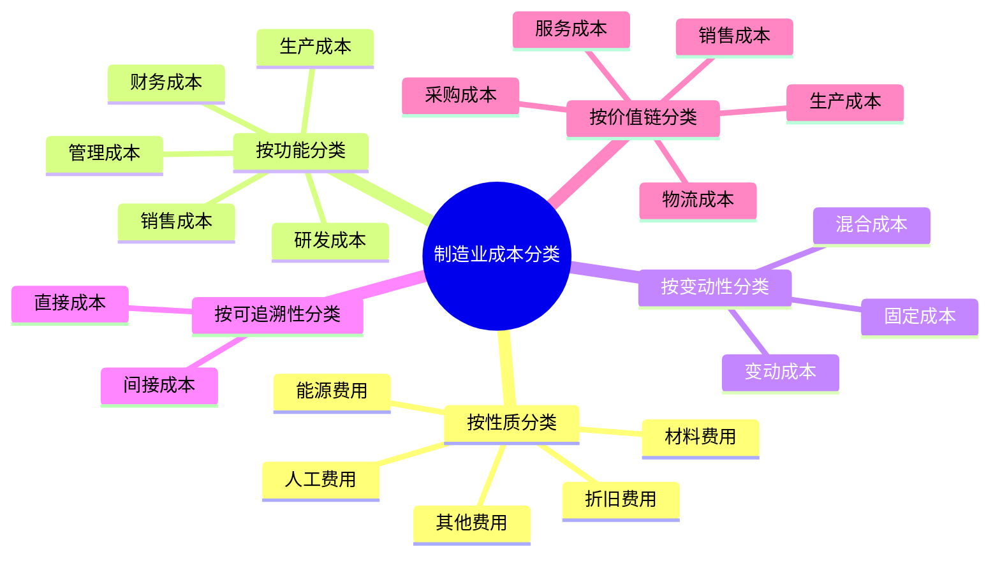
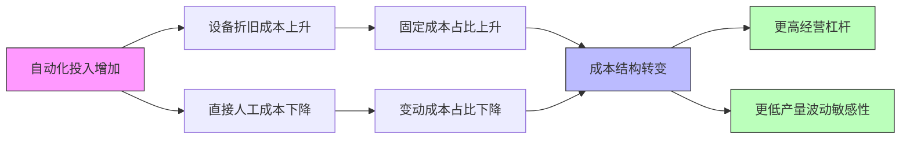
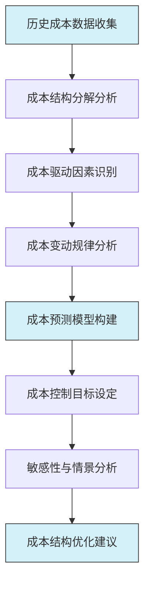

---
{"tags":["财务BP","行业应用","制造业","成本结构","成本管理"],"aliases":"制造行业成本特点,工业生产成本分析","created":"2023-12-10","dg-publish":true,"permalink":"/08-财务专业/财务BP/学习内容/行业应用/制造业BP特点/制造业成本结构特点/","dgPassFrontmatter":true}
---


> [!abstract] 概述
> 制造业拥有独特的成本结构特点，在财务BP工作中正确理解和把握这些特点对预测准确性和决策支持至关重要。本文详细阐述制造业成本的构成要素、分类方法、影响因素及其在财务BP中的应用，并通过典型案例展示不同类型制造企业的成本结构差异及其财务规划策略。

## 基本概念

制造业成本结构是指制造企业在生产经营过程中各类成本要素的构成及其相互关系。与服务业和贸易业相比，制造业的成本结构具有更高的复杂性和层次性，直接影响企业的竞争力和盈利能力。

### 制造业成本的构成要素

制造业成本通常包括以下几个主要组成部分：

1. **直接材料成本**：用于产品生产的原材料、零部件及辅料的成本
2. **直接人工成本**：直接参与产品生产的工人工资及福利
3. **制造费用**：包括间接材料、间接人工、折旧、能源和维修等
4. **期间费用**：销售费用、管理费用和研发费用等非生产性成本
5. **财务费用**：与企业融资活动相关的利息支出等

### 制造业成本的分类方法

在财务BP工作中，对制造业成本进行科学分类有助于更精准地进行预测和分析：



### 制造业成本结构的行业特点

不同类型的制造业在成本结构上存在显著差异：

| 制造业类型 | 直接材料占比 | 直接人工占比 | 制造费用占比 | 主要特点 |
|----------|------------|------------|------------|---------|
| 资本密集型 | 30-45% | 5-15% | 40-60% | 高固定成本，高折旧 |
| 劳动密集型 | 40-60% | 25-40% | 10-25% | 高人工成本，低自动化 |
| 技术密集型 | 35-50% | 15-25% | 25-45% | 高研发投入，高附加值 |
| 资源密集型 | 60-80% | 5-10% | 15-30% | 原材料成本占比高 |
| 定制生产型 | 30-50% | 20-40% | 20-40% | 柔性成本结构，低批量 |
| 大批量生产型 | 50-70% | 5-15% | 20-40% | 规模效应明显，高标准化 |

## 核心内容

### 制造业成本结构的特点及其财务影响

#### 1. 固定成本与变动成本的比例

制造业通常具有较高的固定成本比例，这主要包括生产设备折旧、厂房设施、基本生产人员薪酬等。

**特点分析**：
- 固定成本占比高，导致较高的经营杠杆
- 产量变动对单位成本影响较大，规模效应明显
- 产能利用率成为影响盈利的关键因素

**财务BP应用**：
- 在预算编制时需精确预测产量和产能利用率
- 通过盈亏平衡分析确定目标销量
- 敏感性分析中重点关注产量变动的影响

#### 2. 成本层级结构的复杂性

制造业成本通常具有多级划分，从车间、产线到产品级别的多层次分配。

**特点分析**：
- 成本分配的复杂性需要精确的成本核算系统
- 间接成本占比较高，分配方式影响产品盈利分析
- 多产品线企业需要科学的成本分摊方法

**财务BP应用**：
- 建立多级成本预算模型，反映成本层级关系
- 对关键共享资源成本进行合理分配
- 设计科学的成本动因分析和预测方法

#### 3. 生产周期对成本结构的影响

制造业的生产周期长短对成本结构有显著影响，尤其影响营运资金需求。

**特点分析**：
- 长生产周期企业在制品占用资金较多
- 生产节奏与销售节奏可能不一致，导致存货波动
- 批量大小与设备调整成本形成经济批量平衡点

**财务BP应用**：
- 预测生产计划与销售预测的协调
- 考虑生产周期对现金流的时间性影响
- 在季节性业务中设计合理的产能规划

#### 4. 原材料成本波动的影响

制造业通常面临原材料价格波动的风险，尤其在资源密集型行业。

**特点分析**：
- 原材料价格波动直接影响毛利率稳定性
- 采购策略和库存策略影响成本控制效果
- 不同原材料价格变动可能存在相关性或滞后性

**财务BP应用**：
- 建立原材料价格预测模型或情景分析
- 设计采购时点策略的财务影响分析
- 评估套期保值等风险管理工具的适用性

### 制造业成本结构变化的趋势

制造业成本结构正经历显著变化，主要受以下因素驱动：

#### 1. 自动化与智能制造的影响



**趋势分析**：
- 直接人工成本占比持续下降
- 设备自动化投资增加，折旧成本上升
- 智能制造系统投入增加，IT相关成本提高
- 控制系统和数据分析成本成为新兴成本类别

**财务BP应用**：
- 自动化投资回报分析成为BP核心内容
- 需重新评估固定成本与变动成本划分
- 建立数字化转型成本效益评估模型

#### 2. 全球供应链重构的影响

**趋势分析**：
- 供应链多元化增加采购管理成本
- 区域化生产提高物流协调复杂性
- 供应链弹性投入成为新增成本类别
- 单一低成本来源策略向多元均衡策略转变

**财务BP应用**：
- 供应链重构情景的成本影响分析
- 库存策略调整的财务影响评估
- 供应商分散化与集中化的成本效益分析

#### 3. 环保与可持续发展要求的影响

**趋势分析**：
- 环保合规成本持续增加
- 碳排放管理成为新增成本项目
- 可持续材料采购可能提高原材料成本
- 绿色工艺改造需要额外资本支出

**财务BP应用**：
- 环保投资回报周期分析
- ESG相关成本预测与分析
- 碳定价机制对成本结构的影响评估

### 制造业成本控制的关键方法

在财务BP中，需要考虑制造业常用的成本控制方法及其影响：

#### 1. 精益生产(Lean Manufacturing)

**核心理念**：消除浪费，提高效率，实现连续流动生产

**成本影响**：
- 减少在制品库存，降低库存持有成本
- 缩短生产周期，提高资产周转率
- 降低质量缺陷成本和返工成本
- 优化空间利用，减少厂房相关固定成本

**财务BP应用**：
- 精益转型项目的投资回报分析
- 精益指标与财务指标的关联分析
- 价值流图谱与成本流分析的整合

#### 2. 总成本所有制(Total Cost of Ownership)

**核心理念**：考虑采购决策全生命周期的成本影响

**成本影响**：
- 超越初始采购价格，考虑使用和维护成本
- 评估质量差异导致的隐性成本
- 分析供应商稳定性对成本的长期影响
- 考虑物流和库存成本在总成本中的作用

**财务BP应用**：
- 建立TCO分析模型支持采购决策
- 开发供应商评估的财务评价体系
- 设计梯次供应商策略的成本效益分析

#### 3. 产品价值工程(Value Engineering)

**核心理念**：优化产品设计以降低成本同时保持或提高功能价值

**成本影响**：
- , 通过设计优化降低直接材料成本
- 简化产品结构，减少生产复杂性和成本
- 标准化组件，提高规模效应和降低采购成本
- 提高产品可制造性，降低生产成本

**财务BP应用**：
- 产品成本改进目标设定与跟踪
- 设计优化项目的财务评估
- 产品组合优化的成本效益分析

## 应用方法

### 制造业成本结构分析流程

在财务BP工作中，应遵循系统化的流程分析制造业成本结构：



#### 1. 历史成本数据收集与整理

- 收集过去3-5年的详细成本数据
- 按产品线、成本类别和责任中心分类整理
- 分析成本数据的季节性和周期性特征
- 识别历史成本数据中的异常值和特殊事件

#### 2. 成本结构分解分析

- 按不同维度对成本进行分解和分类
- 计算各类成本占总成本和收入的比例
- 分析主要成本类别的历史变动趋势
- 与行业标准和竞争对手进行对标分析

#### 3. 成本驱动因素识别

- 识别影响各类成本的关键驱动因素
- 建立成本与驱动因素的数量关系模型
- 分析不同产品、渠道、客户的成本构成差异
- 确定成本弹性系数，量化驱动因素影响

#### 4. 成本预测模型构建

- 基于驱动因素建立成本预测模型
- 纳入通货膨胀、产量变化等关键变量
- 考虑固定成本分摊与边际成本变化
- 整合战略规划中的成本改进措施

#### 5. 敏感性与情景分析

- 设计关键变量的敏感性分析
- 构建不同经营情景下的成本结构变化
- 评估外部环境变化对成本结构的影响
- 分析成本控制措施的潜在成效

#### 6. 成本结构优化建议

- 基于分析结果提出成本结构优化建议
- 设计成本控制策略和实施路径
- 评估优化举措的预期财务影响
- 建立成本控制目标和监控机制

### 制造业成本预测的关键技术

#### 1. 工程法成本估算

**适用情境**：新产品开发、工艺改造、扩产项目

**技术要点**：
- 基于产品BOM清单和工艺路线进行成本估算
- 考虑直接材料、直接人工和制造费用的详细构成
- 结合工艺参数计算能源消耗和损耗率
- 纳入设备利用率对单位成本的影响

**例如**：一个汽车零部件新产品成本估算
```
直接材料成本 = Σ(零件数量 × 单价 × (1 + 损耗率))
直接人工成本 = Σ(工序工时 × 工时单价)
制造费用 = Σ(设备机时 × 设备小时费率) + 质检费用 + 工装费用
```

#### 2. 活动基础成本法(ABC)预测

**适用情境**：多产品生产、间接成本占比高的企业

**技术要点**：
- 识别关键生产活动和成本池
- 确定各活动的成本动因和动因率
- 基于预测产量计算活动成本消耗
- 将间接成本科学分配到产品上

**例如**：应用ABC法预测电子产品组装成本
```
设备调试成本 = 预计调试次数 × 单次调试成本
物流搬运成本 = 预计搬运批次 × 批次搬运成本
质量检验成本 = 预计检验点数 × 单点检验成本
产品成本 = 直接成本 + Σ(消耗的活动量 × 活动成本率)
```

#### 3. 统计回归与时间序列预测

**适用情境**：成本历史数据充分、外部环境相对稳定

**技术要点**：
- 建立成本与关键变量的回归模型
- 分析成本的季节性和趋势性变化
- 考虑成本滞后效应和自相关性
- 结合定量预测与定性判断

**例如**：电力成本预测模型
```
电力成本 = 基础电费 + β1×产量 + β2×季节因子 + β3×能源价格指数 + ε
其中β1, β2, β3为回归系数，ε为误差项
```

## 案例分析

### 案例一：汽车零部件制造企业成本结构分析与优化

某汽车零部件制造企业拥有压铸、机加工和组装三个主要生产环节，年销售额约5亿元。在准备年度财务BP时，需要详细分析其成本结构特点并提出优化建议。

**成本结构现状**：

| 成本类别 | 占总成本比例 | 变动/固定属性 | 近三年变化趋势 |
|---------|------------|--------------|--------------|
| 直接材料（铝合金、钢材等） | 48% | 90%变动/10%固定 | 上升15% |
| 直接人工 | 12% | 70%变动/30%固定 | 上升20% |
| 能源费用 | 10% | 60%变动/40%固定 | 上升25% |
| 设备折旧 | 15% | 100%固定 | 稳定 |
| 模具费用 | 5% | 100%固定 | 稳定 |
| 其他制造费用 | 6% | 50%变动/50%固定 | 上升10% |
| 期间费用 | 4% | 40%变动/60%固定 | 上升5% |

**成本结构特点分析**：

1. **材料密集型特征**：
   - 直接材料占比接近50%，为最主要成本要素
   - 主要原材料价格波动对盈利稳定性影响显著
   - 近三年材料成本上涨15%，压缩了利润空间

2. **固定成本占比较高**：
   - 完全固定成本约占25%（折旧、模具等）
   - 半固定成本约占10%（部分人工、能源及间接费用）
   - 高固定成本导致经营杠杆较高，产能利用率成为关键

3. **能源依赖度高**：
   - 能源成本占10%，高于行业平均水平
   - 能源价格持续上涨，成本压力明显
   - 压铸工艺能源消耗最为集中

**成本驱动因素分析**：

根据对历史数据的回归分析，识别出的主要成本驱动因素包括：
- 产量/产能利用率：影响单位固定成本分摊
- 产品复杂度：影响加工工时和材料损耗
- 批量大小：影响设备调整频率和生产效率
- 原材料价格指数：直接影响材料成本
- 工艺稳定性：影响次品率和返工成本

**财务BP中的成本预测方法**：

1. **直接材料成本预测**：
   ```
   材料成本 = Σ(各材料预计消耗量 × 预测单价 × (1 + 损耗率))
   预测单价 = 基期价格 × (1 + 价格指数预期变动)
   ```

2. **人工成本预测**：
   ```
   人工成本 = 基本人工成本 × (1 + 工资增长率) + 加班成本
   加班成本 = 标准工时缺口 × 加班工资率
   ```

3. **制造费用预测**：
   ```
   变动制造费用 = 标准单位变动费率 × 预计产量
   固定制造费用 = 基期固定成本 × (1 + 通胀率) ± 计划调整
   ```

**成本结构优化建议**：

1. **供应链优化**：
   - 实施原材料战略采购，锁定关键材料长期价格
   - 开发备选供应商，降低单一供应商风险
   - 推行供应商管理库存(VMI)，优化库存结构

2. **精益生产实施**：
   - 重点改善压铸工序流程，减少能源消耗
   - 优化生产计划，提高设备利用率
   - 实施快速换模技术，降低小批量生产成本

3. **产品设计优化**：
   - 推行设计成本控制(DTC)方法
   - 实施零部件标准化和通用化
   - 优化产品结构，减少材料使用和加工复杂度

4. **自动化升级**：
   - 重点实施装配线自动化改造
   - 引入机器人代替高强度人工岗位
   - 建立能源管理系统，实现精细化能耗控制

**优化效果预测**：

| 优化举措 | 预计年化效益 | 投资额 | 回收期 | 实施难度 |
|---------|------------|-------|-------|---------|
| 供应链优化 | 750万元 | 120万元 | 2个月 | 中 |
| 精益生产实施 | 830万元 | 450万元 | 6.5个月 | 高 |
| 产品设计优化 | 1200万元 | 680万元 | 7个月 | 中高 |
| 自动化升级 | 950万元 | 2300万元 | 29个月 | 中 |

通过这些优化措施，预计三年内可将综合成本降低8%，提高毛利率4个百分点，同时减轻对原材料价格波动的敏感度。

### 案例二：消费电子制造企业的季节性成本管理

某智能手机配件制造企业面临明显的季节性需求波动，销售旺季（每年9-12月）的月均产量是淡季（1-4月）的3倍，导致成本结构和资源利用面临特殊挑战。

**企业成本结构概况**：

| 成本类别 | 占总成本比例 | 固定/变动属性 | 季节性特征 |
|---------|------------|--------------|------------|
| 电子元器件 | 52% | 完全变动 | 旺季采购价格上涨5-8% |
| 塑料材料 | 13% | 完全变动 | 价格相对稳定 |
| 直接人工 | 15% | 40%固定/60%变动 | 旺季临时工比例高达30% |
| 设备折旧 | 8% | 完全固定 | 无季节性 |
| 厂房租金 | 5% | 完全固定 | 无季节性 |
| 能源费用 | 3% | 30%固定/70%变动 | 旺季单位能耗下降10% |
| 物流费用 | 2% | 完全变动 | 旺季运费上涨15-20% |
| 其他费用 | 2% | 50%固定/50%变动 | 中度季节性波动 |

**季节性成本管理的关键挑战**：

1. **产能利用不均衡**：
   - 旺季产能紧张，需额外增加临时产能
   - 淡季产能闲置，固定成本分摊效率低
   - 设备维护和升级只能安排在淡季

2. **人力资源波动**：
   - 核心技术工人需全年保留
   - 旺季需大量招聘临时工和外包人员
   - 临时工培训成本高，质量风险大

3. **采购与库存管理**：
   - 旺季原材料供应紧张，价格上涨
   - 提前备货增加库存资金占用
   - 产品更新换代快，库存过时风险高

**季节性成本管理策略**：

1. **柔性产能规划**：
   - 核心产能维持在年均产量的70%水平
   - 旺季通过外协生产满足20%产能需求
   - 额外10%需求波动通过加班和临时工解决
   - 淡季积极开发补充性产品或代工业务

2. **分层人才策略**：
   - 构建"核心员工+熟练工+临时工"的三层人才结构
   - 与职业学校建立定向培养计划，解决旺季用工
   - 设计淡旺季弹性工作制和相应的薪酬激励机制
   - 提高自动化水平，减少季节性用工波动

3. **战略采购与库存优化**：
   - 对关键电子元器件实施战略采购和锁价
   - 设计"基础库存+安全库存+战略库存"的分层库存策略
   - 与主要供应商建立VMI和consignment库存管理
   - 根据产品生命周期和需求预测调整库存策略

**财务BP中的季节性成本预测**：

在构建财务BP时，需要特别考虑季节性因素的影响：

1. **月度颗粒度预测**：
   - 将年度预算细化至月度，反映季节性波动
   - 为各月设置不同的标准成本率
   - 设计季节性绩效指标评价体系

2. **预测模型例子**：
   ```
   月度单位成本 = 基础单位成本 × 季节调整因子 × 产量调整因子
   
   季节调整因子 = 1 + Σ(各成本要素季节性影响权重)
   产量调整因子 = (基准产量/实际产量)^固定成本占比
   ```

3. **情景规划**：
   - 设计标准季节、极端旺季和极端淡季三种情景
   - 评估不同产能规划方案下的成本结构变化
   - 测算新产品导入对季节性波动的影响

**案例效果评估**：

该企业实施柔性成本管理策略两年后，取得以下成效：

- 淡季产能利用率从原来的40%提升至65%
- 旺季临时工比例从30%降低至18%
- 产品库存周转率提高25%，库存减值损失下降40%
- 全年毛利率波动范围从±6%缩小至±3%
- 综合成本下降8.5%，资本回报率提升3个百分点

这一案例展示了制造业企业如何通过对成本结构的深入理解，有效应对季节性需求波动的挑战。在财务BP工作中，需要结合产品特性、市场周期和生产特点，构建适应性强的成本管理策略。

## 相关链接

- [[财务BP/学习内容/行业应用/制造业BP特点/产能规划与预算\|产能规划与预算]]
- [[财务BP/学习内容/行业应用/制造业BP特点/库存管理与预算\|库存管理与预算]]
- [[08-财务专业/财务BP/学习内容/预算编制基础/成本预测方法/固定成本与变动成本分析\|固定成本与变动成本分析]]
- [[08-财务专业/财务BP/学习内容/预算编制基础/成本预测方法/成本结构分析\|成本结构分析]]
- [[财务BP/学习内容/预算编制基础/成本预测方法/成本驱动因素识别\|成本驱动因素识别]]
- [[08-财务专业/财务BP/学习内容/财务预测与模型/敏感性分析/敏感性分析的目的与方法\|敏感性分析的目的与方法]]

## 参考文献

1. Hansen, D. R., Mowen, M. M., & Guan, L. (2021). *Cost Management: Accounting and Control*. Cengage Learning.
2. Horngren, C. T., Datar, S. M., & Rajan, M. V. (2018). *Cost Accounting: A Managerial Emphasis*. Pearson.
3. Bragg, S. M. (2019). *Cost Reduction Analysis: Tools and Strategies*. John Wiley & Sons.
4. Liker, J. K. (2004). *The Toyota Way: 14 Management Principles from the World's Greatest Manufacturer*. McGraw-Hill.
5. Cooper, R., & Kaplan, R. S. (1999). *The Design of Cost Management Systems: Text and Cases*. Prentice Hall.
6. 汪一凡, (2021). 《制造业成本管理实务》. 机械工业出版社.
7. 李明贤, (2019). 《精益成本控制与分析》. 清华大学出版社.
8. 张伟, (2020). 《智能制造环境下的成本管理创新》. 中国财政经济出版社. 