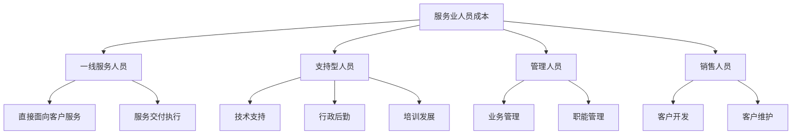
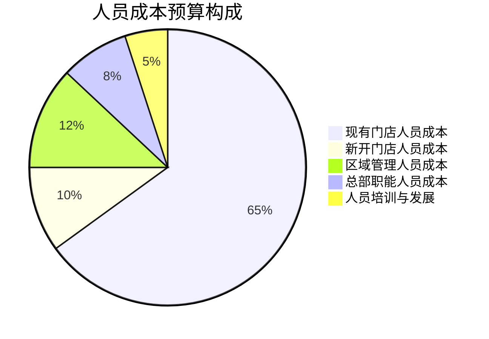
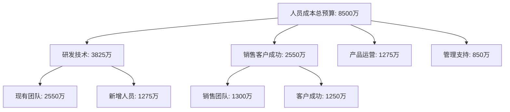

---
{"title":"服务业人员成本规划","date":"2023-11-20","tags":["财务BP","服务业","人员成本","预算规划","人力资源"],"description":"本文详细分析服务业人员成本的特点、结构、预测方法及优化策略","dg-publish":true,"permalink":"/08-财务专业/财务BP/学习内容/行业应用/服务业BP特点/人员成本规划/","dgPassFrontmatter":true}
---


## 引言
人员成本在服务业企业中通常占据总成本的50%-70%，是最核心的成本要素。有效的人员成本规划直接关系到服务企业的盈利能力、服务质量和市场竞争力。本文详细探讨服务业人员成本的特点、结构、预测方法以及优化策略，帮助财务BP更好地进行人员成本预算和管理，平衡短期成本控制与长期服务能力建设的关系。

## 服务业人员成本的基本特征

### 成本占比高

与制造业和贸易业相比，服务业的人员成本占总成本比例显著更高：

1. **核心价值创造**：人是服务的主要提供者，直接创造价值
2. **难以替代性**：许多服务职能难以完全自动化
3. **服务质量依赖**：人员素质直接影响服务质量和客户体验
4. **规模经济效应弱**：服务能力扩张通常需要同比例增加人员

### 结构复杂多样

服务业人员结构比制造业更加复杂：

1. **多层级服务角色**：从一线服务人员到管理人员的多层级结构
2. **专业分工细致**：根据服务流程和客户需求的专业化分工
3. **灵活用工比例高**：兼职、临时工和外包人员比例较高
4. **季节性人员需求**：根据业务波动有较大的季节性需求变化

### 与收入关联度高

服务业人员成本与收入增长呈较强的相关性：

1. **直接服务人员**：收入增长通常需要相应增加服务人力
2. **变动薪酬比例高**：绩效工资、提成、奖金占比较大
3. **服务能力限制**：人员容量直接限制可实现的收入上限
4. **人效提升空间**：通过流程优化和技术应用提升人效的潜力

## 服务业人员成本的主要构成

### 按职能分类



### 按成本属性分类

1. **固定人员成本**
   - 基本工资
   - 社会保险和住房公积金
   - 固定福利项目
   - 长期激励计划

2. **变动人员成本**
   - 业绩提成
   - 绩效奖金
   - 计件/计时薪酬
   - 季节性用工成本

3. **半变动人员成本**
   - 加班工资
   - 班次津贴
   - 服务质量奖励
   - 季节性奖金

### 按直接/间接属性分类

1. **直接人员成本**：直接参与服务交付的人员成本
   - 一线服务人员工资
   - 客户直接接触人员成本
   - 服务交付专业人员费用

2. **间接人员成本**：支持服务交付的人员成本
   - 管理人员成本
   - 行政后勤人员成本
   - 培训发展人员成本

## 服务业不同岗位人员成本特点

| 岗位类型 | 成本特点 | 定价基础 | 变动比例 | 关键成本管理点 |
|---------|---------|---------|---------|--------------|
| 核心专业人员 | 高固定成本，高专业要求 | 市场稀缺性，专业价值 | 固定占比高，20-30%变动 | 留存率，专业发展 |
| 一线服务人员 | 中等基本工资，高变动比例 | 行业标准，服务量 | 40-60%变动比例 | 效率管理，质量控制 |
| 销售人员 | 低基本工资，高提成比例 | 业绩贡献，市场行情 | 60-80%变动比例 | 激励机制，业绩导向 |
| 管理人员 | 高固定薪酬，中等变动比例 | 管理幅度，责任范围 | 30-40%变动比例 | 管理幅度，组织效率 |
| 支持人员 | 固定薪酬为主，变动比例低 | 职能价值，市场水平 | 10-20%变动比例 | 支持效率，流程优化 |

## 服务业人员成本规划方法

### 1. 营收驱动型规划

适用于业务量与人员需求呈正比的服务业态，如零售、餐饮、酒店等。

#### 规划步骤

1. **确定销售/业务量预测**
   - 分析历史销售与人员配比关系
   - 预测未来业务量

2. **建立标准人员配置模型**
   - 制定单位业务量所需的标准人员配置
   - 考虑季节性和时段性波动因素

3. **计算人员需求量**
   - 业务量预测 × 标准人员配置 = 基础人员需求
   - 加入效率提升和服务改进因素

4. **测算人员成本**
   - 按不同岗位类型应用薪酬标准
   - 考虑薪酬增长和福利变化因素

#### 预测公式示例

```
人员需求 = 销售额 ÷ 人均产值

或

人员需求 = 客户数 × 服务深度 ÷ 人均服务能力
```

### 2. 服务能力驱动型规划

适用于服务能力建设先行的业态，如医疗、教育、咨询等。

#### 规划步骤

1. **明确服务能力需求**
   - 分析服务能力缺口
   - 规划服务组合与覆盖范围

2. **设计团队结构和人员配置**
   - 确定核心团队组成
   - 设计专业分工与协作模式

3. **人员获取与培养规划**
   - 外部招聘计划
   - 内部培养路径

4. **制定阶段性人员投入计划**
   - 人员引进时间表
   - 培训与上岗计划

#### 预测公式示例

```
专业人员需求 = 服务项目数 × 项目复杂度 ÷ 人均专业覆盖能力

支持人员比例 = 专业人员数 × 支持配比系数
```

### 3. 客户关系驱动型规划

适用于深度客户关系管理的服务业态，如金融服务、高端咨询、企业服务等。

#### 规划步骤

1. **客户分层与需求分析**
   - 按价值、需求等维度进行客户分层
   - 评估不同层级客户的服务需求

2. **客户经理配置规划**
   - 确定客户经理与客户比例
   - 设计客户分配机制

3. **专业支持团队配置**
   - 确定专业支持人员配比
   - 建立协作服务模式

4. **绩效与激励体系设计**
   - 基于客户价值贡献的绩效评估
   - 长短期激励平衡机制

#### 预测公式示例

```
客户经理数量 = 高价值客户数 ÷ 标准管理客户数 + 中等价值客户数 ÷ 标准管理客户数 × 调整系数

专业支持人员 = 客户经理数量 × 支持配比系数
```

### 4. 项目驱动型规划

适用于项目制服务业态，如IT服务、工程咨询、广告创意等。

#### 规划步骤

1. **项目储备与转化预测**
   - 分析销售漏斗和项目转化率
   - 预测项目数量和规模分布

2. **项目资源需求测算**
   - 按项目类型标准化资源需求
   - 设定项目实施阶段人员配置

3. **人员池与资源调配规划**
   - 核心人员与弹性人员规划
   - 跨项目资源共享机制

4. **项目人员成本测算**
   - 直接项目人员成本计算
   - 间接支持和管理成本分摊

#### 预测公式示例

```
项目执行人员需求 = Σ(各类项目数量 × 项目标准人员配置 × 平均实施周期)

项目管理人员需求 = 项目执行人员 ÷ 管理跨度
```

## 服务业人员成本预测方法

### 自下而上预测法

从岗位和个人层面进行详细测算，适用于人员结构相对稳定、规模较小的服务企业。

#### 步骤与方法

1. **编制岗位人员编制计划**
   - 确定各部门/职能岗位需求
   - 规划人员进出计划

2. **制定个人薪酬计划**
   - 现有员工薪酬调整规划
   - 新进人员薪酬水平测算

3. **计算福利及附加成本**
   - 社保、公积金测算
   - 福利项目成本计算

4. **汇总形成总人员成本预算**
   - 按部门汇总
   - 按成本性质分类汇总

#### 优势与局限

- **优势**：精确度高，细节掌控好
- **局限**：工作量大，难以应对大规模或快速变化

### 自上而下预测法

基于历史数据和关键参数进行整体测算，适用于规模大、标准化程度高的服务企业。

#### 步骤与方法

1. **确定关键人效指标**
   - 人均产值/人均利润
   - 人员成本占收入比例

2. **预测收入规模与结构**
   - 各业务线收入预测
   - 各区域/渠道收入结构

3. **应用预测参数**
   - 应用人效参数计算总人数
   - 应用成本比例计算总成本

4. **进行结构性分解**
   - 按职能大类分解
   - 考虑结构优化方向调整

#### 优势与局限

- **优势**：效率高，适合快速变化环境
- **局限**：精确度较低，细节掌握不足

### 驱动因素预测法

基于业务驱动因素建立人员成本预测模型，适合业务与人员关系明确的服务企业。

#### 步骤与方法

1. **识别关键驱动因素**
   - 业务量指标(客户数、订单量等)
   - 服务深度指标(客户接触频次、服务时长等)

2. **建立因素与人员关系模型**
   - 确定驱动因素与人员需求的函数关系
   - 设定不同场景下的参数变化

3. **预测驱动因素变化**
   - 基于业务规划预测驱动因素
   - 分析驱动因素变化趋势

4. **计算人员需求与成本**
   - 应用模型计算人员需求
   - 转换为具体成本预算

#### 优势与局限

- **优势**：逻辑性强，与业务关联紧密
- **局限**：模型构建复杂，参数需精确校准

## 服务业人员成本管理策略

### 结构优化策略

通过优化人员结构提升人员投入效益。

1. **金字塔结构优化**
   - 合理设置管理层级
   - 扩大管理幅度
   - 降低管理人员比例

2. **核心-外围人员结构**
   - 明确核心能力岗位
   - 建设核心人才团队
   - 灵活配置外围支持人员

3. **专业化分工优化**
   - 提高专业分工效率
   - 减少能力重叠
   - 提升专业人员利用率

### 弹性用工策略

增加人员成本的可变性，提高成本结构的灵活性。

1. **多元雇佣模式**
   - 正式员工 + 合同工
   - 全职人员 + 兼职人员
   - 内部员工 + 外包人员

2. **工作弹性安排**
   - 弹性工时制
   - 季节性排班
   - 共享员工机制

3. **业务外包模式**
   - 非核心环节外包
   - 专业服务采购
   - 平台化协作

### 技术赋能策略

利用技术手段提升人员效能，降低边际人工成本。

1. **智能化工具应用**
   - 自助服务技术
   - 服务自动化工具
   - 智能辅助系统

2. **流程数字化转型**
   - 服务流程再造
   - 数字化工作流
   - 标准化服务模块

3. **数据驱动决策**
   - 智能排班系统
   - 预测性资源调配
   - 绩效实时监控

### 激励机制优化

通过激励机制优化提高人效和人才留存。

1. **薪酬结构优化**
   - 提高变动薪酬比例
   - 建立差异化薪酬机制
   - 长短期激励平衡

2. **多元化激励手段**
   - 金融性激励(薪酬、奖金)
   - 发展性激励(培训、晋升)
   - 认可性激励(荣誉、表彰)

3. **绩效导向文化**
   - 明确KPI指标体系
   - 强化绩效-回报关联
   - 建立正向激励循环

## 服务业人员成本预算案例分析

### 案例一：连锁餐饮企业人员成本预算

#### 背景
某连锁餐饮品牌在全国拥有120家门店，计划新财年开设15家新店，同时提升现有门店的服务质量和运营效率。人员成本占总成本的40%左右。

#### 人员构成
- 门店一线员工(服务员、厨师等)：85%
- 区域管理人员：8%
- 总部职能人员：7%

#### 预算方法与流程

1. **门店标准配置模型**

建立以营业额为基础的标准人员配置模型：
```
门店标准人数 = 固定基础人数 + 每增加10万月营业额增加人数
```

具体参数：
- 小型门店(月营业额<50万)：固定8人 + 每10万增加1.5人
- 中型门店(月营业额50-100万)：固定12人 + 每10万增加1.2人
- 大型门店(月营业额>100万)：固定18人 + 每10万增加1人

2. **人效提升计划影响**

通过流程优化和技术应用，计划人效提升5%：
```
调整后人员需求 = 标准配置人数 × (1 - 人效提升率)
```

3. **新店人员爬坡曲线**

新店从筹备到成熟分为四个阶段，人员配置逐步到位：
- 筹备期(开业前1个月)：标准配置的50%
- 初期(开业1-3个月)：标准配置的80%
- 成长期(4-6个月)：标准配置的90%
- 成熟期(7个月以后)：完全标准配置

4. **人员成本计算**

不同岗位应用不同的平均成本：
- 一线员工：月均5000元/人
- 店长：月均12000元/人
- 区域经理：月均18000元/人
- 总部职能：月均15000元/人

#### 预算结果



#### 关键假设
1. 平均门店营业额同比增长8%
2. 人员流失率控制在25%以内
3. 平均薪酬水平上涨5%
4. 新店首年达到成熟店80%的营业额

#### 敏感性分析
对关键变量进行敏感性分析，评估其对人员成本预算的影响：

| 变量变化 | 人员成本变化 | 占收入比变化 |
|---------|------------|-------------|
| 营业额±10% | ±3.5% | ∓0.7% |
| 人效提升±2% | ∓1.8% | ∓0.4% |
| 平均薪酬±3% | ±2.8% | ±0.6% |
| 新店数量±3家 | ±2.0% | ±0.3% |

### 案例二：金融科技公司人员成本预算

#### 背景
某金融科技公司提供企业支付和财资管理SaaS服务，业务快速增长。公司计划在新财年扩大技术研发和销售团队规模，人员成本占总成本的65%。

#### 人员构成
- 研发技术人员：45%
- 销售与客户成功：30%
- 产品与运营：15%
- 管理与支持：10%

#### 预算方法与流程

1. **研发人员规划**

基于产品开发路线图和技术栈需求：
```
研发人员需求 = 现有维护人力 + 新功能开发人力 + 架构升级人力

新功能开发人力 = Σ(功能点 × 复杂度系数 ÷ 开发效率)
```

产品路线图分解为120个功能点，按复杂度分为高中低三档。

2. **销售团队规划**

基于销售目标和客户获取计划：
```
销售人员需求 = 目标新增客户数 ÷ (人均年获客数 × 成功率)
```

目标新增客户300家，人均年获客15家，平均成功率40%。

3. **客户成功团队规划**

基于客户服务比例：
```
客户成功经理数量 = 客户总数 ÷ 标准服务客户数

标准服务客户数根据客户等级不同而调整：
- 钻石级：1:10
- 黄金级：1:30
- 标准级：1:100
```

4. **薪酬结构设计**

不同岗位采用不同薪酬结构：
- 研发人员：固定占比70%，年终奖占比30%
- 销售人员：固定占比40%，提成占比60%
- 客户成功：固定占比60%，绩效占比40%
- 职能部门：固定占比80%，绩效占比20%

#### 预算结果与分析

年度人员成本总预算8500万元，比上年增长35%。



#### 关键假设
1. 研发人员市场薪资上涨15%
2. 销售人员平均完成目标达成率110%
3. 高级人才招聘周期平均3个月
4. 员工留存率：技术80%，销售75%，其他85%

#### 风险与应对
1. **招聘不达预期风险**
   - 提前启动校园招聘
   - 建立人才储备池
   - 制定外包应急方案

2. **人员成本超预算风险**
   - 分阶段释放招聘名额
   - 设立季度成本控制点
   - 强化绩效与薪酬挂钩机制

3. **团队生产力风险**
   - 加强新员工培训
   - 优化团队结构与协作
   - 建立技术与业务赋能体系

## 服务业人员成本优化方向

### 数字化转型与自动化

利用技术手段减少人工依赖，提高人效：

1. **客户自助服务**
   - 自助服务终端
   - 线上自助平台
   - 智能客服机器人

2. **运营流程自动化**
   - 流程机器人(RPA)
   - 智能文档处理
   - 自动化决策系统

3. **智能资源调配**
   - AI排班系统
   - 智能任务分配
   - 预测性人力规划

### 组织结构优化

通过组织设计提升人力资源效能：

1. **扁平化管理**
   - 减少管理层级
   - 扩大管理幅度
   - 授权与自组织团队

2. **敏捷组织模式**
   - 跨职能小团队
   - 项目制矩阵组织
   - 动态资源分配

3. **共享服务中心**
   - 集中化职能服务
   - 标准化服务流程
   - 资源共享与复用

### 人才发展与效能提升

提升现有人才效能而非单纯增加人数：

1. **技能提升计划**
   - 系统化培训体系
   - 多技能培养
   - 内部知识传承

2. **绩效文化建设**
   - 目标与关键结果(OKR)
   - 持续绩效反馈
   - 高绩效团队建设

3. **员工体验提升**
   - 数字化工作环境
   - 健康关怀计划
   - 职业发展路径

## 相关链接

- [[08-财务专业/财务BP/学习内容/行业应用/服务业BP特点/服务业成本结构特点\|服务业成本结构特点]]
- [[08-财务专业/财务BP/学习内容/行业应用/服务业BP特点/服务业收入模式特点\|服务业收入模式特点]]
- [[08-财务专业/财务BP/学习内容/行业应用/服务业BP特点/服务能力与扩张预算\|服务能力与扩张预算]]
- [[08-财务专业/财务BP/学习内容/预算编制基础/人员预算/人力资源规划与预算\|人力资源规划与预算]]
- [[08-财务专业/财务BP/学习内容/预算编制基础/人员预算/人员成本构成\|人员成本构成]]

## 参考文献

1. 刘志强 (2022). 《服务型组织人力资源成本管理》. 中国人民大学出版社.
2. 赵明华, 王丽 (2021). 《服务业人效管理与成本优化》. 经济管理出版社.
3. Kaplan, R. S., & Anderson, S. R. (2019). *Time-Driven Activity-Based Costing in Service Organizations*. Harvard Business Review Press.
4. 德勤人力资本咨询 (2023). 《服务业人才战略与成本优化》. 德勤研究报告.
5. 中国人力资源开发研究会 (2023). 《中国服务业人才发展报告》.
6. Phillips, J., & Phillips, P. (2020). *Human Capital ROI: Measuring the Economic Value of Employee Performance*. McGraw-Hill. 