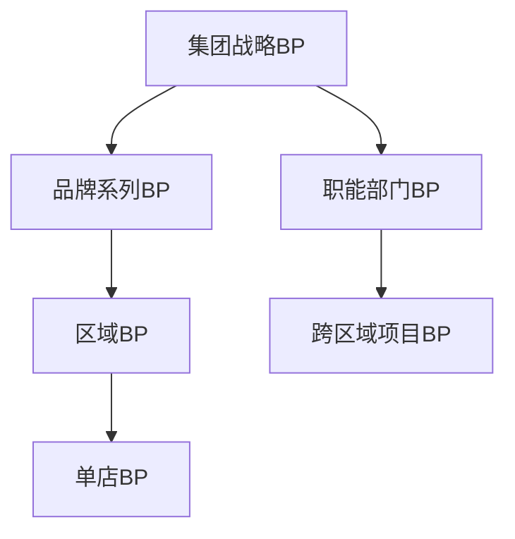
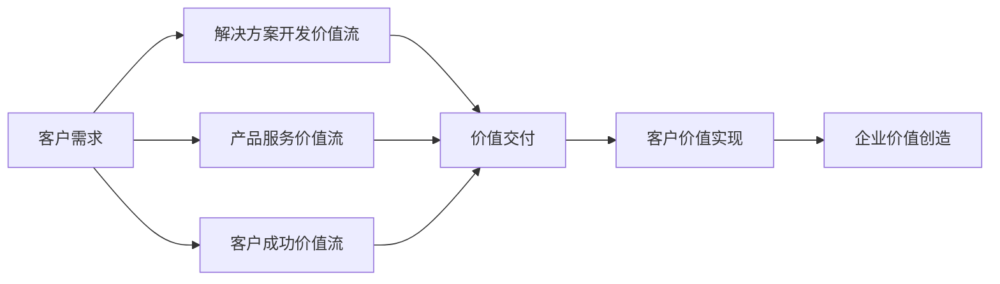
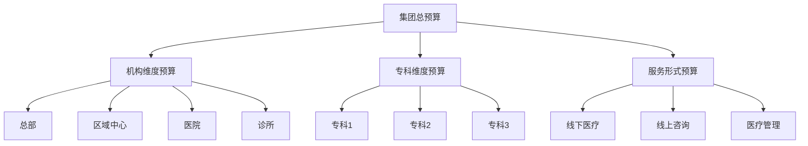
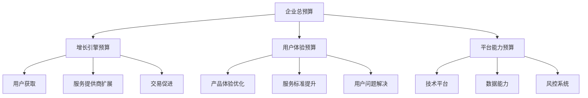

---
{"title":"服务业BP案例分析","date":"2023-11-30","tags":["财务BP","服务业","案例分析","预算规划","行业应用"],"description":"本文通过多个行业实例详细分析服务业BP的应用方法与实践经验","dg-publish":true,"permalink":"/08-财务专业/财务BP/学习内容/行业应用/服务业BP特点/服务业BP案例分析/","dgPassFrontmatter":true}
---

## 引言

服务业在现代经济中占据主导地位，其业务规划和预算编制(BP)工作具有鲜明的行业特性。财务BP作为服务企业战略落地的关键工具，连接企业战略目标与运营执行，在业绩预测、资源配置和风险管理方面发挥着至关重要的作用。

本文通过分析不同服务行业的典型BP案例，详细阐述服务业BP的关键特征、方法论与应用实践，展示财务BP如何在不同服务业态中因地制宜地支持企业决策和价值创造。通过案例分享，帮助读者深入理解服务业BP的精髓并从中汲取实用经验。

## 案例一：高端连锁酒店集团的多层次BP体系

### 企业背景

某高端连锁酒店集团在全国拥有65家酒店，旗下有三个品牌系列，年营业额约50亿元。企业计划未来三年内扩张到100家酒店，同时提升高端品牌的市场份额与盈利能力。

### BP面临的挑战

1. **多元业态协同**：旗下不同品牌定位和业态差异大
2. **强周期性特征**：酒店业务具有明显的季节性波动
3. **固定成本高**：物业和人员成本占比大，运营杠杆高
4. **集团与门店关系**：总部和门店的权责划分需平衡

### BP体系设计与实施

#### 多层次BP架构

企业建立了三层BP体系：

#### 关键BP内容与特点

1. **集团战略BP**
   - 五年滚动战略规划
   - 品牌矩阵与市场定位
   - 资源配置优先级
   - 核心财务指标目标

2. **品牌系列BP**
   - 品牌差异化定位
   - 客群与价格策略
   - 服务标准与成本结构
   - 品牌扩张路径

3. **单店BP**
   - 客房收入预测：入住率、平均房价(ADR)
   - 餐饮及其他收入预算
   - 人力配置与能源成本预算
   - 营销推广计划

#### 预算编制流程创新

集团采用"自上而下与自下而上结合"的弹性预算方法：

1. **总部战略目标分解**
   - 设定关键业绩指标(KPIs)
   - 分解至品牌、区域和门店层级
   - 确定非协商指标与弹性指标

2. **门店自主预算编制**
   - 基于本地市场情况制定详细预算
   - 门店经理对自主指标拥有决策权
   - 资源需求自下而上提报

3. **多轮协商与平衡**
   - 区域层面初步平衡
   - 品牌系列层面资源调配
   - 集团层面最终批准

#### 数字化BP工具应用

企业开发了集成BP系统，实现：

- 实时数据采集与分析
- 多维度预算模拟
- 情景分析与敏感性测试
- 动态预算调整机制

### 创新亮点与成效

1. **基于客户价值的BP观**
   - 将客户生命周期价值(LTV)纳入BP核心指标
   - 根据客群分层制定差异化资源投入策略
   - 会员投资回报率成为关键决策依据

2. **季节性波动应对机制**
   - 建立季节性人力配置模型
   - 制定旺季资源优化与淡季成本控制策略
   - 跨区域资源平衡与调配机制

3. **动态预算调整机制**
   - 月度滚动预测与季度预算修订
   - 触发式预算调整规则
   - 基于市场指标的自动预警系统

### 取得的成就

实施新BP体系后，企业取得显著成果：

- RevPAR(每可用房收入)同比提升12%
- 运营成本占比降低3个百分点
- 集团EBITDA率提升至32%
- 新店培育期缩短30%
- 预算准确性提升至95%以上

## 案例二：IT服务企业基于价值流的BP改革

### 企业背景

某IT服务企业提供企业级软件开发、云服务和数字化咨询服务，年收入约18亿元，员工2000人。公司正经历从传统项目制向混合服务模式的转型，同时积极拓展云服务和订阅收入。

### BP面临的挑战

1. **业务模式多元**：项目制、托管服务、产品订阅并存
2. **收入确认复杂**：不同业务线收入确认机制差异大
3. **人力资源密集**：人力成本占总成本75%以上
4. **客户需求不确定性**：定制化服务需求预测难度大

### BP变革与实践创新

#### 从职能式预算到价值流预算

公司摒弃传统部门式预算，转向基于价值流的预算管理：

#### 价值流预算设计

1. **价值流识别与定义**
   - 根据客户价值链划分核心价值流
   - 确定价值流的输入、活动与输出
   - 建立价值流关键绩效指标

2. **价值流团队预算授权**
   - 价值流领导获得预算决策权
   - 跨职能资源整合与分配
   - 基于价值创造的资源投入机制

3. **成本与收入联动管理**
   - 直接关联成本投入与收入产出
   - 价值流投资回报率评估
   - 跨价值流资源协同优化

#### 特色预算方法

企业引入多种创新预算方法：

1. **容量预算法**
   - 以人力资源容量为基础单位
   - 跨价值流资源共享与调配
   - 按客户价值的资源优先分配

2. **超越财年的项目预算**
   - 项目生命周期预算取代年度切割
   - 滚动预算更新与调整
   - 项目工作量与价值关联评估

3. **敏捷投资决策机制**
   - 分阶段投资决策点(Stage Gate)
   - 最小可行产品(MVP)测试投入
   - 基于验证的增量投资模式

### 数据驱动预算决策

企业建立了完整的数据分析体系支持BP决策：

1. **前瞻性指标预测**
   - 销售漏斗转化率分析
   - 客户合同价值预测模型
   - 资源利用率曲线预测

2. **动态资源优化**
   - 实时资源利用率监控
   - 跨项目资源平衡模型
   - 技能矩阵与需求匹配分析

3. **价值创造评估**
   - 客户满意度与留存关联分析
   - 人均创收与利润贡献率
   - 价值流ROI计算与比较

### 变革成效与经验总结

#### 主要成就

- 资源利用率提升15%
- 项目交付周期缩短25%
- 客户续约率提升至92%
- 订阅收入占比从18%提升至32%
- 人均利润贡献增加22%

#### 关键经验总结

1. **BP与业务模式耦合**
   - 预算模式需与业务模式相匹配
   - 混合收入模式需差异化管理
   - 价值导向替代控制导向

2. **人才赋能是关键**
   - 培养财务业务复合型人才
   - 提升业务经理的财务决策能力
   - 建立跨职能协作机制

3. **敏捷性与战略性平衡**
   - 短期灵活性与长期投资平衡
   - 价值创造与成本控制协同
   - 授权与问责相结合

## 案例三：医疗服务集团的多维度BP体系

### 企业背景

某医疗服务集团拥有15家专科医院及30家诊所，覆盖8个城市，年收入约25亿元。企业提供多个专科医疗服务，同时快速拓展线上医疗服务平台。

### BP面临的特殊挑战

1. **强监管环境**：医疗服务受严格监管，预算合规性要求高
2. **服务质量与成本平衡**：医疗质量不可妥协，成本控制困难
3. **技术与服务融合**：传统医疗与数字化服务边界模糊
4. **医保政策影响**：政策变化对收入结构影响显著

### BP设计与实施方案

#### 多维度预算矩阵

企业设计了三维预算矩阵体系：

1. **机构维度**：总部、区域中心、医院、诊所
2. **专科维度**：不同临床专科预算单元
3. **服务形式**：线下医疗、线上咨询、医疗管理

#### 医疗服务特色预算方法

1. **医保导向收入预测**
   - 医保政策变化情景分析
   - 医保额度与控费目标分解
   - 自费服务与医保服务差异化预算

2. **医疗质量目标联动**
   - 质量指标与预算挂钩
   - 医疗风险准备金设置
   - 质量改进项目专项预算

3. **医疗资源容量规划**
   - 医师出诊量与收入关联
   - 设备利用率与投资回报
   - 床位周转与护理配比

#### 特色预算工具创新

1. **专科DRG成本核算**
   - 基于疾病诊断相关分组的成本核算
   - 标准成本与实际成本对比分析
   - 专科盈利能力评估

2. **医生个人经济核算**
   - 医生创收与成本贡献分析
   - 绩效与团队协作价值评估
   - 医生资源价值最大化配置

3. **临床路径与预算整合**
   - 标准临床路径成本测算
   - 诊疗过程资源消耗分析
   - 医疗价值与资源投入优化

### 线上线下融合的预算创新

1. **患者全生命周期服务预算**
   - 从获客到康复全流程资源规划
   - 线上引流与线下转化关联预算
   - 患者留存与复诊价值评估

2. **线上平台资源配置**
   - 技术基础设施投入与回报分析
   - 线上医生资源调配模型
   - 流量获取与转化效率预算

3. **价值医疗导向的资源配置**
   - 治疗效果与成本效益分析
   - 预防性服务投入回报测算
   - 患者满意度提升投入计划

### 取得的主要成效

- 医疗服务单位成本下降8%，同时患者满意度提升12%
- 线上引流转化率提升30%，患者获取成本降低25%
- 医护人员单位时间产值提升18%
- 设备利用率提升22%
- 整体毛利率提升3.5个百分点

### 经验与启示

1. **医疗行业BP需平衡多重价值**
   - 医疗质量、患者体验与经济效益平衡
   - 短期绩效与长期健康发展协调
   - 合规要求与效率提升并重

2. **数据驱动决策是关键**
   - 医疗大数据支持精准预测
   - 临床与财务数据整合分析
   - 前瞻指标与滞后指标结合

3. **专业团队赋能不可少**
   - 医疗专业人员财务认知提升
   - 财务人员医疗知识培养
   - 跨专业沟通机制建设

## 案例四：共享经济企业的轻资产BP模式

### 企业背景

某服务共享平台企业主要提供本地生活服务对接，连接超过100万服务提供者和2000万用户，年交易额60亿元，平台收入8亿元。平台正从快速扩张期向精细化运营阶段转变。

### BP面临的挑战

1. **双边网络效应**：需平衡供需双方资源投入
2. **轻资产重现金流**：现金流管理压力大
3. **高度可变成本结构**：主要成本随业务量变动
4. **快速迭代业务模式**：业务模式频繁变化

### BP设计创新

#### 业务增长导向预算

企业围绕"增长指标"设计预算体系：

1. **用户增长预算**
   - 新用户获取成本(CAC)目标分解
   - 用户留存路径投资规划
   - 用户活跃度提升资源配置

2. **供给侧能力预算**
   - 服务提供者招募与激活预算
   - 服务质量提升项目投入
   - 供给端粘性与活跃度投资

3. **交易增长预算**
   - 交易频次提升资源配置
   - 客单价优化策略投入
   - 撮合效率提升技术投资

#### 特色预算方法

1. **弹性预算自动调整机制**
   - 基于关键业绩指标的预算触发规则
   - 业务量与成本弹性系数模型
   - 自动扩缩的资源投入框架

2. **单位经济模型预算法**
   - 单用户价值(LTV)驱动投资决策
   - 单位交易贡献率阈值控制
   - 投资回收周期管理

3. **场景化预算细分**
   - 按服务场景细分预算单元
   - 场景交叉引流资源优化
   - 场景生命周期阶段差异化投入

#### 现金流管理创新

1. **流动性周期预算**
   - 季节性现金流波动预测
   - 现金转换周期优化计划
   - 流动性风险缓冲机制

2. **资金使用效率目标**
   - 资金使用效率KPI
   - 投入节奏与效果匹配
   - 资源配置优先级机制

3. **扩张与盈利平衡策略**
   - 核心业务与新业务资源平衡
   - 市场份额与盈利目标动态调整
   - 战略性投入与近期回报平衡

### 数据驱动的BP实践

1. **实时预算执行监控**
   - 核心指标每日追踪
   - 预算执行偏差自动预警
   - 资源使用效率实时评估

2. **算法辅助预算优化**
   - 机器学习预测需求趋势
   - 智能资源配置建议
   - 多变量优化的预算方案

3. **超细粒度预算分析**
   - 城市-品类-渠道三维分析
   - 用户群-行为-价值关联分析
   - 时段-区域-活动效果分析

### 实施成效与关键经验

#### 主要成效

- 用户获取成本降低28%
- 核心城市盈亏平衡时间缩短45%
- 现金转换周期优化30%
- 资金使用效率提升35%
- 营销投入ROI提升50%

#### 关键经验

1. **以用户价值为核心的BP思维**
   - 用户终身价值驱动资源分配
   - 服务能力与用户体验平衡
   - 长期可持续增长导向

2. **灵活性与纪律性的平衡**
   - 预算弹性机制与底线管理
   - 动态资源调整与结果问责
   - 创新试错与效率优化并重

3. **前瞻指标与投资周期管理**
   - 建立预测性指标预警体系
   - 不同周期投资组合管理
   - 短期战术与长期战略协调

## 综合启示与服务业BP最佳实践

### 服务业BP差异化特点

从上述案例可总结服务业BP的关键特点：

1. **人本资源主导**
   - 人力资源规划与预算高度关联
   - 服务能力与人员素质直接相关
   - 人效提升是成本优化核心

2. **服务质量与成本平衡**
   - 服务标准与成本结构关联设计
   - 质量提升投入需考虑回报周期
   - 差异化服务对应差异化资源配置

3. **资产轻型与现金流管理**
   - 多数服务行业固定资产占比低
   - 营运资金管理尤为重要
   - 现金转换周期管理成为关键

4. **多维度预算协同**
   - 职能、业务线、区域多维度整合
   - 成本结构与收入模式紧密匹配
   - 固定成本与可变成本动态平衡

### 服务业BP最佳实践建议

1. **以客户为中心的BP设计**
   - 将客户生命周期价值纳入预算核心
   - 客户体验与服务标准预算匹配
   - 基于客户细分的资源差异化分配

2. **能力建设与价值交付导向**
   - 核心能力建设作为战略性投入
   - 服务能力与市场需求动态匹配
   - 能力建设与价值实现平衡管理

3. **数字化与敏捷BP转型**
   - 实时数据支持动态预算调整
   - 敏捷预算响应市场快速变化
   - 数字工具提升预算编制效率

4. **前瞻性指标与预测模型**
   - 建立业务先行指标预警体系
   - 运用场景模拟优化资源配置
   - 增强预测能力应对不确定性

### 未来服务业BP发展趋势

1. **超越传统年度周期**
   - 持续滚动预算替代固定年度预算
   - 基于价值流的预算编制方法普及
   - 敏捷与适应性预算理念兴起

2. **数据智能驱动决策**
   - AI辅助预测与资源优化
   - 大数据分析支持精准预算
   - 预测分析替代历史外推

3. **全价值链整合视角**
   - 从单点服务转向全场景预算
   - 生态系统资源协同预算模式
   - 跨界服务融合的资源配置模型

## 相关链接

- [[08-财务专业/财务BP/学习内容/行业应用/服务业BP特点/服务业成本结构特点\|服务业成本结构特点]]
- [[08-财务专业/财务BP/学习内容/行业应用/服务业BP特点/服务业收入模式特点\|服务业收入模式特点]]
- [[08-财务专业/财务BP/学习内容/行业应用/服务业BP特点/人员成本规划\|人员成本规划]]
- [[08-财务专业/财务BP/学习内容/行业应用/服务业BP特点/服务能力与扩张预算\|服务能力与扩张预算]]
- [[08-财务专业/财务BP/学习内容/财务预测与模型/敏感性分析/敏感性分析的目的与方法\|敏感性分析的目的与方法]]

## 参考文献

1. 李永强 (2022). 《服务业财务管理与预算实务》. 中国财政经济出版社.
2. 王志远, 陈明 (2021). 《服务企业全面预算管理》. 企业管理出版社.
3. Kaplan, R. S., & Norton, D. P. (2019). *The Strategy-Focused Organization: How Balanced Scorecard Companies Thrive in the New Business Environment*. Harvard Business Review Press.
4. 普华永道 (2023). 《中国服务业财务转型白皮书》. 普华永道研究报告.
5. 中国总会计师协会 (2023). 《中国企业预算管理优秀案例集》.
6. Hope, J., & Fraser, R. (2020). *Beyond Budgeting: How Managers Can Break Free from the Annual Performance Trap*. Harvard Business School Press. 