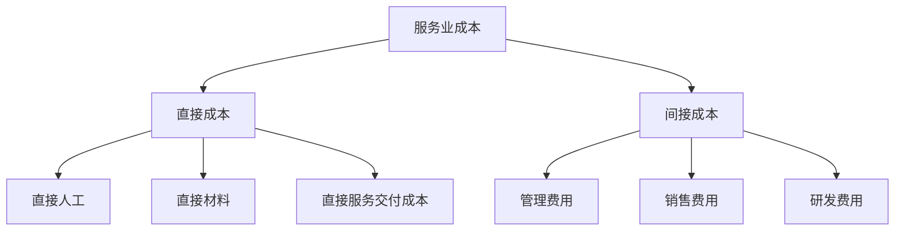
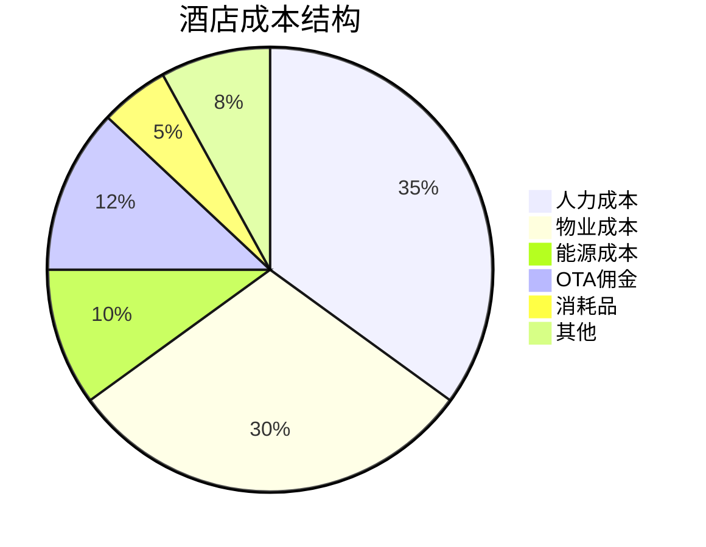

---
{"title":"服务业成本结构特点","date":"2023-11-15","tags":["财务BP","服务业","成本分析","行业应用"],"description":"本文详细分析了服务业成本结构的特点、分类及管理方法","dg-publish":true,"permalink":"/08-财务专业/财务BP/学习内容/行业应用/服务业BP特点/服务业成本结构特点/","dgPassFrontmatter":true}
---

## 引言

服务业作为经济中日益重要的部分，其成本结构与制造业有着显著区别。服务业企业的成本管理直接影响其盈利能力和市场竞争力。本文将详细探讨服务业成本结构的特点、分类方法以及优化策略，为财务BP提供行业分析参考。

## 服务业成本的基本概念

服务业成本是指服务企业在提供服务过程中发生的各种经济资源消耗。与制造业不同，服务业成本具有以下基本特征：

1. **无形性**：服务产品通常是无形的，难以实物形式存储
2. **同时性**：服务的生产与消费往往同时发生
3. **异质性**：服务质量受到多种因素影响，标准化程度较低
4. **易逝性**：服务不能被储存，未使用的服务能力无法保留

## 服务业成本的构成要素

### 人力资源成本

人力资源成本在服务业中占据主导地位，通常包括：

- 工资薪金
- 社会保险与福利
- 培训与发展支出
- 绩效奖金
- 招聘成本

### 设施与设备成本

- 场地租金/物业费
- 设备购置与维护
- 水电气等能源消耗
- 资产折旧
- IT基础设施成本

### 运营管理成本

- 行政管理成本
- 市场营销费用
- 客户关系管理
- 质量控制成本
- 通信与技术支持费用

### 服务交付成本

- 直接服务材料成本
- 外包服务成本
- 知识产权使用费
- 交通与差旅成本
- 客户交互成本

## 服务业成本的分类方法

### 按成本性质分类

### 按成本行为分类

- **固定成本**：与服务量无关的成本，如租金、基础设施折旧等
- **变动成本**：随服务量变动的成本，如直接服务材料、佣金等
- **混合成本**：兼具固定和变动特性的成本，如水电费等

### 按服务流程分类

- **前台成本**：与客户直接接触的服务过程成本
- **后台成本**：支持服务交付的内部运营成本
- **基础设施成本**：支持整体服务系统的基础设施投入

## 服务业成本结构的行业特点

### 高人力成本比重

服务业的核心是人，人力成本通常占总成本的50%-70%，远高于制造业。这使得人力资源管理和效率优化成为服务业成本控制的核心。

### 固定成本占比较高

服务企业通常需要维持一定规模的服务能力以应对需求波动，导致固定成本占比较高，这增加了运营杠杆，使得收入波动对利润的影响更为显著。

### 规模经济效应较弱

相比制造业，服务业的规模经济效应通常较弱，增加服务规模不一定能显著降低单位成本，特别是在高度定制化的服务领域。

### 标准化程度影响成本结构

服务标准化程度越高，变动成本比例越低；定制化程度越高，变动成本比例越高。不同服务业态在标准化与定制化之间的平衡点不同。

### 数字技术对成本结构的影响

数字化转型正在重塑服务业成本结构，云计算、人工智能等技术降低了传统固定成本，但增加了技术投入与维护成本。

## 不同服务业态的成本结构比较

| 服务业态 | 人力成本占比 | 固定成本占比 | 变动成本占比 | 关键成本驱动因素 |
|---------|------------|------------|------------|----------------|
| 酒店业   | 30%-40%    | 50%-60%    | 15%-25%    | 物业成本、能源消耗 |
| 咨询业   | 60%-75%    | 15%-25%    | 10%-15%    | 专业人才薪酬     |
| 餐饮业   | 25%-35%    | 30%-40%    | 30%-40%    | 食材成本、租金   |
| 零售业   | 15%-25%    | 30%-40%    | 40%-50%    | 商品成本、租金   |
| IT服务业 | 50%-65%    | 20%-30%    | 15%-25%    | 技术人才薪酬     |
| 金融服务 | 40%-55%    | 25%-35%    | 15%-25%    | 合规成本、人才成本|

## 服务业成本管理的关键策略

### 基于活动的成本管理(ABC)

将成本分配到具体服务活动，识别价值链中的成本驱动因素，优化资源配置。

### 需求管理与产能平衡

通过预测分析、价格差异化等手段，平衡服务需求与产能利用，降低闲置产能成本。

### 服务标准化与流程优化

在保证服务质量的前提下，提高服务标准化程度，简化服务流程，降低变动成本。

### 技术赋能与自动化

利用数字化工具、自助服务技术和自动化系统，减少人工干预，提高服务效率。

### 外包与共享经济模式

将非核心服务外包，利用共享经济平台降低固定资产投入，实现成本结构的灵活性。

## 案例分析

### 案例一：某连锁酒店集团的成本结构优化

#### 背景
某连锁酒店集团在全国拥有200多家门店，面临市场竞争加剧和OTA佣金上升的双重压力，需要优化成本结构以维持盈利能力。

#### 成本结构现状

#### 挑战
1. 固定成本占比高达65%，导致在淡季入住率下降时盈利能力显著恶化
2. OTA渠道依赖度高，佣金成本持续上升
3. 能源成本随市场波动，难以控制
4. 服务标准化与个性化之间的平衡难以把握

#### 优化策略
1. **智能化运营系统导入**：投资智能化客房控制系统，实现无人值守和能源智能管理，降低人力与能源成本
2. **动态定价系统**：基于预测分析的动态定价，提高淡季入住率，平滑需求波动
3. **直销渠道建设**：建立会员制度和自有预订平台，降低OTA依赖度
4. **柔性员工排班**：建立核心员工+灵活用工的人员结构，使人力成本半变动化
5. **标准化服务模块**：将服务分解为标准模块，客人可自由组合，既保持个性化又提高效率

#### 成效
1. 人力成本占比从35%降至28%
2. 能源成本降低25%
3. OTA佣金占比降至8%
4. 运营杠杆度降低，抗风险能力增强

### 案例二：某在线教育平台的成本结构转型

#### 背景
某在线教育平台最初采用录播课程为主的模式，后转向直播+辅导的模式，成本结构发生显著变化。

#### 成本结构转变

**转型前**:
- 内容制作成本(一次性固定成本): 60%
- 平台运维成本: 25%
- 营销成本: 15%
- 变动成本占比低，边际成本几乎为零

**转型后**:
- 教师薪酬(半变动成本): 45%
- 平台运维成本: 20%
- 营销成本: 20%
- 学生服务成本: 15%
- 变动成本占比明显上升

#### 挑战
1. 业务模式转变导致成本结构从"重前期投入、低边际成本"转向"持续性高人力投入"
2. 教师供给的季节性波动难以管理
3. 服务质量标准化难度增加
4. 规模扩张不再带来显著的单位成本下降

#### 优化策略
1. **分层级教学体系**：设立首席教师、辅导教师和助教三级体系，优化师资结构和成本
2. **混合教学模式**：将直播与录播结合，在保证交互性的同时降低人力依赖
3. **AI辅助工具**：开发智能批改、个性化学习路径推荐等工具，减少常规辅导工作量
4. **教师共享平台**：建立跨机构的教师共享机制，平滑供需波动
5. **服务模块化**：将教学服务拆分为标准化模块，学生可按需选择

#### 成效
1. 教师成本占比降至38%
2. 服务质量稳定性提高30%
3. 学生留存率提升25%
4. 实现了较好的规模经济效应

## 服务业成本管理的发展趋势

1. **数据驱动决策**：利用大数据分析优化定价和资源配置
2. **自动化与AI应用**：通过技术减少人工干预，降低人力依赖
3. **共享经济模式**：资源共享降低固定成本
4. **敏捷成本结构**：增加成本弹性，适应市场波动
5. **可持续发展投入**：环保与社会责任成本占比上升
6. **全渠道融合**：线上线下渠道协同降低获客和服务成本

## 相关链接

- [[08-财务专业/财务BP/学习内容/行业应用/制造业BP特点/制造业成本结构特点\|制造业成本结构特点]]
- [[财务BP/学习内容/财务分析/成本分析/成本控制方法\|成本控制方法]]
- [[财务BP/学习内容/财务分析/盈利能力分析/盈亏平衡分析\|盈亏平衡分析]]

## 参考文献

1. 陈志军 (2021). 《服务经济时代的成本管理》. 经济管理出版社.
2. 王立彦, 李明 (2022). 《服务业财务管理实务》. 中国财政经济出版社.
3. Kaplan, R. & Norton, D. (2018). 《服务型组织的战略成本管理》. 哈佛商业评论.
4. 中国连锁经营协会 (2023). 《中国服务业发展报告》.
5. 德勤咨询 (2023). 《后疫情时代服务业成本结构变革》. 