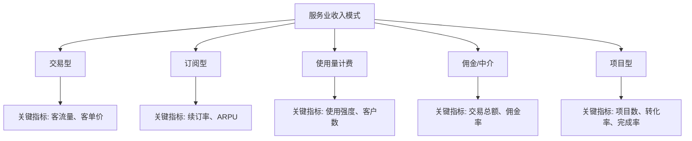
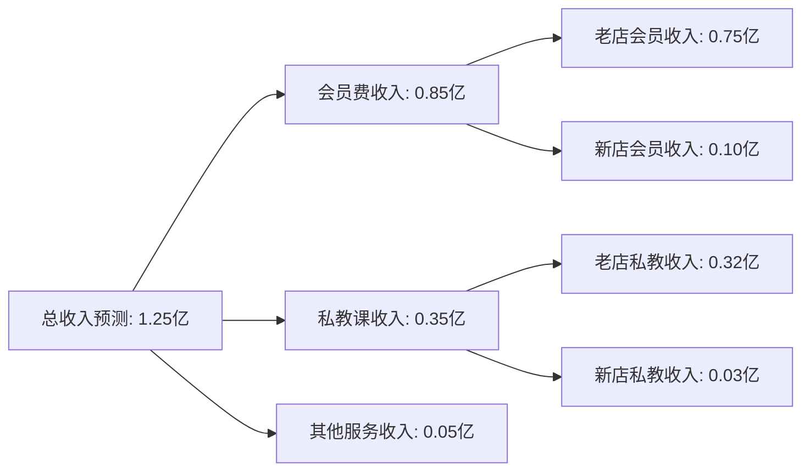
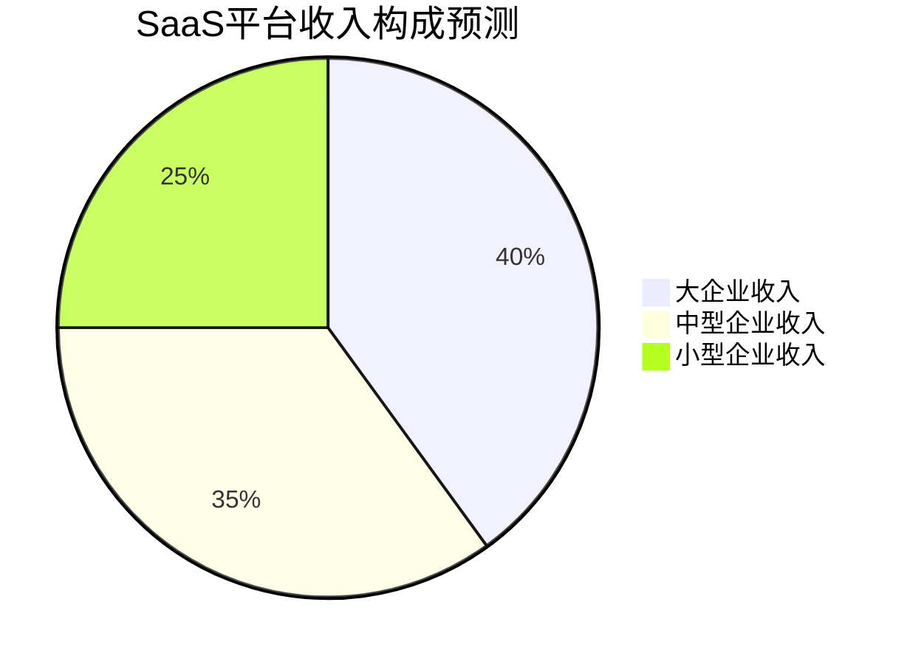

---
{"title":"服务业收入模式特点","date":"2023-11-15","tags":["财务BP","服务业","收入模式","收入预测","行业应用"],"description":"本文分析了服务业的多种收入模式、预测方法及其在财务BP中的应用","dg-publish":true,"permalink":"/08-财务专业/财务BP/学习内容/行业应用/服务业BP特点/服务业收入模式特点/","dgPassFrontmatter":true}
---


# 服务业收入模式特点

## 引言

服务业作为现代经济的核心组成部分，具有独特的收入生成模式和预测特点。与制造业相比，服务业收入的无形性、即时性和客户依赖性更强，这为财务BP工作带来了独特的挑战。本文将详细探讨服务业的收入模式特点、预测方法及其在财务规划中的应用，帮助财务专业人士更准确地制定服务业企业的收入预算。

## 服务业收入模式的基本特征

### 无形性与即时性

服务业收入来源于无形的服务交付，具有以下特点：

1. **无法存储**：服务不能像产品一样被库存，未使用的服务能力直接转化为收入损失
2. **生产与消费同步**：服务的提供与客户消费通常同时发生
3. **时效性强**：服务价值往往与提供时间密切相关，过期即失效
4. **体验依赖**：服务质量和客户体验直接影响收入水平

### 收入波动性

服务业收入通常比制造业表现出更高的波动性：

1. **季节性因素**：大多数服务行业存在明显的季节性需求波动
2. **时段波动**：日内、周内收入分布不均
3. **经济敏感性**：对宏观经济变化反应更为敏感
4. **客户行为变化**：受消费者情绪和偏好变化影响大

## 主要服务业收入模式类型

服务业存在多种收入模式，每种模式具有不同的特点和预测方法：

### 1. 交易型收入模式

基于单次服务交付的收入，常见于零售服务、餐饮、酒店等行业。

- **特点**：
  - 收入直接与交易量相关
  - 客单价与交易频次是关键指标
  - 价格敏感性通常较高
  
- **预测方法**：
  - 客流量 × 客单价
  - 历史同期数据 + 增长率
  - 市场份额 × 市场总量

### 2. 订阅型收入模式

基于持续服务关系的定期收入，常见于SaaS、健身中心、内容平台等。

- **特点**：
  - 收入稳定性高
  - 客户生命周期价值(LTV)重要
  - 续订率是核心绩效指标
  
- **预测方法**：
  - 期初订阅用户 × (1-流失率) + 新增用户
  - 用户分层模型(按不同订阅周期)
  - MRR(月度经常性收入)增长模型

### 3. 使用量计费模式

基于服务使用量收费，常见于公用事业、云服务、电信等行业。

- **特点**：
  - 收入与客户使用强度挂钩
  - 常有基础费用+使用费的结构
  - 规模效应明显
  
- **预测方法**：
  - 客户数 × 平均使用量 × 单价
  - 使用量分布模型
  - 阶梯定价收入模拟

### 4. 佣金/中介模式

基于促成交易收取的佣金，常见于房地产中介、在线平台、金融服务等。

- **特点**：
  - 收入与促成交易总额关联
  - 佣金率是关键驱动因素
  - 平台效应显著
  
- **预测方法**：
  - 交易总额 × 佣金率
  - 双边用户增长模型
  - 平台渗透率分析

### 5. 项目型收入模式

基于特定项目完成的收入，常见于咨询、工程服务、定制开发等。

- **特点**：
  - 收入确认与项目进度相关
  - 项目周期长短不一
  - 收入确认时间点不均衡
  
- **预测方法**：
  - 项目储备 × 转化率
  - 项目阶段完成度模型
  - 销售漏斗转化预测



## a服务业收入预测方法与工具

### 基础预测方法

#### 1. 历史趋势分析法

基于历史数据的收入预测，适用于相对稳定的服务业务。

- **应用步骤**：
  1. 收集3-5年历史收入数据(按月/季度)
  2. 识别季节性模式和增长趋势
  3. 应用趋势线或移动平均线进行预测
  4. 调整异常值和特殊事件影响

- **优势**：简单直观，数据需求少
- **局限**：对新业务或变化快的行业预测准确度低

#### 2. 驱动因素分解法

将收入分解为核心驱动因素进行建模，适用于有明确收入驱动机制的服务业。

- **预测公式**：收入 = 客户数 × 使用频率 × 客单价

- **应用步骤**：
  1. 识别关键收入驱动因素
  2. 分别预测各驱动因素
  3. 建立驱动因素间的关系模型
  4. 汇总计算预期收入

- **优势**：逻辑性强，易于理解和解释
- **局限**：需要更多数据支持，各因素间可能有相关性

#### 3. 市场份额法

基于整体市场规模和企业份额的预测，适用于成熟服务市场。

- **预测公式**：收入 = 市场总规模 × 市场份额比例

- **应用步骤**：
  1. 获取市场规模预测数据
  2. 分析企业历史市场份额变化
  3. 预测未来市场份额
  4. 计算预期收入

- **优势**：考虑了市场因素影响，更符合竞争环境
- **局限**：依赖市场数据可靠性，不适用于快速变化的新兴市场

### 高级预测方法

#### 1. 客户生命周期价值(LTV)模型

基于客户群体的获取、转化、留存分析，适用于订阅模式和会员制服务业。

- **预测步骤**：
  1. 客户分群(按获取渠道、消费特征等)
  2. 计算各群体的获取成本(CAC)和生命周期价值(LTV)
  3. 建立客户留存曲线和消费曲线
  4. 预测新增客户和存量客户贡献的收入

- **优势**：客户视角分析，能更准确预测长期收入
- **局限**：数据需求大，模型复杂

#### 2. 销售漏斗转化模型

基于销售过程各环节转化率的预测，适用于高价值B2B服务和项目型服务。

- **预测步骤**：
  1. 定义销售漏斗各阶段(线索、意向、评估、谈判、成交)
  2. 计算各阶段历史转化率和处理时间
  3. 输入销售漏斗上游数据
  4. 预测各时段的转化结果和收入

- **优势**：能反映销售过程动态，预测准确度高
- **局限**：需要完整的CRM数据支持

#### 3. 多因素回归分析

使用统计方法确定多个变量对收入的影响，适用于受多种因素影响的复杂服务业态。

- **预测步骤**：
  1. 识别潜在影响收入的内外部因素
  2. 收集历史数据并进行相关性分析
  3. 建立多元回归模型
  4. 利用模型预测未来收入

- **优势**：考虑多种因素影响，客观性强
- **局限**：要求较高的统计知识，需要大量数据

## 服务业收入预测的主要难点

### 1. 需求波动预测

服务需求受多种因素影响，波动性大，预测难度高：

- **季节性波动**：如旅游业淡旺季、餐饮业节假日效应
- **时段分布不均**：如日内高峰期和淡时期
- **外部因素影响**：如天气条件、重大事件

**应对策略**：
- 构建多层次时间序列模型
- 引入外部变量(如天气、节假日)
- 使用历史同期数据进行校准

### 2. 新服务收入预测

无历史数据支持的新服务收入预测挑战：

- **市场接受度未知**：客户采用意愿难以评估
- **定价弹性不确定**：价格敏感性需要测试
- **竞争反应未知**：竞争对手可能调整策略

**应对策略**：
- 参考类似服务的历史数据
- 进行小规模市场测试
- 使用情景分析方法

### 3. 客户行为变化

服务业收入高度依赖客户行为，而客户行为可能快速变化：

- **偏好变化**：客户服务需求不断演变
- **渠道迁移**：从线下转向线上等渠道变化
- **竞争环境影响**：竞争加剧导致客户忠诚度下降

**应对策略**：
- 建立客户细分模型
- 定期进行客户调研
- 跟踪行为指标变化

## 不同服务行业收入预测特点比较

| 服务行业 | 主要收入模式 | 关键预测指标 | 预测难点 | 建议方法 |
|---------|------------|------------|---------|---------|
| 酒店业 | 交易型 | 入住率、平均房价(ADR) | 季节性强、价格弹性大 | 历史同期+市场份额法 |
| SaaS服务 | 订阅型 | 续费率、ARPU | 产品迭代影响、竞争变化 | LTV模型+客户分层 |
| 医疗服务 | 交易型+项目型 | 患者量、平均诊疗费 | 政策影响大、需求难预测 | 驱动因素分解+多因素回归 |
| 咨询服务 | 项目型 | 项目数量、平均合同金额 | 项目周期长、个案差异大 | 销售漏斗+项目完成度 |
| 电信服务 | 订阅型+使用量 | ARPU、客户数 | 用户行为复杂、套餐多样 | 客户分层+使用量预测 |
| 金融服务 | 佣金+交易型 | 客户资产规模、交易频次 | 市场波动大、客户粘性各异 | 资产分层+多因素场景 |

## 服务业收入预测在BP中的应用

### 预算制定流程

1. **分析历史数据**：回顾过去2-3年收入表现和驱动因素
2. **确定预测方法**：根据业务特点选择适合的预测模型
3. **设定假设条件**：明确关键假设(价格、客流、渠道等)
4. **构建收入预测模型**：建立详细的收入预测数据模型
5. **情景分析**：制定基准、乐观和保守三种情景
6. **细化分解**：按产品线、区域、客户群等维度分解
7. **验证与调整**：与业务团队交叉验证，进行必要调整
8. **定期回顾与更新**：建立滚动预测机制，定期更新

### 案例分析

#### 案例一：某高端连锁健身中心收入预测

##### 背景
某高端健身连锁品牌在全国拥有30家门店，主要收入来源是会员费(年费/季费/月费)和私教课程。公司计划在新财年扩张5家新店，同时提升私教服务占比。

##### 收入模式分析
- **主要收入类型**：订阅型(会员费)+交易型(私教课)
- **关键指标**：会员数、会员续费率、私教课销售率、客单价

##### 收入预测模型

会员费收入预测采用客户生命周期模型：
```
会员收入 = 期初会员 × 续费率 × 平均会费 + 新增会员 × 平均首次会费
```

私教课收入预测采用交叉销售模型：
```
私教收入 = 活跃会员数 × 私教课购买率 × 平均课时 × 课时单价
```

##### 预测流程

1. **会员数预测**
   - 划分会员群体(新会员、1年以内、1-2年、2年以上)
   - 分析各群体历史续费率
   - 根据市场营销计划预测新增会员
   - 预测总会员数变化趋势

2. **私教课程预测**
   - 分析会员购买私教课的概率分布
   - 预测私教课程渗透率和平均课时
   - 结合价格策略计算私教收入

3. **新店收入爬坡曲线**
   - 基于历史数据建立新店会员发展曲线
   - 预测新店12-24个月的收入爬坡过程

##### 预测结果



##### 关键假设
1. 老店会员续费率保持在65%
2. 新会员获取成本同比上升10%
3. 私教课程渗透率从当前25%提升至30%
4. 新店会员爬坡周期为18个月

##### 风险分析
1. 高端健身市场竞争加剧可能影响会员价格
2. 私教人员流动可能影响会员体验和续费率
3. 新店选址风险可能导致会员发展不及预期

##### 应对措施
1. 建立会员价值提升计划，增加高价值服务比重
2. 完善私教激励机制，降低流失率
3. 新店采用阶段性投入策略，根据业绩动态调整

#### 案例二：某企业SaaS平台收入预测

##### 背景
某企业SaaS平台提供人力资源管理系统，采用订阅制收费模式。公司正从传统大客户战略转向发展中小企业市场，同时推出按员工数阶梯定价模式。

##### 收入模式分析
- **主要收入类型**：订阅型
- **计费方式**：基础模块+高级功能模块+按员工数阶梯定价
- **关键指标**：客户数、续约率、ARPU(每用户平均收入)、模块渗透率

##### 预测模型架构

按客户分层的多维预测模型：
```
总收入 = Σ(各客户层级) [客户数 × 续约率 × 平均订阅价格 + 新增客户 × 平均首年合同价值]
```

其中：
- 客户分为大企业、中型企业、小企业三层
- 每层客户的获取成本、续约率、ARPU均不同
- 模块使用率影响客户ARPU值

##### 预测流程

1. **客户存量预测**
   - 分析历史客户留存曲线
   - 预测不同规模客户的续约率
   - 计算客户生命周期价值(LTV)

2. **新客户获取预测**
   - 根据销售漏斗转化率预测新增客户
   - 分析销售周期和成交率
   - 预测客户获取成本(CAC)变化

3. **客单价预测**
   - 预测基础模块与高级模块采用率
   - 分析员工规模增长对阶梯定价的影响
   - 估算价格变动对需求的影响

##### 预测结果与分析



##### 关键假设
1. 大企业客户续约率保持在92%
2. 中小企业获客成本比大企业低30%
3. 中小企业ARPU值为大企业的45%
4. 新客户第一年高级模块采用率为30%

##### 挑战与对策
1. **挑战**：中小企业客户波动率高
   **对策**：简化产品线，降低入门门槛

2. **挑战**：大客户议价能力强
   **对策**：增加高价值定制服务，提高转换成本

3. **挑战**：收入确认时间点不均匀
   **对策**：推广月度付费方案，平滑现金流

## 服务业收入预测的最佳实践

### 1. 精细化客户分层

根据客户价值、行为特征和生命周期阶段进行分层预测：

- 划分高价值客户、中等价值客户和低价值客户
- 分析不同客户群的消费行为和贡献度
- 建立客户迁移矩阵，跟踪客户价值变化

### 2. 多维度收入分解

将收入按多种维度分解，增加预测精度：

- 产品/服务线维度
- 地区/门店维度
- 客户群体维度
- 销售渠道维度

### 3. 结合定性与定量方法

综合使用数据分析和专业判断：

- 数据模型提供基准预测
- 业务专家提供调整意见
- 建立结构化的假设条件
- 持续验证和调整预测模型

### 4. 建立动态更新机制

预测不是一次性工作，需要持续跟踪和更新：

- 实施滚动预测机制
- 设定预警指标和触发更新的阈值
- 定期分析预测偏差原因
- 不断优化预测模型和参数

## 相关链接

- [[08-财务专业/财务BP/学习内容/行业应用/服务业BP特点/服务业成本结构特点\|服务业成本结构特点]]
- [[08-财务专业/财务BP/学习内容/行业应用/服务业BP特点/服务能力与扩张预算\|服务能力与扩张预算]]
- [[08-财务专业/财务BP/学习内容/行业应用/服务业BP特点/人员成本规划\|人员成本规划]]
- [[08-财务专业/财务BP/学习内容/预算编制基础/收入预测方法/销量预测技术\|销量预测技术]]
- [[08-财务专业/财务BP/学习内容/财务预测与模型/敏感性分析/敏感性分析的目的与方法\|敏感性分析的目的与方法]]

## 参考文献

1. 王明华 (2022). 《服务经济时代的收入管理》. 经济管理出版社.
2. 李晓东, 张伟 (2021). 《服务业财务规划实务》. 中国财政经济出版社.
3. McCarthy, J., & Wright, P. (2020). *Revenue Management for Service Organizations*. Harvard Business Review Press.
4. 德勤咨询 (2023). 《后疫情时代服务业收入模式创新》. 德勤研究报告.
5. 中国服务贸易协会 (2023). 《中国服务业发展报告》.
6. Gupta, S., & Lehmann, D. R. (2018). *Customer Lifetime Value: The Cornerstone of Financial Planning*. Journal of Service Research, 21(2), 213-228. 