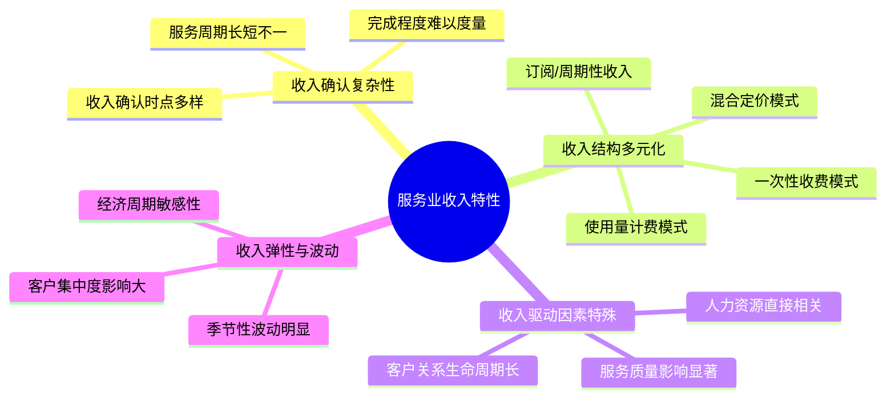

---
{"tags":["财务BP","服务业","收入预测","行业应用"],"aliases":["服务行业收入预测","服务业收入模型"],"created":"2023-11-17","dg-publish":true,"permalink":"/08-财务专业/财务BP/学习内容/行业应用/服务业BP特点/服务业收入预测特点/","dgPassFrontmatter":true}
---

# 服务业收入预测特点

## 概述

服务业收入预测具有独特的复杂性和挑战，这源于服务业务的无形性、变动性和客户关系的持续性特征。本文系统分析服务业收入预测的特点、方法和最佳实践，帮助财务BP掌握服务型企业收入预测的核心技能，提高预测准确性，为业务决策提供可靠支持。

## 服务业收入特性及其对预测的影响

### 服务业收入的基本特性

### 对预测工作的影响

| 收入特性 | 对预测的影响 | 应对策略 |
| -------- | ------------ | -------- |
| 收入确认复杂 | 单一服务可能跨多个周期确认收入 | 建立收入递延与确认模型 |
| 收入模式多样 | 不同收入流需要不同预测方法 | 开发综合预测框架 |
| 人力资源依赖 | 收入上限受服务能力制约 | 整合产能分析与收入预测 |
| 季节性波动 | 年内分布不均衡 | 应用季节性调整因子 |
| 客户关系影响 | 客户留存率对长期收入至关重要 | 客户生命周期预测模型 |

## 服务业收入预测方法

### 基于历史数据的预测方法

1. **时间序列分析**
   - 趋势分析：识别长期发展方向
   - 季节性模式：捕捉周期性变化
   - 自回归综合移动平均(ARIMA)模型应用

2. **客户队列分析法**
   - 按获取时间分组客户
   - 追踪队列留存率与消费变化
   - 预测客户终身价值与收入贡献

3. **指数平滑法**
   - 简单指数平滑：适用于无明显趋势和季节性的数据
   - 霍尔特-温特斯模型：处理带趋势和季节性的数据
   - 调整系数的动态优化

### 驱动因素分析预测法

1. **服务能力驱动模型**
   - 人力资源产能评估
   - 利用率分析与预测
   - 产能瓶颈识别与突破规划

2. **客户行为驱动模型**
   - 活跃客户数预测
   - 客户使用频率分析
   - 客户消费升级路径

3. **市场渗透驱动模型**
   - 目标市场规模估算
   - 市场渗透率预测
   - 竞争格局变化分析

### 情景与敏感性分析

1. **多情景预测框架**
   - 乐观、基准、保守三情景构建
   - 情景概率权重分配
   - 综合情景预期值计算

2. **关键因素敏感性分析**
   - 价格弹性测试
   - 客户留存率变动影响
   - 服务利用率波动效应

3. **压力测试**
   - 极端情况收入冲击评估
   - 恢复期预测
   - 弹性恢复能力分析

### 专业服务特定预测方法

1. **项目组合预测法**
   - 已签约项目收入确认计划
   - 销售管道转化率分析
   - 项目延期风险调整

2. **计费率与利用率模型**
   - 专业人员利用率预测
   - 计费率变动趋势分析
   - 人员结构与收入关系模型

3. **客户组合管理预测**
   - 客户分层与收入贡献分析
   - 大客户依赖度评估
   - 客户扩展收入预测

### 订阅式服务特定预测方法

1. **MRR/ARR模型**
   - 月度/年度经常性收入追踪
   - 新增MRR预测
   - 扩展MRR与流失MRR分析

2. **SaaS指标预测框架**
   - 客户获取数量预测
   - 净续约率(NRR)预测
   - 客户扩展收入率分析

3. **订阅生命周期模型**
   - 转化率预测
   - 升级路径分析
   - 流失风险预测

## 预测模型构建流程

### 收入结构分解

1. **收入流识别与分类**
   - 核心服务收入
   - 增值服务收入
   - 一次性服务收入
   - 经常性服务收入

2. **收入要素分解**
   - 客户数 × 客单价
   - 交易频率 × 平均交易价值
   - 服务时长 × 时间单价

3. **收入确认时间分布**
   - 预收款项分析
   - 递延收入模式
   - 长期合同收入分配

### 驱动因素模型构建

1. **关键驱动因素识别**
   - 相关性分析确定主要驱动因素
   - 因果关系验证
   - 前导指标确定

2. **驱动因素预测**
   - 内部驱动因素发展预测
   - 外部市场因素预测整合
   - 驱动因素间相互影响评估

3. **收入转换模型**
   - 驱动因素与收入的量化关系模型
   - 转换参数的历史表现校准
   - 非线性关系处理

### 预测精度优化

1. **预测误差分析**
   - 系统性偏差识别
   - 误差来源分解
   - 预测偏差模式识别

2. **模型迭代优化**
   - 参数动态调整机制
   - 多模型组合预测
   - 机器学习算法应用

3. **人工判断整合**
   - 业务洞察与定量模型结合
   - 异常情况人工调整流程
   - 市场新动态的灵活纳入

## 服务业收入预测的难点与解决方案

### 难点一：服务价值量化

**挑战**：
- 服务质量与客户满意度难以数值化
- 不同客户对相同服务的价值感知差异大
- 服务创新对收入影响难以预先量化

**解决方案**：
1. **价值指标体系**
   - 开发客户感知价值的代理指标
   - 建立服务质量与价格关联模型
   - 设计客户满意度收入影响跟踪体系

2. **价值分层策略**
   - 基于客户分层的差异化定价模型
   - 服务组件价值拆分分析
   - 增值服务序列与收入增长路径

3. **创新试点测试**
   - 小规模服务创新试点收入效应测量
   - A/B测试新服务定价策略
   - 渐进式推广的收入增长模型

### 难点二：客户行为预测

**挑战**：
- 客户需求变化快且个性化强
- 客户续约决策受多因素复杂影响
- 使用量预测的高度不确定性

**解决方案**：
1. **客户细分预测**
   - 基于行为特征的客户细分模型
   - 细分群体行为模式识别
   - 差异化预测策略应用

2. **客户健康度指标系统**
   - 设计预警客户流失的先导指标
   - 构建客户参与度评估框架
   - 客户健康度与收入关联分析

3. **使用量模拟模型**
   - 基于历史使用模式的情景模拟
   - 客户类型与使用强度关联分析
   - 季节性与事件触发的使用波动预测

### 难点三：长期合同收入分配

**挑战**：
- 多年期合同的年度收入分配复杂
- 合同变更对收入确认的影响难以预测
- 完工百分比估计的主观性

**解决方案**：
1. **结构化合同分析**
   - 合同收入要素拆分模型
   - 分阶段交付的里程碑确认框架
   - 合同变更标准化处理流程

2. **完工进度跟踪系统**
   - 开发客观的完工指标体系
   - 进度与成本消耗关联分析
   - 项目延期的收入影响评估

3. **预收账款动态管理**
   - 预收账款向确认收入的转化模型
   - 合同资产与负债的预测管理
   - 现金流与收入确认的匹配分析

## 不同服务业细分行业的预测特点

### 专业服务企业

**收入预测特点**：
- 基于项目组合和人力资源计划
- 计费率和利用率是核心驱动因素
- 客户组合稳定性影响高

**预测方法重点**：
1. 销售漏斗转化率分析与项目预测
2. 专业人员生产力监控与预测
3. 高价值客户续约率及扩展率

### SaaS企业

**收入预测特点**：
- 订阅收入模式主导
- 客户获取、留存和扩展三维驱动
- 前期投入与长期收益的时间差大

**预测方法重点**：
1. 队列分析法跟踪订阅生命周期
2. 客户终身价值(LTV)预测
3. 净收入留存率(NRR)与扩展收入分析

### 零售服务企业

**收入预测特点**：
- 客流量与客单价驱动
- 地理位置和季节性影响显著
- 短期营销活动影响大

**预测方法重点**：
1. 门店/位置级别的客流量预测
2. 促销活动效果量化与预测
3. 季节性调整与特殊事件影响分析

### 金融服务企业

**收入预测特点**：
- 资产规模与费率结构驱动
- 市场波动影响手续费收入
- 客户关系长期性与忠诚度关键

**预测方法重点**：
1. 资产规模增长预测
2. 净利息收入敏感性分析
3. 财富管理客户资产留存分析

## 案例分析

### 案例一：专业咨询公司收入预测模型重构

**背景**：
一家中型咨询公司面临预测准确率低的问题，传统预测方法主要依赖销售团队预测，准确率仅为65%

**挑战**：
- 项目启动和完成时间的不确定性高
- 咨询师利用率波动大
- 不同类型项目的收入确认模式差异大

**解决方案**：
1. **三层预测模型构建**：
   - 确定性层：已签约未交付项目的收入计划
   - 高概率层：后期销售阶段机会的概率加权预测
   - 趋势层：基于历史模式的漏斗转化预测

2. **资源能力约束整合**：
   - 开发顾问产能模型，整合休假、培训、非计费工作
   - 建立项目人员配置计划与收入预测的双向约束
   - 设计资源瓶颈预警系统

3. **情景预测框架应用**：
   - 开发关键不确定因素的情景矩阵
   - 为不同情景制定资源应对计划
   - 建立滚动修正机制，每月更新预测

**实施效果**：
- 收入预测准确率提升至89%
- 资源利用率提高12%
- 现金流预测偏差降低40%
- 未预见项目延误减少60%

### 案例二：SaaS企业订阅收入预测优化

**背景**：
一家成长期SaaS企业在扩张过程中难以准确预测订阅收入增长，影响融资和投资决策

**挑战**：
- 新客户获取渠道多样，转化率差异大
- 客户使用量扩展路径不明确
- 流失率波动显著

**解决方案**：
1. **客户获取模型细化**：
   - 按营销渠道构建转化漏斗模型
   - 开发销售周期时长分布预测
   - 建立签约概率动态评分系统

2. **队列分析框架升级**：
   - 引入多维度客户分层（行业、规模、产品）
   - 追踪队列月度留存率与扩展率趋势
   - 开发客户健康度预警指标体系

3. **收入驱动因素仪表板**：
   - 整合先导指标监控体系
   - 构建驱动因素间相互影响网络
   - 开发自动更新的预测修正机制

**实施效果**：
- ARR预测准确率从70%提升至93%
- 流失预警准确率达到85%
- 扩展收入识别提前3个月
- 客户获取成本分配优化节省20%营销预算

## 技术工具与应用

### 数据基础架构

1. **数据整合与管理**
   - 客户数据平台构建
   - 交易与行为数据统一视图
   - 历史预测与实际结果跟踪系统

2. **关键指标定义标准化**
   - 服务业收入指标词典
   - 计算逻辑一致性确保
   - 跨部门指标协调

3. **数据质量管理**
   - 数据完整性检查机制
   - 异常值识别与处理流程
   - 历史数据修正与调整标准

### 预测工具与技术

1. **统计分析工具**
   - R/Python时间序列分析应用
   - 多元回归模型工具
   - 季节性分解技术

2. **商业智能平台**
   - Power BI动态仪表板开发
   - Tableau预测可视化应用
   - 自助分析工具配置

3. **预测软件应用**
   - 专业预测软件选择考虑因素
   - 云端预测平台优势
   - 企业资源规划系统集成

### 人工智能与高级分析

1. **机器学习应用**
   - 客户分层聚类算法
   - 流失预测模型
   - 收入异常模式检测

2. **情景模拟技术**
   - 蒙特卡洛模拟应用
   - 决策树分析
   - 贝叶斯网络预测

3. **预测自动化**
   - 自动参数优化
   - 预测异常自动提醒
   - 机器辅助预测调整

## 最佳实践与建议

1. **预测流程标准化**
   - 建立明确的预测流程与责任
   - 设定标准预测周期与更新频率
   - 制定预测假设记录与更新机制

2. **预测准确度跟踪与改进**
   - 实施预测后评审(Post-forecast Review)
   - 开发预测偏差分析框架
   - 建立预测改进闭环系统

3. **业务协作预测方法**
   - 整合销售、运营和财务视角
   - 建立共同预测会议机制
   - 明确分歧解决流程

4. **预测与决策支持结合**
   - 将预测直接与决策选项关联
   - 开发基于预测的场景分析
   - 建立预测驱动的行动触发机制

5. **持续学习与适应**
   - 定期更新预测假设与方法
   - 测试新预测技术与方法
   - 建立预测知识管理系统

## 相关链接

- [[08-财务专业/财务BP/学习内容/行业应用/服务业BP特点/服务业BP特点概述\|服务业BP特点概述]]
- [[08-财务专业/财务BP/学习内容/行业应用/服务业BP特点/服务业收入模式特点\|服务业收入模式特点]]
- [[08-财务专业/财务BP/学习内容/行业应用/服务业BP特点/服务能力与扩张预算\|服务能力与扩张预算]]
- [[08-财务专业/财务BP/学习内容/行业应用/服务业BP特点/服务业BP案例分析\|服务业BP案例分析]]
- [[08-财务专业/财务BP/学习内容/财务预测与模型/财务报表预测/利润表预测方法\|财务报表预测/利润表预测方法]]

## 参考资料

1. McKinsey & Company (2023). *The new science of revenue forecasting in service businesses*
2. Harvard Business Review (2022). *Subscription Business Forecasting: Beyond the Traditional Methods*
3. KPMG (2022). *Revenue Forecasting for Professional Services: Advanced Techniques*
4. Gartner (2023). *The Future of Financial Planning: AI-Enhanced Revenue Prediction*
5. Deloitte (2023). *Service Business Analytics: Transforming Revenue Forecasting Capabilities* 