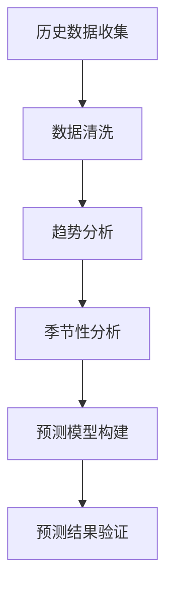
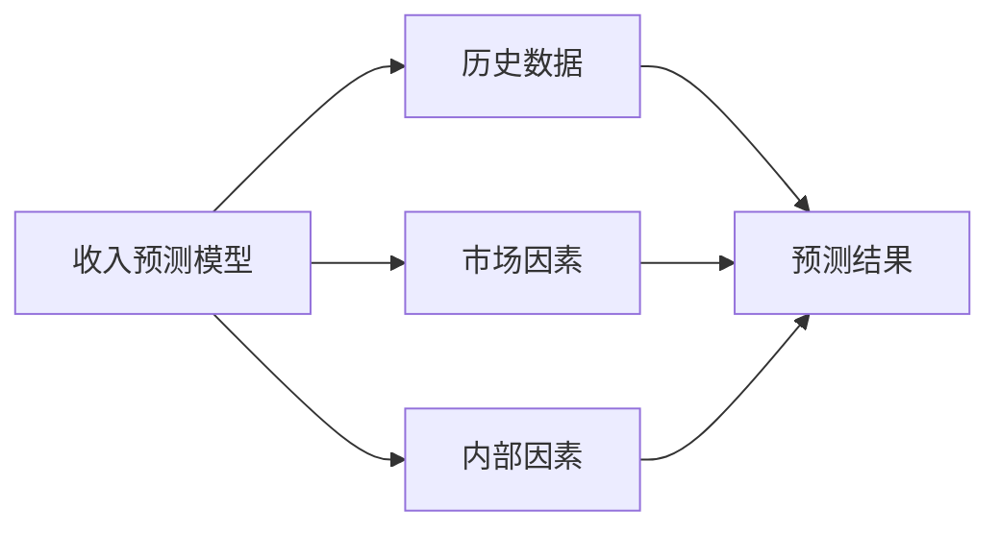

---
{"tags":["财务BP","服务业","收入预测","预测方法","行业特点"],"aliases":["服务业收入预测","服务收入预测方法"],"created":"2024-03-20","dg-publish":true,"permalink":"/08-财务专业/财务BP/学习内容/行业应用/服务业BP特点/服务业收入预测特点/","dgPassFrontmatter":true}
---

# 服务业收入预测特点

> [!abstract] 概述
> 本文档详细分析服务业收入预测的特点、方法和挑战。服务业收入预测与制造业相比具有显著差异，主要体现在收入模式多样性、客户关系持续性、服务交付即时性等方面。通过深入理解这些特点，可以建立更准确的收入预测模型。

## 一、服务业收入预测的基本特征

### 1. 收入模式多样性
- **基础服务收入**：核心服务收费
- **增值服务收入**：附加服务收费
- **会员订阅收入**：定期会员费
- **按需收费**：按使用量计费
- **平台佣金收入**：中介服务费

### 2. 客户关系持续性
- 客户生命周期价值（LTV）分析
- 客户留存率预测
- 客户升级/降级预测
- 客户流失风险分析

### 3. 服务交付即时性
- 服务产能与需求匹配
- 高峰期与低谷期预测
- 服务资源优化配置

## 二、收入预测方法

### 1. 历史数据分析法

### 2. 客户细分预测法
- 按客户类型细分
- 按服务类型细分
- 按地域细分
- 按客户价值细分

### 3. 服务能力驱动法
- 服务人员配置
- 服务设施容量
- 服务时间安排
- 服务质量标准

### 4. 市场驱动预测法
- 市场容量分析
- 竞争格局分析
- 价格弹性分析
- 市场份额预测

## 三、预测模型构建

### 1. 基础预测模型

### 2. 高级预测模型
- 时间序列分析
- 回归分析
- 机器学习模型
- 混合预测模型

## 四、案例分析

### 案例1：连锁酒店收入预测
**背景**：某连锁酒店集团需要预测未来12个月的收入。

**预测方法**：
1. 历史数据分析
   - 过去3年同期数据
   - 季节性波动分析
   - 特殊事件影响

2. 市场因素分析
   - 旅游市场趋势
   - 竞争对手动态
   - 价格策略调整

3. 内部因素分析
   - 新增门店计划
   - 服务升级计划
   - 会员体系优化

**预测结果**：
- 基础收入预测
- 乐观情景预测
- 悲观情景预测
- 敏感性分析

### 案例2：SaaS企业收入预测
**背景**：某SaaS企业需要预测订阅收入。

**预测方法**：
1. 客户生命周期分析
   - 新客户获取
   - 客户留存率
   - 客户升级率
   - 客户流失率

2. 产品组合分析
   - 基础版订阅
   - 专业版订阅
   - 企业版订阅
   - 增值服务

3. 市场扩张计划
   - 新市场进入
   - 产品线扩展
   - 渠道建设

**预测结果**：
- 月度收入预测
- 年度收入预测
- 客户结构预测
- 收入构成预测

## 五、预测风险与应对

### 1. 常见风险
- 市场波动风险
- 竞争加剧风险
- 客户流失风险
- 服务能力风险

### 2. 风险应对策略
- 情景分析
- 敏感性分析
- 预警机制
- 应急方案

## 六、最佳实践建议

1. **数据质量保证**
   - 建立完整的数据收集体系
   - 确保数据准确性
   - 定期数据清洗

2. **模型持续优化**
   - 定期评估预测准确性
   - 及时调整预测模型
   - 引入新的预测方法

3. **跨部门协作**
   - 与业务部门紧密合作
   - 共享市场信息
   - 协同制定策略

## 相关链接

- [[服务业BP特点概述\|服务业BP特点概述]]
- [[08-财务专业/财务BP/学习内容/行业应用/服务业BP特点/服务业收入模式特点\|服务业收入模式特点]]
- [[08-财务专业/财务BP/学习内容/行业应用/服务业BP特点/服务业成本结构特点\|服务业成本结构特点]]
- [[08-财务专业/财务BP/学习内容/行业应用/服务业BP特点/人员成本规划\|人员成本规划]]
- [[08-财务专业/财务BP/学习内容/行业应用/服务业BP特点/服务能力与扩张预算\|服务能力与扩张预算]]

## 参考文献

1. Kaplan, R. S., & Norton, D. P. (2008). *The Execution Premium: Linking Strategy to Operations for Competitive Advantage*. Harvard Business Press.
2. Damodaran, A. (2012). *Investment Valuation: Tools and Techniques for Determining the Value of Any Asset*. Wiley Finance.
3. 《服务企业收入预测方法研究》，张明，管理科学学报，2020.
4. 《SaaS企业收入预测模型构建》，李强，财务与会计，2021.
5. 《服务业收入预测的挑战与对策》，王华，商业经济研究，2019. 