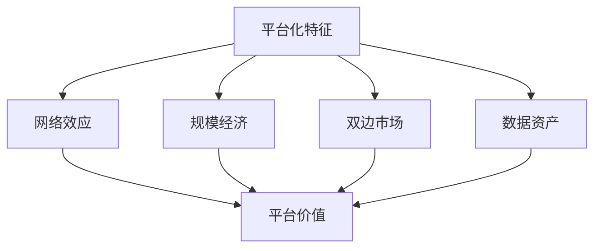
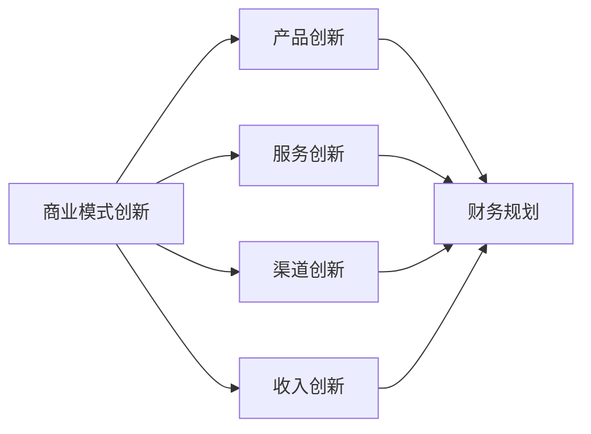

---
{"tags":["财务BP","科技企业","业务模式","商业模式","行业特点"],"aliases":"科技企业商业模式,科技企业业务特点","created":"2024-03-20","dg-publish":true,"permalink":"/08-财务专业/财务BP/学习内容/行业应用/科技企业BP特点/科技企业业务模式特点/","dgPassFrontmatter":true}
---

> [!abstract] 概述
> 本文档详细分析科技企业的业务模式特点及其对财务BP的影响。科技企业具有独特的业务模式，包括高研发投入、快速迭代、网络效应、平台化等特点，这些特点对财务规划、预算管理和成本控制提出了特殊要求。

## 一、科技企业业务模式的基本特征

### 1. 研发驱动型
- **高研发投入**：持续的技术创新投入
- **快速迭代**：产品快速更新换代
- **技术壁垒**：核心技术竞争力
- **知识产权**：专利和技术保护

### 2. 平台化特征

### 3. 收入模式多样性
- 订阅收入
- 广告收入
- 交易佣金
- 增值服务
- 数据变现

## 二、业务模式对财务BP的影响

### 1. 收入预测特点
- 用户增长预测
- 客单价预测
- 留存率预测
- 变现率预测

### 2. 成本结构特点
- 研发成本占比高
- 市场获客成本高
- 固定成本比例大
- 规模效应明显

### 3. 现金流特征
- 前期投入大
- 回收周期长
- 季节性波动
- 融资需求强

## 三、业务模式创新与财务规划

### 1. 商业模式创新

### 2. 财务规划重点
- 研发投入规划
- 市场扩张规划
- 人才储备规划
- 融资规划

### 3. 风险控制
- 技术风险
- 市场风险
- 竞争风险
- 财务风险

## 四、案例分析

### 案例1：SaaS企业业务模式
**背景**：某SaaS企业提供企业级软件服务。

**业务模式**：
1. 产品策略
   - 模块化设计
   - 按需订阅
   - 增值服务
   - 定制开发

2. 市场策略
   - 免费试用
   - 病毒式传播
   - 客户成功
   - 生态建设

3. 财务规划
   - 研发预算
   - 市场预算
   - 客户成功预算
   - 运营预算

**实施效果**：
- 用户快速增长
- 收入持续增长
- 毛利率提升
- 客户留存提高

### 案例2：平台型科技企业
**背景**：某平台型科技企业提供B2B服务。

**业务模式**：
1. 平台策略
   - 双边市场
   - 网络效应
   - 数据驱动
   - 生态构建

2. 收入模式
   - 交易佣金
   - 广告收入
   - 增值服务
   - 数据服务

3. 财务规划
   - 平台建设预算
   - 市场推广预算
   - 运营维护预算
   - 研发创新预算

**实施效果**：
- 平台规模扩大
- 收入多元化
- 成本结构优化
- 盈利能力提升

## 五、业务模式优化建议

### 1. 产品策略优化
- 产品组合优化
- 定价策略优化
- 服务模式创新
- 技术路线优化

### 2. 市场策略优化
- 获客成本优化
- 客户留存提升
- 市场扩张策略
- 竞争策略调整

### 3. 财务策略优化
- 成本结构优化
- 收入结构优化
- 现金流管理
- 融资策略优化

## 六、最佳实践建议

1. **业务模式创新**
   - 持续技术创新
   - 商业模式创新
   - 服务模式创新
   - 收入模式创新

2. **财务规划优化**
   - 研发投入规划
   - 市场扩张规划
   - 人才储备规划
   - 融资规划

3. **风险控制加强**
   - 技术风险控制
   - 市场风险控制
   - 竞争风险控制
   - 财务风险控制

## 相关链接

- [[08-财务专业/财务BP/学习内容/行业应用/科技企业BP特点/研发投入预算\|研发投入预算]]
- [[08-财务专业/财务BP/学习内容/行业应用/科技企业BP特点/快速增长阶段的BP策略\|快速增长阶段的BP策略]]
- [[08-财务专业/财务BP/学习内容/行业应用/科技企业BP特点/科技企业BP案例分析\|科技企业BP案例分析]]
- [[预算编制基础\|预算编制基础]]
- [[08-财务专业/财务BP/笔记/预算编制基础/收入预测方法\|收入预测方法]]

## 参考文献

1. Christensen, C. M. (2016). *The Innovator's Dilemma: When New Technologies Cause Great Firms to Fail*. Harvard Business Review Press.
2. Osterwalder, A., & Pigneur, Y. (2010). *Business Model Generation: A Handbook for Visionaries, Game Changers, and Challengers*. Wiley.
3. 《科技企业商业模式创新研究》，张明，管理科学学报，2020.
4. 《科技企业财务规划实践》，李强，财务与会计，2021.
5. 《科技企业业务模式优化策略》，王华，商业经济研究，2019. 