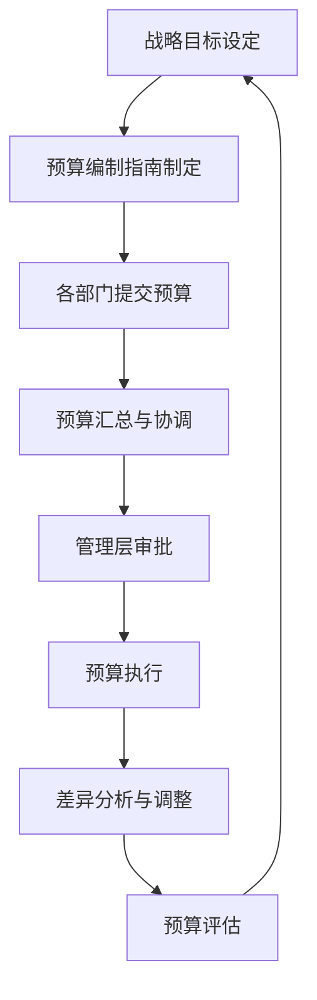

---
{"tags":["财务BP","预算周期","流程管理","业务规划"],"created":"2024-04-24","update":"2024-04-24","dg-publish":true,"permalink":"/08-财务专业/财务BP/学习内容/财务BP基础概念/BP流程与周期/BP预算周期概述/","dgPassFrontmatter":true}
---

# BP预算周期概述

## 引言
预算周期是财务BP工作中的核心环节，它为企业提供了一个规范化的框架来规划、执行和监控财务活动。完整的预算周期确保了企业资源的合理分配和有效利用，同时也是企业战略执行的重要保障。

## 预算周期的基本构成

预算周期通常包括以下几个关键阶段：

1. **战略目标设定**：与企业整体战略保持一致，明确未来期间的业务目标和财务目标
2. **预算编制与提交**：各部门根据战略目标编制详细预算计划
3. **预算审核与批准**：财务部门与管理层审核预算合理性，确保资源合理分配
4. **预算执行与监控**：实施预算计划并持续监控偏差
5. **预算调整与修正**：根据实际情况及时调整预算
6. **预算总结与评估**：对整个预算周期进行分析评估，为下一周期提供参考

## 年度预算周期与滚动预算

### 传统年度预算周期
传统预算周期通常按照财年进行，完整流程如下：

### 滚动预算方法
现代企业越来越多地采用滚动预算方法，以更好地应对市场变化：

- 持续更新未来12个月的预算
- 每季度或每月进行滚动更新
- 减少传统年度预算的局限性
- 提高企业对市场变化的响应能力

## 预算周期中的关键角色

在预算周期管理中，各方扮演不同但互补的角色：

| 角色 | 主要职责 |
|------|----------|
| 高层管理者 | 制定战略目标，最终审批预算 |
| 财务BP | 协调预算过程，提供专业支持，进行财务分析 |
| 业务部门 | 编制详细预算，执行预算计划 |
| 财务总监 | 监督整个预算过程，确保财务健康 |

## 有效预算周期的关键成功因素

1. **高层支持**：管理层的重视和参与是预算成功的关键
2. **清晰沟通**：确保所有相关方理解预算目标和过程
3. **适当的时间安排**：为各阶段分配充足的时间
4. **数据可靠性**：确保预算基于准确、及时的数据
5. **弹性机制**：建立应对变化的调整机制
6. **技术支持**：利用适当的工具和系统支持预算过程

## 相关链接
- [[08-财务专业/财务BP/笔记/基础概念/财务BP的组成部分\|财务BP的组成部分]]
- [[08-财务专业/财务BP/笔记/基础概念/BP与企业战略\|BP与企业战略]]
- [[08-财务专业/财务BP/笔记/基础概念/BP定义与作用\|BP定义与作用]]

## 参考文献
1. 李明. (2022). 《现代企业预算管理》. 经济管理出版社.
2. Smith, J. (2021). *Business Planning and Budgeting Process*. Financial Management Journal, 45(3), 112-125.
3. 王华. (2023). 《滚动预算在企业中的应用》. 财务与会计, 15(2), 78-85. 