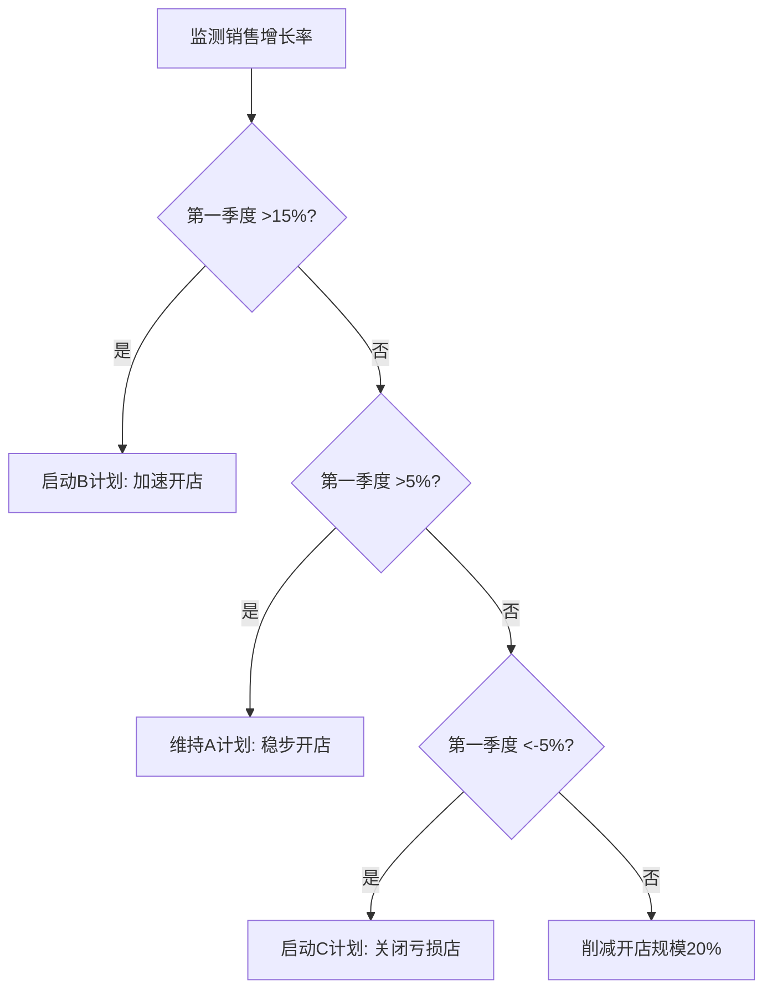

---
{"tags":["财务BP","情景分析","决策支持","财务预测","风险管理"],"aliases":"情景决策,情景为本决策,情景评估","dg-publish":true,"permalink":"/08-财务专业/财务BP/学习内容/财务预测与模型/情景分析/情景分析的决策应用/","dgPassFrontmatter":true}
---

> [!NOTE] 概述
> 情景分析的决策应用是[[08-财务专业/财务BP/笔记/财务预测与模型/情景分析\|情景分析]]实践的最终目的。本文详细介绍如何将情景分析结果转化为具体的决策支持工具，探讨情景分析在不同决策环境下的应用方法，以及如何构建情景感知型的决策架构，增强企业面对不确定性的适应能力和韧性。

## 情景分析与决策的关系

### 情景分析在决策中的基本价值

情景分析对决策的价值源于以下几个方面：

- **拓展思维边界**：打破单一预测的局限，扩展决策者的思维空间
- **识别风险与机会**：揭示常规预测可能忽略的风险和机会
- **提高决策韧性**：帮助设计在多种可能情景下均有效的韧性决策
- **动态视角**：将静态决策转变为对未来不同路径的动态响应
- **共识建立**：为决策者提供共同的思考框架和语言

情景分析与传统决策方法的关系可表示为：

| 决策方法 | 特点 | 适用环境 |
|---------|------|----------|
| 确定性决策 | 单一预测，明确目标函数 | 稳定环境，低不确定性 |
| 概率决策 | 基于概率分布和期望值 | 风险可量化的环境 |
| 情景决策 | 考虑多种可能情景，注重适应性 | 高不确定性，不可量化风险 |

### 情景分析的决策应用框架

将情景分析应用于决策的基本框架包括：

1. **情景构建**：基于[[08-财务专业/财务BP/学习内容/财务预测与模型/情景分析/情景构建方法\|情景构建方法]]创建相关、合理、差异化的情景
2. **情景评估**：评估决策方案在各情景下的表现
3. **决策分类**：将决策分为稳健型、灵活型或有条件型
4. **策略设计**：设计与情景响应匹配的决策策略
5. **监控与调整**：建立情景监控机制，动态调整决策

这一框架构成了情景为本决策（Scenario-based Decision Making）的核心，与[[08-财务专业/财务BP/学习内容/财务预测与模型/情景分析/最佳、基准与最差情景\|最佳、基准与最差情景]]和[[08-财务专业/财务BP/学习内容/财务预测与模型/情景分析/情景权重分析\|情景权重分析]]等方法协同应用。

## 三类情景决策策略

### 稳健型决策策略

稳健型决策（Robust Decisions）在所有主要情景下均能取得可接受结果：

- **特点**：注重基本面，避免极端风险，寻求各情景共同要素
- **优势**：减少重大错误，保持战略连续性
- **劣势**：可能错失情景特定的机会，平均表现不够突出
- **适用场景**：资本密集型投资，长期战略规划，核心业务决策

**案例应用**：
某能源公司在能源转型背景下的发电资产组合决策采用稳健策略：

| 投资方案 | 碳税高企情景 | 碳税适中情景 | 碳税低情景 | 稳健性评分 |
|---------|------------|------------|-----------|----------|
| 全煤电 | 极差 | 一般 | 优秀 | 低 |
| 全可再生 | 优秀 | 一般 | 较差 | 中 |
| 多元组合 | 良好 | 良好 | 良好 | 高 |

公司最终选择了投资组合包含30%天然气、40%可再生能源、20%核能和10%清洁煤的多元方案，尽管在任何单一情景下都不是最优方案，但在所有情景下都能取得可接受的回报。

### 灵活型决策策略

灵活型决策（Flexible Decisions）强调保持调整选项，随情景演化灵活应对：

- **特点**：分阶段投入，保留调整选项，设计触发点
- **优势**：降低沉没成本风险，适应性强
- **劣势**：可能增加复杂性和短期成本
- **适用场景**：高度不确定的市场环境，技术演进快速的领域

**案例应用**：
某制药公司采用灵活策略进行新药研发投资：

1. 初始阶段：小规模投入6个候选药物（1000万元）
2. 设计三个决策检查点（Gates）：
   - Gate 1：基于临床I期结果，淘汰3个项目
   - Gate 2：基于临床II期结果，选择主要推进对象
   - Gate 3：根据市场情况决定商业化模式（自销/许可/合作）

当市场出现负面信号时，公司迅速缩减投资规模；当看到积极信号时，加大投入并启动全球临床试验。这种灵活策略使公司在新冠疫情期间能够快速调整研发方向，将一个抗病毒药物项目快速推向市场。

### 有条件型决策策略

有条件型决策（Conditional Decisions）基于特定情景信号触发预设行动：

- **特点**：预先定义情景信号和对应行动，明确触发条件
- **优势**：快速响应，减少决策延迟，清晰的行动指南
- **劣势**：可能过于机械，错过新兴情景
- **适用场景**：需要快速响应的市场环境，具有明确转折点的行业

**案例应用**：
某零售企业设计了基于销售数据的有条件扩张策略：

该企业制定了详细的触发条件和对应行动表，让各区域经理能够根据当地市场情况做出快速响应，无需等待总部决策流程。当疫情影响出现时，负责华南区的经理迅速根据触发条件启动了门店调整计划，将损失控制在预设范围内。

## 情景分析在具体决策中的应用

### 战略规划决策应用

战略规划中的情景应用注重长期视角和方向性决策：

1. **情景图谱构建**：创建涵盖主要不确定因素的战略情景图谱
2. **战略选项评估**：评估不同战略选项在各情景下的表现
3. **关键能力识别**：识别在多种情景下都需要的核心能力
4. **预警指标设计**：设计情景预警指标体系

**案例应用**：
某汽车制造商使用情景分析进行2030年战略规划：

| 战略选项 | 电动革命情景 | 混合演进情景 | 燃油延续情景 | 结论 |
|---------|------------|------------|--------------|------|
| 全面电动化 | 极佳 | 可接受 | 严重亏损 | 高风险高回报 |
| 混合战略 | 良好 | 良好 | 良好 | 稳健选择 |
| 渐进转型 | 错失市场 | 良好 | 优秀 | 保守选择 |

公司最终决定采用混合战略，同时设计了"电动革命"情景的早期预警指标（如：电池成本下降速度、充电基础设施增长率、消费者购买意愿),一旦这些指标达到预设阈值，将加速电动化转型进程。

### 资本预算决策应用

资本预算决策将情景分析与财务评估相结合：

1. **情景财务模型**：构建多情景下的项目现金流模型
2. **风险调整评估**：基于情景评估的风险调整后NPV/IRR
3. **投资弹性设计**：设计能适应不同情景的投资阶段
4. **退出选项评估**：评估不同情景下的退出价值

**案例应用**：
某酒店集团评估一个需投资10亿元的度假村项目：

| 指标 | 旅游繁荣情景 | 基准情景 | 旅游萎缩情景 | 
|-----|------------|----------|------------|
| 概率估计 | 25% | 50% | 25% |
| NPV(百万元) | +350 | +120 | -150 |
| IRR | 18% | 12% | 4% |
| 回收期(年) | 5.5 | 8.0 | >10 |

基于情景分析，集团设计了三阶段投资方案：
- 第一阶段：投资40%建设核心设施
- 第二阶段：根据市场情况决定是否投资30%扩建高端设施
- 第三阶段：根据营运表现决定是否投资30%建设配套设施

这种分阶段方法降低了在旅游萎缩情景下的风险暴露，同时保留了在旅游繁荣情景下捕捉更大价值的机会。

### 新产品开发决策应用

新产品开发中的情景应用关注市场不确定性：

1. **市场情景构建**：建立关于市场接受度的多种情景
2. **产品规格调整**：设计能适应不同市场情景的产品规格
3. **开发路径规划**：规划分阶段、可调整的开发路径
4. **退出门槛设定**：明确项目继续或终止的决策条件

**案例应用**：
某消费电子公司基于情景分析设计新智能家居产品线：

| 决策维度 | 快速采纳情景 | 渐进采纳情景 | 缓慢采纳情景 |
|---------|------------|------------|------------|
| 产品阵容 | 全面布局(10+产品) | 核心布局(5-6产品) | 最小布局(2-3产品) |
| 价格策略 | 溢价定位 | 中高定位 | 入门定位 |
| 开发投入 | 2亿元 | 1亿元 | 4000万元 |
| 营销策略 | 品牌营销 | 精准营销 | 教育营销 |

公司采用情景触发的产品开发计划：先推出3个核心产品，设定明确的销量和用户反馈目标；当这些指标达到预设水平时，触发第二波产品开发；同时为三种情景准备了不同的营销材料和渠道策略，根据市场反应灵活调整。

### 风险管理决策应用

风险管理中的情景应用注重识别和应对极端情况：

1. **风险情景识别**：构建涵盖主要风险因素的情景集
2. **脆弱性评估**：评估组织在不同风险情景下的脆弱性
3. **缓解措施设计**：设计针对性的风险缓解措施
4. **应急计划制定**：为关键风险情景制定应急计划

**案例应用**：
某跨国制造企业构建了供应链风险情景矩阵：

| 风险情景 | 发生概率 | 潜在影响 | 缓解措施 | 触发应急计划 |
|---------|---------|----------|---------|------------|
| 主要供应国政治危机 | 中 | 高 | 供应商多元化 关键零部件库存增加 | 启动备选供应商 加速产能转移 |
| 关键材料价格暴涨 | 中高 | 中 | 战略采购合约 材料替代研发 | 启动价格转嫁方案 产品结构调整 |
| 主要港口封锁 | 低 | 极高 | 物流路径多元化 区域库存布局 | 启动空运应急通道 生产计划调整 |

基于此分析，企业实施了"关键零部件+3供应商"策略，并在全球设立了区域性应急库存中心，成功应对了2023年某区域性供应链中断事件。

## 情景驱动的决策流程设计

### 情景决策的组织机制

将情景分析融入组织决策流程的关键机制：

1. **战略对话整合**：将情景讨论融入战略对话和高管会议
2. **决策评估标准**：在决策评估中加入情景适应性评分
3. **预算与规划整合**：将情景规划与年度预算和规划流程整合
4. **情景更新机制**：建立情景定期更新和重评估机制

**案例应用**：
某石油公司设计了"情景月"机制，每年第三季度专门用于更新全球能源情景并评估公司战略。这一机制包括：
- 情景更新研讨会（跨部门参与）
- 战略韧性评估会议（评估现有战略在新情景下的表现）
- 战略调整工作坊（设计必要的战略调整）
- 情景融入预算指引（将情景分析结果融入下一年预算指引）

这一机制使公司能够系统性地应对能源转型带来的不确定性，在维持石油核心业务的同时，逐步扩大了可再生能源投资组合。

### 情景预警系统设计

情景预警系统帮助组织及早识别情景转变信号：

1. **关键指标选择**：选择能有效区分情景的先导指标
2. **阈值设定**：设定情景转变的指标阈值
3. **监控频率确定**：根据指标变化速度确定监控频率
4. **响应机制设计**：设计指标触发的响应机制

**案例应用**：
某零售银行设计了房地产市场情景预警系统：

| 监控指标 | 监控频率 | "过热"阈值 | "降温"阈值 | "崩盘"阈值 | 触发行动 |
|---------|---------|----------|----------|----------|---------|
| 房价收入比 | 季度 | >12 | <8且下降 | <6且急跌 | 调整贷款政策 |
| 按揭违约率 | 月度 | <1% | 1-2% | >3% | 资产质量审查 |
| 新房销售速度 | 月度 | <30天 | 60-90天 | >120天 | 调整开发贷政策 |
| 政策收紧指数 | 实时 | >75 | 40-60 | <30 | 更新风险模型 |

该预警系统在2022年成功捕捉到房地产市场降温信号，银行提前6个月调整了房地产相关信贷政策，显著降低了资产减值风险。

### 情景沟通框架

有效的情景决策需要清晰的沟通框架：

1. **情景叙事简化**：将复杂情景简化为清晰叙事
2. **视觉化表达**：使用图表直观展示情景差异
3. **决策逻辑透明化**：明确解释情景与决策的关联
4. **共同语言建立**：建立组织内部的情景术语表

**案例应用**：
某投资公司设计了"三层沟通法"用于向客户传达情景分析结果：

- 第一层：情景摘要卡片（每个情景一张卡片，包含核心叙事和3-5个关键指标）
- 第二层：情景决策矩阵（展示不同投资组合在各情景下的表现）
- 第三层：详细分析报告（提供完整的情景分析和建议）

这种分层沟通方法极大提高了客户对情景分析的理解和接受度，帮助客户在市场波动时保持战略定力。

## 常见情景决策陷阱与应对

### 五大决策陷阱

情景决策中常见的陷阱及其表现：

1. **锚定陷阱**：过度关注基准情景，其他情景沦为装饰
2. **确认偏误**：只关注支持已有决策倾向的情景证据
3. **短期偏好**：优先考虑短期结果而非长期韧性
4. **分析瘫痪**：陷入无尽情景分析而延迟决策
5. **虚假精确**：追求情景细节的精确度而忽视整体方向

### 有效应对策略

应对情景决策陷阱的策略：

1. **对抗锚定**：先讨论极端情景，后讨论基准情景
2. **提问法**：设计关键问题强制考虑不同视角
3. **预先承诺**：在获知情景分析结果前预先承诺决策标准
4. **时间限制**：为情景分析设定明确时间边界
5. **外部视角**：引入外部专家挑战主流观点

**案例应用**：
某投资银行采用"红队-蓝队"辩论机制进行重大投资决策：
- 蓝队：负责构建和捍卫基准情景和首选决策方案
- 红队：负责构建挑战性情景并寻找决策方案的弱点
- 裁判组：评判双方论点并综合最终决策建议

这一机制有效减少了确认偏误，在2022年市场动荡时期帮助该行避免了多项高风险投资。

## 前沿情景决策方法

### 情景适应型战略

情景适应型战略（Scenario-Adaptive Strategy）是近年发展的前沿方法：

1. **核心与边缘分离**：将战略分为不变核心和适应性边缘
2. **选项组合构建**：构建战略选项组合而非单一路径
3. **小赌博实验**：设计小规模战略实验测试情景假设
4. **学习循环整合**：将学习循环内置于战略实施过程

**案例应用**：
某科技公司采用情景适应型战略应对AI技术变革：
- 核心战略：专注数据价值创造（在所有情景下都重要）
- 适应性边缘：针对三种AI发展情景（爆发式增长、平稳发展、监管受限）设计了三套不同的产品开发路径
- 战略实验：同时推进三种小规模原型项目，根据市场反馈和技术发展调整资源分配
- 季度学习评估：每季度评估情景发展信号，调整战略资源分配

这种方法使公司在AI技术快速变化的环境中保持了灵活性，同时确保了核心竞争力的持续发展。

### 实时情景决策

实时情景决策（Real-time Scenario Decision Making）结合大数据与情景方法：

1. **实时数据监控**：持续监控关键情景指标数据
2. **动态情景更新**：基于实时数据动态调整情景参数
3. **情景概率重估**：根据新数据实时更新情景概率
4. **自动决策调整**：预设决策调整机制自动响应情景变化

**案例应用**：
某对冲基金开发了实时情景交易系统：
- 构建了50+宏观经济指标的实时监控仪表盘
- 设计了四种核心市场情景（繁荣、滞胀、衰退、通缩）的判别算法
- 系统根据实时数据动态计算四种情景的概率分布
- 当情景概率分布发生显著变化时，自动调整投资组合配置

该系统在2022年通胀飙升期间成功捕捉到市场转向滞胀情景的早期信号，及时调整了投资组合，避免了重大损失。

### 协作型情景决策

协作型情景决策（Collaborative Scenario Decision Making）强调多利益相关方参与：

1. **多方情景构建**：邀请多利益相关方共同构建情景
2. **价值冲突识别**：识别不同相关方在各情景下的价值冲突
3. **共赢方案设计**：设计在多种情景下均能平衡各方利益的方案
4. **共享监控责任**：分配情景监控责任给不同相关方

**案例应用**：
某城市更新项目采用协作型情景决策方法：
- 召集政府、开发商、社区代表、环保组织共同构建四种城市发展情景
- 识别各方在不同情景下的核心诉求和潜在冲突
- 设计了分阶段开发方案，纳入各方关切并设置明确触发条件
- 建立由多方代表组成的情景监督委员会，定期评估项目进展与情景发展

这种方法大幅降低了项目阻力，在优化经济价值的同时保障了社会和环境价值，成为城市规划的创新案例。

## 情景分析在财务BP中的决策应用

### 财务BP中的情景决策框架

财务BP特定的情景决策框架包括：

1. **情景财务模型构建**：构建能反映多种情景的财务模型
2. **情景敏感度分析**：分析关键财务指标在不同情景下的波动
3. **财务行动计划设计**：为不同情景设计具体财务行动计划
4. **资源分配策略**：设计情景响应的资源分配策略

这一框架与[[08-财务专业/财务BP/学习内容/财务预测与模型/敏感性分析/敏感性分析的目的与方法\|敏感性分析的目的与方法]]相结合，形成完整的财务决策支持体系。

**案例应用**：
某制造企业在年度财务BP中整合了情景决策框架：

| 财务维度 | 最差情景行动 | 基准情景行动 | 最佳情景行动 | 触发条件 |
|---------|------------|------------|------------|---------|
| 资本支出 | 削减40%，聚焦维护 | 按计划执行 | 增加20%，扩产 | 季度收入vs预算 |
| 运营成本 | 全面成本控制 | 选择性优化 | 战略性投入 | 毛利率表现 |
| 现金管理 | 提高安全储备 | 维持平衡 | 增加股东回报 | 现金循环天数 |
| 融资策略 | 提前再融资 | 维持现状 | 优化资本结构 | 债务覆盖率 |

这一框架帮助企业在2022年供应链中断和成本上涨的环境中，根据情景触发及时调整了资本支出计划和成本管理策略，保持了财务稳健性。

### 情景驱动的预算与资源分配

情景分析如何影响预算和资源分配决策：

1. **弹性预算设计**：设计能根据情景调整的弹性预算
2. **资源分配组合**：构建适应不同情景的资源分配组合
3. **触发式调整机制**：设计情景触发的预算调整机制
4. **战略资源保护**：识别并保护在所有情景下都重要的战略资源

**案例应用**：
某连锁零售商设计了三层预算结构：
- 核心预算：在所有情景下都必须保证的资源配置（80%）
- 情景调整预算：根据情景发展动态调整的资源（15%）
- 战略实验预算：用于测试新的战略方向的小规模投入（5%）

公司设计了明确的季度预算检查点，根据销售、利润和市场指标判断情景发展方向，并按预设规则调整情景调整预算的分配。这种机制使公司在2022年通胀压力下能够快速调整营销和促销策略，维持了市场份额。

### 并购与投资组合决策

情景分析在并购和投资组合决策中的应用：

1. **情景估值分析**：评估并购目标在不同情景下的价值
2. **协同效应估计**：分析不同情景下的协同效应实现可能性
3. **投资组合平衡**：设计在多种情景下均表现良好的投资组合
4. **退出策略设计**：为不利情景制定清晰的退出策略

**案例应用**：
某私募股权基金使用情景分析评估一个医疗科技并购案：

| 情景要素 | 市场增长情景 | 市场分化情景 | 监管趋严情景 |
|---------|------------|------------|------------|
| 估值倍数 | 20x EBITDA | 15x EBITDA | 10x EBITDA |
| 业绩增长 | 年均30% | 年均15% | 年均5% |
| 协同效应 | 较易实现 | 部分实现 | 难以实现 |
| IRR预期 | 35% | 20% | 8% |
| 退出窗口 | 3-4年 | 5-6年 | 7+年 |

基于分析，基金调整了收购方案，降低了前期收购价格，增加了基于业绩的或有支付比例，并设计了分阶段整合计划，降低了协同效应实现风险。

## 小结

情景分析的决策应用是将情景分析从理论工具转化为实际决策支持的关键环节。通过将情景分析融入决策流程，组织可以设计更具韧性的战略，做出更明智的资源分配决策，并在不确定性中保持方向感。无论是采用稳健型、灵活型还是有条件型决策策略，情景分析都能帮助决策者在面对不确定未来时保持清晰思考并采取有效行动。

情景分析的决策应用不仅体现在战略层面，更应落实到运营和财务决策的日常实践中。通过构建情景预警系统、设计基于情景的资源分配机制和培养组织的情景思维能力，企业可以将情景分析转化为提升组织韧性和竞争力的强大工具。

情景分析与[[08-财务专业/财务BP/学习内容/财务预测与模型/情景分析/最佳、基准与最差情景\|最佳、基准与最差情景]]和[[08-财务专业/财务BP/学习内容/财务预测与模型/情景分析/情景构建方法\|情景构建方法]]共同构成了完整的情景分析体系，为企业财务BP提供了面对不确定性的系统方法论。

## 参考文献

1. Wack, P. (1985). *Scenarios: Uncharted Waters Ahead*. Harvard Business Review, 63(5), 72-89.
2. Schoemaker, P. J. H. (1995). *Scenario Planning: A Tool for Strategic Thinking*. Sloan Management Review, 36(2), 25-40.
3. Van der Heijden, K. (2011). *Scenarios: The Art of Strategic Conversation*. John Wiley & Sons.
4. Ramírez, R., & Wilkinson, A. (2016). *Strategic Reframing: The Oxford Scenario Planning Approach*. Oxford University Press.
5. 《战略决策的艺术》，约翰·穆拉里亚，中信出版社，2021.
6. 《不确定时代的战略选择》，李杰，机械工业出版社，2020. 