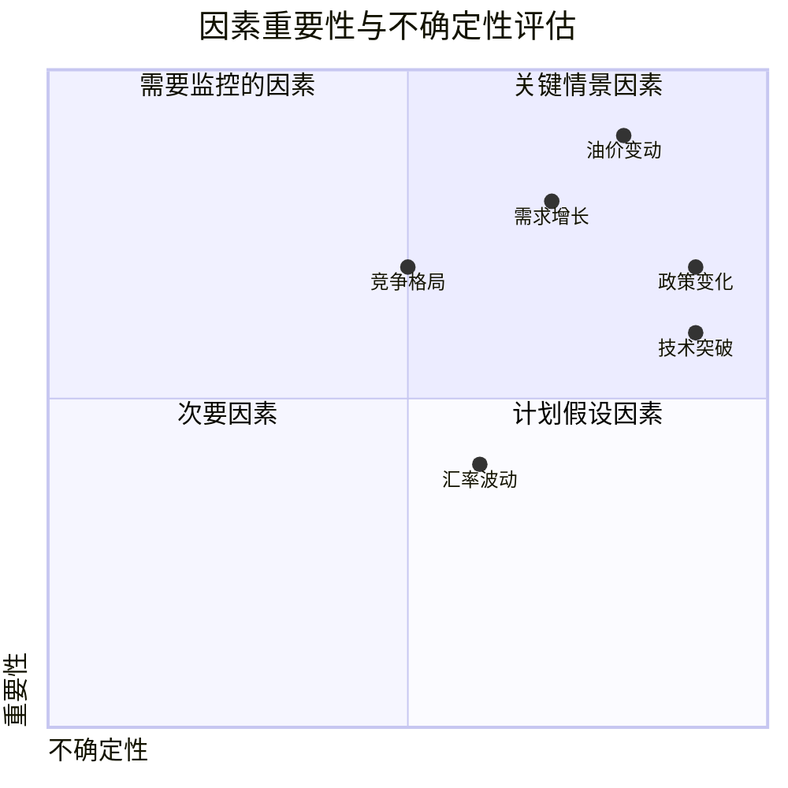

---
{"tags":["财务BP","情景分析","情景构建","财务预测","风险评估"],"aliases":["情景设计方法","场景构建技术"],"dg-publish":true,"permalink":"/08-财务专业/财务BP/学习内容/财务预测与模型/情景分析/情景构建方法/","dgPassFrontmatter":true}
---


# 情景构建方法

> [!NOTE] 概述
> 情景构建是[[08-财务专业/财务BP/笔记/财务预测与模型/情景分析\|情景分析]]的基础环节，通过科学方法设计多种可能的未来情景，为企业提供全面的决策支持。本文详细介绍情景构建的方法论、步骤流程和实践技巧，帮助财务BP编制过程中构建更有价值的情景分析框架。

## 情景构建的理论基础

### 什么是情景

在财务BP语境中，情景(Scenario)是指对未来一段时间内可能发生的经济、行业或企业特定状况的一种合理描述。与[[08-财务专业/财务BP/笔记/预算编制基础/预算编制流程\|预算编制流程]]中的单一预测不同，情景分析承认未来的不确定性，通过构建多种可能的未来情景来增强决策的稳健性。

情景分析的核心假设是：未来不是单一路径的延伸，而是存在多种可能性，企业需要为不同可能性做好准备。

### 情景分析的价值

有效的情景构建能为企业带来以下价值：

- **防范风险**：识别潜在风险并制定应对措施
- **把握机会**：发现不同情景下的战略机遇
- **提高决策质量**：避免单一预测的偏差，做出更稳健的决策
- **促进战略思考**：打破思维定式，鼓励创新思考
- **增强组织韧性**：提高应对不确定性的能力

情景构建与[[08-财务专业/财务BP/学习内容/财务预测与模型/敏感性分析/敏感性分析的目的与方法\|敏感性分析]]相比，更加系统化、结构化，能够同时考虑多个变量的相互作用。

## 情景构建的基本原则

### 1. 相关性原则

情景必须与决策目标相关，能够对关键决策产生实质性影响。

**案例应用**：
某汽车制造商在构建电动化转型战略的情景时，重点关注了电池技术发展速度、政府补贴政策变化和消费者接受度三个关键因素，而非一般的宏观经济变量，因为这三个因素对电动化转型决策最为关键。

### 2. 合理性原则

情景必须是合理可能的，虽可能挑战常规思维，但应基于现实和逻辑推理。

**案例应用**：
某能源企业构建2030年情景时，考虑了油价在20-120美元/桶的区间波动，而非极端的0美元或500美元，因为这些极端情况虽然理论上可能，但实际发生概率极低，不具备决策参考价值。

### 3. 差异性原则

各情景之间应有明显差异，能够测试战略在不同条件下的稳健性。

**案例应用**：
某零售企业在构建疫情后发展情景时，设计了"快速恢复"、"缓慢复苏"和"长期低迷"三种截然不同的情景，而非仅在基准情景上做小幅调整，确保测试了战略在显著不同环境下的表现。

### 4. 全面性原则

情景组合应覆盖合理可能发生的主要未来情况。

**案例应用**：
某科技企业在预测新产品市场表现时，构建了"行业领先"、"稳健增长"、"艰难竞争"和"产品失败"四种情景，基本涵盖了产品可能面临的主要市场反应。

### 5. 内部一致性原则

每个情景内部的各要素应相互一致，形成逻辑自洽的叙事。

**案例应用**：
某航空公司在构建"高油价"情景时，同时考虑了油价上涨对机票定价、客流量、竞争策略和替代交通方式的综合影响，确保情景内部逻辑一致。

## 情景构建的步骤方法

### 1. 明确决策问题

第一步是明确情景分析要解决的核心决策问题：

- 确定分析的时间范围
- 定义需要回答的关键问题
- 明确利益相关者的期望

**案例应用**：
某医药企业明确其情景分析目标为：评估未来5年内在三种不同市场环境下，现有产品组合的盈利能力和现金流表现，以及是否需要通过并购扩充产品线。

### 2. 识别关键影响因素

识别影响决策结果的关键因素：

- 内部因素：企业可控的变量
- 外部因素：企业不可控的环境变量
- 对每个因素进行重要性与不确定性评估



**案例应用**：
某化工企业通过专家研讨会，识别出影响未来五年业绩的20个因素，并通过重要性和不确定性评分，筛选出原材料价格波动、环保政策变化和新兴市场需求增长三个关键不确定因素作为情景构建的核心变量。

### 3. 构建情景框架

基于关键不确定因素，构建情景框架：

- 双因素法：选择两个最关键的不确定因素构建2×2矩阵
- 多因素法：综合考虑3-5个关键因素的不同组合
- 轴向法：围绕核心主题设定不同发展路径

**案例应用**：
某新能源企业使用双因素法，以"政策支持力度"和"技术进步速度"为两个轴，构建了四种未来情景：

```mermaid
quadrantChart
    title 新能源发展情景
    x-axis 技术进步速度 低 -> 高
    y-axis 政策支持力度 低 -> 高
    quadrant-1 加速转型
    quadrant-2 政策引导
    quadrant-3 市场停滞
    quadrant-4 技术驱动
```

### 4. 丰富情景内容

为每个情景框架添加详细内容：

- 描述情景下的宏观环境
- 分析行业和竞争格局变化
- 预测客户需求和行为转变
- 评估供应链和成本结构影响

**案例应用**：
某连锁零售企业在"数字化加速"情景中详细描述了：
- 消费者线上购物比例增至70%
- 实体店转向体验中心功能
- 本地即时配送成为标准服务
- 数据分析驱动的个性化营销普及
- 传统竞争对手转型失败，新型平台崛起

### 5. 量化关键指标

将定性情景转化为具体数字假设：

- 确定需要量化的关键财务指标
- 明确各情景下指标的取值
- 建立情景与指标间的逻辑关系

**案例应用**：
某快消品企业将"消费升级"情景量化为以下具体指标：
- 高端产品线收入年增长率：22%
- 中端产品线收入年增长率：8%
- 低端产品线收入年增长率：-5%
- 广告投入占销售比：提高2个百分点
- 电商渠道占比：提高15个百分点
- 毛利率：提高3个百分点

### 6. 展开财务模型预测

基于量化假设进行财务模型预测：

- 将情景假设输入财务模型
- 生成各情景下的财务预测
- 分析不同情景间的财务表现差异
- 识别关键财务风险点和机会

这一步与[[08-财务专业/财务BP/学习内容/财务预测与模型/财务报表预测/报表间的逻辑关系\|报表间的逻辑关系]]密切相关，需要确保三大财务报表在各情景下的一致性。

**案例应用**：
某制造企业根据"供应链重构"情景，调整了以下财务模型参数：
- 原材料成本增加15%
- 库存周转天数增加10天
- 资本支出增加3,000万元（本地产能投资）
- 固定成本增加8%
- 产品价格提高5%

预测结果显示，该情景下第一年净利润将下降30%，但第三年后将恢复并超过基准情景，长期毛利率提高2个百分点。

## 情景构建的高级方法

### 1. 德尔菲法

通过多轮专家匿名问卷，收集并综合专家对未来发展的判断：

1. 设计关键问题并发送给专家组
2. 收集、汇总第一轮反馈
3. 将汇总结果反馈给专家，让他们修正意见
4. 经过多轮反复，形成相对一致的判断

**案例应用**：
某大型保险公司采用德尔菲法，邀请30位行业专家、经济学家和技术专家，通过三轮匿名问卷，最终达成对健康保险市场未来五年发展的三种主要情景共识，作为产品开发战略的基础。

### 2. 系统动力学法

结合系统思维，构建变量间的因果关系模型：

1. 识别系统中的关键变量
2. 建立变量间的因果循环关系
3. 设定不同情景下的初始条件
4. 通过模拟观察系统随时间的演化

**案例应用**：
某国家石油公司构建了包含油价、投资、产能、成本和需求等因素的系统动力学模型，通过不同初始条件模拟，生成了四种不同的行业演化情景，为长期投资决策提供了依据。

### 3. 交叉影响分析

考虑多个事件之间的相互影响和条件概率：

1. 确定关键事件清单
2. 评估每个事件发生的基础概率
3. 评估事件间的条件概率（一个事件发生对其他事件概率的影响）
4. 通过矩阵计算，识别高概率事件组合

**案例应用**：
某投资银行使用交叉影响分析方法，评估了政策收紧、利率上升、消费疲软等10个关键事件之间的相互影响，识别出三种高概率的事件组合作为宏观经济情景的基础，为客户投资组合建议提供依据。

### 4. 未来轮法

通过未来轮(Futures Wheel)工具探索特定事件的连锁反应：

1. 在中心写下核心事件或趋势
2. 确定此事件的直接影响（第一层）
3. 继续扩展每个直接影响的次级影响（第二层）
4. 根据影响路径构建情景

**案例应用**：
某汽车企业使用未来轮法分析"自动驾驶技术普及"这一核心事件的影响链，从车辆设计、使用模式、城市规划到保险业务模式，识别出一系列连锁反应，并据此构建了详细的行业转型情景。

## 情景构建的行业应用特点

### 金融行业

- **关键因素**：利率变动、监管政策、科技创新、消费者行为
- **典型情景**：经济快速增长+利率上升、温和增长+利率稳定、经济下行+利率下降
- **特殊考量**：监管压力测试要求、资本充足率影响

**案例应用**：
某商业银行构建的情景除考虑常规宏观经济因素外，还特别关注了金融科技对传统业务的替代速度，构建了"渐进式替代"、"快速颠覆"和"共生发展"三种情景，预测对存贷款业务和中间业务收入的不同影响。

### 制造业

- **关键因素**：原材料价格、全球供应链、自动化程度、贸易政策
- **典型情景**：全球化深化、区域化发展、技术驱动转型
- **特殊考量**：产能利用率、规模经济效应

**案例应用**：
某汽车零部件制造商基于全球化趋势变化，构建了"全球整合"、"区域自主"和"本地优先"三种情景，每种情景下都详细预测了生产基地布局、采购策略、研发投入和资本支出的差异，以及对成本结构和竞争力的影响。

### 消费品行业

- **关键因素**：消费能力、渠道变革、品牌偏好、健康环保意识
- **典型情景**：高增长高溢价、稳定增长、价格竞争、市场萎缩
- **特殊考量**：渠道库存、促销效果、品牌价值

**案例应用**：
某食品饮料企业根据消费趋势变化，构建了"健康优先"、"体验至上"、"价格导向"和"两极分化"四种消费情景，并针对每种情景制定了不同的产品组合、定价策略和营销投入方案，同时预测了财务表现差异。

### 科技行业

- **关键因素**：技术迭代速度、用户采用曲线、监管环境、平台竞争
- **典型情景**：爆发式增长、稳健发展、监管收紧、技术瓶颈
- **特殊考量**：研发投入回报、用户获取成本、网络效应

**案例应用**：
某SaaS企业在产品开发战略中，构建了"快速普及"、"垂直深耕"和"缓慢渗透"三种市场发展情景，分别对应不同的客户获取成本、续约率和单客价值假设，并据此制定差异化的团队规模、融资计划和营销策略。

## 情景构建的常见陷阱与应对

### 1. 过度简化

- **表现**：情景过于简单，无法真实反映复杂现实
- **应对**：确保考虑关键变量之间的交互关系，构建有深度的情景叙事

**案例应用**：
某能源企业最初仅考虑油价变化构建情景，后来发现这过于简化。改进后的方法同时考虑了油价、碳税政策和可再生能源技术进步三个因素的交互作用，构建了更全面的能源转型情景。

### 2. 偏好性偏差

- **表现**：情景构建偏向管理层希望看到的结果
- **应对**：邀请外部专家参与，引入挑战者角色，鼓励反向思考

**案例应用**：
某零售集团意识到其最初构建的情景过于乐观，未能反映潜在风险。公司随后邀请了外部顾问和行业专家参与，特意引入了"电商颠覆"和"消费降级"两个挑战现有业务模式的情景，使战略规划更加全面和稳健。

### 3. 锚定效应

- **表现**：所有情景都围绕基准情景小幅变动
- **应对**：先独立构建差异化情景，后比较情景间差异

**案例应用**：
某电信企业改变传统的"基准+/-10%"的情景设计方法，采用全新的情景构建流程，先由不同团队独立构建四种情景愿景，再相互比较和完善，最终得到了包括"平台融合"、"专业垂直"等截然不同的发展路径。

### 4. 数量陷阱

- **表现**：过度关注数字准确性而忽视情景逻辑
- **应对**：先构建定性情景骨架，确保情景内部一致性，再进行量化

**案例应用**：
某地产企业在情景规划中，首先建立了清晰的叙事框架和内部一致的因果逻辑，然后才对房价、销售速度、融资成本等指标进行量化，避免了以往单纯调整数字假设而缺乏合理解释的问题。

### 5. 可操作性不足

- **表现**：情景分析完成后缺乏明确行动指导
- **应对**：为每个情景设计明确的指标和触发点，以及对应的行动计划

**案例应用**：
某制药企业不仅构建了市场情景，还为每个情景设计了"预警信号组合"和对应的行动计划。当实际市场发展显示某情景正在出现时（如特定信号已达到预设阈值），公司可以快速启动相应的预案，如调整研发投入、调整营销策略等。

## 情景在财务BP中的落地应用

### 情景驱动的财务规划

将情景分析与[[08-财务专业/财务BP/笔记/基础概念/财务BP的组成部分\|财务BP]]紧密结合：

1. 基于情景构建业务假设
2. 将假设转化为财务预测
3. 分析各情景下的财务表现
4. 识别关键财务指标的波动范围

**案例应用**：
某制造业企业将情景分析完全融入年度预算流程，财务BP不再是单一数字，而是在三种主要情景下的财务预测范围。管理层审批的不仅是基准预算，还包括在不同情景下的应对策略和资源调整计划。

### 弹性预算机制

设计能够应对不同情景的弹性预算机制：

- 核心/基础预算：在所有情景下都需执行的部分
- 触发式预算：根据情景触发的额外资源配置
- 预留/应急资金：应对极端情景的资源储备

**案例应用**：
某科技公司根据产品发布表现情景，设计了分阶段投放的营销预算：基础预算占总额的60%，剩余40%根据产品前两周市场反馈情况，按预设条件触发释放，实现了资源的灵活配置，避免了资源浪费或错失机会。

### 情景监控与调整

建立情景监控机制，实时调整战略执行：

1. 设定情景早期预警指标
2. 定期监测实际发展与情景的匹配度
3. 识别情景转换信号
4. 调整战略执行路径

**案例应用**：
某快消品集团建立了"情景仪表盘"，包含20个关键指标，每月更新并评估实际市场发展与预设情景的匹配度。2022年初，仪表盘显示市场正从"恢复增长"情景向"通胀压力"情景转变，公司及时调整了定价策略和产品包装规格，比竞争对手更快适应了市场变化。

## 小结

情景构建是企业应对不确定性的有力工具，通过系统化方法构建多种可能的未来情景，为战略决策和财务规划提供更全面的视角。有效的情景构建应当遵循相关性、合理性、差异性、全面性和内部一致性原则，通过明确决策问题、识别关键因素、构建情景框架、丰富情景内容、量化关键指标和展开财务模型预测等步骤实施。

情景构建与[[08-财务专业/财务BP/学习内容/财务预测与模型/情景分析/最佳、基准与最差情景\|最佳、基准与最差情景]]、[[08-财务专业/财务BP/学习内容/财务预测与模型/情景分析/情景权重分析\|情景权重分析]]和[[情景分析的决策应用\|情景分析的决策应用]]密切相关，构成了完整的情景分析体系。通过科学的情景构建方法，企业可以提高战略决策的稳健性，增强组织应对未来变化的适应能力，实现可持续发展。

## 参考文献

1. Schoemaker, P. J. H. (1995). *Scenario Planning: A Tool for Strategic Thinking*. Sloan Management Review, 36(2), 25-40.
2. Schwartz, P. (1996). *The Art of the Long View: Planning for the Future in an Uncertain World*. Currency Doubleday.
3. Wade, W. (2012). *Scenario Planning: A Field Guide to the Future*. Wiley.
4. 《战略情景规划》，韦德，中信出版社，2017.
5. McKinsey & Company. (2021). *Strategy Beyond the Hockey Stick: People, Probabilities, and Big Moves to Beat the Odds*. Wiley. 